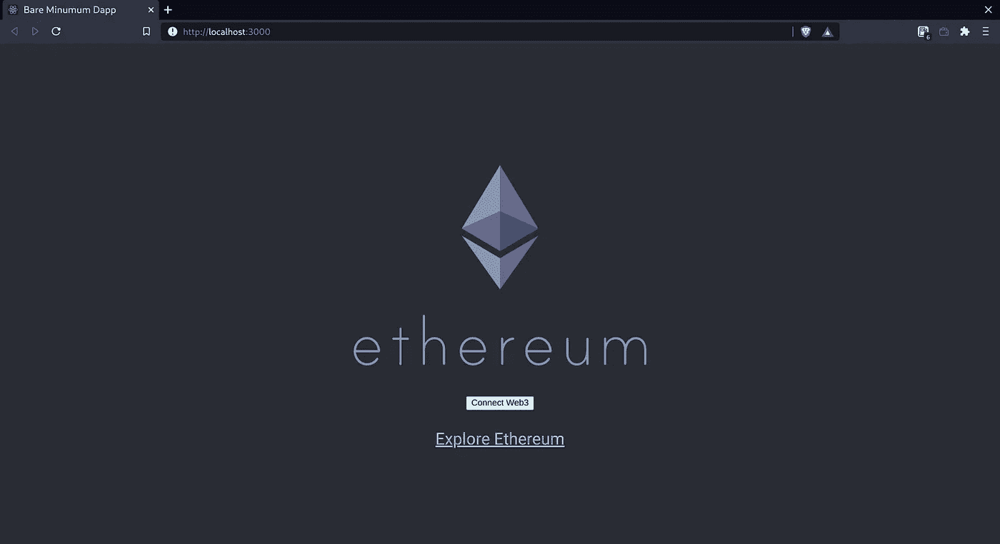

# bm-dapp 简介:一个为您的分散式应用提供的最小前端

> 原文：<https://medium.com/coinmonks/introducing-bm-dapp-a-bare-minimum-front-end-for-your-decentralized-application-a3e4b949115e?source=collection_archive---------6----------------------->



接受吧，当我们需要快速测试一些东西或者需要一个非常基本的简单样板来开始我们下一个酷项目的时候，我们已经经历过很多次了。Remix、Hardhat 和 Truffle 将帮助您满足所有智能合约需求。但是前端呢？

bm-dapp 是你的分散式 web3 应用程序的一个最小的 dapp 前端。创建一个一键式 dapp，用 [Create React App](https://github.com/facebook/create-react-app) 模板引导。

*   简单、容易且快速
*   准备将 dapp 与 web3 登录功能一起使用
*   只包含最少的依赖项，所以你的应用程序不会臃肿
*   使用[web 3 mode](https://github.com/Web3Modal/web3modal)，因此您可以轻松添加其他提供商
*   帐户和网络改变时自动重新加载

# 如何使用

使用 bm-dapp 模板创建 React 应用程序来引导您的 dapp

```
npx create-react-app my-app --template bm-dapp
yarn start
```

app 在[*http://localhost:3000*](http://localhost:3000/)以开发模式运行。默认情况下，点击`**Connect Web3**`按钮会弹出 Metamask(如果启用了 web3)。要添加其他提供商，请检查[web 3 模式提供商选项](https://github.com/Web3Modal/web3modal#provider-options)

# 与醚一起使用

默认情况下，bm-dapp 使用 ethers 提供程序。要使用连接的提供者，从位于`src`目录中的 web3 目录导入`Web3Context`。

```
import React, { useContext } from 'react';
import { Web3Context } from './web3';const { account, provider } = useContext(Web3Context);
```

初始化一个 ethers 契约对象

```
const daiContract = new ethers.Contract(daiAddress, daiAbi, provider);
```

要将签名人连接到上述只读合同，请执行以下操作

```
const signer = await provider.getSigner();
daiContract.connect(signer);
```

或者初始化与签名者的合同

```
const daiWithSigner = new ethers.Contract(daiAddress, daiAbi, provider.getSigner());
```

更多详情请参考`[ethers](https://docs.ethers.io/v5/getting-started/)` [文档](https://docs.ethers.io/v5/getting-started/)。

# 与 web3 一起使用

您可以用 web3js 包装从 Web3Context 接收的提供者，并按如下方式使用它

```
import React, { useContext } from 'react';
import { Web3Context } from './web3';const { account, provider } = useContext(Web3Context);
const web3 = new Web3(provider);
```

更多详情，请参考`[web3js](https://web3js.readthedocs.io/en/v1.3.4/index.html)` [文档](https://web3js.readthedocs.io/en/v1.3.4/index.html)

# 链接

GitHub:【https://github.com/sudeepb02/cra-template-bm-dapp 

https://www.npmjs.com/package/cra-template-bm-dapp[NPM 套餐](https://www.npmjs.com/package/cra-template-bm-dapp)

# 相关努力

如果您正在寻找一整套带有智能合约和其他功能的以太坊 dapp，请查看以下链接:

*   保罗伯格[创作 eth app](https://github.com/paulrberg/create-eth-app)
*   奥斯汀·格里菲斯的《T4 脚手架》