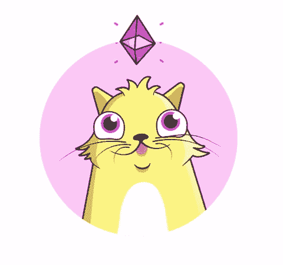

# 介绍加密组件

> 原文：<https://medium.com/coinmonks/introducing-crypto-composables-ee5701fde217?source=collection_archive---------1----------------------->

自从引入比特币以来，我们已经有了一个分布式账本上可替代资产的分散数字稀缺的可证明模型。可替换的:所有的单位都是相等的，当合并时，总和是不可区分的。第一批使用比特币网络模式的不可替代资产或契约是在 2010 年通过对 [BitDNS](https://en.bitcoin.it/wiki/BitDNS) / [Namecoin](https://en.wikipedia.org/wiki/Namecoin) 的讨论推出的，这是一种去中心化的 DNS 服务。现实世界资产的所有权后来由[彩色硬币](https://en.bitcoin.it/wiki/Colored_Coins)项目提出。我们现在有了一个虚拟不可替代资产的蓬勃发展的例子。 [Cryptokitties](https://www.cryptokitties.co/) 建立在[以太坊](http://ethereumfoundation.org/)网络上；一种可编程的通用区块链。然而，并不是所有的资产，不管是虚拟的还是其他的，都可以很容易地用一个契约来表示，或者在以太坊征求意见的情况下，ERC- [721](https://github.com/ethereum/eips/issues/721) ，一个[单一标识整数](/crypto-currently/the-anatomy-of-erc721-e9db77abfc24)。

> [发现并回顾最佳区块链软件](https://coincodecap.com)

Cryptokitty lusting over Ether.

在买卖房屋时，官方的说法是，所有权是指土地，任何高于或低于土地的东西。但是，房子是你卖的；这是感知价值。土地的真正价值是作为一种升值的资产。可能的话，计划是拆除重建，或者单独出售房子。在所有其他的土地所有权交易中，房子，也许还有房子里的东西，将是销售的主要部分。买房变成了一个复杂的决定；一次所有权转让，代表以后可能被拆散的物品的组合。我们如何在区块链以太坊实现这一目标？

# 输入加密组件

任何不可替代令牌(NFT)拥有另一个不可替代 ERC-721 令牌或可替代 ERC-20 令牌的标准扩展。转移令牌组合意味着转移项目的整个层次结构。虚拟资产可以拥有自己的资产。例如，一只隐猫可能拥有一个抓挠柱和一个喂食盘；该盘可以包含一些可替换的“食物”代币。那是一只快乐且喂得很好的虚拟猫。

Remember Tamagotchi? Coming soon to a blockchain near your wallet?

隐猫最有趣的方面之一是繁殖功能。组合资产也可以提供基于“装备”子资产的动作。想象一下给一个虚拟角色添加一个食物资产，就像我们有食物代币的小猫。现在，小猫可以吃食物代币，加快繁殖休眠期，变得更有价值。本文讨论范围之外的一点是“活动资产”的建议标准，它允许可组合资产作用于其他资产、它们的子资产，或者使用基于子资产所有权的特殊动作。我们可以用可组合和可操作的资产来服务哪些其他游戏或业务用例？

# [ERC-998](https://github.com/ethereum/EIPs/issues/998) 可组合 NFTs

如果没有示例实现，标准会是什么样的呢？在接下来的部分中，我将详细讨论这是如何工作的。

## 更新

由于区块链的发展速度相当快，我在更新帖子的这一部分，解释 ERC-998 的功能部分，以反映最新的资源、规范和参考实现:

[EIP-998 主](https://github.com/ethereum/EIPs/blob/master/EIPS/eip-998.md)在那里你会找到最新的规格。

Composables-998 是一个最新的参考实现。

## [用例发布](/coinmonks/crypto-composables-building-blocks-and-applications-65902709298c)

## 原始详细解释

接下来是对原始帖子中基本概念的高度概括。固体代码已被删除，以免混淆读者。

“父”将指可组合的 ERC-721(现在是 [ERC-998](https://github.com/ethereum/EIPs/issues/998) )令牌，“子”将指可组合的拥有的任何 ERC-721 或 ERC-20 令牌。

ERC-998 所需的映射是从可组合的父 tokenId 到子协定地址和无符号整数之间的另一个映射。当父级拥有不可替换的子令牌时，子契约地址映射到父级可能拥有的子令牌 id。当父令牌拥有可替换令牌时，子契约地址映射到子令牌的余额。对于 ERC-721 儿童，我们跟踪代币 id，对于 ERC-20，我们跟踪代币金额。这种内部簿记将有助于确保不拥有父母的人不能转移孩子。

在这两种情况下，子令牌在其契约中的实际拥有地址是可组合的 ERC-998 契约。该映射允许我们通过父令牌 ID 实施父子关系和所有权。如果发送方也拥有父令牌 ID，则只有*子令牌能够从合同中转移*。一个主要的警告是，你必须相信可组合的 ERC-998 契约没有*也没有*任意转移联系人技术上拥有的子令牌的能力。

# 添加孩子

ERC-998 合同需要得到子令牌的批准，这样它才能使用`transferFrom(owner, to, tokenId)`函数。此功能允许父代将所有权从当前所有者(将子代添加到父代的用户)转移到父代智能合同。

或者，您可以直接从 ERC-721 和 ERC-223 转移，并使用可选的`bytes`字段来指示您希望转移到 ERC-998 合同中的哪个 NFT。这导致只有一个事务来移动一个可组合的。

一旦完成并成功返回，父节点就将子节点添加到内部映射中。这将允许我们在以后转移孩子时加强父子关系。

# 转移不可替换的 ERC-721 儿童

转移可组合资产的子资产可以被认为是*资产分解*。为了转移不可替换的子令牌，我们需要知道*我们要将令牌转移给谁*以及拥有子令牌的父令牌的 ID，以强制实施所有权；最后，我们需要子合同地址和子令牌 ID。使用此信息，我们首先检查以下内容:

*   函数调用的发送者拥有父令牌，这是 ERC-721 规范中实现为`_owns(address, tokenId)`的标准方法
*   我们已经实现了 **rootOwnerOf** ，如果存在可组合令牌的层次结构，它将实际检查谁拥有父令牌 ID
*   父令牌 ID 通过子契约地址映射到子令牌 ID，从而加强父子关系

一旦这些都准备好了，我们可以调用子契约的转移函数，如果我们的转移成功，我们将子映射设置为 0，反映子资产不再属于父资产。这被称为*分解*资产。

# 转移可替换的 ERC-20 儿童

如上例所示，如果满足两个条件，我们可以转移孩子:

*   函数调用的发送方拥有父令牌 ID
*   父代币拥有足够的可替换子代币余额，以便转移该金额

第二个条件是在多个父母拥有相同类型代币的情况下，防止父母过度花费子代币。同样，所有子资产都归父令牌的合同地址所有，而不是直接归父令牌本身所有。如果一切正常，并且转移成功，我们将转移令牌，并减少子映射中的子令牌数量。

Making use of “chow” tokens.

# 摘要

我已经提出了可组合 NFT 的新标准， [ERC-998](https://github.com/ethereum/EIPs/issues/998) 。该标准允许 ERC-998 令牌拥有 ERC-998、ERC-721 和 ERC-20 令牌。这允许标准以太坊资产被组合成复杂的组合，并使用单次转移进行交易。基于特定子令牌的存在，可以向 NFT 添加额外的功能，并且这些功能是开放供探索的。我相信，不可替代和可替代资产的标准接口将被组合并提供动作，这是以太坊社区要探索的一个令人兴奋的新领域，我期待看到未来的工作。

原 GitHub 发布: [ERC-998 可组合不可替换令牌标准](https://github.com/ethereum/EIPs/issues/998)

谢谢你纵容我。

【medium.com/@mattdlockyer
[twitter.com/mattdlockyer](https://twitter.com/mattdlockyer)
[linkedin.com/in/mattlockyer](https://linkedin.com/in/mattlockyer)

**更新**

[EIP-998 Master](https://github.com/ethereum/EIPs/blob/master/EIPS/eip-998.md) 是您可以找到最新规格的地方。

[Composables-998](https://github.com/mattlockyer/composables-998/) 是一个最新的参考实现。

感谢[尼克·穆奇](https://medium.com/u/ca7b1065d06a?source=post_page-----ee5701fde217--------------------------------)，[小猫咪](https://medium.com/u/c8b1419b5d28?source=post_page-----ee5701fde217--------------------------------)，[法比亚诺·PS](https://medium.com/u/4f05d7e799e0?source=post_page-----ee5701fde217--------------------------------)，[特伦特·麦康纳](https://medium.com/u/f1cb98e196bc?source=post_page-----ee5701fde217--------------------------------)

# 参考

[https://github.com/ethereum/EIPs](https://github.com/ethereum/EIPs)

[https://github . com/ether eum/EIPs/blob/master/EIPS/EIP-721 . MD](https://github.com/ethereum/EIPs/blob/master/EIPS/eip-721.md)

 [## ERC:不可替换令牌标准发行#721 以太坊/EIPs

### 该提案已被接受并合并为一个标准草案，请查看官方跟踪版本…

github.com](https://github.com/ethereum/eips/issues/721)