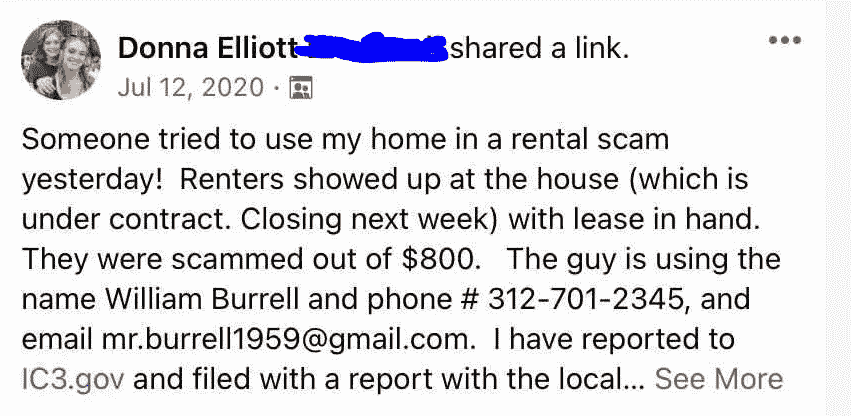

# 介绍 Dapposit(以及对 web3 的额外介绍)

> 原文：<https://medium.com/coinmonks/introducing-dapposit-and-a-bonus-intro-to-web3-2c499d5c3ea8?source=collection_archive---------4----------------------->

上周，我发布了我的第一个 dapp，你可以在这里查看[(你必须安装一个](http://dapposit.herokuapp.com) [Metamask](https://metamask.io/) 钱包，它才能工作)。电梯推介:Dapposit 通过将资金托管在以太坊区块链的智能合同中，为住宅租户提供了一种更安全的存储保证金的方法。只有租房者能够在头 4 周获得这笔钱，所以如果他/她出于任何原因需要撤回押金，特别是租金欺诈，很容易做到这一点。4 周后，只有房东有权提取资金，因此押金有效地从租户转移到房东，自动且安全。

对于 web3 的新用户来说,“dapp”或分散式应用程序是一种无需许可的应用程序，其代码运行在分布式(点对点)计算结构上，如以太坊。无权限是什么意思？这意味着任何人都可以使用它。没有登录，订阅，或窃取您的数据。

酷，酷。让我们倒回去一分钟。什么是 web3？？哦，顺便问一下，web1 和 web2 是什么？

简而言之:web 1.0，互联网的第一次迭代，见证了提供静态内容的登陆页面的优势。“只读”的东西，比如新闻网站，是那里的内容。Web 2.0 增加了一层动态和用户生成的内容(“读写”)。想想脸书、YouTube 和优步。

Web3 又增加了一层:价值。根据定义，web3 包括一个将货币价值与每个用户相关联的结构，以及一个在用户之间转移价值的嵌入式架构。密码术是以太坊体系结构，因此，它具有对等、分散和不可信的优点。没有人、公司或国家在幕后操纵以太坊，将来也不会有。只是一个矿工网络，他们通过选择每天运行相同的软件来表示合作。这是 web3。

# 返回数据仓库

好的……回到正轨。我决定建立一个 dapp 来解决现实世界的问题。没有产量农业，NFT 的，或元诗句涉及。所有这些事情都很棒，但驱使我探索 web3 奥秘的是它能立即让世界变得更好的潜力；也就是说，例如，不需要让公众相信像素化的卡通人物头像很酷。在伊丽莎白·沃伦看到罪犯和恐怖分子的地方，我看到了潜在解决一些世界上最紧迫问题的关键，特别是那些需要不同人群之间的社会经济协调的问题。

这让我想到了我的第一项任务:解决租房诈骗。虽然这有点晦涩，但租金欺诈背后的数字惊人地大，我将谈到这些。

首先，租房欺诈是指骗子诱使他人租用他/她并不拥有的住宅。租房诈骗犯可能会随便拍一栋房子的照片，然后在 Craigslist 或《脸书邮报》上发布广告，宣传“你的下一个梦想之家”，该房屋将于下月 1 日出租。一旦有人伸出手来回应，“房东”建议受害者立即交付保证金，因为有少数其他感兴趣的租户，没有时间带他们每个人参观。保证金通常是一个月的租金，如果有人不幸上当，房东会携款潜逃。

为什么会有人上当？这个国家正处于至少 100 年来最严重的住房短缺之中。在像佛罗里达和德克萨斯这样的地方，移民潮导致了空前规模的卖方市场，体面的房子在挂牌的同一天收到了多个要价甚至更高的报价。这种动态已经影响到租赁市场，由于经济适用房的短缺以及负债累累的千禧一代的到来，租赁市场的需求增长甚至更快。

在这种环境下，租赁欺诈是一个大问题。美国 43.1%的租房者遭遇过欺诈性房源，520 万租房者被骗。可以预见的是，由于他们更糟糕的经济环境和由此产生的绝望，这个问题不成比例地影响了年轻一代，18-29 岁的所有租房者中有 9.1%由于租房骗局而损失了金钱。

同样糟糕的是，由于各方之间缺乏信任，大量合法业务被扼杀。在另一段生活中，我在房地产行业工作，并亲身经历了通过脸书租到一个单元的困难，因为一个潜在的租户认为我是一个骗子。真的，我只是想在一个非常好的单位填补一个空缺，甚至一个骗局的威胁扼杀了交易。

那么，我该怎么做呢？Dapposit 提供了第一个用于进行住宅安全存款的无信任协议。房东原来是个骗子？没问题。如果在存款后的 4 周内密钥转移没有按计划进行，智能合同将允许租户的以太坊地址取回资金。另一方面，如果密钥转移正确，租户和房东都不必采取进一步的行动，智能合同将在 4 周后自动将存放资金的所有权转移到房东的以太坊地址。

按照 web3 的精神，我的代码都是开源的，你可以在这里查看。任何人都可以克隆它，叉它，改变它，或者用它做任何他们想做的事情。我的特定版本的代码运行在 Heroku 上的云中，所以除了我之外，这些东西不能被编辑。

最大的(价值数十亿美元)web3 协议也是开源的，任何人都可以使用。Uniswap 处理数十亿美元的交易，Aave 处理数十亿美元的贷款，任何人都可以查看他们的代码，看看它是如何工作的。另一方面，华尔街日报[的调查文章](https://www.wsj.com/articles/the-facebook-files-11631713039)揭示了脸书的算法如何使美国社会两极分化到不可修复的地步。从另一个角度来看，这就是为什么 web3 是互联网未来的一次巨大飞跃，为了人民的利益，这是一场不可避免的运动。

Automatically generated email when a deposit is made.

# 挑战

我是否希望很多人立即开始使用我的 dapp 进行安全存款？绝对不行。大多数人不会保管自己的密码。换句话说，如果你把你的密码余额放在像比特币基地这样的交易所，我的 dapp 就不会为你工作。你必须使用像 Metamask 这样的钱包来控制你自己的私钥。

此外，由于住房短缺，租户几乎没有能力要求房东立即转向基于加密的无信任协议。更重要的是，房地产行业主要由不了解或不想学习密码的婴儿潮一代组成。这些类型的人愿意采用像 Dapposit 这样的协议来改变他们几十年来进行安全存款的方式的可能性很小。

然而，所有这些事情都在改变。每一天，年轻一代——理解加密及其好处的一代——都在逐渐积累财富，获得权力。此外，Metamask 的月活跃用户在去年增长了 18 倍；这项技术正在迅速传播。最后，在美国证交会最近的攻击之后，数百名新产生的秘密百万富翁成为了单一议题选民，以保护他们一生的积蓄，随着时间的推移，这种动态应该会对政治话语产生一些影响。我的预测是，在几年内，社会将准备完全采用加密，我希望成为第一批提供交钥匙解决方案的人之一，让生活更美好。

*我写一些我在加密方面感兴趣的话题。关注我* [*推特*](https://twitter.com/BasriRoss) *。*

> 加入 Coinmonks [电报频道](https://t.me/coincodecap)和 [Youtube 频道](https://www.youtube.com/c/coinmonks/videos)了解加密交易和投资

## 另外，阅读

*   [尤霍德勒 vs 科恩洛安 vs 霍德诺特](/coinmonks/youhodler-vs-coinloan-vs-hodlnaut-b1050acde55a) | [Cryptohopper vs 哈斯博特](https://blog.coincodecap.com/cryptohopper-vs-haasbot)
*   [币安 vs 北海巨妖](https://blog.coincodecap.com/binance-vs-kraken) | [美元成本平均交易机器人](https://blog.coincodecap.com/pionex-dca-bot)
*   [新加坡十大最佳加密交易所](https://blog.coincodecap.com/crypto-exchange-in-singapore) | [购买 AXS](https://blog.coincodecap.com/buy-axs-token)
*   [投资印度的最佳加密软件](https://blog.coincodecap.com/best-crypto-to-invest-in-india-in-2021) | [HitBTC 评论](/coinmonks/hitbtc-review-c5143c5d53c2)
*   [加拿大最好的加密交易机器人](https://blog.coincodecap.com/5-best-crypto-trading-bots-in-canada) | [赌注加密](https://blog.coincodecap.com/staking-crypto)
*   [如何在印度购买比特币？](/coinmonks/buy-bitcoin-in-india-feb50ddfef94) | [瓦济克斯审查](/coinmonks/wazirx-review-5c811b074f5b)
*   [比特币主根](https://blog.coincodecap.com/bitcoin-taproot) | [Bitso 点评](https://blog.coincodecap.com/bitso-review) | [排名前 6 的比特币信用卡](/coinmonks/bitcoin-credit-card-bc8ab6f377c6)
*   [最佳免费加密信号](https://blog.coincodecap.com/free-crypto-signals) | [YoBit 评论](/coinmonks/yobit-review-175464162c62) | [Bitbns 评论](/coinmonks/bitbns-review-38256a07e161)
*   [huo bi 的加密交易信号](https://blog.coincodecap.com/huobi-crypto-trading-signals) | [BitMEX 评论](https://blog.coincodecap.com/bitmex-review)
*   [7 个最佳零费用加密交换平台](https://blog.coincodecap.com/zero-fee-crypto-exchanges)
*   [去中心化交易所](https://blog.coincodecap.com/what-are-decentralized-exchanges) | [Bitbns FIP](https://blog.coincodecap.com/bitbns-fip)
*   [用信用卡购买密码的 10 个最佳地点](https://blog.coincodecap.com/buy-crypto-with-credit-card)
*   [OKEx 回顾](/coinmonks/okex-review-6b369304110f) | [Kucoin 交易机器人](/coinmonks/kucoin-trading-bot-automate-your-trades-8cf0ca2138e0) | [期货交易机器人](/coinmonks/futures-trading-bots-5a282ccee3f5)
*   [AscendEx Staking](https://blog.coincodecap.com/ascendex-staking)|[Bot Ocean Review](https://blog.coincodecap.com/bot-ocean-review)|[最佳比特币钱包](https://blog.coincodecap.com/bitcoin-wallets-india)
*   [霍比评论](https://blog.coincodecap.com/huobi-review) | [OKEx 保证金交易](https://blog.coincodecap.com/okex-margin-trading) | [期货交易](https://blog.coincodecap.com/futures-trading)
*   [Godex.io 审核](/coinmonks/godex-io-review-7366086519fb) | [邀请审核](/coinmonks/invity-review-70f3030c0502) | [BitForex 审核](https://blog.coincodecap.com/bitforex-review)
*   [Crypto.com 费用](/coinmonks/binance-fees-8588ec17965) | [僵尸加密审查](/coinmonks/botcrypto-review-2021-build-your-own-trading-bot-coincodecap-6b8332d736c7) | [替代品](https://blog.coincodecap.com/crypto-com-alternatives)
*   [有哪些交易信号？](https://blog.coincodecap.com/trading-signal) | [Bitstamp vs 比特币基地](https://blog.coincodecap.com/bitstamp-coinbase) | [买索拉纳](https://blog.coincodecap.com/buy-solana)