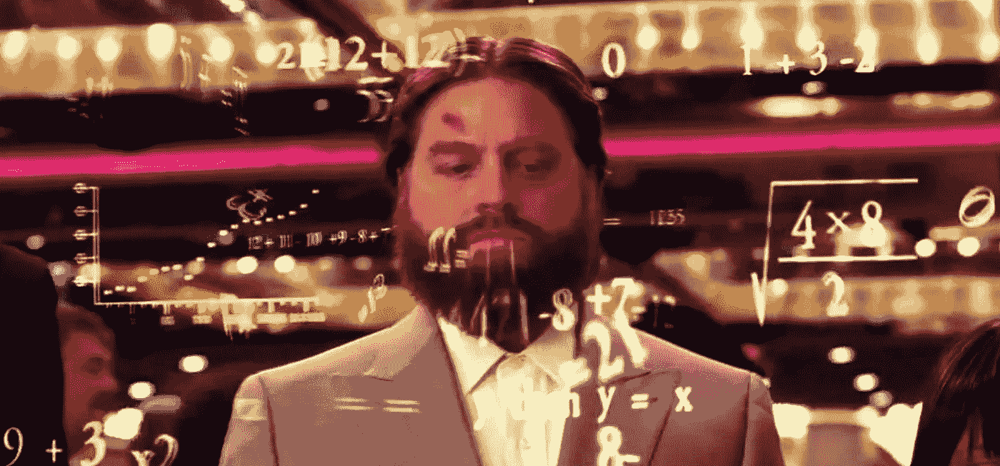
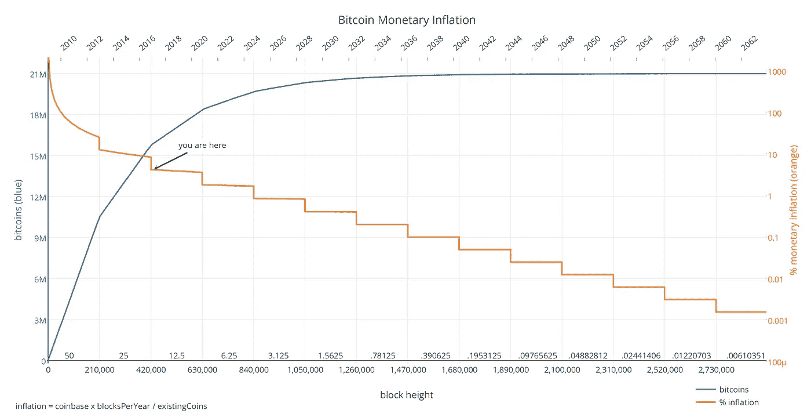
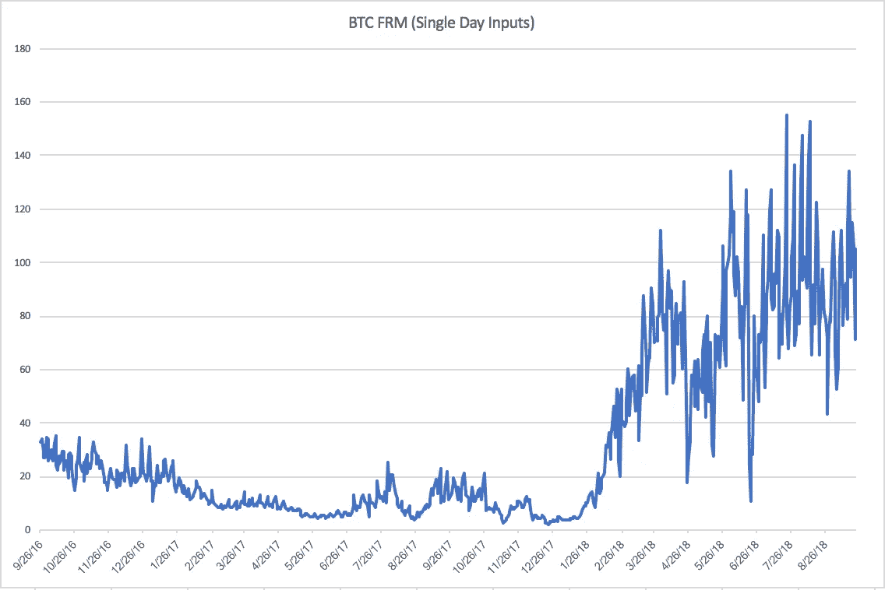
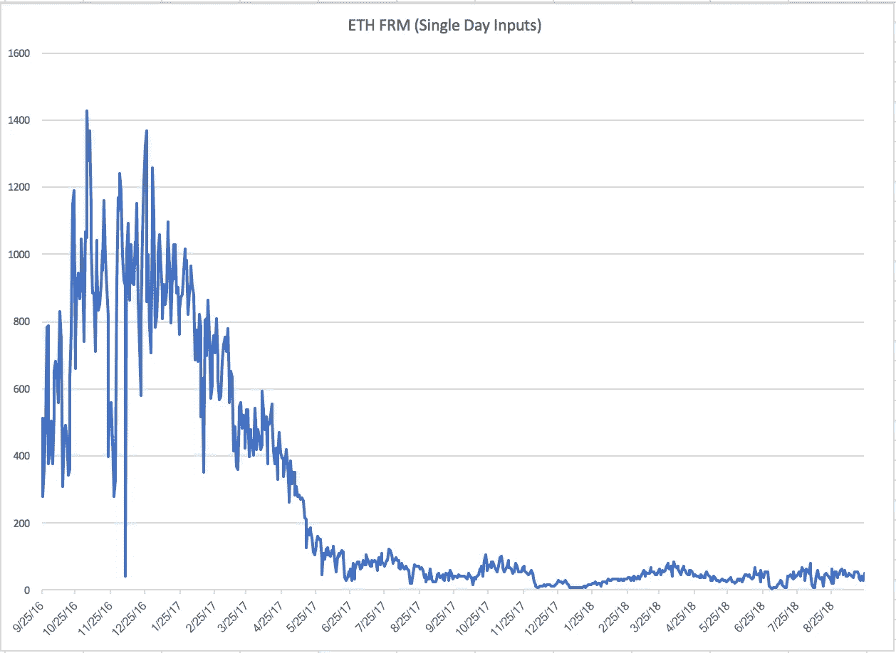
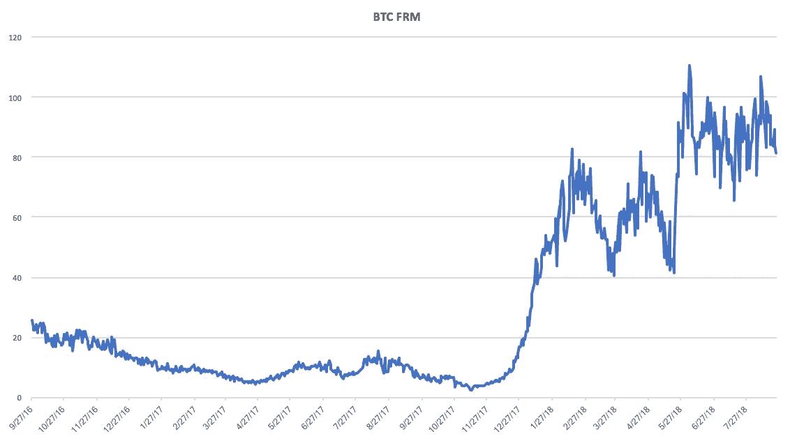
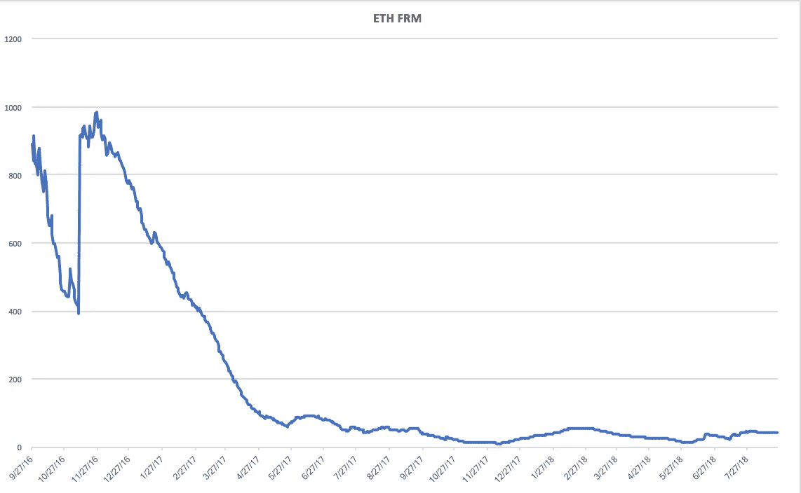
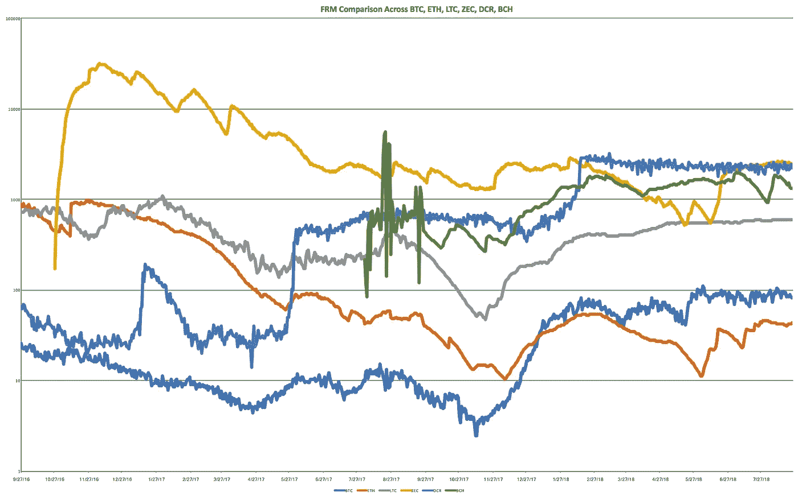
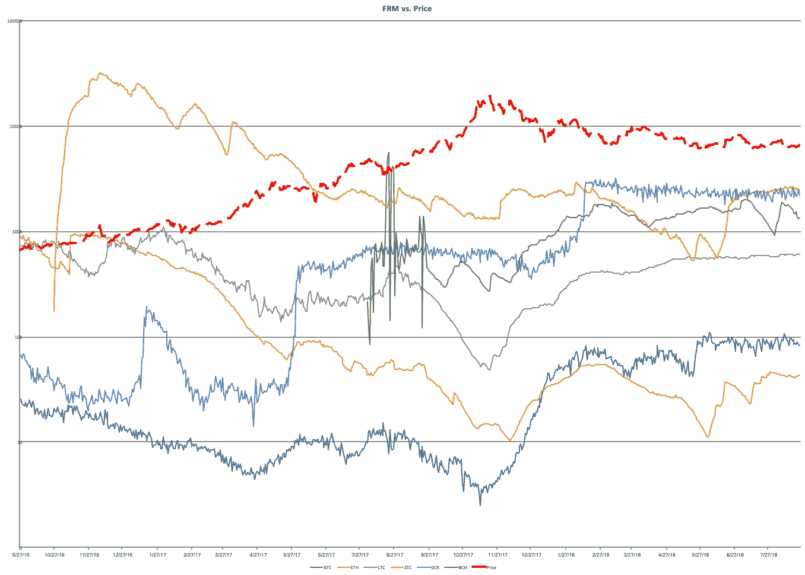

# 介绍:费用比率倍数(FRM)

> 原文：<https://medium.com/coinmonks/introducing-fee-ratio-multiple-frm-1eada9ac9bec?source=collection_archive---------2----------------------->

## *一种新的衡量指标，用于衡量电力链必须覆盖的距离，以便仅通过交易费收入维持当前的安全水平*

*一如既往，以下仅出于教育目的。这不是投资建议。*

# **费用比例**

Nic Carter 最近[倡导](https://www.youtube.com/watch?v=D2WXxgZ8h-0&feature=youtu.be&t=1h18m27s)一种新的衡量标准来取代不断误导的“市场资本总额”，后者目前占据着主导地位，是构建加密资产市场状态的主要参考。

**费用比例**是对 Nic 提出的以下问题[的回答:](https://www.docdroid.net/FbgH1WS/bitcoin-institution-riga.pdf)

> “如果整体薪酬明天就消失了，我们将不得不支付多大比例的经济总量来替代它们。”
> 
> “大约 0.6%的经济总量将不得不支付费用，以支持同等水平的网络安全。”

对于数学上的倾斜，费用比率可以表示如下:

**FR (%) =矿商收入(美元)/交易量(美元)**

或者以 BTC 为例:

**0.41% = 61.1 亿美元/1.49 万亿美元**

在 FR 思想实验中，交易费收入取代了事后的总矿工收入。

*(数据由* [*提供)CoinMetrics.io*](http://coinmetrics.io) *，FR 使用矿工 1 年的收入和调整后的交易量数据计算)*

# **FR 为什么重要？**

绝大多数加密资产采用反通胀货币政策，发行率因此呈几何级数下降。

BTC Inflation Schedule (Kiran Vaidya)

矿工们通过消耗能源来获得工作证明(PoW)链，从而为垄断力量建立了经济障碍，他们依靠集体奖励和交易费的组合来弥补他们的成本——这可能被称为**安全预算(SB)** (H/T [乔丹·麦金尼](https://twitter.com/jordanmmck))。

随着大宗奖励每四年减半，战俘链将越来越受交易费收入的支配，交易费收入将成为 SB 的主要资金来源。

与此同时，随着 SB 和网络价值之间的比率降低，攻击者的风险回报增加。这个比率可以被称为安全系数(H/T 再到[乔丹·麦金尼](https://twitter.com/jordanmmck))。

FR 表面上假设现有链的 SB 一直处于平衡状态——任何更低的水平，链都是不安全的:任何更高的水平，用户都会多付。如果 SB 没有处于平衡状态，那么 FR 就不能提供洞察力，因为我们没有一个基准来衡量经济总量和/或网络价值的最小百分比足以保证链的安全。

在这些假设下，可以推断出低 FR 是期望的度量。

低 FR 意味着用户可以安全地交易，同时为每笔交易支付最低%的 T2 费用。相反，高 FR 意味着用户必须**为每笔交易支付高%的费用，以便安全交易。**

# **回到比特币**

BTC 的失业率为 0.41%，看起来状况不错。BTC 的 FR 远低于 Zcash(6.70%)、Decred (9.54%)，甚至 Ether (1.16%)。

人们可能会认为，用户会更愿意为 BTC 矿商的服务支付这一比例，这是情有可原的。

但是为了真正理解 FR 的含义，有必要理解 ***达到 FR 需要多少倍的现有交易费收入。***

# **费用比率倍数(FRM)**

所以我提出了**费用比率倍数(FRM)** ，它等于:

**矿工收入【区块奖励+交易费】/交易费**

FRM 是明确关于安全的，应该被认为是链栈的基础层。通过观察 FRM，我们可以推断出，一旦块状奖励消失，连锁将变得多么安全。

> 此外， **FRM 隐含地衡量了资产作为价值储存手段的能力。**
> 
> 低 FRM 表明一项资产可以维持其当前的安全预算(矿工收入),而不必依赖通胀补贴。
> 
> **相反，高 FRM 表明，一项资产将需要通过整体奖励补贴大幅通胀，以维持其现有的安全预算。**

FRM 只能在整体奖励减半周期的基础上应用，即对于 BTC，着眼于 2012-2016 年和 2016-2020 年期间的 FRM。

这是因为随着块奖励变得可以忽略不计，FRM *有*趋向于 1。通过衡量 4 年期间，你保持块报酬为常数，并衡量其与交易费用的变化关系。

和 FR 一样，FRM 只在 SB 到目前为止已经足够的假设下工作。

# **关于 NVT 的几句话:**

FRM 与交易净值(NVT)不同，其计算方式为**价格*供应/交易数量**。

NVT 用于**衡量一个链作为支付网络与其市场价值**相比的实力——较低的 NVT 可能表明一个网络与其作为结算层提供的服务相比被低估了。

NVT 和 FRM 不会永远联系在一起。一个连锁店可能有大量的交易和较低的网络价值，因此有较低的 NVT，同时有较高的 FRM，这取决于当前的大宗交易报酬和平均交易费用的大小。

此外，NVT 比 FRM 更容易被欺骗:人们只需要用低费用交易在网络上发送垃圾邮件。相比之下，从定义上来说，对 FRM 的重大操纵需要巨大的成本，因为 FRM 衡量的是交易费用的总价值，而不是计数。

# **方法论**

FRM 可以在不同的时间框架内计算。

或许最显而易见的方法是从某一天获得矿工收入(交易费+大宗奖励),然后用这个数字除以当天的交易费收入。

下面是一个为期一年的比特币“每日”FRM 的图解。

虽然这种方法确实提供了一些 BTC FRM 的长期趋势，但每日交易费收入的波动性导致了一个“嘈杂”的图表。

使用这种“每日”方法计算 FRM，为 ETH 产生了类似的“嘈杂”结果:

我们可以计算 2 天、4 年以及两者之间任何时间的交易费收入的平均值。

在这个练习中，我决定用 30 天均线来计算交易费收入。

至于每日生成的硬币(即，批量奖励)，没有必要根据 EMA 进行计算，因为发行率在每 4 年期间接近恒定。

在这个练习中，我通过 [CryptoSheets](https://cryptosheets.com/vacm) 使用了 [CoinMetrics.io](http://coinmetrics.io) 数据。

**请注意:我的意图并不一定是将这种方法作为信条，而是为其他人提供一个基础，然后在此基础上进行改进。**

**我知道 ZEC 的数据不包括屏蔽交易。与此同时，人们似乎普遍认为，透明交易在 ZEC 交易量中占主导地位。**

# **历史 FRMs:**

这是比特币 BTC 公司过去两年的 FRM。

BTC FRM (linear)

这是同一时期 FRM 的以太公司:

以下是 BTC、瑞士联邦理工学院、莱特币(LTC)、Zcash (ZEC)、Decred (DCR)和比特币现金(BCH)的 frm。

FRM (log)

从上面的图表中可以得出什么信息？

1.  **ZEC、DCR 和 BCH 的 frm 都在 1000x 以上:**

请记住:这意味着为了达到当前的安全预算水平，而不需要整体奖励补贴，每个链的交易费收入必须达到 1000 倍以上。

**2。BTC FRM 正在崛起:**

就在两年前，BTC·FRM 26 岁。到 2017 年 11 月，这一数字低至 2。自那以来，FRM 已上涨 40 倍，至 80-90 的区间。

**3。FRM 联邦理工学院正在衰落:**

2016 年 9 月 FRM 联邦理工学院是 891x。如今，它的 FRM 是所有资产中最低的，为 43 倍。ETH 的 FRM 也是今天唯一一个低于 2017 年 7 月的 FRM。

# **FRM 相关性:**

FRM 和价格之间的相关性是什么样的？我们期望相关性是什么样的？

在这个练习中，我将使用 BTC 价格作为市场价格的代理。

FRM vs. Price (log)

**预期相关性:**

我们会很自然地认为价格大幅波动和 FRM 之间存在很强的负相关性:

任何一个方向的强劲价格行为通常都伴随着交易量的激增→

更多的交易量表明更多的人将资产转移到交易所→

越来越多的人使用加密资产进行交易意味着更高的交易费用收入→

更高的交易费收入意味着更低的 FRM

**期望相关性:**

我们自然希望 P 和 FRM 之间有相关性。

在一个完美的世界里，有上限供应资产的 FRM 将随着时间的推移继续下降，最终接近 1，交易费收入占矿商总收入的 100%。

**实际相关性:**

实际相关性比期望相关性更接近预期相关性。

每种资产的 FRM 在 11 月 17 日至 18 年 1 月的 ATH 期间触底。

**与去年同期相比，ETH 是唯一一家 FRM 较低的资产。**尽管 **ETH 价格实际上*下降了* 50 美元，或**18%，年初至今。

与此同时，尽管价格上涨了 47 %, BTC FRM 的股价却上涨了 7 倍。

这可能意味着什么？

1.  市场目前并没有把 FRM 作为一个指标给予足够的重视。 BTC 的价格是瑞士联邦理工学院的 5 倍，但[没有特别的。说服 path](/@matteoleibowitz/bitcoin-disinflating-to-death-b4ba7b691969) 将交易费收入乘以**87 倍**，这是维持当前安全水平所必需的。
2.  **BTC 的价格上涨并没有促进使用。或许相反，这是在鼓励囤积:毕竟，这是奥地利人的方式。但这很可能会对 BTC 造成最终的损害，因为矿业收入，即安全预算，会继续减少。**
3.  **相反，ETH 的价格贬值不会成为使用的障碍。**尽管价格大幅下跌，但 ETH 交易费收入继续呈上升趋势，表明投机之外的用途呈增长趋势。

# 向前发展:

在评估区块链及其原生数字资产的长期价值主张时，必须首先考虑它对攻击的恢复能力。如果获得 51%的 hash power——或者作为利益链的证明，Stake——并不昂贵，那么区块链的数字资产就毫无价值。

如果实行反通胀货币政策的区块链在未来几年内不大幅增加交易费收入，那么它们注定会销声匿迹。从长远来看，费用市场是唯一重要的市场。

另一种选择是改变货币政策，以保留一定程度的整体回报，尽管这种通胀补贴将限制资产作为长期价值储存手段的吸引力。

我希望这篇文章将鼓励进一步探索链安全性，并期待读者改进计算 FRM 的方法。

*订阅 CryptoChat* [*这里*](http://cryptochat.us) *。*

非常感谢 Jordan McKinney 和 Chris Ware 的反馈。

> [直接在您的收件箱中获得最佳软件交易](https://coincodecap.com/?utm_source=coinmonks)

