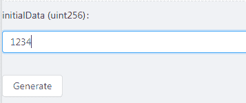
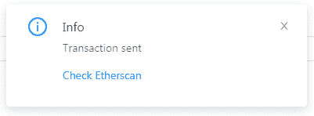
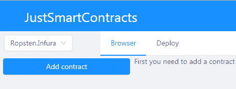
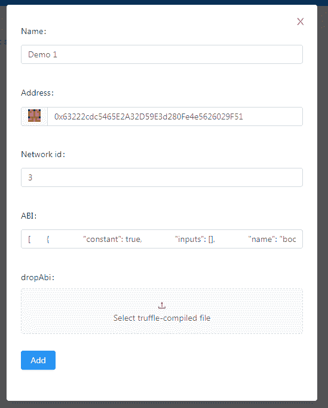
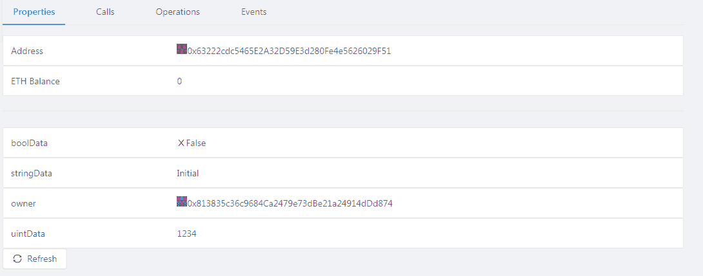
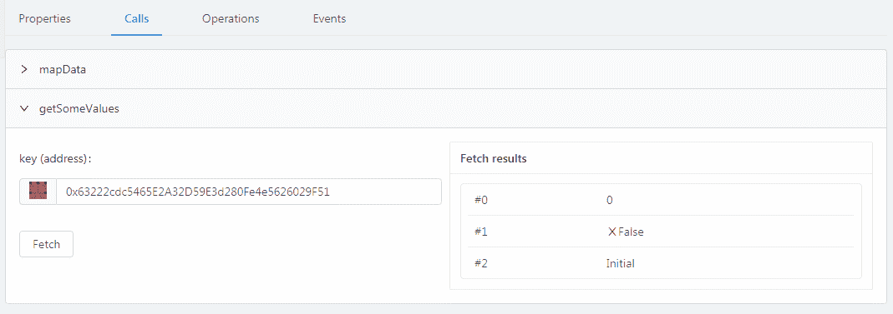
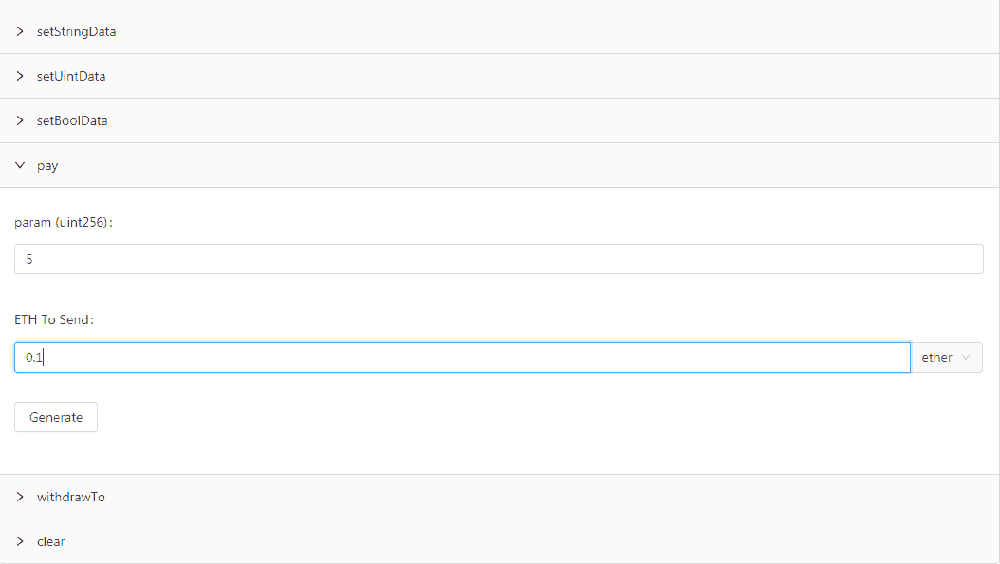
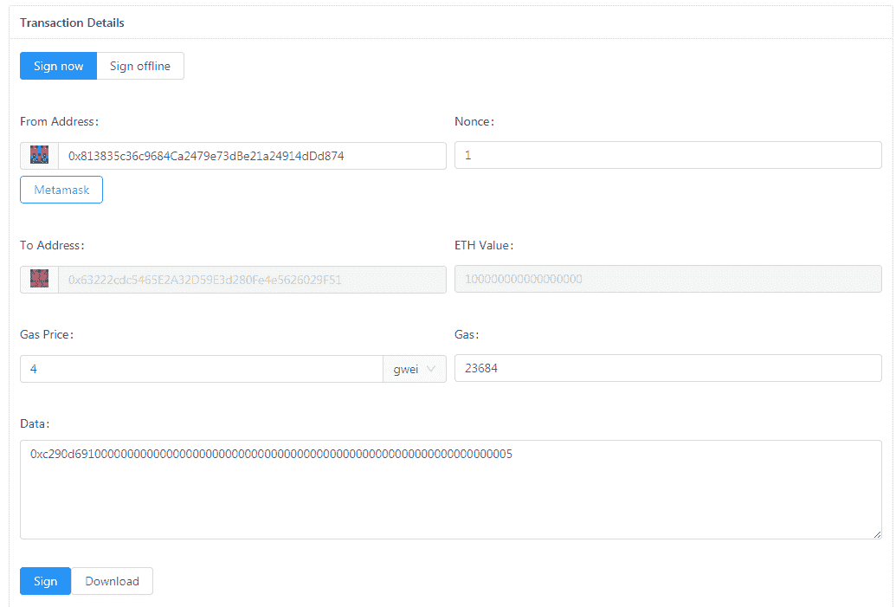
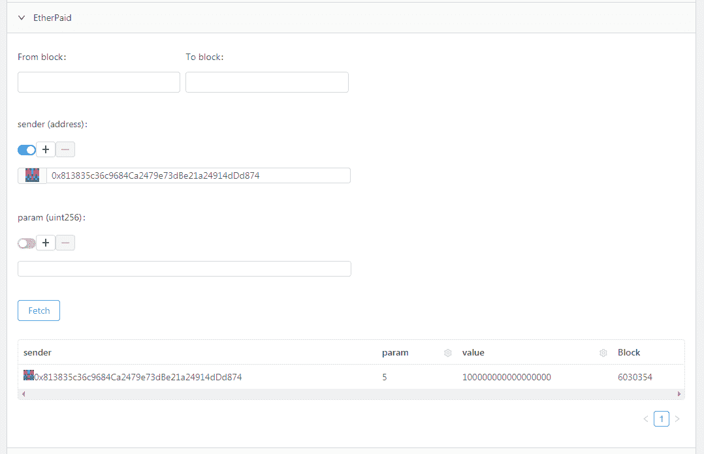

# JustSmartContracts.dev 简介

> 原文：<https://medium.com/coinmonks/introducing-justsmartcontracts-dev-web-tool-for-interacting-with-ethereum-smart-contracts-da9b5dfe563c?source=collection_archive---------1----------------------->

## 用于与以太坊智能合约交互的 web 工具

为了给以太坊智能合约开发者和区块链爱好者提供更好的体验，我想在这里介绍一个我和我朋友开发的网站——[https://justsmartcontracts.dev/](https://justsmartcontracts.dev/)。但是首先我要解释创建这个网站的原因。

# 我们为什么需要它？

在过去的两年里，我一直在密切关注一个基于以太坊区块链的项目。这项工作包括开发智能合同和执行各种链外互动。开发智能合约本身的过程非常简单。写代码-`truffle compile`-`truffle test`-重复。然而，与已经部署的契约和部署过程本身的交互似乎总是有点烦人(尤其是如果您需要在安全的 *cold* 机器上签署事务)。我觉得缺乏面向用户的服务，并且不太喜欢那些已经存在的服务。此外，我想自己尝试前端开发，面向以太坊的网站似乎是一个完美的场景。最初，我们计划实现这些简单而有用的特性。

1.  在浏览器中存储 ABI+地址记录。没有强制注册之类的。
2.  快速切换网络:Mainnet/Ropsten/etc 或您自己的 localhost testnet。就像我的老式钱包一样。
3.  将相似的契约部分分组:`view`不需要事务就可以调用的函数，需要通过事务、事件调用的常用函数。
4.  合同事件中的用户友好搜索。
5.  用户友好的部署界面。

# 如何使用 JustSmartContracts

为了进行演示，我将使用部署在 Ropsten testnet 上的特殊测试契约。它的源代码可以在[这里](https://github.com/olekon/justsmartcontracts/blob/master/src/stubs/smarts/contracts/SampleContract.sol)找到。这个契约包含了我们测试和演示所需的一切:`public`数据、`view`函数、`payable`函数、事务函数、几个事件和带参数的`constructor`。除了测试，它没有其他真正的目的。

# 部署

目前，JustSmartContracts 只使用元掩码来签署交易。或者，您可以选择下载任何交易，并使用您想要的任何方式进行签名。
让我们首先选择**部署**选项卡…

…并指定字节码和 ABI。您可以从 truffle 构建文件中复制/粘贴这些信息，或者只是将该文件拖放到页面上。输入 ABI 后，我们可以指定构造函数参数

按下**生成**按钮，显示交易界面。那么你只需要从地址输入**即可。您可以手动或使用**元掩码**按钮从您的活动元掩码帐户复制地址。**签署**交易，等待确认。**

# 与合同互动

让我们使用您喜欢的任何区块链浏览器来查找已部署的合同地址。然后我们选择**浏览器**选项卡和**添加合同**。不要忘记保持当前网络设置为 Ropsten。

输入正确的网络 id 很重要。对于 Mainnet 它是 1，对于 Ropsten 它是 3，[等等](https://github.com/ethereum/EIPs/blob/master/EIPS/eip-155.md#list-of-chain-ids)

所有合同数据分为四类:

**1。属性**。这包括基本信息，如契约的地址及其以太网余额，以及`public`数据变量和不带参数的`view`函数。换句话说，不需要额外的用户输入就可以查询的所有内容。

**2。来电**。这包括带参数的`view`函数。换句话说，不需要发送事务就可以调用的函数，但是需要额外的用户输入。

**3。操作**。这些是需要执行交易的契约功能。例如，让我们看看契约的`payable`方法。

按下 **Generate** 按钮，打开我们之前用来部署合同的同一个事务接口。只是这次它还填充了**到**地址(合同)和要发送的以太值。

让我们**签署**并发送交易，确认后，我们将检查合同事件。

**4。事件**。显然，所有合同事件都属于这一类。让我们找到反映我们刚刚执行的操作的那个—**ether payed**。我们可以对`indexed`参数使用过滤器来缩小搜索范围。

# 其他功能

JustSmartContracts 使用浏览器的本地存储来存储您的合同和自定义网络信息。因此，如果您或您的浏览器清空了存储空间，您的合同将会丢失。此外，值得一提的是，JustSmartContracts 仍处于早期开发阶段，因此可能会出现一些小错误。

# 结论

我们希望[https://just smart contracts . dev](https://justsmartcontracts.dev)能够成为以太坊和 Solidity 开发者的一个有用且方便的工具。我们也肯定可以看到改进和新功能的空间，并尝试尽快实现它们。

> [在您的收件箱中直接获得最佳软件交易](https://coincodecap.com/?utm_source=coinmonks)

