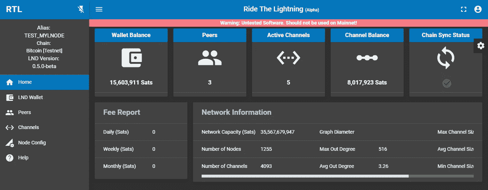
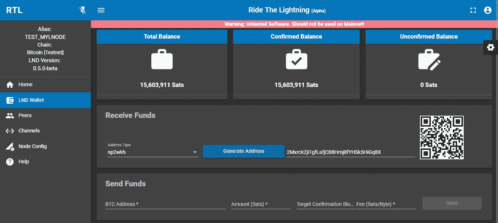
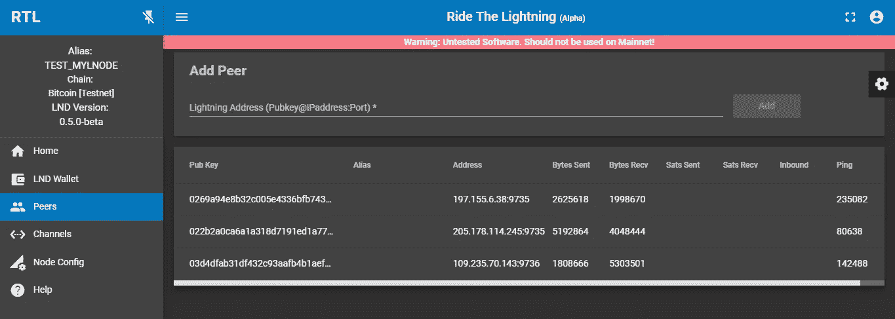
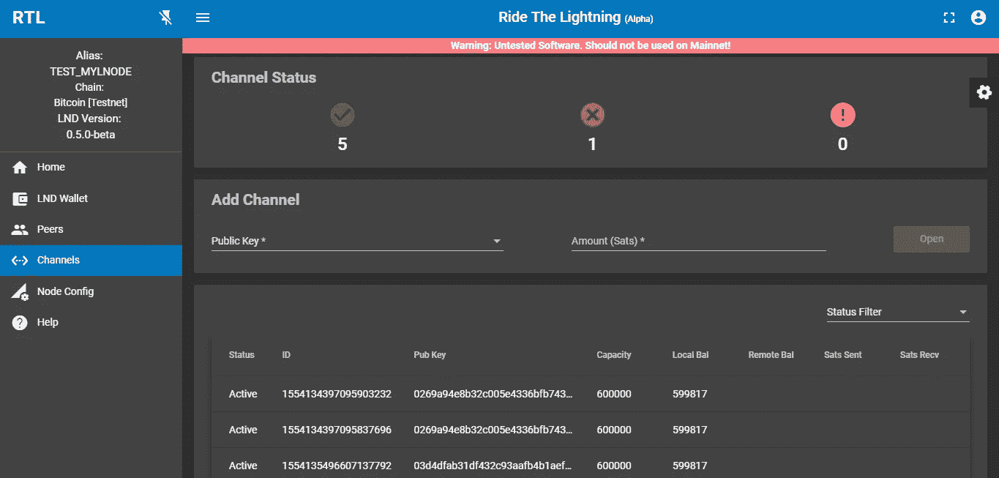

# 介绍 RTL——Lightning 网络守护进程的 Web 用户界面

> 原文：<https://medium.com/coinmonks/introducing-rtl-a-web-ui-for-lnd-d0bb0d937e91?source=collection_archive---------1----------------------->

**简介**

在这篇文章中，我们将介绍“**乘风破浪**或 **RTL** 的应用。这是一个适度的尝试，以解决和改善可用性的闪电网络守护进程(LND)，为节点运营商。

我们是两个拥有互补技能和对比特币闪电网络着迷的个体。我们有理由相信，现在正在开发许多这样的解决方案。这是我们对这个神奇的、不断进化的生态系统的小小贡献，这个生态系统就在我们眼前发展着。

我们认为“驾驭闪电”是一个很好的应用名字，它可以更好地管理闪电节点。无意冒犯金属乐队的粉丝。:-)(欢迎反馈和美术作品建议)。

**App**

RTL 是一个网络应用程序，这是一个易于使用的 LND 界面。这个想法是为命令行界面提供一个 GUI 抽象，它目前可供用户与 LND 交互。

这个应用程序是用 Angular 6 编写的，有一个 node.js 中间层，它与 LND REST API 交互。

该应用程序目前处于 alpha 测试阶段，需要用户和测试人员帮助我们发现错误并提供反馈，以便我们可以改进应用程序。我们目前的计划是至少在接下来的三个月内保持这个应用程序的 alpha 测试。

因此，如果你是一个闪电网络爱好者，请帮助我们测试并提供您的反馈。

**特色亮点**

以下是一些功能亮点，提供了应用程序布局的视角。更多的功能正在定期添加，您可以在我们的 [repo](https://github.com/ShahanaFarooqui/RTL/blob/master/Application_features.md) 上跟踪。

*   主页(仪表板)

主页是一个仪表板，提供有关节点的基本信息，如钱包余额、对等项、活动通道、通道余额和同步状态。仪表板的下半部分提供了节点的路由费用和网络信息。

Home Page

*   LND 钱包

此页面提供了您的 LND 钱包中未在渠道上承诺的资金的状态。您可以查看总余额、已确认余额和未确认余额。该页面还提供了 LND 基本钱包功能的接口，可用于为您的节点提供资金或从您的节点发送资金。

*请注意，该软件仍在 alpha 测试中，我们建议现在只在“testnet”上运行它*。

LND Wallet

*   凝视

此页面提供了一个将对等方连接到您的节点的界面。和，还列出了与您的节点连接的对等方。与同行连接是在闪电网络上打开通道的先决条件。

Peers

*   频道

该页面提供了通道状态视图(活动、非活动、未决)、与连接的对等方打开通道的能力以及通道列表。

Channels

**安装说明**

[https://github . com/ShahanaFarooqui/RTL/blob/master/readme . MD](https://github.com/ShahanaFarooqui/RTL/blob/master/README.md)

**未来路线图**

我们正在不断增加新的功能。当前的优先事项包括渠道详细信息、关闭渠道、验证付款请求、发送付款等。我们在这里维护和更新我们的路线图。

我们也愿意与有兴趣将这个 UI 集成到他们的完整节点堆栈上的开发人员合作。

**学分**

首先，特别感谢 LND 发展社区的所有人，他们开发了这个惊人的协议，它位于比特币之上。我们相信闪电网络是比特币的扩展解决方案，它将彻底改变下一代金融基础设施，这有可能建立在比特币的基础上。

LND 的 slack 频道尤其有助于解决我们的问题。特别感谢亚历克斯·博斯沃思和奥卢瓦·奥苏托昆。

我们还要感谢 [Stadicus](https://medium.com/u/c1196417c2ab?source=post_page-----d0bb0d937e91--------------------------------) ，他著名的[指南](https://github.com/Stadicus/guides/blob/master/raspibolt/README.md)是我们设置和使用 Lightning Network 的简单指南。

**关闭**

我们着手开发这个应用程序的目的是为了学习 Lightning Network，同时也是为了贡献可用的软件。随着我们继续构建软件，学习的过程也在继续。

如果即使是一小部分的社区或用户能够利用这个软件，并帮助发展闪电网络，这是我们的使命完成。

同样，我们想邀请能够提供反馈并帮助我们改进这个软件的测试人员和用户。

谢谢！

**参考文献**

对于 Windows 用户，安装指南:

 [## 在 Windows 上用 LND 和比特币测试 RTL 网络用户界面

### 在 Windows 上使用 LND 和比特币测试 RTL 网络用户界面的指南

link.medium.com](https://link.medium.com/1SSq0oNlLR) 

功能列表:

 [## 沙哈纳法鲁基/RTL

### RTL 大厦。在 GitHub 上创建一个帐户，为沙哈纳法鲁基/RTL 的发展做出贡献。

github.com](https://github.com/ShahanaFarooqui/RTL/blob/master/Application_features.md) 

LND 指南:

 [## 体育场/指南

### 斯塔迪库斯的加密货币指南。通过在 GitHub 上创建帐户，为 Stadicus/guides 的发展做出贡献。

github.com](https://github.com/Stadicus/guides/blob/master/raspibolt/README.md) 

如有任何问题或反馈，欢迎在 twitter ( [@Suheb__](https://twitter.com/Suheb__) )留言或找我