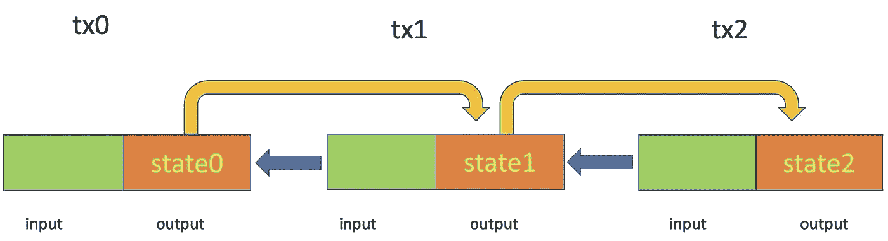

# 介绍有状态属性

> 原文：<https://medium.com/coinmonks/introducing-stateful-properties-f0f6bce45a06?source=collection_archive---------8----------------------->

## 我是如何学会不再担心并热爱比特币国家的

对于 sCrypt 初学者来说，最具挑战性的部分之一是在契约中保持内部状态。我们使用[州装饰者](https://scryptdoc.readthedocs.io/en/latest/state.html)提供了一个优雅的解决方案。

State is carried across UTXOs in a contract

# 问题是

比特币智能合约使用 UTXO 模型，默认无状态。之前，我们已经开发了一种通用的方法来维护契约中的状态，它建立在 [OP_PUSH_TX](https://xiaohuiliu.medium.com/op-push-tx-3d3d279174c1) 技术的基础上。即使这种方法证明保持状态是可行的，它充其量也是笨拙的。

[Counter contract](https://github.com/sCrypt-Inc/boilerplate/blob/79eea1f37a53f7b75ecb74d9605c498a4d50bf61/contracts/counter.scrypt)

例如，在上面的契约中，我们维护一个状态，计数器，并在每次调用 ***increment()*** 时加 1。我们在这里只维护了一个计数器，但是已经有大量的样板代码，主要是为了序列化和反序列化状态(第 5–9 行和第 15 行)。核心逻辑只是第 12 行的一行。当状态变得更加复杂时，代码会变得更加麻烦和容易出错。

# 解决方案:国家装饰者

使用新的状态装饰器方法，您可以通过三个简单的步骤来维护契约中的状态，如下所示:

1.  用 decorator `@state`声明任何属于状态的属性。
2.  将 stateful 属性用作普通属性:读取并更新它。
3.  当您准备将新状态传递到当前支出事务的输出中时，只需调用一个内置函数`this.getStateScript()`来获取包含最新有状态属性的锁定脚本。它是为每个有状态契约自动生成的，也就是说，一个契约至少有一个用`@state`修饰的属性。

[Counter contract](https://github.com/scrypt-sv/boilerplate/blob/master/contracts/counter.scrypt)

如您所见，这比手动序列化和反序列化状态更加简洁和安全。当国家增长时，这种优势更加显著。

## SDK 支持

我们已经更新了我们的[JavaScript/TypeScript SDK](https://github.com/sCrypt-Inc/scryptlib#contracts-with-state)来支持有状态属性，极大地简化了与有状态契约的交互。其他 SDK([Python](https://github.com/sCrypt-Inc/py-scryptlib)&[Go](https://github.com/sCrypt-Inc/go-scryptlib))即将更新。

[1]装饰器语法受到了 [Python](https://www.python.org/dev/peps/pep-0318/) 、 [Java](https://docs.oracle.com/javaee/7/tutorial/cdi-adv007.htm) 和 [TypeScript](https://www.typescriptlang.org/docs/handbook/decorators.html) 的启发。

> 加入 Coinmonks [电报频道](https://t.me/coincodecap)和 [Youtube 频道](https://www.youtube.com/c/coinmonks/videos)了解加密交易和投资

## 另外，阅读

*   [网格交易机器人](https://blog.coincodecap.com/grid-trading) | [Cryptohopper 审查](/coinmonks/cryptohopper-review-a388ff5bae88) | [Bexplus 审查](https://blog.coincodecap.com/bexplus-review)
*   [7 个最佳零费用加密交易平台](https://blog.coincodecap.com/zero-fee-crypto-exchanges)
*   [分散交易所](https://blog.coincodecap.com/what-are-decentralized-exchanges) | [比特 FIP](https://blog.coincodecap.com/bitbns-fip) | [Pionex 评论](https://blog.coincodecap.com/pionex-review-exchange-with-crypto-trading-bot)
*   [用信用卡购买密码的 10 个最佳地点](https://blog.coincodecap.com/buy-crypto-with-credit-card)
*   [霍比评论](https://blog.coincodecap.com/huobi-review) | [OKEx 保证金交易](https://blog.coincodecap.com/okex-margin-trading) | [期货交易](https://blog.coincodecap.com/futures-trading)
*   [麻雀交换评论](https://blog.coincodecap.com/sparrow-exchange-review) | [纳什交换评论](https://blog.coincodecap.com/nash-exchange-review)
*   [美国最佳加密交易机器人](https://blog.coincodecap.com/crypto-trading-bots-in-the-us) | [经常性评论](https://blog.coincodecap.com/changelly-review)
*   [在印度利用加密套利赚取被动收入](https://blog.coincodecap.com/crypto-arbitrage-in-india)