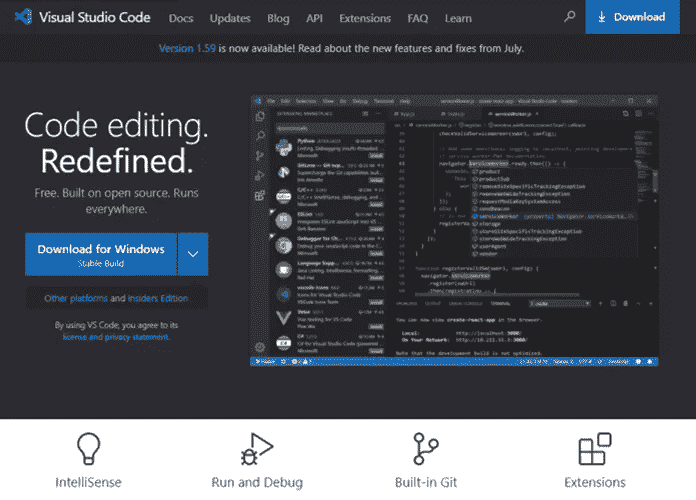

# 以太坊开发环境简介:第 1 部分

> 原文：<https://medium.com/coinmonks/introducing-the-ethereum-development-environment-part-1-bed0a273e55?source=collection_archive---------1----------------------->

## **我的以太坊开发工具链**

像所有其他软件开发过程一样，在以太坊中构建[分散式应用](https://ethereum.org/en/dapps/)会附带一套开发工具。其实有很多选择。

在这个由 2 部分组成的教程中，我将通过构建[自由职业者分散应用](/coinmonks/the-freelancers-smart-contract-how-it-works-fda5e1fddf8d)的例子来展示我的以太坊开发工具链:

1.  编写和测试 Solidity Smart 契约
2.  [构建和部署 DApp](https://jacksonngtech.medium.com/introducing-the-ethereum-development-environment-part-2-5fc49a62621d)

我在本教程中使用的脚本和配置文件可以在我的 GitHub 库[这里](https://github.com/jacksonng77/GettingStartedEthereum)找到

有很多方法可以建造 DApp，这是我的方法。


Photo by [Alexandru Acea](https://unsplash.com/@alexacea?utm_source=unsplash&utm_medium=referral&utm_content=creditCopyText) on [Unsplash](https://unsplash.com/s/photos/coding?utm_source=unsplash&utm_medium=referral&utm_content=creditCopyText)

## **加纳切**

[Ganache](https://www.trufflesuite.com/ganache) 是基于桌面的个人以太坊区块链。一个本地的、独立的以太坊区块链网络是测试你的代码的最快方式，因为交易是瞬间执行的。

访问 Ganache，下载、安装并在您的计算机上启动它。


添加新的工作空间。称之为“自由职业者合同”，因为我们将在这个独立的本地以太坊区块链网络中测试我们的自由职业者合同。保存工作空间并启动它。


请注意，已经生成了一些帐户，每个帐户都有 100 个 ETH。点按“显示密钥”以显示第一个帐户的私钥。


复制私钥。我们将在下一步中使用这个密钥。


## **元掩码**

MetaMask 是一款以太坊钱包。就像你存放美元钞票的实体钱包一样，MetaMask 可以让你在账户之间存钱、消费和转账。MetaMask 还允许您执行以太坊交易和运行分散的应用程序。

在 Chrome 或 Firefox 浏览器上下载并设置 MetaMask。


默认情况下，您的新 MetaMask 钱包连接到主以太坊网络。我们会将其重新连接到我们本地的 Ganache 以太坊区块链。为此，请访问元掩码上的设置。添加具有下列设置的网络:

*   **网络名称:**本地(您可以称之为 Ganache，或者任何您喜欢的名称)
*   **新建 RPC URL:**[HTTP://127 . 0 . 0 . 1:7545](http://HTTP://127.0.0.1:7545)(你可以在 RPC 服务器下的 Ganache 上找到这个
*   **链 ID:** 1337(这是 Ganache 的默认设置)


导入帐户。将您之前复制的私钥粘贴到私钥文本字段中。这会将相应的 Ganache 帐户导入到您的 MetaMask wallet 中。如果你这样做是正确的，你会在这个账户中看到 100 ETH。如果你愿意，你可以从 Ganache 导入更多的账户到 MetaMask。

## **Visual Studio 代码**

我使用 Visual Studio 代码作为我的集成开发环境(IDE)。我喜欢它，因为它附带了我喜欢使用的 Solidity 开发扩展。使用哪种 IDE 并不重要。在这里下载并安装你的。



搜索“Solidity Visual Developer”扩展并安装它。这将在你编码时提供坚实的语言支持。我喜欢它时髦的彩色代码亮点！


## **松露盒**

构建 Ganache 的人还构建了"[Truffle box](https://www.trufflesuite.com/boxes)"，这是带有 [Solidity](https://docs.soliditylang.org/en/v0.4.24/) 、 [Web3](https://web3js.readthedocs.io/en/v1.4.0/) 和其他库的样板文件，开发人员需要这些库来编译和测试他们的智能合约，并为您的分散式应用构建前端。有用于 [React 应用](https://www.trufflesuite.com/boxes/react)、 [React 原生](https://www.trufflesuite.com/boxes/drizzle-react-native)和[项目样本](https://www.trufflesuite.com/boxes/pet-shop)的松露盒。


在本教程中，我们正在构建自由职业者 DApp，一个简单的基于 HTML/JavaScript/Bootstrap 的 Web 应用程序。所以我们将使用 webpack 盒子。

安装松露

```
npm install -g truffle
```

我们现在准备开发我们的自由职业者 DApp 项目。在你的电脑上创建一个新文件夹“自由职业者”。输入以下命令，将 webpack 样板文件解压缩到文件夹中:

```
npx truffle unbox webpack
```

在 VS 代码中打开文件夹。我们准备开始建设。

编辑`truffle-config.js`。


更改 network 下的`develop`设置，使其指向 Ganache，因为这是我们测试合同的地方:

```
develop: {
      host: "127.0.0.1",     // Localhost (default: none)
      port: 7545,            // Standard Ethereum port (default: none)
      network_id: "*",       // Any network (default: none)
    },
```

将 Solidity 编译器版本改为 0.8.0，因为自由职业者智能合约是用 Solidity 0.8.0 编写的:

```
solc: {
       version: "0.8.0",    // Fetch exact version from solc-bin (default: truffle's version)
    }
```

这是 webpack 样板文件的迁移智能合同。将迁移智能契约的 Solidity 版本也更改为 0.8.0，以便它可以使用我们在 truffle-config.js 中指明的正确版本的 Solidity 编译器进行编译。

```
// SPDX-License-Identifier: MIT
pragma solidity ^0.8.0;contract Migrations {
    address public owner;
    uint public last_completed_migration; constructor() public {
        owner = msg.sender;
    } modifier **restricted**() {
        **if** (msg.sender == owner) _;
    } function **set**Completed(uint completed) public restricted {
        last_completed_migration = completed;
    }
}
```

## **编译&部署 freelancer.sol**

将 [freelancer.sol](https://github.com/jacksonng77/GettingStartedEthereum/blob/main/freelancer.sol) 复制到/contract 文件夹中。


然后运行以下命令编译 freelancer.sol 和 migration.sol:

```
truffle compile
```

我们现在准备迁移部署 freelancer.sol 智能合同。

在我的迁移脚本中，我编写了一个基本场景来执行一个[端到端流程](/coinmonks/the-freelancers-smart-contract-how-it-works-fda5e1fddf8d)，从合同启动到最终付款。

迁移脚本有两个用途——作为自由职业者智能合同的部署脚本，以及作为测试脚本，每当我进行代码更改时对智能合同进行回溯测试，这样我就可以确保每次调整时没有破坏任何东西。

以下是一些代码片段:

*连接到本地 Ganache 区块链上的第一个和第二个地址。第一个账户属于自由职业者，第二个账户属于委托人:*

```
//get address **for** programmer and client wallet
    await web3.eth.getAccounts().then(function(result){
        programmerWallet = result[0];
        clientWallet = result[1];
    });
```

*自由职业者部署自由职业者合同:*

```
//**deploy** freelancer contract
    **await** deployer.deploy(freelancer, {from: programmerWallet}).then(()=> {
        **console**.log("Freelance Contract:" + freelancer.address);
      }
    );
```

*自由职业者在合同中加入“设计阶段”:*

```
//**add** design phase to freelancer contract
    **await** freelancer.deployed().then(
        **async** function(contractInstance) {
            **await** contractInstance.addSchedule('DSP','Design Phase', web3.utils.toWei('1.25', 'ether'), {from: programmerWallet}).then(
              **function**(v) {
                **console**.log("Schedule Added:"+v.receipt.logs[0].args.shortCode);
              }
            )
        }
    );
```

*客户接受合同并为设计阶段提供资金:*

```
//client accept freelancer contract
    await freelancer.deployed().then(
        async function(contractInstance) {
            await contractInstance.acceptProject({from: clientWallet}).then(
              function(v) {
                console.log("Contract Accepted By:"+v.receipt.logs[0].args.clientAddress);
              }
            )
        }
    );

    //client funds design phase
    await freelancer.deployed().then(
        async function(contractInstance) {
            await contractInstance.fundTask(0, {from: clientWallet, value: web3.utils.toWei("1.25", "ether")}).then(
              function(v) {
                console.log("Task Funded:"+v.receipt.logs[0].args.scheduleID);
              }
            )
        }
    );
```

*自由职业者从项目中释放资金给自己，然后结束项目:*

```
//**programmer** releases funds to himself
    **await** freelancer.deployed().then(
        **async** function(contractInstance) {
            **await** contractInstance.releaseFunds(2, {from: programmerWallet}).then(
                **function**(v) {
                    **console**.log("Funds Released:"+v.receipt.logs[0].args.scheduleID);
                }
            )
        }
    );     //**programmer** ends project
    **await** freelancer.deployed().then(
        **async** function(contractInstance) {
            **await** contractInstance.endProject({from: programmerWallet}).then(
                **function**(v) {
                    **console**.log("Project Ended");
                }
            )
        }
    );
```

要运行迁移脚本，请将 [2_deploy_contracts.js](https://github.com/jacksonng77/GettingStartedEthereum/blob/main/2_deploy_contracts.js) 复制到/migrations。


现在运行以下命令来迁移、部署和测试自由职业者智能合同:

```
truffle migrate
```

观察加纳切。如果运行成功，您的第一个钱包中的 ETHs 将被转移到第二个钱包中。


## **接下来是什么？**

既然已经开发、测试和迁移了自由职业者智能合同，下一步就是构建这个分散应用程序的前端。我们将在教程的[第二部分对此进行探讨。](https://jacksonngtech.medium.com/introducing-the-ethereum-development-environment-part-2-5fc49a62621d)

如果您喜欢本教程，也许您也希望阅读:

*   [总部位于 NFT 的豪华手表证书](/coinmonks/nft-based-luxury-watch-certificate-how-it-works-71d715914006):演示如何在以太坊区块链上用不可替代的令牌(NFT)取代纸质证书。
*   自由职业者[智能*合同*合同](/coinmonks/the-freelancers-smart-contract-how-it-works-fda5e1fddf8d):自由职业者和他的客户之间的一种支付系统，以确保交货和付款。
*   Ropsten 以太坊水龙头:我在 Ropsten 网络上做了一个以太坊水龙头发出 ETH。
*   [在区块链上投票](/coinmonks/voting-on-a-blockchain-how-it-works-3bb41582f403):以太坊上投票 DApp 的实现。
*   [使用 Kaleido](/coinmonks/deploy-a-private-ethereum-blockchain-in-10-minutes-with-kaleido-73c21a26d5bb) 在 10 分钟内部署一个私有以太坊区块链:瞬间启动并运行一个私有以太坊区块链。
*   [通过演示解释智能合约](/coinmonks/smart-contract-explained-by-demonstration-93b06e938474):托管服务智能合约 DApp 的演示——在我看来，这是向外行人解释区块链是什么的最快方式。
*   [以太坊 IOT Kid Grounding Device](/coinmonks/ethereum-iot-kid-grounding-device-iv-arduino-in-retrospect-b7a32e5ec185) :我将区块链与物联网结合的尝试。
*   [彩票作为智能合约](/coinmonks/lottery-as-a-smart-contract-the-business-logic-3bd22d3a6c4e):去中心化彩票，在以太坊区块链上构建彩票系统的尝试。

> 加入 [Coinmonks 电报频道](https://t.me/coincodecap)，了解加密交易和投资

## 另外，阅读

[](https://blog.coincodecap.com/crypto-exchange) [## 最佳加密交易所| 2021 年十大加密货币交易所

### 加密货币交易所的加密交易需要了解市场，这可以帮助你获得利润…

blog.coincodecap.com](https://blog.coincodecap.com/crypto-exchange) [](https://blog.coincodecap.com/crypto-lending) [## 2021 年 9 大最佳加密借贷平台

### 当谈到加密货币贷款时，大量因素等同于良好的收入状况。此外，借款的一部分…

blog.coincodecap.com](https://blog.coincodecap.com/crypto-lending) [](/coinmonks/crypto-trading-bot-c2ffce8acb2a) [## 2021 年最佳加密交易机器人(免费和付费)

### 2021 年币安、比特币基地、库币和其他密码交易所的最佳密码交易机器人。四进制，位间隙…

medium.com](/coinmonks/crypto-trading-bot-c2ffce8acb2a) [](/coinmonks/best-crypto-signals-telegram-5785cdbc4b2b) [## 最佳 4 个加密交易信号电报通道

### 这是乏味的找到正确的加密交易信号提供商。因此，在本文中，我们将讨论最好的…

medium.com](/coinmonks/best-crypto-signals-telegram-5785cdbc4b2b) [](https://blog.coincodecap.com/blockfi-review) [## BlockFi 评论 2021:利弊和利率

### 今天，我们提出了一个全面的 BlockFi 评论，这是一个成立于 2017 年的加密贷款平台，拥有其…

blog.coincodecap.com](https://blog.coincodecap.com/blockfi-review) [](/coinmonks/buy-bitcoin-in-india-feb50ddfef94) [## 如何在印度购买比特币？2021 年购买比特币的 7 款最佳应用[手机版]

### 如何使用移动应用程序购买比特币印度

medium.com](/coinmonks/buy-bitcoin-in-india-feb50ddfef94) [](/coinmonks/best-crypto-tax-tool-for-my-money-72d4b430816b) [## 加密税务软件——五大最佳比特币税务计算器[2021]

### 不管你是刚接触加密还是已经在这个领域呆了一段时间，你都需要交税。

medium.com](/coinmonks/best-crypto-tax-tool-for-my-money-72d4b430816b) [](https://blog.coincodecap.com/pionex-review-exchange-with-crypto-trading-bot) [## Pionex 评论-被动交易者的简单交易机器人

### 在本文中，我们将回顾 Pionex，它提供了加密交易机器人自动化工具，集成了一个…

blog.coincodecap.com](https://blog.coincodecap.com/pionex-review-exchange-with-crypto-trading-bot) [](https://blog.coincodecap.com/best-hardware-wallet-bitcoin) [## 存储比特币的最佳加密硬件钱包[2021]

### 保管您的数字资产很容易，但找到正确的存储方式却是一项繁琐的任务。在线钱包有一个风险…

blog.coincodecap.com](https://blog.coincodecap.com/best-hardware-wallet-bitcoin)