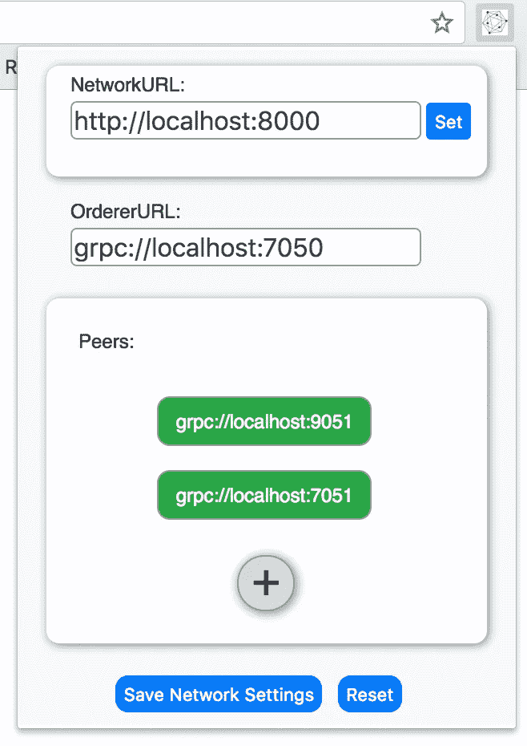

# Hyperledger Fabric Chrome 扩展简介

> 原文：<https://medium.com/coinmonks/introducing-the-hyperledger-fabric-chrome-extension-f1fd00f84a2c?source=collection_archive---------2----------------------->

在我的 Hyperledger 实习项目中，我的任务是构建一个 Chrome 扩展，提供一个易于使用的 api，可以连接到光纤网络。

这个项目的灵感来自以太坊网络上的**元面具**(【https://metamask.io/】T2)。

MetaMask 的伟大之处在于，它为开发人员提供了一种安全的方式来建立一个可以连接到以太坊网络的网站。它还提供了一种发送交易和加密货币的简单方法。

与 Metamask 类似，Chrome 扩展的工作方式相同，只是使用了 Hyperledger Fabric 而不是 Ethereum。扩展 UI 允许您输入网络端点，并将自动配置其余部分。

这种扩展的好处是它将允许应用程序变得更加分散。这是因为事务不是由某个公司服务器完成的，而是由用户完成的。

该扩展通过将 api 注入网页来工作。web 开发人员将使用这些来提示交易。

为了防止网站发送恶意交易，用户需要从弹出窗口中确认交易。

**接下来是什么:**

目前，该扩展还不支持某些网络所需的登录系统。因此，您目前无法添加凭据。

尽管如此，它目前在大多数基本网络上都能工作。

请随意查看/投稿:[https://github.com/hyperledger-labs/fabric-chrome-extension](https://github.com/hyperledger-labs/fabric-chrome-extension)

> [直接在您的收件箱中获得最佳软件交易](https://coincodecap.com/?utm_source=coinmonks)

