# lexDAO 注册中心介绍:智能签约的 TLDR 方法

> 原文：<https://medium.com/coinmonks/introducing-the-lexdao-registry-a-tldr-approach-to-smart-contracting-f4ebca8ff4f0?source=collection_archive---------2----------------------->

⚖️ *律师们，欢迎来到你们的加密|* 💰 *|经济沙盒！* ⚔️

作为律师，我们可以更好地抓住眼前的机遇。

坦率地说，曾经辉煌的法律学术道路和为 [*公会*](https://www.jstor.org/stable/29760531?seq=1#page_scan_tab_contents) 工作已经失去了很多光彩。

但是没有理由为什么律师的常规*信任脚本*和*争议解决*功能不能跟上创新的步伐。

有点不幸的是，当律师事务所绞尽脑汁将信息技术转移到 2000 年以后，并支付[无执照的法律毕业生 19 万起薪](https://abovethelaw.com/2018/09/biglaw-firm-reverses-course-on-associate-raises-is-now-onboard-with-190000-starting-salary/)以跟上琼斯(day)的步伐时，赛弗朋克们正在编程[数字法庭](https://github.com/aragon/aragon-court)并试图将法律成本降至最低。

如果你是一家律师事务所的客户，控制着外部法律支出，并面临着自己日益增加的自动化压力，如果更好的服务就在眼前，你真的会犹豫要不要削减配备齐全、毫无歉意的服务吗？人们一定想知道…

在据称紧随我们的趋势中，以太坊等可编程区块链承诺通过利用其他互联网固有的怪癖，从根本上改变交易结算成本，*交易脚本*可以服务于传统的受信任的角色，如托管代理人和支付代理人，因为他们得到这样的指示，并且比他们的银行同行具有更大的确定性和成本效益(……与由例如纸质合同指挥的人类托管代理人不同，以太坊代理人不睡觉或不履行职责……)。

以太坊因此可以作为一个令人兴奋和及时的沙盒，让律师们了解，更重要的是，*在*中发挥领导作用，技术趋势可能会决定我们在未来十年如何处理越来越多地转移到网上的资产和交易。

***声音好听吗？***

好了，接下来来认识一下[***lex Dao Registry***](https://github.com/lexDAO/TLDR/blob/master/README.md)，这是一个高度简化的“TLDR”方法，用于律师智能签约和在线争议解决，由以太坊事务脚本提供支持。(*什么？*)

我正试图让成为区块链合格律师变得简单而愚蠢，并给你的律师工具增加新的优势！哦，也许还能赚些钱💰~

***简要背景***

TLDR 智能合同是由~yours truly~写的，他是一名贸易公司律师，而以太坊( [Solidity](https://solidity.readthedocs.io/en/v0.5.12/) )程序员是由渴望写的🤷‍♂️.

除了托管数字托管和契约的脚本，TLDR 还通过游戏和加密经济功能在其维护者中作为“[道](https://www.sec.gov/litigation/investreport/34-81207.pdf)”进行治理，这是 Manuel Araoz 在 2019 年 2 月阐述的一种合作形式，“设计数字生命和死亡 ”👾💀。

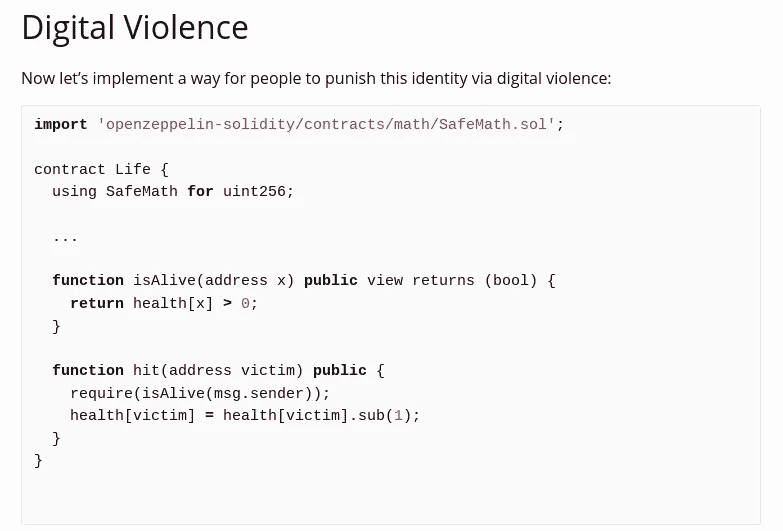

Example Solidity code for “Digital Life”

碰巧的是，这种形式类似于律师之间现有的私人和半对抗性治理方案，目前通过提交律师投诉和寻求对贬低我们所有集体努力的专业失误的补救来运营行业协会。

在这里，最初的 [TLDR 代码](https://etherscan.io/address/0x77eca7e76fbeb9c33d3ef0664f2b333205d48a77#code)由 Kelvin Fichter 审核，此处提供此类审核。反映此次审计和其他近期变更的当前部署可以在此处[视为 TLDR 版本 0.2](https://etherscan.io/address/0x77eca7e76fbeb9c33d3ef0664f2b333205d48a77)

以下章节将为律师和类似的交易者简要介绍 TLDR 是如何走到一起的:

***lexDAO:治理&密码经济学***

如上所述，lexDAO 实现了一个声誉机制，由以太坊上被识别为 *lexScribes* 的成员监管。

目前，lexDAO 地址在确定新的 lexScribes 的服务资格后对其进行注册。有立即的计划将这个角色转移到一个 Aragon DAO 代理程序，以便在更多的地址中分配这个接纳功能。我们目前有一个测试者团体，你可以在这里监控:

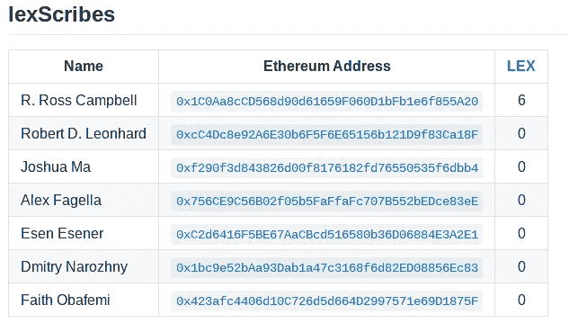

每一个被录取的 lexScribe 在注册 lexDAO 项目时都会获得“1”的声誉点。

这种最初的平衡反映了他们在 lexDAO 的试用状态，因为“0”声誉禁止 lexScribes 写新内容和赚取仲裁费用。

每个抄写员每天可以修复或削减 1 点其他抄写员的声望(因此，新抄写员可以说是如履薄冰，所有人都应该保持“清醒”)。

作为进步的缓冲和标志，每个 lexScribe 可以获得多达“3”的声誉点，反映他们在收到其他 lex scribe 投诉的情况下“三振出局”的总余额。

只要你的声望> 0，你就有资格在 TLDR 工作。

每隔 90 天，通过向 lexDAO 提交 0.1 以太(ξ)或燃烧 10 个由 TLDR 为他们的工作铸造的 LEX 代币，可以由 lexScribe 完全恢复 TLDR 的声誉。

实际上，作为一个*声誉卓著的* lexScribe，地址可以在 TLDR 注册模板，这些模板可用于将法律参考打包到数字托管交易中，以及解决相关争议:

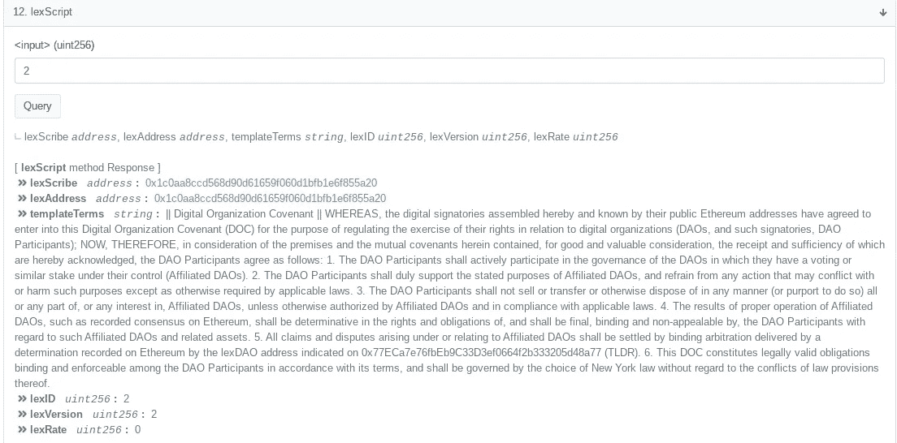

LEX ID #2 reflects Retainer Terms stored as ‘String ‘ directly on Ethereum

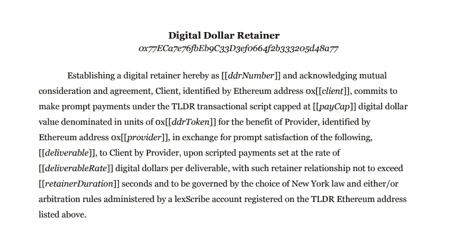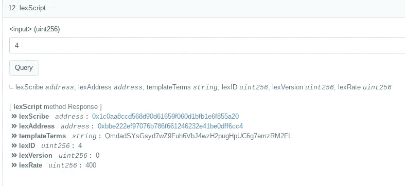

[Template Terms stored as IPFS Hash](https://ipfs.globalupload.io/QmdadSYsGsyd7wZ9Fuh6VbJ4wzH2pugHpUC6g7emzRM2FL)

如果以太坊用户将一个 lexScript(索引为 *lexID* )导入此类托管交易，授权地址将收到他们为模板记录的 lexRate 金额💸。

例如，导入 lexID #4“预聘”语言的 1 wETH 交易可能从 TLDR 托管支付每笔相关付款提取交易的 0.25%，如下所示:

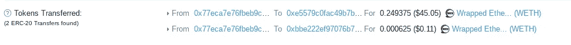

[Transaction Link](https://etherscan.io/tx/0x244a8792e856dd5365bd73ee20db9793608eabbb40310c481ae75bc2139e0524)

就上下文而言，LexID #4 引用了以下 IPFS 的预聘协议散列(此处清晰可见[为](https://ipfs.globalupload.io/QmdadSYsGsyd7wZ9Fuh6VbJ4wzH2pugHpUC6g7emzRM2FL))来以人类可读的术语包装以 [*wETH*](http://weth.io) 命名的托管交易:

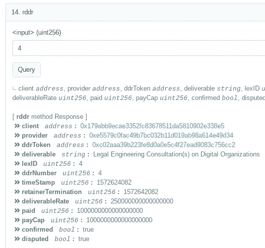

Details of deal are stored in Ethereum object

在这个托管示例中，此类预聘模板[费用被直接](https://etherscan.io/address/0xbbe222ef97076b786f661246232e41be0dff6cc4#tokentxns)到使用 [Aragon DAO](https://mainnet.aragon.org/#/openesquire) 模板代码运行的 [OpenESQ LLC/DAO](https://forum.aragon.org/t/funding-proposal-reimburse-formation-of-open-esq-llc-hybrid-aragon-organization/755) 金库🦅(#stackingwei)，由此衍生的每笔交易的 0.25% 🕺.

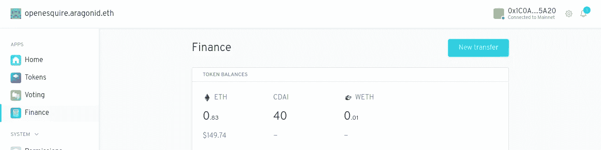

此外，为了获得更多有趣的激励，我们还可以看到对有争议的托管金额进行仲裁是如何奖励一个 instantly⚡:的

***直接在 raw***[***etherscan dApp***](https://etherscan.io/address/0x77eca7e76fbeb9c33d3ef0664f2b333205d48a77#writeContract)***:***

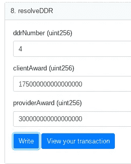

*using wei amounts // see gwei.io for background

***结算托管值:***

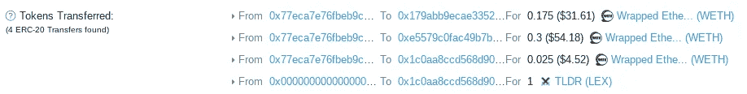

[Transaction Link](https://etherscan.io/tx/0xf7ae1b729b1ce371b701d7c0a823cc3a718a41be849551f7e8e6393b99454e47)

**莱克斯令牌**

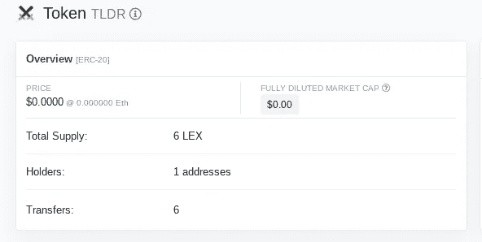

[LEX Token Page](https://etherscan.io/token/0x77eca7e76fbeb9c33d3ef0664f2b333205d48a77)

每个 lexScribe 可以为他们注册的每个 lexScript 赢得 1 个 TLDR 本地 LEX token，以完成托管交易、数字契约或仲裁托管争议。

如上所述，LEX 代币可以兑换成 TLDR 积分，以在每个季度更新信誉积分。此外，TLDR 计划要求仲裁员在其账户余额中为这项工作特权保留 5 LEX。也有一些涉及 lexDAO 表示的 LEX 用例，我们欢迎对此提出意见！

**想要轻松开始 TLDR 智能承包吗？**

**尝试对这种“数字组织契约”(DOC)形式进行数字签名，这种形式在 LexID #3 中嵌入了 IPFS 散列:** ✒️ ✋

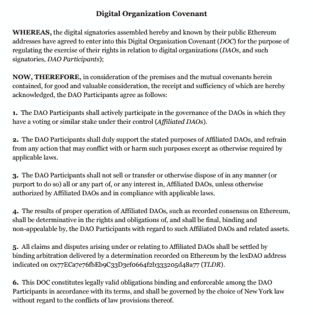

[IPFS Link](https://ipfs.globalupload.io/QmW5rkmZPFrEd3j1JJq9SSWqyXrKKW7STEQtcD5hJxuWNP)

为此，单击此链接到原始 TLDR [以太扫描 dApp 编写函数](https://etherscan.io/address/0x77eca7e76fbeb9c33d3ef0664f2b333205d48a77#writeContract)(最底部，24 — *signDC* )，输入“3”作为 lexScript lexID 的参考，然后将自己添加到有序的 DAO 参与者池中:

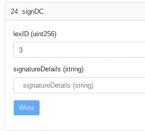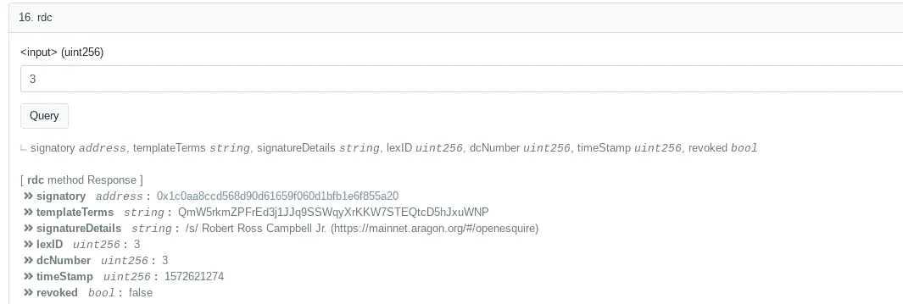

Digital Covenant on DOC terms stored on TLDR // revocable-at-will

*万岁！*

由于我们开发了一个用户友好的(d)应用程序和界面，供律师访问和管理 lexDAO / TLDR，我们欢迎对我们的代码和相关文档提出意见:[https://github.com/lexDAO/TLDR](https://github.com/lexDAO/TLDR)💪

如果您想了解更多关于成为 TLDR 用户或贡献 lexScribe 的信息，请通过 info@lexdao.club 🖖联系我们

***12 月 31 日更新:***

我们最近在这里部署了一个新的 TLDR 智能合同[实例，还构建了一个 dApp 来管理](https://etherscan.io/address/0x8CEDe32BbbCe5854992e151Fe215f2887E522553) [lexdao.club](https://lexdao.club/) (BETA)的注册 escrows！

> [直接在您的收件箱中获得最佳软件交易](https://coincodecap.com/?utm_source=coinmonks)

