# 介绍 TheButton.co——一个简单的以太坊游戏

> 原文：<https://medium.com/coinmonks/introducing-thebutton-co-a-simple-ethereum-game-b1b03fe1e8ce?source=collection_archive---------7----------------------->

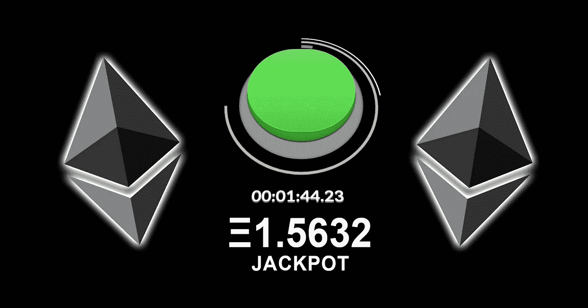

[TheButton.co](http://thebutton.co/)

# TL；速度三角形定位法(dead reckoning)

这是对流行的 Reddit 实验[按钮](https://en.wikipedia.org/wiki/The_Button_(Reddit))的模仿，但有一些关键的不同。核心上，这个按钮是基于一个[以太坊](https://ethereum.org/)智能合约。有一个倒数计时器——当按钮被按下时，计时器重置(就像原来一样)。任何人都可以想按多少次就按多少次，但是按一次需要花费*乙醚*。最后一名按压者赢得累积的乙醚作为头奖！

[在这里查看](http://thebutton.co/)并加入我们的[子栏目](https://www.reddit.com/r/TheButtonCo/)！

# 详细描述

## 游戏规则

以上 TL；灾难恢复是一个巨大的简化，因为它仅仅触及了表面。首先，按下按钮存入的资金进入四个不同的“桶”:

*   累积奖金(目前为 85%)
*   **慈善**(目前为 5%)
*   开发人员的收入(目前为 9%)
*   其余的将用于下一次竞选活动(目前为 1%)

可以推断，如果计时器超时，活动就结束了。当这种情况发生时，下一次按键将结束上一次活动，并开始新的活动。完成一项运动意味着累积的乙醚将按照上述预设的比例进行分离。

其次，按键的价格不是不变的！有两个参数决定价格如何变化: **N** 和**价格乘数**。目前 N = 5，价格乘数设置为 6%，这意味着每按 4 次价格将增加 6%。

最后，活动还有一个决定其行为的参数——周期(或计时器重置的值),当前设置为 30 分钟。

## 动机

如果你熟悉原来的按钮，那么这大部分是有意义的，但如果不是，我强烈推荐检查原来的[子编辑](https://www.reddit.com/r/thebutton/)。在过去的一年里，我一直在学习 solidity，我一直在思考一些简单而有趣的想法，我可以将它们作为 dApps 来实现。想到过去简单的和病毒性的互联网现象，我很快就把这些点连接起来，并思考如何将这个按钮变成一个以太坊 dApp。我以前从未做过任何 web 开发，所以这是一次重要的学习经历！

我有工程背景，但我也刚刚完成工商管理硕士学位。我一直在思考智能合同能为企业做些什么，我的[会计智能合同库](/coinmonks/accounting-base-for-solidity-smart-contracts-384c4d53eaaf)是我希望为打算基于智能合同开展业务的开发者和公司做出贡献的方式之一。另一个方向是**思考回馈社会**，我希望更多的区块链项目采取这个方向，我也愿意为此做出贡献。我们都痴迷于我们正在开发的技术，或者我们已经购买的密码和令牌的价格，但我们中没有多少人停下来欣赏我们所拥有的，并思考我们如何才能帮助世界上的弱势群体。这就是为什么我在 button dApp 中实现了一个慈善部分，并且我打算将它添加到我未来工作的任何 dApp 项目中。思考企业社会责任不仅仅是已经成功的公司的事情，我认为它也可以是非常年轻的企业的一部分(这个主题可以是一篇独立的文章)！

目前的慈善受益人是 Giveth.io，我和他们没有任何关系。他们正致力于发展区块链以太坊的捐赠前景，并且是目前少数几个接受以太坊捐赠的慈善组织之一。他们对于如何使用资金是完全透明的，这使得将来向特定事业捐款变得容易。

## 智能合同概述

对于那些想了解智能合约具体做什么的人，我将在这里一步一步地解释。此处 合同部署[](https://etherscan.io/address/0x2b0ec0993a00b2ea625e3b37fcc74742f43a72fe#code)

*有包含所有简单的 getters 和 setters 的`ButtonBase`契约和包含核心逻辑的`TheButton`。基础合同继承`[DSAuth](https://github.com/dapphub/ds-auth)` [](https://github.com/dapphub/ds-auth)所有权和`[Accounting](/coinmonks/accounting-base-for-solidity-smart-contracts-384c4d53eaaf)`会计。也使用`[DSMath](https://github.com/dapphub/ds-math)`进行安全的数学运算。*

*按钮活动包含在结构中:*

*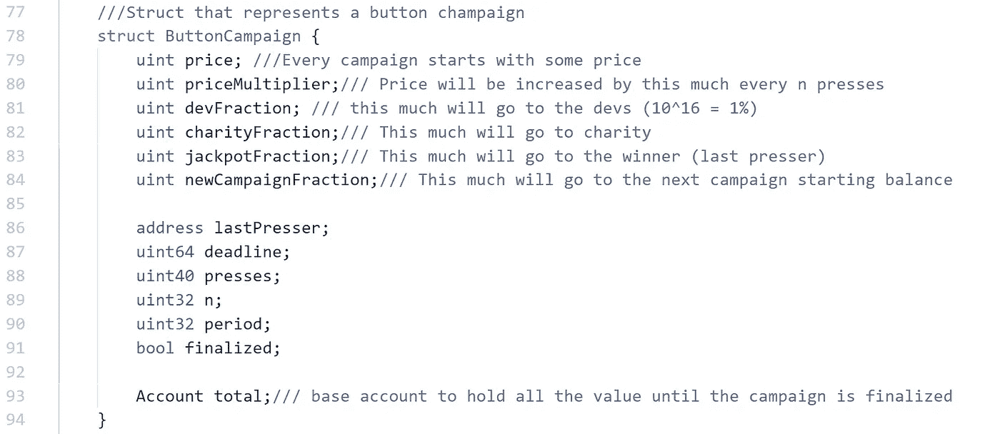*

*Button Campaign Struct*

*所有活动参数都可以更改，但更改它们只会影响下一个活动，因为这些参数是作为内部变量单独存储的。合同的所有者可以使用这些函数修饰符来更改参数，但只能在一定程度上更改:*

*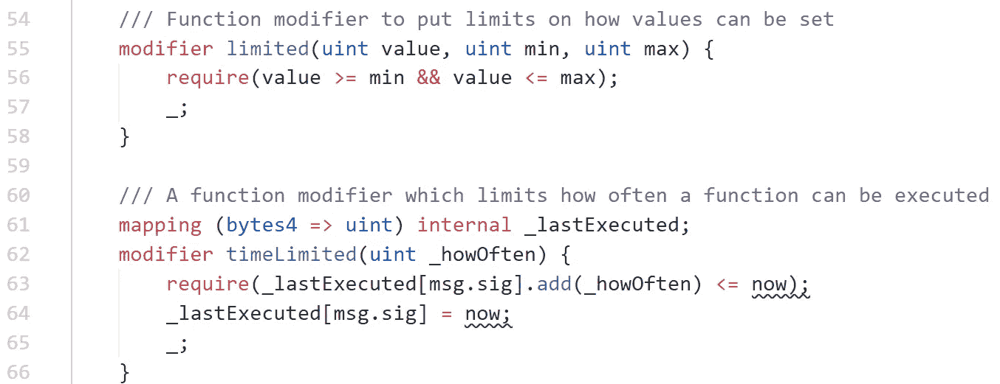*

*Limiting Function Modifiers*

*`limited`修饰符确保某些提供的参数有硬编码的限制，而`timeLimited`修饰符确保一个函数只能偶尔调用一次——这在设置按钮参数或计算分数时很有用:*

*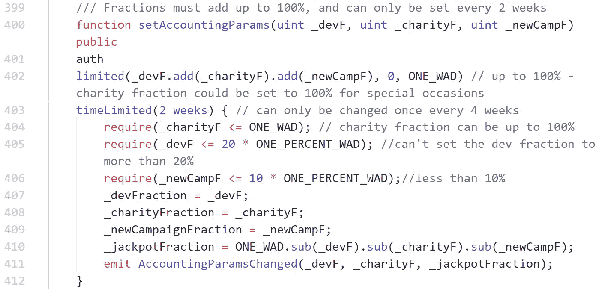*

*Changing Accounting Parameters*

*设置慈善受益人也是`timeLimited`——这丝毫不能阻止开发者欺骗和窃取慈善资金(通过等待设置受益人的期限)，但它至少保证了我们不能随时随地这样做。我们无意骗取任何人的血汗钱，但我们需要一些时间来获得合法性和社区的信任。*

*赢家的资金保存在一个映射中:*

```
*mapping (address => Account) winners;*
```

*提取头奖非常简单(使用专有会计功能可以轻松处理价值):*

*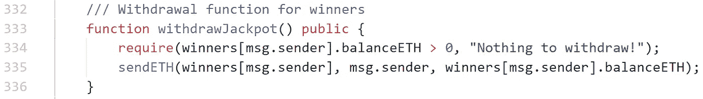*

*Jackpot Withdrawal Function*

*发送慈善 ETH:*

*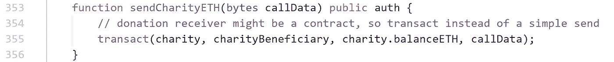*

*Donation Function*

*由于会计基础跟踪所有已知的存款和取款，我们有功能来兑换任何剩余的 ETH(可以从合同`selfdestruct`发送)或 ERC20 令牌:*

*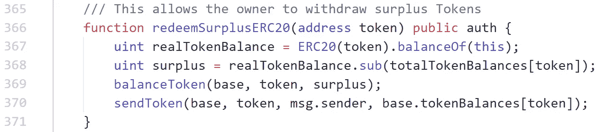*

*主合同包含**按下逻辑**:*

*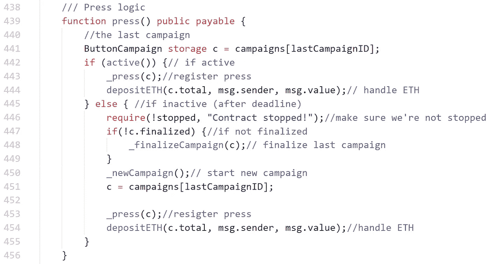*

*Button Press Code*

*归结起来就是:*

*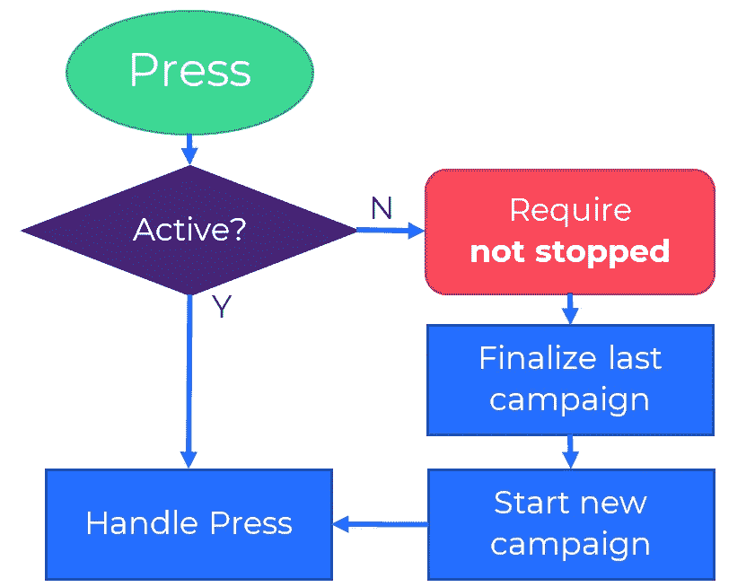*

*Button Press Logic*

*该按钮可以停止，但这只会阻止开始新的活动，并不影响任何正在运行的活动。它还防止从媒体功能完成一个活动，这就是为什么有一个单独的公共`finalize`功能，允许任何人完成最后一个活动。*

*操作印刷机看起来像这样:*

*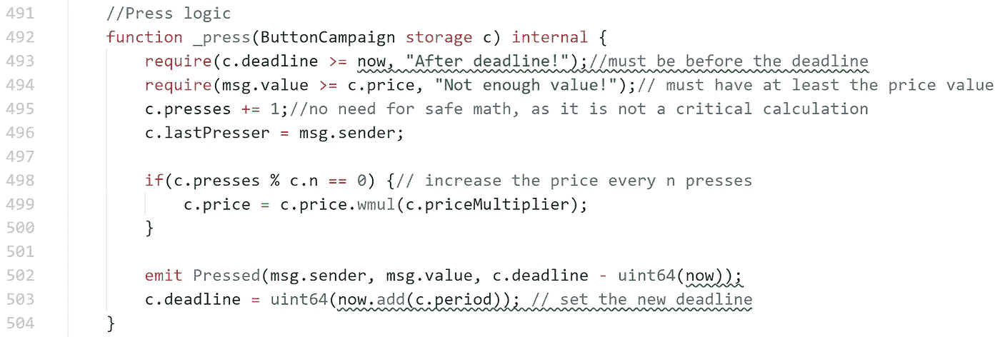*

*Press Handling — Internal Function*

*开始新的活动:*

*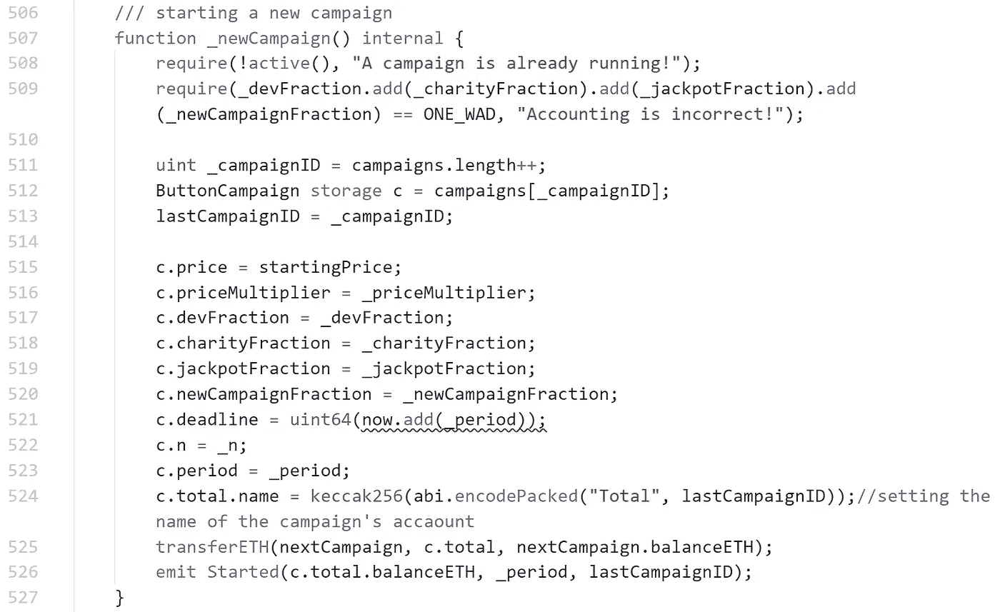*

*New Campaign — Internal Function*

*完成活动:*

*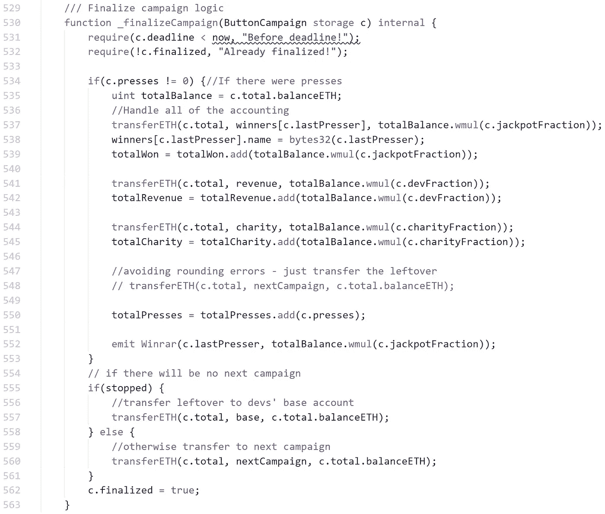*

*Finalizing a Campaign — Internal Function*

*使用`DSMath` 很容易——它可以将数字视为 *wads* (有 18 个小数位的数字)，因此如果一个分数被设置为 0.05 * 10⁸(wads 中的 5%)，那么使用`wmul`函数将总余额与该分数相乘就可以计算出向给定帐户转移了多少。*

*更多信息，请查看在 Etherscan 上验证的官方智能合约代码[。](https://etherscan.io/address/0x2b0ec0993a00b2ea625e3b37fcc74742f43a72fe#code)*