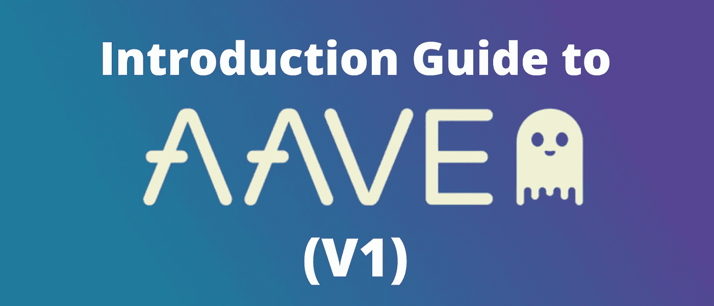

# Aave (V1)介绍指南

> 原文：<https://medium.com/coinmonks/introduction-guide-to-aave-v1-945175125486?source=collection_archive---------2----------------------->

## Aave 是一个开源协议，创建于以太坊之上，以完全去中心化的方式提供借贷功能。

这个项目于 2017 年 11 月推出，当时是一个名为 ETHLend 的 P2P 借贷平台，后来在 2018 年 9 月更名为 [Aave](https://aave.com/) 。这个名字来源于芬兰语单词“ghost ”,该协议于一月份在 mainnet 上发布…