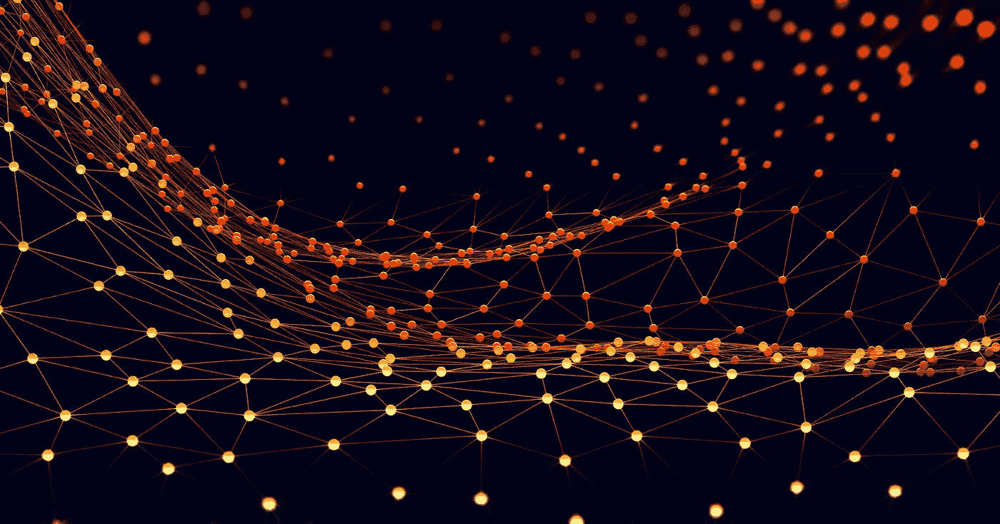
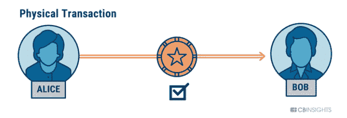
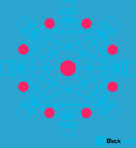
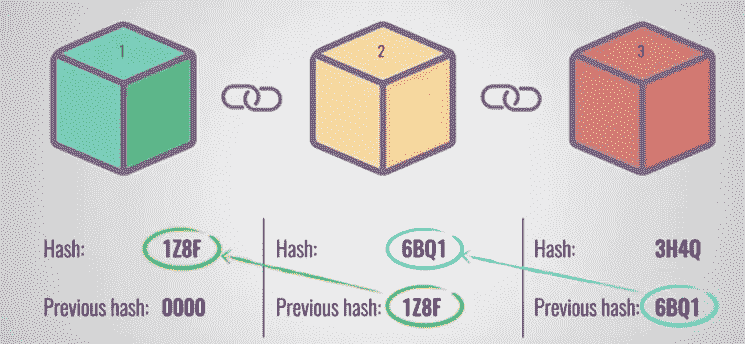
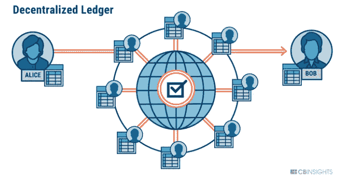
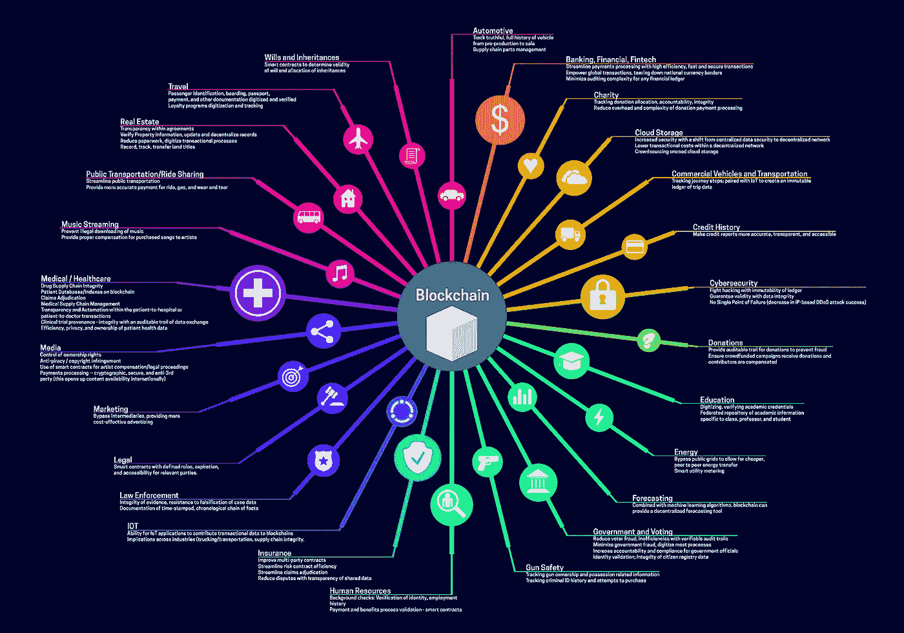

# 新手区块链入门(非技术类)

> 原文：<https://medium.com/coinmonks/introduction-to-blockchain-for-beginners-non-technical-22a791f051c8?source=collection_archive---------2----------------------->

**在深入研究之前，我们应该知道我们为什么需要区块链？**

为了更容易地解释这一点，我将举几个示例用例。一个是金钱转移，另一个是财产转移。

**货币转账:-** 假设美国的爱丽丝想给在日本的鲍勃转账 100 美元。最常见的方法是他去美国的一家银行把钱转到鲍勃的账户上。或者更高级的，他会通过银行或货币兑换系统进行网上转账。

这个场景中的问题是，如果 Alice 想要转账 100 美元，那么他需要在进行交易时支付一些金额。另一方无论谁想退出都需要为他的行为支付费用。理想情况下，鲍勃最终会得到 95 美元。

如果有一个过程，我们可以用来转移资金，没有任何第三方的参与，也花更少的交易费用，也是实时的。哇！:)

**财产转让:-** 再想象一下，现在爱丽丝和鲍勃住在同一个国家，爱丽丝想把他的土地卖给鲍勃。为此，他需要将所有权转让给鲍勃。通常的方法是 Alice 和 bob 去找法律顾问，签订法律协议或合同来转让所有权。

这种情况下的问题是，他们再次需要第三方来达成协议，并且他们还需要为他的服务支付一些费用。

如果有一个法律程序，爱丽丝和鲍勃会写一份数字合同或协议，就一些条款达成一致，并在上面签字，在没有中间人参与的情况下转让所有权，那会怎么样？

所以现在你可以想一想各种各样的日常生活场景，在这些场景中，我们依赖中间人和超速行驶费来获得他们的服务。

我在这里谈论中间人和交易费用的原因是，如果我们使用区块链技术，我们就不需要依赖可信的第三方，也不需要为交易和其他服务花费太多费用。

**什么是区块链？**

> ***区块链是一种技术，它将使一个人能够在没有中间人参与的情况下，安全地将有价值的资产转移给另一个人。***

区块链是一个分散的系统，其中每个用户都像点对点连接一样相互连接。而且没有控制的中心点。事务的有效性将由连接到系统(Miner)的其他节点控制。

一旦一个人进行了一次交易并通过了验证，那么交易的详细信息将进入某种散列过程，并被存储为一个新的块。并且新块将具有前一块的参考。因此，理想情况下，它会通过引用前面的块来创建一个链。

一旦该块被添加到一个链中，那么该链中的所有节点将获得该块并与它们的链一起添加，以便维护该链的相同版本。为了使链安全，块的散列将由交易数据、时间戳、先前散列和许多其他细节的组合来创建。因此，一旦有人试图添加或删除一个块将是不可能的，因为每个块都有唯一的哈希，由以前的哈希组合创建。即使他们尝试添加和中断他们的链，也不会影响其他节点，因为每个节点都有自己的链，实际上不可能更新所有节点的链数据。

在验证交易、创建散列和存储交易数据时，存在更多高级和技术性的东西。下一个故事将详细解释这些事情。

**让我们来看看我们的用例**

如果爱丽丝通过区块链转账，那么他不需要第三方参与，交易将实时发生，交易费用更少，甚至不到 1 澳元。并且该事务将创建一个块并广播到每个节点。(就像成为你自己的银行一样)

如上所述，如果 Alice 将他的地契或记录数字化并存储在区块链，那么当他想将其转让给 bob 时，他们可以编写一份智能合同来表明协议。一旦双方都在合同上签了字，就会创建一个新的区块，并将土地所有者存储为 bob。Alice 已经拥有这块土地，并且记录在 blokchcain 中，现在一旦他转让了他的所有权，它将被发布到所有节点，说这块土地的新所有者是 bob。

[https://flur.ee/](https://flur.ee/)

**已经有许多银行和公司使用区块链技术转移资金、资产、数据和更多的东西。在早期阶段，它只用于转移资金，在引入智能合约后，区块链的增长势不可挡。区块链技术已经颠覆了金融、医疗、供应链、保险和物流行业。到 2027 年，每家公司都将使用区块链。**

> [直接在您的收件箱中获得最佳软件交易](https://coincodecap.com/?utm_source=coinmonks)

***注意:-*** *如前所述，这篇文章只是提供了一个关于区块链的简要概述，并没有讨论区块链背后的任何先进的技术概念。这更像是冰山一角，下一个故事将解释区块链的幕后。*

**参考**

 [## 到 2027 年，每个公司都将使用区块链

### 以下是方法。

hackernoon.com](https://hackernoon.com/your-company-will-use-blockchain-in-less-than-10-years-heres-how-6d9da452fa8d)  [## 什么是区块链技术？-硬币台

### “实际后果[...是...]这是第一次，一个互联网用户可以通过这种方式传送一份独特的…

www.coindesk.com](https://www.coindesk.com/information/what-is-blockchain-technology/)  [## 什么是区块链技术？初学者的循序渐进指南

### 区块链是一个不可否认的巧妙发明——一个人或一群人的智慧结晶

blockgeeks.com](https://blockgeeks.com/guides/what-is-blockchain-technology/) 

# ❤️喜欢，分享，留下你的评论

如果你喜欢这篇文章，不要忘记喜欢，与你的朋友和同事分享，并在下面留下你对这篇文章的评论。跟我来……