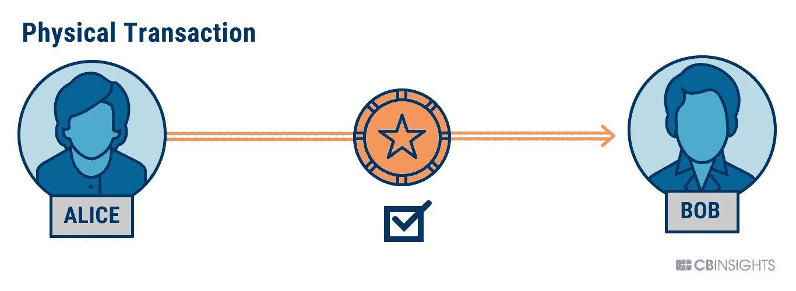

# 区块链的基石介绍:-椭圆曲线 secp256k1

> 原文：<https://medium.com/coinmonks/introduction-to-blockchains-bedrock-the-elliptic-curve-secp256k1-e4bd3bc17d?source=collection_archive---------1----------------------->

## 保持比特币安全的曲线


# 放弃

> 我是区块链的琼恩·雪诺

这意味着“*我对区块链一无所知”。*如有错误请随时指出

还有…..我们有…..

> 涉及大量数学:)


# 目标

1.  了解 secp256k1 椭圆曲线加密背后的数学原理
2.  了解如何使用椭圆曲线加密技术用私钥派生公钥
3.  了解 PRNS(伪随机数发生器)
4.  以数学方式签署和验证数字签名
5.  用 Ruby 实现 secp256k1 的椭圆曲线密码

# 先决条件

*   功能性人脑:)
*   Ruby 基础
*   基本数学概念

# 介绍

比特币是一种高度弹性的技术，在开放互联网的污垢中生存了近 10 年，然而没有人成功渗透到这个网络中。这种牢不可破的安全性的本质来自于大规模去中心化、工作共识证明、密码学等多种因素。在本文中，我们将讨论比特币的密码学方面。比特币使用 secp256k1 的椭圆曲线作为其基础加密技术。

## **比特币信任系统 vs 集中式信任系统**

> “比特币从根本上颠覆了分布式系统的信任机制。传统上，正如我们在支付和银行系统中看到的那样，信任是通过访问控制实现的，即仔细审查参与者并排除不良行为者。这种信任方式需要加密、防火墙、强认证和仔细审查。网络需要对那些获得访问权的人进行信任。”— [安德里亚斯·m·安东诺普洛斯](https://medium.com/u/898f59563d67?source=post_page-----e4bd3bc17d--------------------------------)

比特币信任模型是基于数学计算的，这是一个博弈论的奖励系统，而不是传统集中式系统中的可信访问控制。对比特币的信任是通过证明工作共识解决一个复杂的数学问题来实现的。随着网络变得更加分散，数学计算的难度大大增加，这确保了没有坏的参与者或许多坏的参与者组合在一起可以欺骗，因为他们缺乏超越信任的计算。

## 让我们通俗地谈一下 EEC



让我们假设你有爱丽丝和鲍勃。Alice 想向 Bob 发送一个事务。在集中式系统的情况下，Alice 需要信任中间人(权威机构)来验证并成功地将交易发送给 Bob。*当局*或*中间人*需要非常安全，以使系统免受恶意行为者(黑客)的欺骗。然而，集中安全并不是一帆风顺的***honkey donkey kum baya***，在那里一切都保持安全和完好。我们已经看到很多次恶意黑客恶作剧这些当局从他们的****安全系统*** 中窃取数百万美元。这些系统还利用您的隐私作为验证和安全目的的基础。*

> ****哼！我们能否在不信任第三方或中介、不泄露隐私的情况下拥有一个安全的系统？****

**

*让我们来看看比特币是如何交易的:)*

**

*在这种情况下，不涉及第三方。此外，接收资金的 Bob 不需要 Alice 的验证细节来证明交易。交易的可验证性是通过数学而不是通过中央机构来完成的。Alice 有一个秘钥(私钥:只有他知道)，他用这个秘钥加密消息，把文档和他的公开秘钥(公钥:他可以发给任何人)一起发给 Bob。Bob 用 Alice 的公钥解密该消息，以检索原始消息。*

*任何人在比特币网络上进行交易，他/她都应该有一个唯一的签名，这个签名由一对*公钥*和*私钥组成。公钥是任何人都可以看到的共享密钥。私钥是一个秘密的密钥，除了账户的所有者之外，不应该与任何人共享。比特币使用 ECC 从私钥生成公钥。椭圆曲线使用陷门函数使函数不可逆。通俗地说，你可以通过私钥生成公钥，反之则不行。陷门函数是一种只能单向计算的函数。然而，如果你有无限的计算资源，这是可逆的，你可以活到几千年**

*椭圆曲线使用大数数学，这使得用你现在可以拥有的所有计算资源来暴力破解私钥是不可能的:)*

> *比特币的私钥和公钥非常大，以至于你需要专门的 Javascript 库来处理它们，比如 BigNumberjs*

*所以让我们深入一点:)*

## *椭圆曲线:更好活板门的组成部分*

*ECC 基于私有-公共密钥密码术，例如 RSA。然而，ECC 提供了与 RSA 相同的安全性，但密钥长度更小。由于 ECC 具有较小的密钥大小，因此计算量较小，因此非常适合移动设备和网络*

**

*椭圆曲线的定义*

**在数学中，一条* ***椭圆曲线*** *是一条平面代数* ***曲线*** *由一个方程定义的形式。那是非单数的；也就是说，它没有尖点或自交。**

*简而言之，椭圆曲线是在一个假想的网格上由一个三次方程表示的点集，它映射出某个方程的解*

> *等式:- y2 = x3 + ax + b*

**

*This is how the curve looks [Credit: “Mastering Bitcoin 2nd Edition”]*

**

*让我们来看看这个算法*

*   *假设有一个点“a”和一个点“b”*
*   *注意:如果你是从“a”开始，那么 a 点也被称为 ***种子****
*   *如果从点“a”和点“b”画一条直线，它将与点“c”相交*
*   *点“c”沿 x 轴的反射会给出另一个点叫做，它将等同于“a+b”，也就是“-c”。“a+b”代表“a.b”*
*   *“a+b”实际上代表 ECC 数学。*
*   *从点“-c”到“a”再画一条直线。这会给你另一个路口。在 x 轴上反射它，这将产生另一个点*
*   *还有，椭圆曲线上有一个关于最大值的概念。最大值由密钥大小决定，它代表 x 轴上的 EC 值。如果增加密钥大小的最大值，就增加了通过 ECC 曲线相交的线性线可以使用的值的数量。*

*ECC 帮助您建立一个出色的活板门功能。如果知道初始点“ **a** ”和“**到达点“ **x** ”的跳数**。很容易找到点“ **x** ”。如果你点“**一个**，又点“ **x** ，那就不可能“**跳数**”*

*公钥:起点" **a** ，终点" **x** "*

*私钥:从点" **a** 到" **x** 的跳数*

## *椭圆曲线有趣的特征*

1.  *曲线上的任何点都可以在 x 轴上反射，并保持同一条曲线*
2.  *任何非垂直线至多在三个地方与曲线相交*
3.  *域参数影响给定曲线的各种属性*

# *在 Ruby 中实现先进的 secp256k1 ECC*

## *secp256k1 ECC 域参数*

*   ***证明质数** p，指定有限域的大小*

> *p =(2^256)-(2^32)–(2^9)–(2^8)–(2^7)–(2^6)–(2^4)-(1)*

*   *椭圆曲线方程的**系数** a **和** b。*

> *a = 0，b=7*

*   *生成我们子组的**基点** GG。这也称为生成点*

> *GG =(55066263022277343669578718895168534326250634537759417550187360389167051870830830830830851305070444454575375167523036303275303530303545。*

*   ***阶** n，表示场中的点数。*

> *n = 0x fffffffffffffffffffffffffffffffebaaedce 6 af 48 a 03 bbfd 25 e8cd 0364141*

*   *$point = GG，如上所述*
*   *$privKey =私钥*

*从此处获得关于这些参数的更多详细信息*

*等式*

*public key = private key * generator point*

## *助手功能*

*   *函数 dectobin:-将十进制转换为二进制*
*   *函数 dectohex:-将十进制转换为十六进制*
*   *函数 hextodec:-将十六进制转换为十进制*
*   *函数 string point:-将字符串转换为整数*
*   *函数生成 SHA256:-生成给定字符串的 SHA256 哈希*

*函数 randomNumberGeneration:-下面实现的是*线性同余生成器 xn*=(*a xn*—1+*c*)(mod*m*)，
*un*=*xn*/*m**

> *$m = 2**32*
> 
> *$a = 1103515245*
> 
> *$c = 12345*

*这些 m、a、c 值是*线性同余发生器*的参数*

## *ECC 逆、加、倍和乘功能*

***函数 modInverse** :-这是扩展的欧几里德算法。伪代码:-*

```
***function** modInverse(a, b)
    s := 0;    old_s := 1
    t := 1;    old_t := 0
    r := b;    old_r := a
    **while** r ≠ 0
        quotient := old_r **div** r
        (old_r, r) := (r, old_r - quotient * r)
        (old_s, s) := (s, old_s - quotient * s)
        (old_t, t) := (t, old_t - quotient * t)*
```

***功能 ECadd** :-在曲线上添加 2 个点。这表示两点椭圆曲线相加。伪代码:-*

```
***function** ECadd(a, b)lamAdd := ((b[1]-a[1]) * modInverse(b[0]-a[0],provePrimeNumber)) % provePrimeNumberx := (lamAdd*lamAdd-a[0]-b[0]) % provePrimeNumbery := (lamAdd*(a[0]-x)-a[1]) % provePrimeNumberreturn [x,y]*
```

***函数 ECdouble** :-点的平方。这代表椭圆曲线平方函数。伪代码:-*

```
***function** ECdouble(a)lam = ((3*a[0]*a[0] * modInverse((2*a[1])provePrimeNumber)) % provePrimeNumberx = (lam*lam-2*a[0]) % provePrimeNumbery = (lam*(a[0]-x)-a[1]) % provePrimeNumberreturn [x,y]*
```

*函数 ECmultiply :-这代表椭圆曲线的乘法函数，它代表(生成点*私有密钥)*

```
***function** ECmultiply()N := privateKeyinBinary
Q := generatorPoint
m:= totalBitsInPrivateKeyfor i from 1 to m do
     N := ECdouble(N)
     if Q[0] := 1 then
         Q :=ECadd(Q, N)
  return *Q**
```

> *ECmultiply 将从私钥中获取公钥。ECadd、ECdouble 和 modInverse 是 ECmultiply 中使用的辅助函数*

## *签名生成和验证*

***功能** **签名再生功能** :-该功能帮助您使用私钥创建数字签名*

```
*(x1,y1) := EccMultiply(genPoint,randomNumber)
r := x1 % numberOfPointInFeild
s := ((sha256HashOfMessage + r) * privKey) * modInverse(randomNumber)) % numberOfPointInFeild*
```

***函数**函数**signatureverification 函数** :-此函数帮助您验证文档是否由公钥的所有者发送和签名。*

```
*w := modInverse(s, numberOfPointsInFeild)point1 := EccMultiply(point,((hashOfThingToSign * w) % numberOfPointsInFeild))point2 = EccMultiply(publicKey,((r*w) % $numberOfPointsInFeild))x,y  = ECadd(point1,point2)if(x === r)return true ## it is validatedelsereturn false ## not validatedend*
```

## *Ruby 的完整代码和实现*

*[](https://github.com/SaifRehman/bitcoin-elliptic-curve) [## 赛弗拉赫曼/比特币椭圆曲线

### 通过在 GitHub 上创建一个帐户，为 SaifRehman/比特币椭圆曲线开发做出贡献。

github.com](https://github.com/SaifRehman/bitcoin-elliptic-curve) 

## 未来的工作

实现 segwits、multisig 和 ZSNARKs。此外，登录使用椭圆曲线加密的系统

## 结论

除了在比特币中使用 ECC 作为证明所有权和验证交易的机制之外，它还被用于各种其他应用。

1.  美国政府用它来保护内部通讯
2.  Tor 项目使用它来帮助确保匿名性
3.  ECC 在苹果的 [iMessage 服务](http://blog.quarkslab.com/imessage-privacy.html)中提供签名
4.  ECC 用于使用 [DNSCurve](http://en.wikipedia.org/wiki/DNSCurve) 加密 DNS 信息
5.  ECC 是通过 SSL/TLS 进行安全 web 浏览的首选身份验证方法
6.  和许多其他应用

# 阅读更多信息:

1.  关注我更多:[https://www.engineerability.com](https://www.engineerability.com)

# 资源

1.  [https://pdfs . semantic scholar . org/b7d 7/0 a9f 5 Fe F9 b 75445 DC 010 c 4987 ea 2f 30 c 0990 . pdf](https://pdfs.semanticscholar.org/b7d7/0a9f5fef9b75445dc010c4987ea2f30c0990.pdf)
2.  【https://www.ijcsi.org/papers/IJCSI-9-1-1-74-77.pdf 
3.  [https://www.irjet.net/archives/V3/i4/IRJET-V3I4397.pdf](https://www.irjet.net/archives/V3/i4/IRJET-V3I4397.pdf)
4.  [http://www.secg.org/SEC2-Ver-1.0.pdf](http://www.secg.org/SEC2-Ver-1.0.pdf)

> [直接在您的收件箱中获得最佳软件交易](https://coincodecap.com/?utm_source=coinmonks)

[](https://coincodecap.com/?utm_source=coinmonks)*