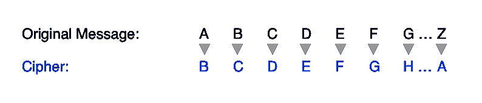
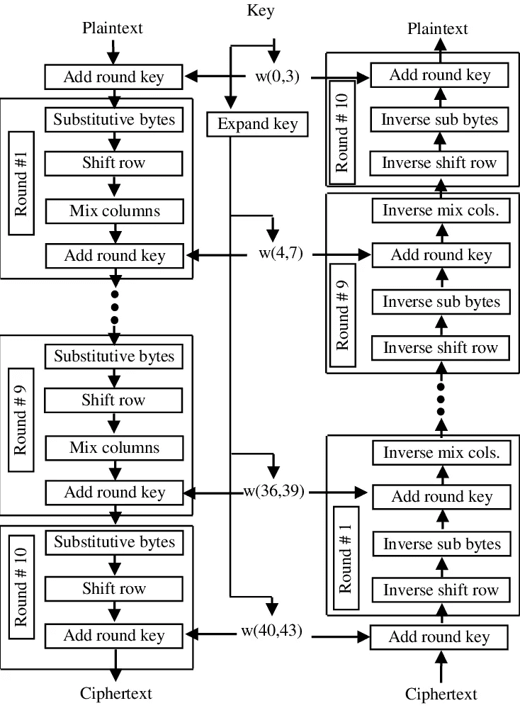
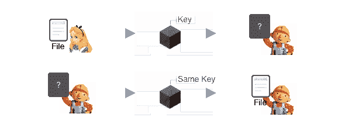
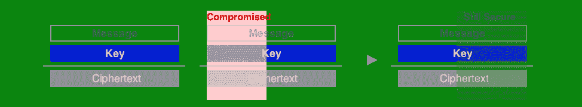
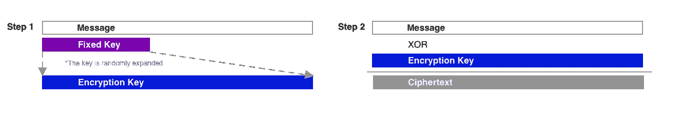
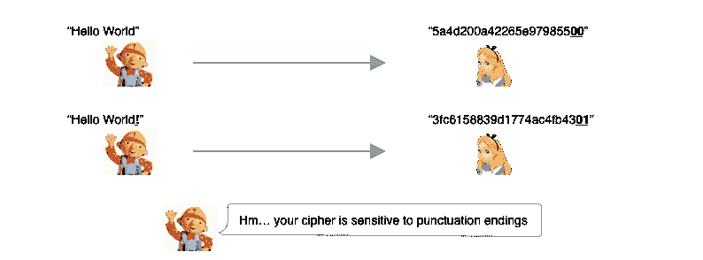

# 密码学简介:一次性密码本和流密码

> 原文：<https://medium.com/coinmonks/introduction-to-cryptography-one-time-pads-and-stream-ciphers-3b62c7003da8?source=collection_archive---------0----------------------->

Image source: [Jon Moore](https://unsplash.com/@thejmoore) [Unsplash](https://medium.com/u/2053395ac335?source=post_page-----3b62c7003da8--------------------------------)

## 基于丹·博纳*的* [*Crypto I*](https://www.coursera.org/learn/crypto/home/welcome) 的 8 周讲解系列的第 1 部分

我希望这能作为一个实用的、易于理解的指南，帮助那些想要更好地理解密码、加密、数论和公钥加密方法的密码爱好者。不需要编码/数学技能。

## 本周我们将讨论:

*   基本对称密码:OTPs、流密码
*   安全性定义:完美的保密性，语义安全性

# 理解基本密码

密码**密码**是将你的秘密信息，例如`“I love dogs!”`打乱成无意义的、看起来随机的文本，称为**密文**的算法。

对于不经意的观察者来说，密文本身没有任何意义。因此，如果它被泄露，你的秘密仍然得到保护。例如，这个密文`49f56c6c40654f48eccc61b`没有独立的意义。

加密密码可以像字母替换一样简单:

An example of a (very insecure) Substitution Cipher

> 基于上面的替代密码，下面的加密密文说了什么？能否解密:`"ifmmp xpsme!"`

现代密码可能与 AES 加密标准一样复杂，AES 加密标准在许多磁盘和网络加密协议中使用:

A schematic of the Advanced Encryption Standard cipher logic

# 示例 1:一次性密码本

需要理解的一个特别重要的密码是一次性密码本(OTP ),它在二战期间非常流行。

**OTP 使用另一个相同长度的预定消息来改变消息。**

例如，Alice 和 Bob 会提前预定一条消息，也称为**密钥**。非常不安全的密钥的一个例子是:`“This is very insecure key”`

稍后，当爱丽丝想要发送下面的秘密消息给鲍勃:例如`“Meet me at the park bench”`，她可以简单地使用密钥对她的消息执行按位`XOR`操作。

在十六进制格式中，这产生了密文`190d0c...`，然后她将它发送给 Bob。

最后，通过将密钥和密文进行异或运算，Bob 可以轻松地解密 Alice 的密文。这允许 Bob 反向导出原始消息。

> `XOR`:OTPs 中的位运算。例如，`0 xor 0`、`1 xor 1`产生`0`位，而`0 xor 1`、`1 xor 0`产生`1`位。
> 
> **需要指出的是，由于 XOR 特性的本质，OTP 有一个重要的漏洞**:如果您使用相同的密钥生成许多密文，并且假设攻击者至少获得了您的 2 个密文，那么攻击者实际上可以对原始密钥进行逆向工程！[攻击解释](http://www.crypto-it.net/eng/attacks/two-time-pad.html)。

这里的要点是，一次性密码本只有在您只使用一次您的密钥时才是安全的，并且只有在您的密钥与您的消息长度相同时才是安全的。

# 将 OTP 与术语相关联

## **OTP 是一种“对称加密”**

正确使用时，一次一密是对称加密的一个很好的例子。这也称为私钥加密、安全密钥加密或秘密密钥共享等。

Alice encrypts a file with the same key that Bob uses to decrypt the file

简单来说，**对称加密**就是参与者共享同一个密钥来加密和解密数据。

## 检察官办公室展示了“完美的保密性”

一次性密码本还展示了一个重要的加密原理，叫做**完全保密**。*其中，给定一个密文，消息空间中的每条消息都完全可能是底层明文。*

简单来说，**完美保密**意味着对攻击者来说，密文看起来完全是随机的。仅仅看密文，没有模式，没有关于潜在信息的提示。

这也意味着，如果攻击者以某种方式获得了密钥/消息的一部分，如前半部分，他将永远无法得到密钥/消息的其余部分:

Illustration of a Perfect Secrecy cipher, even if some parts of its keys are compromised

> 根据上述定义，使用重复密钥的密码是否表现出完美的保密性？如果键是`hellohellohellohello…`

# 示例 2:流密码

**事实证明，在现实生活中使用一次性密码本是非常不切实际的**。

对于你想要加密的每封邮件，你必须创建并共享一个与你的邮件长度相同的新密钥。想象一下，用密钥加密 10 部 5 GB 长的电影。呀。

相反，更现代的对称加密算法需要帮助您避免每次想要加密时生成新的超长密钥。这些密码仍然需要对潜在的攻击者有“一定的安全性”。

流密码提供了这样一个解决方案。

## 流密码

像 OTP 一样，流密码采用一个永远不会改变的预定密钥`k`。

与 OTP 不同，你现在可以多次使用这个密钥。每次你需要加密一些数据时，你依靠一种特殊的算法将你的密钥扩展成一个新的唯一的加密密钥。这个加密密钥实际上与您的数据长度相匹配。

> 事实证明，有一些算法可以以一种相对安全的方式为你进行这种类型的密钥扩展，这样每个加密密钥看起来仍然相对随机，结果产生看起来“随机”的密钥。

然后，与 OTP 类似，您可以通过用新生成的惟一加密密钥对消息进行 xor 运算来加密消息。

视觉上，它是这样工作的:

Stream Ciphers use unique encryption keys randomly derived from the same static key

**在流密码中，你现在可以使用同一个“种子”密钥**重复加密新的*内容，而不会泄露任何秘密。方便！

# 将流密码与术语相关联

## 流密码(也)是一种“对称加密”

同样，相同的种子`k`用于加密和解密。

当谈到解密时，大多数流密码使用*确定性地*生成加密密钥的算法。这意味着接收器已经知道从预设列表中使用哪个唯一的解密密钥。

## 流密码证明了“语义安全”

之前，我们了解到 OTP 提供了**完美的安全性**，但是完全不切实际。所以在现实世界中，我们通过确保所谓的语义安全来实现这一点。

*形式上，这意味着任何概率的多项式时间算法，给定某个消息的密文(取自任何消息分布)和消息的长度，都不能以不可忽略的概率确定消息上的任何部分信息，该概率高于所有其他只能访问消息长度(而不是密文)的算法。*

简单地说，**语义安全是指攻击者不能简单地将巧妙构造的消息发送到密码中，以检测任何最终会帮助他发动攻击的模式**，**，**至少在可能的时间范围内。

为了详细说明这一点，这里有一个非语义安全密码的例子，其中 Bob 是试图猜测 Alice 的秘密的攻击者。

爱丽丝有一个超级不安全的密码，它的工作方式类似于流密码——但出于某种愚蠢的原因——只有当原始消息以标点符号结尾时，才会将密文的最后一位变成`01`。😂

那么，Bob 可以发起以下攻击:

鲍勃现在离破解爱丽丝的语义不安全密码又近了一步。

这是一个有点学究气的例子。但这里的要点是，在多项式时间内，*看似*安全的密码可能会随着时间的推移表现出一些模式，让拥有强大计算资源的攻击者最终破解密码。

这里的主要要点是，在选择对称加密算法时，选择一种在现实世界中经过多年实践检验后被证明是语义安全的算法。不要发明你自己的密码:)

# 主要要点

就是这样！本周你已经学习了以下关键概念:

*   **对称加密**:上面两个密码例子都是对称加密的情况，加密和解密共享**同一个密钥** `k`。
*   OTP 密码不切实际，但具有完美的保密性
*   在实践中，流密码更易于使用，并且为了语义安全而牺牲了完美的保密性，这在实时性方面足够好。

# 我如何了解更多信息:

*   下周:请继续关注一个关于分组密码**和拥有**密码完整性**的简单解释**
*   如果你想加入我的学习小组——课程材料在 Coursera 上免费提供——DM[me on Twitter](https://twitter.com/nczhu)开会时间(1 小时/周)。
*   如果你想全职做这些事情并获得报酬，请查看[奇偶技术](https://medium.com/u/433b0bc6fa9e?source=post_page-----3b62c7003da8--------------------------------)、我在这里工作的[公司](https://www.parity.io/)和我们在这里的[空缺职位](https://www.parity.io/jobs/)。我们在研究和实施过程中构建加密、网络和核心区块链技术。

## 另外，阅读

*   [最佳加密交易机器人](/coinmonks/whats-the-best-crypto-trading-bot-in-2020-top-8-bitcoin-trading-bot-c16adeb13317)
*   最好的比特币[硬件钱包](/coinmonks/the-best-cryptocurrency-hardware-wallets-of-2020-e28b1c124069?source=friends_link&sk=324dd9ff8556ab578d71e7ad7658ad7c)
*   最好的[加密税务软件](/coinmonks/best-crypto-tax-tool-for-my-money-72d4b430816b)
*   [最佳加密交易平台](/coinmonks/the-best-crypto-trading-platforms-in-2020-the-definitive-guide-updated-c72f8b874555)
*   [unis WAP 最佳钱包](/coinmonks/best-wallets-to-use-uniswap-e91a6385d9e8)
*   最佳[加密贷款平台](/coinmonks/top-5-crypto-lending-platforms-in-2020-that-you-need-to-know-a1b675cec3fa)
*   [顶级 DeFi 项目](/coinmonks/defi-future-10-promising-projects-in-the-defi-world-ff2b697ab006)
*   [bits gap review](https://blog.coincodecap.com/bitsgap-review)——一个轻松赚钱的加密交易机器人
*   为专业人士设计的加密交易机器人
*   [3 商业评论](https://blog.coincodecap.com/3commas-review-an-excellent-crypto-trading-bot) |一款优秀的密码交易机器人
*   [3Commas vs Cryptohopper](/coinmonks/cryptohopper-vs-3commas-vs-shrimpy-a2c16095b8fe)
*   Bitmex 的[保证金交易指南](/coinmonks/the-idiots-guide-to-margin-trading-on-bitmex-dbbd7742c6fc?source=friends_link&sk=7bfa99d2a181142510c8442c8ddb0786)
*   [加密摇摆交易权威指南](/coinmonks/the-definitive-guide-to-crypto-swing-trading-7e4af6496d4d?source=friends_link&sk=70448050bd9323b42f63bfc0bb1e60d1)
*   [Bitmex 高级保证金交易指南](/coinmonks/bitmex-advanced-margin-trading-guide-2270c195ce25?source=friends_link&sk=1d986cca731f5084b9a2db4a4bc4a7ad)
*   [面向开发人员的最佳加密 API](/coinmonks/best-crypto-apis-for-developers-5efe3a597a9f)
*   [加密套利](/coinmonks/crypto-arbitrage-guide-how-to-make-money-as-a-beginner-62bfe5c868f6)指南:新手如何赚钱
*   顶级[比特币节点](https://blog.coincodecap.com/bitcoin-node-solutions)提供商
*   最佳[加密制图工具](/coinmonks/what-are-the-best-charting-platforms-for-cryptocurrency-trading-85aade584d80)

> [直接在您的收件箱中获得最佳软件交易](https://coincodecap.com?utm_source=coinmonks)

