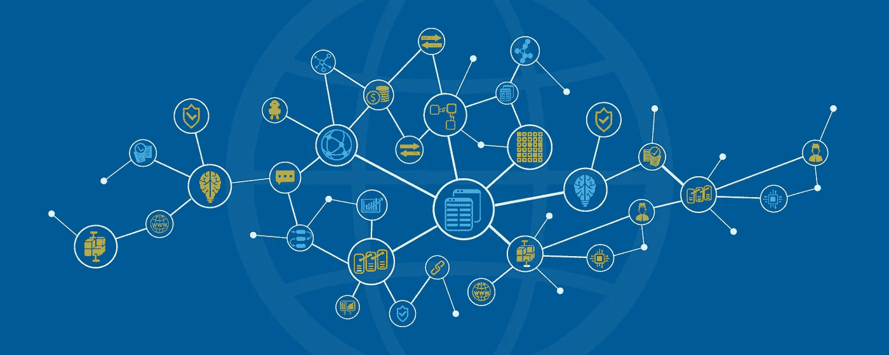
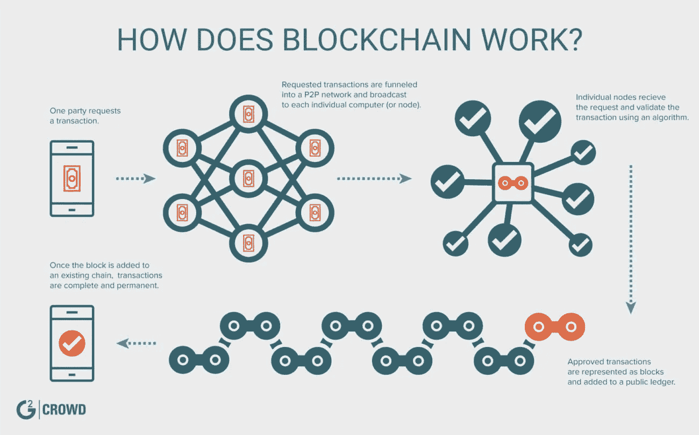

# 动态应用简介。第一部分

> 原文：<https://medium.com/coinmonks/introduction-to-d-apps-part-1-6c03f580dfa1?source=collection_archive---------2----------------------->

## 区块链和去中心化 app 简介。

从更高的层面来看， ***区块链是一个公共分类账，交易以分散的方式匿名存储和确认*** 。记录的信息在多方之间共享，因此， ***一旦输入，就不能更改。***

区块链是由分布式节点 管理的 ***，其中 ***的每个节点都有整个区块链*** 的副本。这些 ***节点中的每一个都可以被添加和删除，每一个都将自己的链副本与其他用户的链副本同步*** 。通过分发拷贝和访问，该链充当了一个既健壮又安全的分散系统。***

***在实现层，区块链是一个分布式数据库，维护着一个不断增长的记录列表*** 。数据库和区块链术语有许多相似之处。

> 区块链术语← → DB 术语
> 
> 区块链← →在 diff 用巨大的表复制 DB 的副本。系统。
> 
> 块← →组合在一起的数据行(即 80- 120)。
> 
> 交易← →一行数据

在 MySQL 这样的普通关系数据库中，我们可以使用 UPDATE 命令轻松地更新一行或多行数据。然而，由于区块链的分布式性质，一旦记录存储在区块链上，我们就不能更新它。

Anatomy of a transaction on a blockchain. (Image Source: [blog.g2crowd.com](https://blog.g2crowd.com/blog/trends/cybersecurity/2018-cs/blockchain/))

检测数据行更改的机制是通过使每个块存储紧接在其自身之前的块的哈希代码来实现的。所以现在，如果存储在一个块的任何一行中的数据发生了变化，它的 hashcode 也会发生变化，它后面的块会识别这种变化。因此，对数据的所有更改都可以很容易地识别出来。

当我们需要在互联网上创建许多区块链的副本，并且我们必须将它们彼此同步时，区块链的复杂性就会增加。在这种情况下，我们还必须确保所有事务尽可能快地通过所有克隆链的所有节点传播。我们不会在本系列中讨论这些情况，但是如果您想在将来构建一个可靠的、可伸缩的分散式应用程序，最好了解一下这些情况。

现在，我们已经了解了区块链是如何工作的，让我们来看看 D-apps，以及它们到底是如何利用区块链来获得优势的。

> 要将应用程序称为 D-app，它必须满足以下条件:
> 
> 1.应用程序必须是完全开源的，它必须自主运行，没有实体控制它的大部分令牌。应用程序可以根据建议的改进和市场反馈修改其协议，但所有更改都必须由用户一致同意。
> 
> 2.应用程序的数据和操作记录必须加密存储在一个公共的、分散的[区块链](https://en.bitcoin.it/wiki/Block_chain)中，以避免任何中心故障点。
> 
> 3.应用程序必须使用加密令牌(比特币或其系统自带的令牌)，这是访问应用程序所必需的，任何来自(矿工/农民)的价值贡献都应在应用程序的令牌中得到奖励。
> 
> 4.应用程序必须根据标准加密算法生成令牌，作为节点对应用程序贡献价值的证明。(即比特币使用工作证明算法)

***说到 D-apps 的分类，主要有三种去中心化应用:***

类型 I 分散式应用有自己的区块链。比特币是第一类去中心化应用最著名的例子，但莱特币和其他“另类硬币”属于同一类型。此外，计算机操作系统(如 Windows、Mac OS X、Linux、Android)类似于第一类系统。

**类型 II** 分散式应用使用类型 I 分散式应用的区块链。类型 II 分散式应用程序是协议，并且具有其功能所必需的令牌。Omni 协议是第二类分散式应用程序的一个例子。通用软件程序(如文字处理器、电子表格软件、文件同步系统，如 Dropbox)类似于类型 1 系统。

**类型 III** 分散式应用使用类型 II 分散式应用的协议。类型 III 分散式应用程序是协议，并且具有其功能所必需的令牌。例如，使用 Omni 协议发行可用于获取分布式文件存储的“安全币”的安全网络就是一个 III 类分散式应用的例子。III 型 D-app 的一个类比是一个专门的软件解决方案(比如使用文字处理器的邮件合并工具，使用电子表格的费用报告宏，或者使用 Dropbox 的博客平台。)

使用这种类比，可以预计，由于网络效应和围绕每个分散应用的生态系统，将会有一些 I 类 D-应用、更多的 II 类 D-应用和甚至更多的 III 类 D-应用。目前，有几个优秀的开源项目利用了 I 类 D-apps。

## 数字应用的重要性

d-app 很重要，因为它们有价值。实际上，app 币之所以有价值，是因为它可以取代一个不可信的集中共识，具有比特币所不具备的功能，具有专门用特定网络的币进行操作的能力。

除了硬币价值，D-apps 也很重要，因为它们有能力颠覆许多行业，如零售银行、保险、金融交易、市场和内容平台。

随着数字应用继续快速增长，它们也将变得更容易被消费者看到。例如，Fatcom 使用区块链来支持审计系统、医疗记录、供应链管理、投票系统、产权、法律应用和金融系统等应用。

现在，我们已经了解了 D-apps 背后的大量理论，我们将开始尝试创建一个。 ***开发这种分散式应用程序的一个平台是以太坊*** ，我们将在本系列的下一部分通过比较以太坊架构和传统的客户机-服务器架构来研究它。

我是 Ravi，班加罗尔 MSRIT 的一名大四 CS 本科生，对 ML，深度学习，数据科学，算法和区块链感兴趣，但在所有这些领域都还是初学者。

您可以通过我的 LinkedIn 个人资料与我联系。

或者，我也可以在[推特](https://twitter.com/ravivats_)、[脸书](https://www.facebook.com/ravivats01)、 [Instagram](https://www.instagram.com/ravivats_/) 和 [Quora](https://www.quora.com/profile/Ravi-Vats-5) 上找到。

本系列后面部分的源代码将上传到这个 [GitHub](https://github.com/ravivats/ethereum-complaint-dapp) 存储库。

一如既往，我欢迎任何编辑或建议，以增强本系列中提供的信息。

为学习干杯！:)