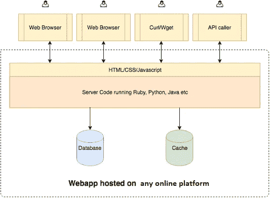
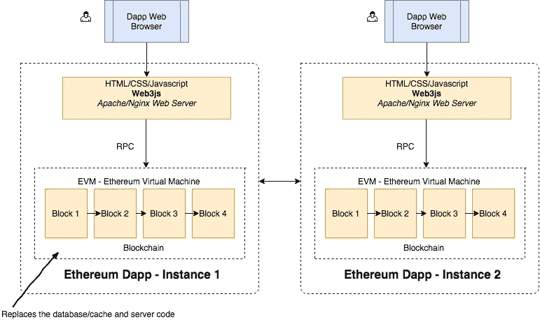

# 动态应用简介。第二部分

> 原文：<https://medium.com/coinmonks/introduction-to-d-apps-part-2-287dc8c3620e?source=collection_archive---------1----------------------->

## 了解以太坊建筑。

通过参考在线文档直接钻研以太坊架构有时会令人困惑和不知所措。更好的方法之一是将以太坊架构与一些广为人知的架构进行比较，比如客户端-服务器架构。

## 客户端-服务器架构概述:

A typical client-server architecture. (Image Source: [www.zastrin.com](https://www.zastrin.com/courses/1/lessons/2-3))

一个典型的 web 应用一般由 ***服务器端代码组成，这些代码可以用 Java、Python、JS*** ***等服务器端语言编写。前端部分(用户可以交互的网站)一般用***HTML/CSS/JavaScript***编码。整个应用程序托管在任何在线提供商上，如 AWS、Hasura、Google Cloud 或像 Digital Ocean 这样的 VPS。***

***用户可以使用 web 浏览器、curl/wget(命令行)等客户端或通过 API*** 与 web 应用进行交互。注意 ***有一个 web 应用程序是集中式的，所有客户端都与这个应用程序交互。当客户端向服务器发出请求时，服务器处理该请求，与数据库和/或缓存进行交互，读取/写入/更新数据库，并向客户端返回响应。***

现在，让我们将它与以太坊建筑进行比较。

## 以太坊架构概述:

客户机-服务器体系结构在大多数时候都工作得很好。然而，在某些应用程序中，如果数据库可以公开且安全地被每个人访问，那么它将会非常有用，并且您不必依赖这个 web 应用程序所有者来获取您的数据。这就是以太坊建筑可以发挥作用的地方。

Typical architecture of a Ethereum D-app. (Image Source: [www.zastrin.com](https://www.zastrin.com/courses/1/lessons/2-3))

如果你注意到，e ***非常客户端(浏览器)与它自己的应用程序实例通信。不存在所有客户端都连接到的中央服务器。这意味着，每个想要与 D-app 互动的人都需要在他们的电脑/手机等设备上运行区块链的完整版本。*** 这意味着，在你可以使用一个应用程序之前，你必须下载整个区块链，然后开始使用该应用程序。这给了我们不依赖单一中央服务器的优势，因为单一中央服务器可能明天就会消失。

在现实中，你不需要花费大量的硬盘和内存来下载整个区块链。有一些变通方法/优化来保持应用程序的分散性，同时使交互变得快速简单。

该架构的主要组件包括:

**数据库:**以太坊网络中发生的每几个交易都被打包成块，每个块都链接到下一个块。这一系列包含所有交易数据的链接块就是区块链。

如果我们回到易贝的例子，买家和卖家之间的每一笔交易，无论是销售、退款还是争议，都将被记录在区块链上，供所有人查看。为了确保网络中的所有节点都有相同的数据副本，并确保没有无效数据被写入该数据库， ***以太坊使用一种称为工作证明*** (也称为 ***以太坊挖掘*** )的算法

**代码:**区块链的数据库方面只是存储数据。但是购买、出售、取消、退款等的逻辑在哪里呢？ ***在以太坊世界里，你用一种叫做 Solidity 的语言编写应用程序代码(叫做契约)。然后使用 solidity 编译器将其编译成以太坊字节码，然后将该字节码部署到区块链。Solidity 的其他替代品很少，但是 Solidity 是目前为止最流行的合同开发语言。***

所以基本上，区块链存储你的数据，存储代码，并且在 EVM(以太坊虚拟机)中运行代码。

***为了构建基于 web 的 d-apps，以太坊附带了一个方便的 javascript 库 web3.js，它可以连接到你的区块链节点。所以你可以把这个库包含在你著名的 JS 框架中，比如 reactjs，angularjs 等等，然后开始构建。***

另一个很大很重要的特点是平台的金融能力。一旦你开始使用 d-app，你就会获得一个内置的银行账户。事实上，不是一个银行账户，但你可以在几分之一秒内创建多个银行账户。这些银行账户被称为钱包，你可以在这里存钱(以太——以太坊生态系统中使用的货币)和交易。

在本系列的下一部分中，我们将着眼于使用 Solidity 和 JavaScript(使用 web3.js)创建一个以太坊 D-app。

本文使用的参考资料:

1.  [https://www . common lounge . com/discussion/44509d 23220 a 42 DEA 228 Fe 90 ad 823683](https://www.commonlounge.com/discussion/44509d23220a42dea228fe90ad823683)
2.  [https://www.zastrin.com/courses/1/](https://www.zastrin.com/courses/1/)
3.  [http://www.ethdocs.org/en/latest/](http://www.ethdocs.org/en/latest/)
4.  [Siral Rawal 的 D-app 视频](https://www.youtube.com/watch?v=gSQXq2_j-mw)。

我是 Ravi，班加罗尔 MSRIT 的一名大四 CS 本科生，对 ML，深度学习，数据科学，算法和区块链感兴趣，但在所有这些领域都还是初学者。

您可以通过我的 [LinkedIn](https://www.linkedin.com/in/ravi-vats-5ab8a910b/) 个人资料联系我。

或者，我也可以在[推特](https://twitter.com/ravivats_)、[脸书](https://www.facebook.com/ravivats01)、 [Instagram](https://www.instagram.com/ravivats_/) 和 [Quora](https://www.quora.com/profile/Ravi-Vats-5) 上找到。

本系列后面部分的源代码将上传到这个 [GitHub](https://github.com/ravivats/ethereum-complaint-dapp) 存储库。

希望你觉得这个系列有趣。我总是乐于接受任何编辑或建议，以增强本系列中提供的信息。

为学习干杯！:)

> [直接在您的收件箱中获得最佳软件交易](https://coincodecap.com/?utm_source=coinmonks)

