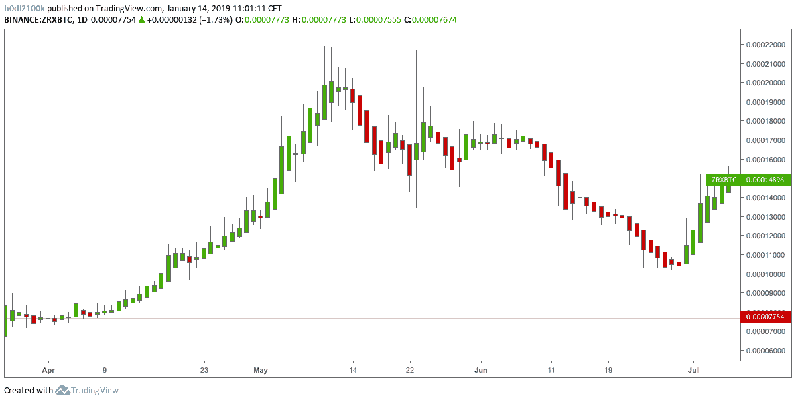
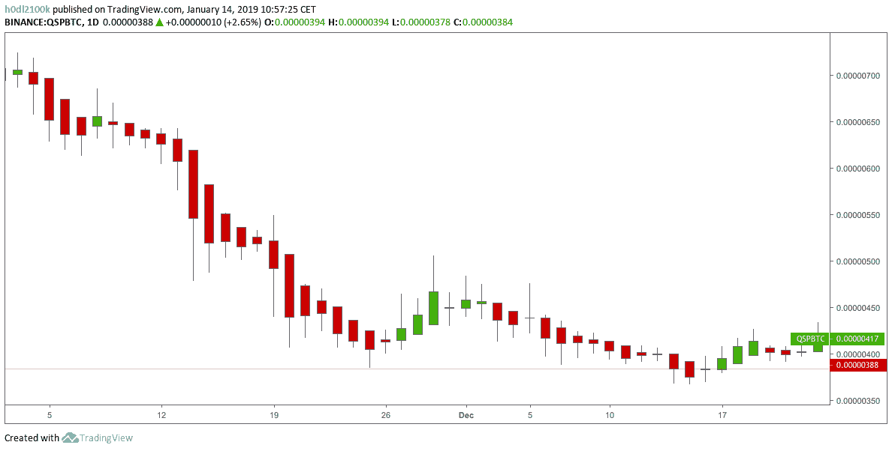
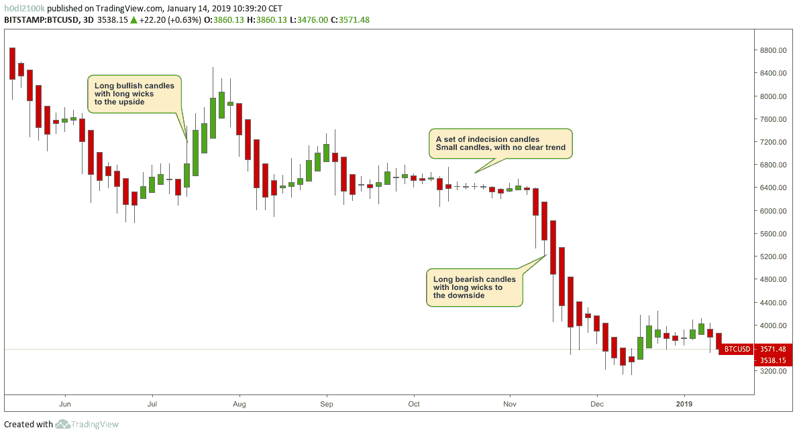
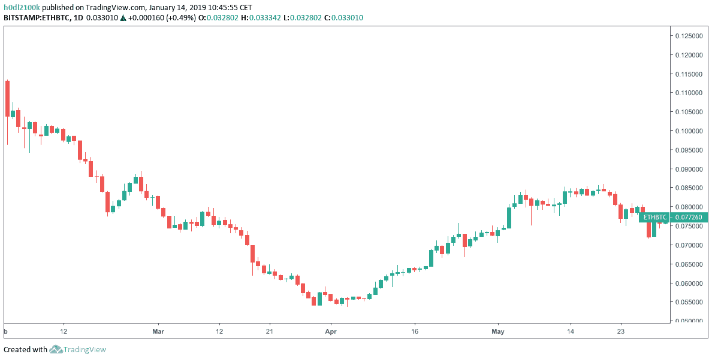
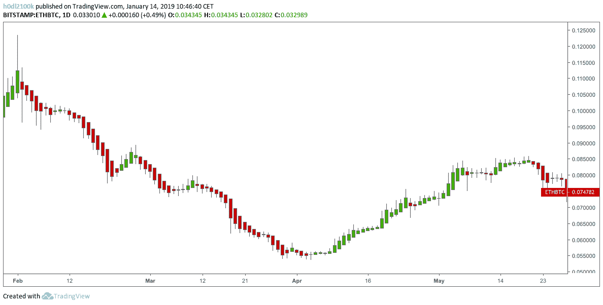
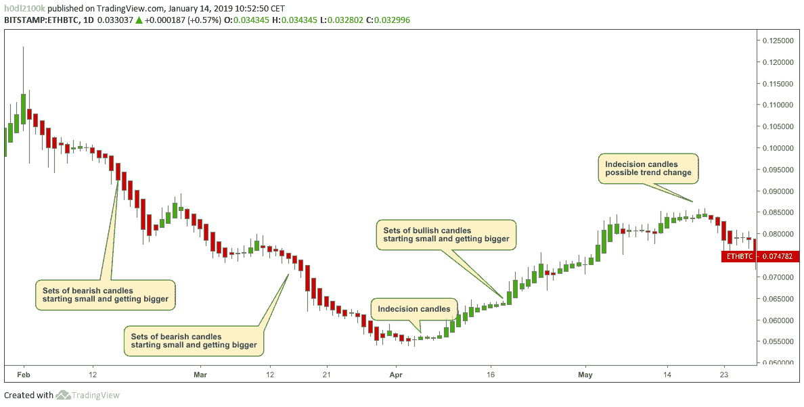
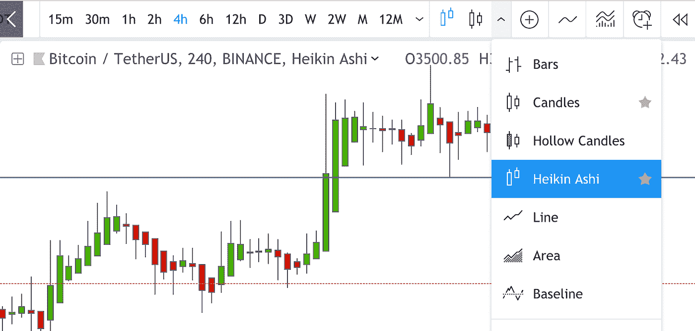
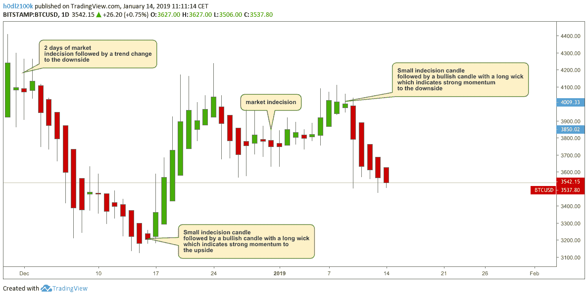

# Heikin Ashi 蜡烛介绍

> 原文：<https://medium.com/coinmonks/introduction-to-heikin-ashi-candles-bd8d7cd641e?source=collection_archive---------2----------------------->

*本文是原文的副本，以便在其他媒体账号上发表。*

# 让潮流成为你的朋友

## 都在名字里

你可能听说过也可能没有听说过 Heikin Ashi，但是在阅读了下面的总结之后，你会对这种古老的日本交易技术有一个基本的了解。就像你知道的普通日本烛台图表，以及一目技巧一样，Heikin Ashi 是由日本人开发的，可以追溯到 18 世纪。单词*、【Heikin】*的翻译是*、【平均】、*或*、【平衡】*。单词*‘Ashi’*翻译过来就是*‘foot’*或者*‘bar’*。Heikin Ashi 交易方法就是画蜡烛，这些蜡烛是由前两根蜡烛的平均值组成的。你可能会问自己一个普通的烛台到底是什么，但你会发现它很简单，很容易理解。在这篇文章中，我将解释烛台的基础，然后快速移动到那些烛台看起来如何。在这一点上，就很容易理解如何解释 Heikin Ashi 烛台。让我们开始吧！

## 一个普通的日本烛台

每支 Heikin Ashi 蜡烛平均涂有两条条纹。就像普通的日本蜡烛一样，Heikin Ashi 蜡烛有开、关、高点和低点。请允许我更好地解释每一个。

*   黑金阿什克洛斯

这是当前周期的开盘价、最高价、收盘价和最低价的平均值。

*   黑金阿什公开赛

这是前一根蜡烛线的开盘价和收盘价的平均值。

*   黑金阿什高中

这是当前时段的最高价、开盘价或收盘价的最大值或最高值。同样，Heikin Ashi high 是这三个值中最高的一个。

*   Heikin Ashi Low

这是当前时段的最低价、开盘价或收盘价中的最小值或最低值。就像高值一样，低值是这三个值中最低的一个。

我可以想象，当我第一次读到这里时，这听起来有点模糊，甚至令人困惑。因此，这里有一个例子来帮助说明我们正在学习什么。

*   平仓 Ashi 收盘价，是*(开盘+高+低+收盘)/4*
*   黑金阿市的开盘价，是*前一根蜡烛线(开盘价+收盘价)/2*

这里的要点是，新蜡烛线的开口总是在前一根蜡烛线的正中间(或平均值)。

## Heikin Ashi 烛台是什么样子的

就像普通的日本烛台一样，你会看到看涨和看跌的烛台以及反转蜡烛。当市场看涨时，你将主要看到一组连续的绿色蜡烛，几乎没有较低的灯芯或阴影。相反，他们大多有上层灯芯。绿色蜡烛越大，灯芯越高，市场的看涨势头越强。让我们来看看下面的 ZRX 图，它是一个具有强大看涨势头的图表示例。你会非常清楚地看到，从 4 月到 5 月中旬，有一个明显的看涨趋势。请注意，在此期间没有向下的灯芯。

ZRX/BTC 1D April — July 2018 — Heikin Ashi chart

理解市场的反面同上但反过来(很明显)。当市场看跌时，你将主要看到连续的红色蜡烛线，上面的灯芯或阴影非常有限。取而代之的是，蜡烛体将只配有较低的烛芯。红烛越大，灯芯越低，市场的看跌势头越强。让我们看看下面的 QSP/BTC 图表，具体是 2018 年 11 月的图表。

QSP/BTC 1D November — December 2018 — Heikin Ashi chart

黑金阿什逆转蜡烛看起来像多奇蜡烛。会有很长的灯芯，但几乎没有人体蜡烛。我们也喜欢称它们为犹豫不决的蜡烛。这些蜡烛非常重要，因为它们将指出当前的趋势已经结束。所以，如果你在交易，这很可能是退出的时候。犹豫不决之后会出现一个新趋势，你想抓住它。在优柔寡断的市场交易对你的投资组合没有任何好处。下面的 BTC/UST 图表提供了一个优柔寡断的好例子，如上所述，是时候退出你的头寸了。

BTC/USD 3D June — January 2019 — Heikin Ashi chart

## Heikin Ashi 烛台的优势

现在我们已经基本了解了什么是 Heikin Ashi 烛台，它们看起来像什么，我想你会想知道 Heikin Ashi 交易技术的优势是什么。重要的是要知道，这些烛台不是正常的日本烛台的替代品，但了解它们会让你在交易时获得额外的优势。简单地说，Heikin Ashi 帮助你发现趋势。这种方法可以用于任何时间框架，但就像大多数图表技术一样，你使用的时间框架越高，就越容易确定长期趋势。

Heikin Ashi 可以帮助你快速想象一项资产是处于熊市还是牛市，就像 Ichimoku 所做的那样。它通过查看图表来定义你的偏见，并帮助你在进场或出场时做出更好的决定，因为它去除了典型图表中的许多噪音或混乱。

这里需要理解的重要一点是，Heikin Ashi 允许你交易趋势。这意味着只有当一个新的趋势形成时，你才能进场或出场。忘记买准确的低点和准确的高点，趋势还没有形成。相反，如果你交易正确，Heikin Ashi 会让你抓住趋势的最大部分。

我们来看两张以太坊的图表，一张是黑金阿希蜡烛，一张是普通蜡烛。下图中没有什么新的东西。只是普通的烛台，红色和绿色互相穿过，下面或上面有灯芯。

ETH/BTC 1D February — May 2018 — Normal candlesticks chart

现在看看下面的 Heikin Ashi 图表。如果你仔细看看，你就会明白我说的从图表中剔除噪声是什么意思。

ETH/BTC 1D February — May 2018 — Heikin Ashi chart

在下跌趋势中，Heikin Ashi 可能只显示红色熊市蜡烛线，而标准图会混合一些绿色蜡烛线。在上涨趋势中，你会看到相反的情况，除了绿色的蜡烛，中间没有红色的熊市。一个 Heikin Ashi 图表将看起来干净和平滑，因为你不会在两个方向都有这些疯狂的灯芯。此外，你会看到 Heikin Ashi 蜡烛组从一个或多个反转蜡烛开始，类似多奇的蜡烛，并将继续增加蜡烛，越来越大。下面的 ETH/BTC 图表很好地证明了这一点。

ETH/BTC 1D February — May 2018 — Heikin Ashi chart

现在让我们一起尝试在交易视图中创建一个 Heikin Ashi 图表。你会发现这是多么简单。在上面的菜单中，你可以选择你喜欢的烛台。只需选择 *Heikin Ashi* 选项，就大功告成了。请记住，如果你点击*星*图标，Heikin Ashi 按钮将出现在普通烛台按钮旁边，这样你就可以在两者之间快速切换。这在分析图表时总是很好的，并且消除了创建两个图表的需要。

Tradingview — Heikin Ashi feature

## 带 Heikin Ashi 烛台的实际比特币图表

如果我们在看基于 Heikin Ashi 蜡烛的比特币实际日线图，它看起来会像下面的图表。

BTC/USD 1D December — February 2018 — Heikin Ashi chart

图表从 12 月开始，显示了两根类似多奇的蜡烛。记住这是市场的犹豫不决。在你交易之前，让市场决定趋势是上涨还是下跌。你希望看到趋势变化的确认，而不仅仅是可能变化的迹象。在图表的后面，我们有一组看跌蜡烛线，其中大部分没有显示上灯芯。这意味着下行势头强劲。这一直持续到 12 月 9 日或 10 日。然后我们看到两根犹豫不定的蜡烛线，跟随下降趋势直到 12 月中旬。12 月 16 日展示了一个小的优柔寡断蜡烛，但这一次是一套绿色蜡烛，上面有长长的灯芯。大约在 2018 年底和 2019 年初，我们再次出现一些市场犹豫不决的情况。没有明显的趋势。在这样的市场中，很难进行交易，而且风险很大。2019 年的第二周，我们看到第一根大的熊市蜡烛，长时间向下移动，这是新的熊市趋势的开始。趋势结束了就结束了…

## 总结一下

这是一篇关于 Heikin Ashi 基本知识的短文。我给你看了一些看涨、看跌和反转蜡烛图的例子，并附有图表。现在我要你记住的是:

*   Heikin Ashi 消除了典型图表中的噪音和混乱
*   Heikin Ashi 给你一个快速的市场偏见，要么看涨，看跌，或犹豫不决。
*   Heikin Ashi 允许您顺应趋势进行交易
*   Heikin Ashi 有助于确保你在正确的时间进入市场，而不是太早
*   Heikin Ashi 确保你在正确的时间退出市场，不会太晚

在下一篇文章“[如何交易 Heikin Ashi 蜡烛](/@h0dl2100k/how-to-trade-heikin-ashi-candles-56f4871279d5)”中，我将讲述如何使用 Heikin Ashi 图表正确交易，何时和如何进入交易，最后但同样重要的是，如何和在哪里退出交易，同时赚到我们都渴望的钱。我还会写一些关于与 Heikin Ashi 交易的能力，并附有其他指标，如 Ichimoku。我喜欢将这两者结合起来，快速了解市场动态。感谢您的阅读，我希望您发现这个简短的教训信息。

*Birb Nest 是一个交易社区，同时为数百名客户提供服务，其团队成员经过全面的检查和测试，具备成熟的技术分析、基本面分析和 IT 专业知识。*

欲了解更多关于 Birb Nest、我们的独家产品和服务以及其他交易资源的信息，请访问 TheBirbNest.com**。**