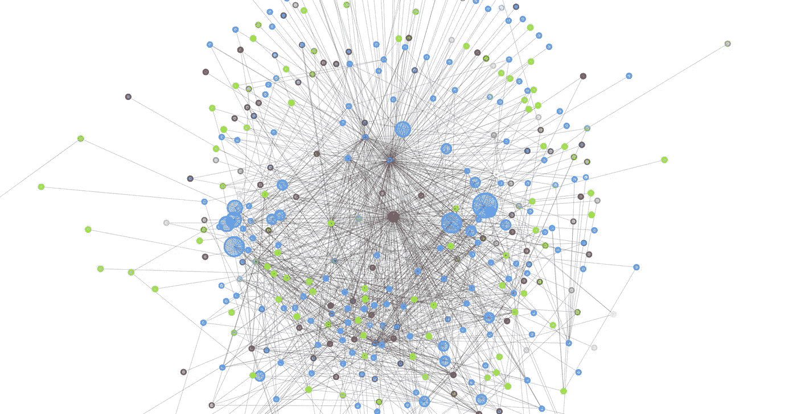

# 雷电网络简介(3/4)

> 原文：<https://medium.com/coinmonks/introduction-to-lightning-network-3-4-f92bf2d0ffde?source=collection_archive---------4----------------------->

比特币有一个可扩展性限制，在当前的提议下，它每秒只能处理大约 3-6 笔交易。而 Visa 每秒可以处理大约 24000 笔交易。

这就是闪电网络发挥作用的地方。

# 闪电？吓人？闪电网到底是什么？

闪电网络是在区块链之上运行的“第二层”支付协议。这是一个分散式网络，在区块链使用智能合约功能，在参与者网络中实现即时支付。它可以将当前的比特币网络从每秒 3-6 次交易扩展到每秒数百万次交易。

LN Node Map | Source: 1ML.com

> 优点是:

*   **即时支付，**从世界的一端到另一端。以毫秒到秒计算的支付速度。
*   **极低的成本**，为即时微支付等新兴用例打开了大门。
*   **可扩展性**，每秒能够处理网络上数百万次交易，支持不同规模的使用案例。

> 缺点是

*   如果接收方离线，则交易无法完成。
*   运行一个闪电节点，打开一个支付通道需要链上流程。
*   该网络仍处于早期阶段，迄今为止规模相对较小。

# **真实世界用例的例子**

*   [来自澳大利亚的 LivingRoomOfSatoshi](https://medium.com/u/d3fe710c9ce2?source=post_page-----f92bf2d0ffde--------------------------------) 采用了[比特币](https://blog.coincodecap.com/tag/bitcoin/)闪电网络，让商家、消费者可以通过闪电网络即时支付澳大利亚的任何账单。
*   **Blockstream 商店**只接受[使用闪电网络的比特币](https://blog.coincodecap.com/tag/bitcoin/)供消费者从其商店购买商品。
*   [Bitrefill](https://medium.com/u/955a02c021f9?source=post_page-----f92bf2d0ffde--------------------------------) 实现了[比特币【Lightning Network，为客户提供使用 Lightning Network 支付账单、购买代金券和给手机充值的服务。](https://blog.coincodecap.com/tag/bitcoin/)

# 比特币闪电网络的现状

> 200 万美元:尽管比特币价格下跌，闪电网络仍达到创纪录的容量

 [## 200 万美元:尽管比特币价格下跌，闪电网络仍达到里程碑

### CCN 正在扩张。你是我们下一个来自美国西海岸的全职记者吗？请将您的简历和示例发送给我们。

www.ccn.com](https://www.ccn.com/2-million-lightning-network-hits-major-milestone-despite-bitcoin-price-decline/) 

2018 年 3 月，来自美国加利福尼亚州的闪电实验室宣布推出其软件的测试版。冒险者可以在 mainnet 上运行闪电节点来测试它的真实能力。

此后，越来越多的商家、用户、项目都在寻找实施和采用闪电网络的方法。迄今为止，比特币闪电网络中锁定了价值超过 200 万美元的比特币。

> 令人敬畏的闪电网络资源、应用程序和库的精选列表

 [## bcongdon/awesome-闪电网络

### ⚡为开发者和密码爱好者策划了一系列令人敬畏的闪电网络项目…

github.com](https://github.com/bcongdon/awesome-lightning-network/blob/master/readme.md) 

如果你有兴趣设置一个闪电节点，请阅读我的下期文章[如何设置一个闪电节点，连接一个对等点，打开一个通道。(4/4)](/@minionDownUnder/how-to-set-up-a-lightning-node-connect-to-a-node-and-open-a-channel-4-4-efd627d7ff32)

> [在您的收件箱中直接获得最佳软件交易](https://coincodecap.com/?utm_source=coinmonks)

