# 机器学习导论——线性回归和逻辑回归的研究

> 原文：<https://medium.com/coinmonks/introduction-to-machine-learning-studying-about-linear-and-logistic-regression-434fdaf2f709?source=collection_archive---------8----------------------->

## 你好世界！

欢迎来到我的第一个机器学习教程，在这个教程中，我将解释如何从 21 世纪最热门的领域之一开始:

**【机器** **学习**

现在，为了更好地了解它，我们首先需要了解它所基于的主要分支，那就是**人工** **智能。**

**什么是******人工** **智能？****

****人工智能(AI)** 是数字计算机或计算机控制的机器人执行通常与智能生物相关的任务的能力。**

**计算机过程包括学习、推理和自我修正。**

**像亚马逊的 Alexa，苹果的 Siri 等虚拟个人助理。是大量部署人工智能的极好例子。**

**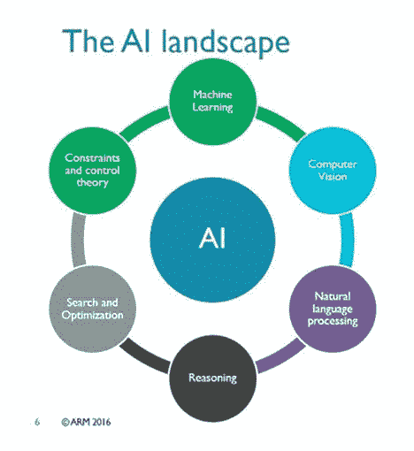**

**如图所示，机器学习是广阔的人工智能领域的一个分支，机器学习的概念可以通过下面的简单图表来解释:**

**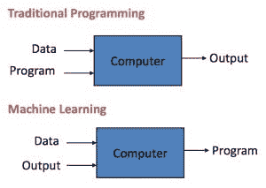**

**所以，这就说明了——**的** **能力****为** **计算机** **为** **生成** **一个** **程序** **当** **它** **为** **提供** **与** **输入****

**机器学习进一步细分为以下分支:**

**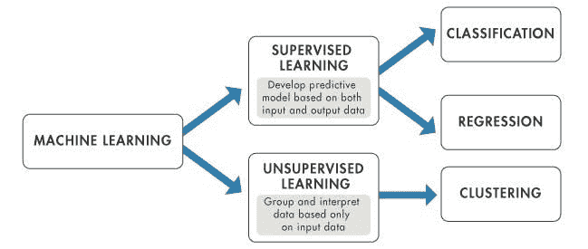**

**在本教程中，我们将坚持使用监督学习算法。本教程将涵盖的主题包括:**

**1.设置环境**

**2.监督学习简介**

**3.线性回归**

**4.逻辑回归**

**5.结论**

**我们开始吧！**

# **1.设置环境:**

**当你想开始机器学习时，这是第一步。你需要建立一个工作环境，这样你就可以开始你的机器学习之旅。请注意，我在本教程中使用的是 python 2，所以如果你是初学者，最好坚持使用 Python 2。**

**为此，请遵循以下步骤:**

****1。**从 https://www.anaconda.com/download/[下载安装 anaconda】。它适用于 Windows、Linux 和 Mac 等操作系统。请在检查您使用的是 32 位还是 64 位操作系统后下载安装程序。](https://www.anaconda.com/download/)**

**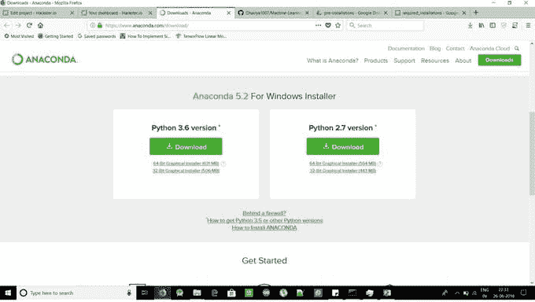**

**这是一个非常有用的软件，它包含了一系列附加功能，当我们在人工智能领域工作时，这些功能使我们的生活变得简单。**

**我建议在基本的 python 包中使用它，因为它已经预装了 conda environment creator 和 jupyter notebook，在接下来的教程中会经常用到。**

****2。**现在，一旦您下载了 anaconda 安装程序，运行它并将其安装到您的 PC 上。这可能需要一些时间，请耐心等待。**

**完成后，进入开始菜单，向下滚动搜索 anaconda 文件夹，打开 anaconda 提示符。**

**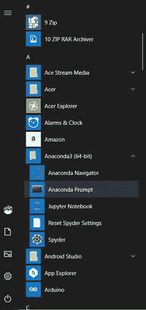**

**当您打开它时，您会看到屏幕上出现以下窗口:**

**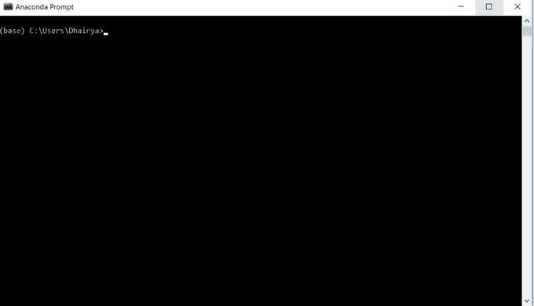**

**现在，您已经准备好进行第 3 步。**

****3。**现在您已经启动并运行了提示窗口，是时候创建一个虚拟环境了。这些为一个特定的项目创建了一个工作区，无论我们在这个环境中下载什么库，只有当我们在 anaconda 提示窗口中激活了这个环境时，才可以访问。**

**在提示符下键入下面一行来创建一个新环境。**

```
conda create -n yourenvname python=x.x anaconda
```

**选择您想要的名称，用 youenvname 替换它，并指定您的 python 版本，在我的例子中是 2.7。运行该命令后，您将在提示符下看到类似这样的内容。**

**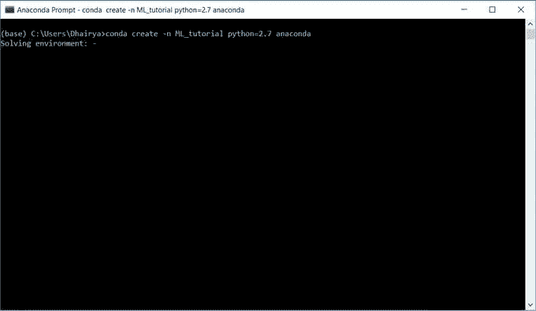**

**创建环境需要几分钟时间，请耐心等待！一旦完成，提示将显示成功的消息。现在，要激活环境，您只需键入:**

```
activate yourenvname
```

**它被激活后，看起来会像这样。**

**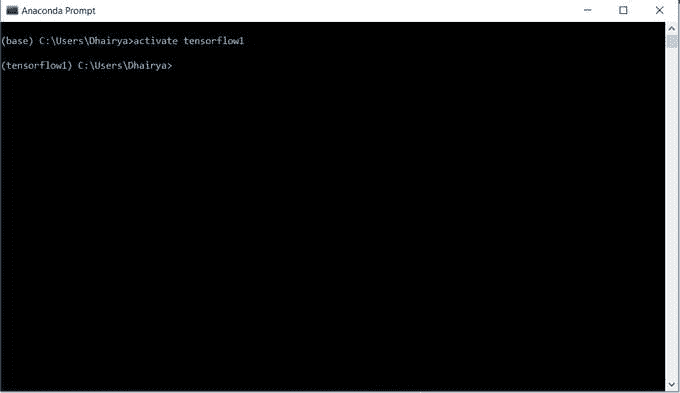**

**现在在这个环境中安装下面的库，因为如果你想开始机器学习，它们是基本的和必需的。他们是-**

****1。** **Numpy** — **为** **数据** **前置** **处理** **和** **模型** **创建****

****2。** **熊猫** — **获取** **数据** **获取****

****3。** **Matplotlib** — **为** **标绘** **为** **结果。****

**使用 pip 命令下载以下库:**

```
pip install numpypip install pandaspip install matplotlib
```

**完成后，你就准备好投入机器学习的世界了，所以让我们继续吧！**

# **2.监督学习简介**

****监督学习****

**监督学习是使用标记数据点执行的学习。换句话说，参数是预定义的，算法知道它在寻找预定义参数之间的关系。该算法使用的训练数据已经具有足够的细节和标签，允许该算法使用数据点的位置来推断多个变量之间的关系。让我们看一个例子:**

****监督学习—回归****

**假设您有一个纽约市公寓租金定价的数据集。每个公寓都有一个月租金和平方英尺的属性。因此，绘制出来的数据集看起来会像这样:**

**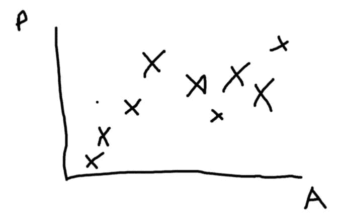**

**P =月租金 A =平方英尺**

**基于以上所述，机器学习算法将分析每个数据点的位置，并生成一个预测函数，该函数可以根据公寓的平方英尺精确地确定公寓的价格。该函数可以用下面的实线表示。**

**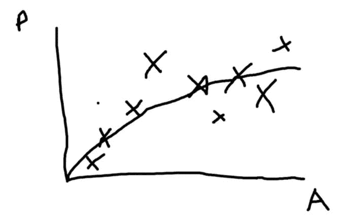**

**线代表平方英尺和月租金之间的关系函数**

**基于预测功能，该算法现在将能够根据公寓的平方英尺来估计公寓的价格。那么，学习在哪里发挥作用呢？随着更多的公寓被出租，监督学习平台将向图表添加更多的“真实”数据点，并且机器学习算法将相应地更新和改变函数，以反映新数据点的位置。因此，随着出租的公寓越来越多，该算法有更多的实时数据要分析，这将使预测算法更加准确。前面提到的例子是监督学习的回归工具的一种形式。监督学习的另一个版本是分类方法，其中有有限数量的类(是或否)。**

**既然我们知道了回归，我们现在将学习监督学习的两个最基本的算法，它们是:**

**1.**线性** **回归****

**2.**逻辑** **回归****

**所以让我们开始吧。:)**

# **3.线性回归**

**这是我们在机器学习中使用的最简单的算法。**

**在这里，我们假设输入和输出之间存在线性关系，这是最简单的非平凡关系。**

**即使数据是非线性的，它在感兴趣的范围内也是线性的，我们使用这个范围来解决我们的问题。**

**现在，为了理解这一点，我编写了一个示例 iPython 笔记本来更好地理解线性回归的概念。要访问它，请从下面提供的我的 git repo 链接下载文件。完成后，解压 zip 文件并复制文件路径。**

**现在，打开 anaconda 提示符并激活您的环境。现在，使用以下命令将目录更改为下载的文件夹:**

```
cd yourdirectorypath
```

**现在，一旦你进入目录，在提示符下输入**jupyter**笔记本。几秒钟后，你会看到一个类似这样的本地窗口在你的默认浏览器上打开。**

**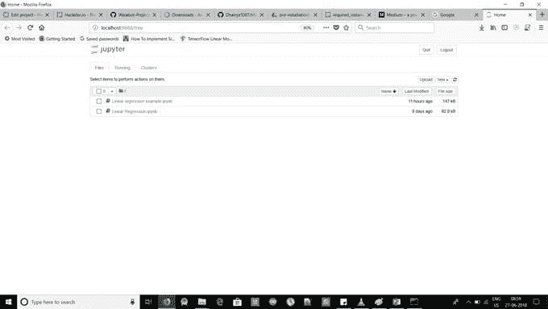**

**现在，打开线性回归示例文件，笔记本就在你面前，让我们来理解它！**

**在第一个框中，我们已经导入了任务所需的所有库。**

**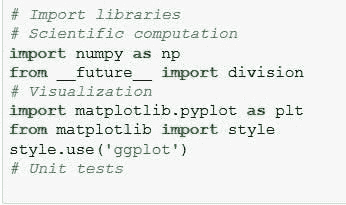**

**现在，要运行 jupyter 笔记本中的一个单元格，你只需要按下 **Shift+Enter。****

**现在，在第二个单元格中，我们已经创建了将要使用的数据。我们在变量 x(它是输入)下创建了一个 10 个元素的数组，输出是 y = 2x+3，这是一个基本的线性关系。输入称为**特性**，输出称为**标签。****

**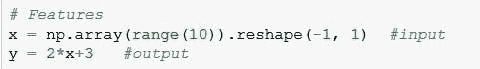**

**现在，所有其他的细节都清楚地写在我的笔记本上，并附有评论和解释，所以请仔细阅读，如果对此有任何疑问，请随时提问。**

# **4.逻辑回归**

**逻辑回归是估计逻辑模型的参数。更正式地说，逻辑模型是一个事件概率的对数比是独立变量或预测变量的线性组合。两个可能的因变量值通常被标记为“0”和“1”，它们代表诸如通过/失败、赢/输、活着/死了或健康/生病之类的结果。二元逻辑回归模型可以推广到因变量的两个以上级别:具有两个以上值的分类输出通过多项式逻辑回归建模，如果多个类别是有序的，则通过有序逻辑回归建模，例如比例优势有序逻辑回归模型。**

**现在，通过一个例子来理解算法，请打开我的 repo 中的逻辑回归示例笔记本。**

**关于这个算法你需要了解的一切都在我的笔记本里解释的很清楚，请参考！**

# **5.结论**

**所以，现在你知道什么是机器学习，你也知道两个最基本的算法。**

**本教程是为那些对人工智能和人工智能有热情，但在学习网络上的复杂教程时有困难的人准备的，所以这是一个为他们创建的简单教程。**

**如果我得到了很好的回应，我会在 ML 上发布进一步的教程，所以请让我知道，这个教程对你有帮助吗，还有任何可以改进的地方。谢谢大家！！**

**我的 git 存储库的链接是:**

**[https://github.com/Dhairya1007/Machine-Learning-Basics](https://github.com/Dhairya1007/Machine-Learning-Basics)**