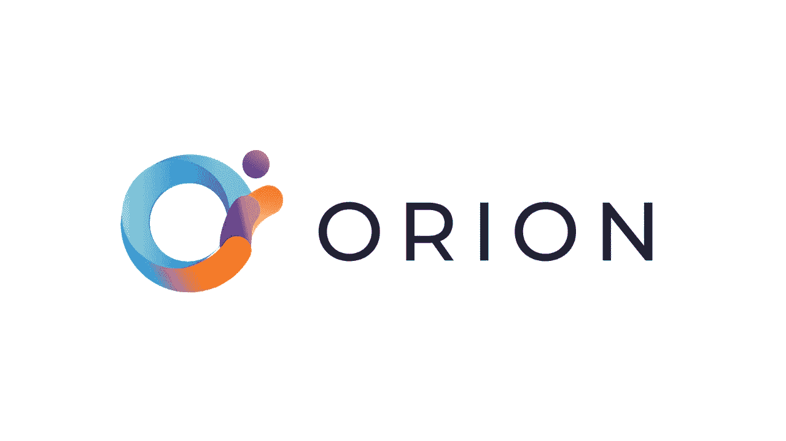
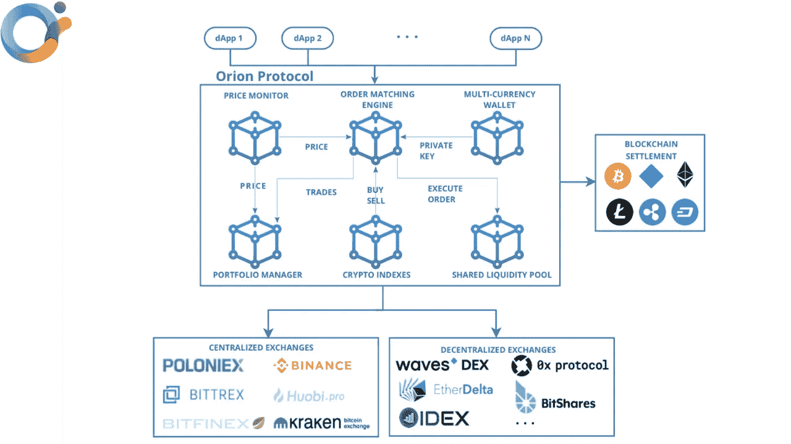
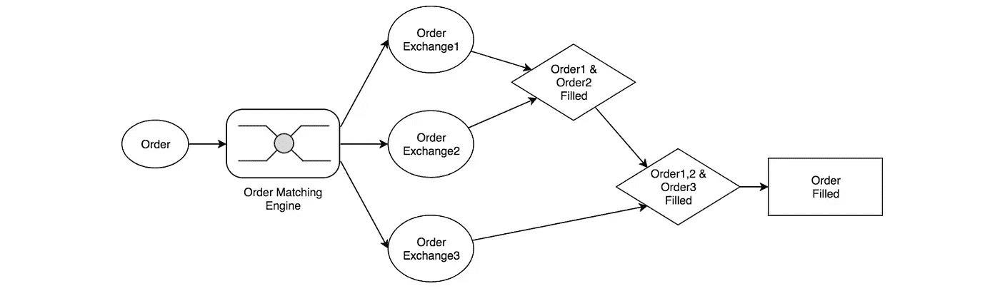
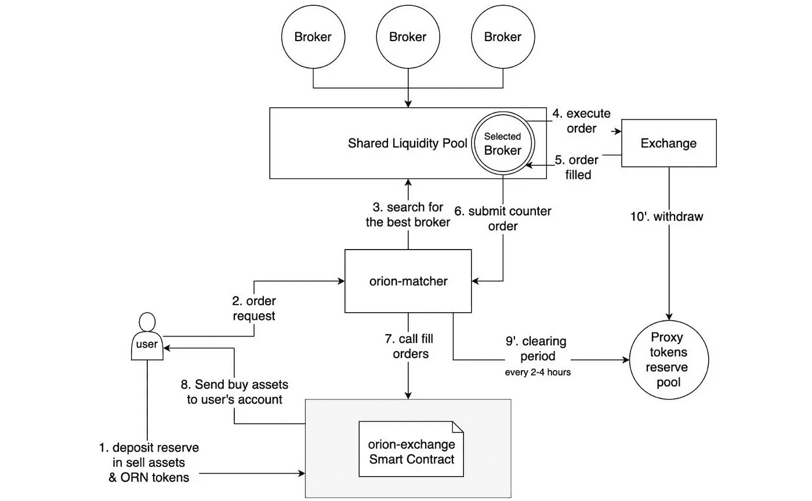

# Orion 简介有史以来最先进的流动性聚合器。

> 原文：<https://medium.com/coinmonks/introduction-to-orion-the-most-advanced-liquidity-aggregator-ever-developed-e6c64a860529?source=collection_archive---------5----------------------->

## 本文旨在讨论 Orion 是如何发展的，以及如何解决流动性问题？

你可能同意流动性在市场中最重要。如果没有足够的流动性，价格开始下跌，卖方开始恐慌。机构远离市场的一部分，这意味着没有流动性就没有市场的未来。现金是流动性最强的资产，加密货币对世界来说还是一个新名词，所以很多人关注流动性。甚至[特斯拉出售比特币来证明作为现金替代品的流动性](https://economictimes.indiatimes.com/markets/stocks/news/elon-musk-says-tesla-sold-bitcoin-to-prove-liquidity-as-cash-alternative/articleshow/82272013.cms)，市场上流动性的减少会消耗你对资产的时间信心，因为大多数有需要的人都是为了利润而来，但如果你不能按时购买/出售你的资产呢？加密市场是高度不稳定的，所以你甚至不能在没有高流动性的地方维持下去。

所以，我希望你已经了解了市场流动性是如何发挥重要作用的。下面就进入我们的话题来讨论一下 Orion 是如何先进的，Orion 是如何解决流动性问题的？

## 介绍

[猎户座协议](https://www.orionprotocol.io/)旨在将众多加密交易的流动性集中到一个分散的阶段，为整个先进资源市场提供一个单独的、非托管的通道。它成立于 2018 年，并于 2020 年由 [Alexey Koloskov](https://www.linkedin.com/in/alexey-koloskov) 派遣，以解决一部分重大的分散金融空间问题。

Orion 的意思是解决与大多数加密交易缺乏流动性相关的执行有益交易的挑战。集中交易和分散交易都是这种情况。Orion 的答案是将所有行业的组织书籍整合成一个易于使用和获取的终端。

猎户座的协议可能会帮助客户从他们的投资中获得最好的回报，同时也降低了利用大量交易的危险。

## Orion 协议架构

通过了解 Orion 协议的架构，可以对 Orion 协议的工作流程有一个大概的了解。Orion 协议利用循环和分散管理的测量工程，满足他们在[以太坊](https://en.wikipedia.org/wiki/Ethereum)平台的所有结算。因此，我们获得了卓越的性能和通过区块链验证的终极安全性。

Orion 协议使用[智能合约](https://en.wikipedia.org/wiki/Smart_contract)来存储用户的资金，这意味着资金非常安全，在维护期间，我们将不会面临任何停机时间，因此无论如何都不会影响任何交易。

## Orion 协议的组件

与其他流动性聚合器相比，它在为 Orion 协议提供唯一身份方面起着至关重要的作用，所以现在让我们讨论 Orion 协议的组件和模块。

1.  **订单匹配引擎:**

通过访问所有可用交易所的最低要价和最高出价，订单匹配引擎对于确保以最有利的价格执行每笔交易至关重要。

当您下新订单时，它首先尝试从内部订单簿执行，但如果订单簿没有最佳价格，则订单匹配引擎开始从其他交易所(CEX 或 DEX)寻找最佳价格。

**2。多币种钱包**

在这里，您可以存储来自不同区块链的多种类型的加密货币，并随时发送/存放密码。尽管如此，包括它，你也可以执行订单，连接到投资组合管理模块，并计算利润和损失。

**3。分散经纪业务中的赌注**

当您使用 Orion 聚合器时，您可以连接到多个交换机。如果你在某个交易所没有资金，你可以选择从一个公共资金池借入必要的流动性。许多银行在 ORN 提供流动性并收取费用，当最初的请求完全结束时。

**4。dApps 市场**

Orion 协议有各种各样的用途，比如交换机器人和支付网关。该协议将广泛用于商业中心的每个分散应用。在 Orion 的 dApps 中，ORN 将作为公用事业令牌工作，用于支付所有管理费用，包括佣金和模型内部费用。

**结论:**

由于加密货币市场是新的，所以我们经常会遇到高波动性。如果你可以检查交易所，你可以发现价格差异，流动性差异，停机时间等。正如我们所知，流动性在减少市场的碎片下跌方面发挥着至关重要的作用，因此我们需要一个像 Orion liquidity aggregator 这样的聚合器，它可以连接 CEX 和 DEX，为我们提供最佳的价格和流动性。

我想通过给你一个 Orion 协议的概述来保持这篇文章的简短和甜蜜，但是在我接下来的文章中，我们将深入讨论 Orion 协议的每个部分、用例、特性等。我希望你喜欢读这篇文章。

谢谢你。

> 加入 Coinmonks [电报频道](https://t.me/coincodecap)和 [Youtube 频道](https://www.youtube.com/c/coinmonks/videos)了解加密交易和投资

## 也阅读

 [## 杠杆代币[多头代币]终极指南

### 杠杆化令牌是具有杠杆化风险敞口的 ERC20 令牌，不考虑保证金、要求、管理…

medium.com](/coinmonks/leveraged-token-3f5257808b22)  [## 最佳加密交易所| 2021 年十大加密货币交易所

### 加密货币交易所的加密交易需要了解市场，这可以帮助你获得利润。之前…

blog.coincodecap.com](https://blog.coincodecap.com/crypto-exchange)  [## 2021 年最佳加密交换平台| CoinCodeCap

### 如果我们看看今天的场景，许多加密货币交换平台提供了广泛的功能和深度…

blog.coincodecap.com](https://blog.coincodecap.com/best-swap-platforms)  [## 2021 年最佳加密借贷平台| 6 大比特币借贷平台

### 获得比特币和其他加密货币的最佳贷款利率

medium.com](/coinmonks/top-5-crypto-lending-platforms-in-2020-that-you-need-to-know-a1b675cec3fa)  [## 2021 年最佳免费加密交易机器人

### 2021 年币安、比特币基地、库币和其他密码交易所的最佳密码交易机器人。四进制，位间隙…

medium.com](/coinmonks/crypto-trading-bot-c2ffce8acb2a)  [## 最佳 4 个加密交易信号电报通道

### 这是乏味的找到正确的加密交易信号提供商。因此，在本文中，我们将讨论最好的…

medium.com](/coinmonks/best-crypto-signals-telegram-5785cdbc4b2b)  [## 获取信号、交易机器人和套利

### 在本文中，我们将回顾 Bitsgap，这是一个满足您所有交易需求的一站式加密交易平台。它…

blog.coincodecap.com](https://blog.coincodecap.com/bitsgap-review)  [## 40 个最佳电报频道，用于加密、电影、表演和演讲| CoinCodeCap

### 随着我们周围无限的信息，我们很难筛选和了解有价值的信息。电报有…

blog.coincodecap.com](https://blog.coincodecap.com/best-telegram-channels)  [## 5 个最佳社交交易平台[2021] | CoinCodeCap

### 困惑于社交交易和副本交易哪个平台最好？本文将带您了解各种…

blog.coincodecap.com](https://blog.coincodecap.com/best-social-trading-platforms)  [## BlockFi 评论 2021:利弊和利率| CoinCodeCap

### 今天，我们提出了一个全面的 BlockFi 评论，这是一个成立于 2017 年的加密贷款平台，拥有其…

blog.coincodecap.com](https://blog.coincodecap.com/blockfi-review)  [## 如何在印度购买比特币？2021 年购买比特币的 7 款最佳应用[手机版]

### 如何使用移动应用程序购买比特币印度

medium.com](/coinmonks/buy-bitcoin-in-india-feb50ddfef94)