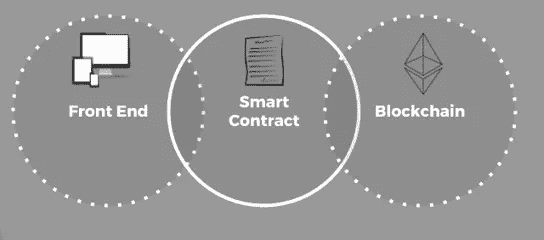

# 智能合同 101 系列(第 1/10 部分)

> 原文：<https://medium.com/coinmonks/introduction-to-smart-contract-part-1-10-1d2c3c7e2896?source=collection_archive---------6----------------------->

# 智能合同简介

让我们从传统契约开始。

> 合同是要约、承诺或对价，它不一定是书面的，可以是双方之间的口头协议，也可以是书面的。在传统方法中，纸质合同更为可取。

合同条款和条件在本质上是独特的。

# **101 什么是智能合同**

> "传统契约的自我执行或传统契约的自动化被称为智能契约. "

最初的概念是由 Nick Szabo 在 1996 年提出的，他创造了这个术语。

以太坊在其区块链上实现了一个突出的智能契约框架，我们将在接下来的章节中浏览它。

Inside Front End appliction, Smartcontract and Blockchain

Ccontract automation process 继承了区块链所有丰富的功能，并提供传统的 web 前端来与区块链世界进行交互。智能合同允许个人以可信、无冲突的方式交换数据，而不依赖于第三方，如银行、律师或公证人。智能合约作为特殊交易存储在以太坊区块链上，然后您可以使用它来构建应用程序。以太坊区块链框架提供完整的端到端解决方案，通过简单易行的步骤创建在区块链部署的智能合同。

请继续([第 2 / 10 部分](/@ismailraja/smart-contract-101-series-part-2-10-a8a38bdb1bda))以继续智能合同的应用。

你也可以在亚马逊上查看我的书

智能合同 101 系列:初学者指南(智能合同 101 系列 I)

 [## 智能合同 101 系列:初学者指南(智能合同 101 系列 I)

### 智能合同 101 系列提供快速启动初学者指南。智能合同是全球人民的一种方式…

www.amazon.com](https://www.amazon.com/dp/B07CX7CBSD/ref=cm_sw_r_tw_dp_U_x_DAQ8AbHV1FM2T)