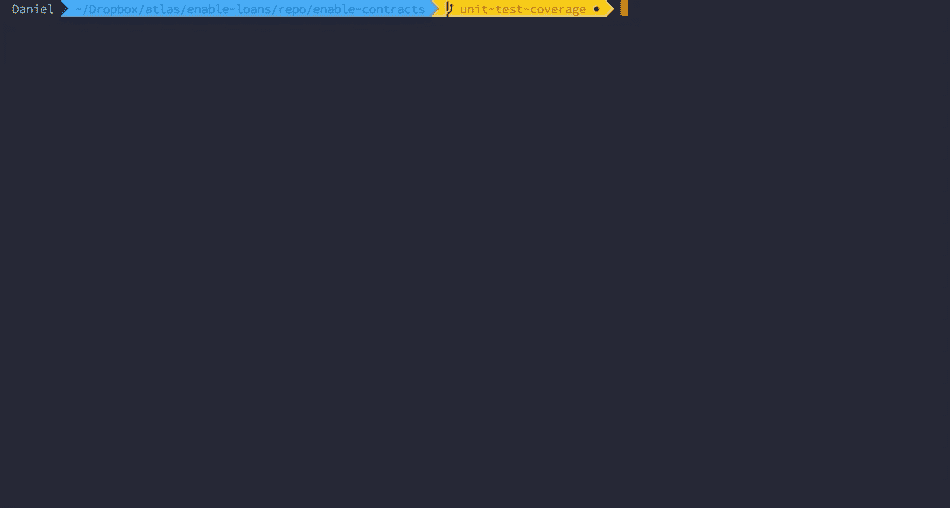

# 固体林挺和格式简介

> 原文：<https://medium.com/coinmonks/introduction-to-solidity-linting-and-formatting-e838c074791a?source=collection_archive---------0----------------------->

## Solhint、beauty-Solidity 和 Git 挂钩的开发人员工作流


Photo by [Markus Spiske](https://unsplash.com/@markusspiske?utm_source=unsplash&utm_medium=referral&utm_content=creditCopyText) on [Unsplash](https://unsplash.com/search/photos/digital?utm_source=unsplash&utm_medium=referral&utm_content=creditCopyText)

以太坊开发者社区开始开发一些[漂亮的](/protofire-blog/solhint-an-advanced-linter-for-ethereums-solidity-c6b155aced7b) [令人敬畏的](https://github.com/duaraghav8/Ethlint) [工具](https://github.com/prettier-solidity/prettier-plugin-solidity)，让我们更接近自动化工作流和开发者“驾驶舱”，我们在更成熟的语言如 Javascript 或 Go 中已经有了。

其中两个工具触及了开发人员工作流程中最核心的部分:编写代码:

*   Linters 自动分析代码中可能的编程和样式错误(常见的例子:ESLint for Javascript)
*   **格式化器**根据预定义的规则和缩进默认值自动格式化代码(通俗的例子:gofmt for go)

本教程介绍了**中的**一种**多种**设置方法。我们在使用 [Truffle 框架](https://www.trufflesuite.com/)的回购环境中介绍了这些工具，但是这些步骤可以适用于任何框架(或者不适用)。

# 第 1 部分:棉绒

Solhint 和 [Ethlint](https://github.com/duaraghav8/Ethlint) (以前的 Solium)是 Solidity 语言的两个奇妙的社区标记。他们就像自动代码审查者，标记安全错误并在团队中灌输最佳实践。

对于本教程，我们将重点关注 Solhint，尽管我强烈建议您也带 Ethlint 出去转转。

## Solhint

首先，确保您在项目根目录中，然后使用 NPM 或 Yarn 添加 solhint 模块。

```
> npm install --save-dev solhint
```

## 配置 Solhint

用基本配置文件初始化`solhint`。

```
> ./node_modules/.bin/solhint init-config
```

这应该会在项目的根目录下创建一个`./solhint.json`文件。这个文件确切地指定了您希望 sol hint lint 处理哪些规则。Solhint 对[安全规则](https://github.com/protofire/solhint/blob/master/docs/rules.md#security-rules)、[风格指南规则](https://github.com/protofire/solhint/blob/master/docs/rules.md#style-guide-rules)和[最佳实践规则](https://github.com/protofire/solhint/blob/master/docs/rules.md#best-practise-rules)的覆盖范围相当惊人。

一个大问题:**默认情况下很少规则被打开**。经过一些试验和错误之后，我发现`**solhint:recommended**`比 Solhint 在[文档](https://github.com/protofire/solhint#configuration)中列出的`solhint:default`稍微好一点。

我强烈建议浏览一下规则列表，把你想要的添加到`./solhint.json`中。我个人认为安全规则和最佳实践非常有用。

## Solhint 忽略

类似于`.gitignore`，你可以让`solhint`忽略文件和文件夹

```
node_modules/
migrations/
```

## Solhint 脚本

编辑您的`package.json`以包含一个新脚本来运行 Solhint。

```
"solhint": "./node_modules/.bin/solhint -f table contracts/**/*.sol"
```

上面的命令有几点需要注意:

*   `Solhint`在匹配文件模式的 globs 上运行。在上面的例子中，它运行在`contracts`目录中的所有`**/*.sol`文件上
*   `-f table`以表格形式展示调查结果。您可以从其他选项中选择(例如`unix`、`tap`)

## Solhint 在行动

```
> npm run solhint
```

您可能会看到许多错误，尤其是缩进和样式错误。不需要手动修复这些！我们的下一个工具(格式化程序)将对此有很大帮助。


Solhint in action

# 第二步:格式化程序

是一个神奇的工具，它可以根据预定义的风格指南自动格式化代码库。只需在团队层面事先就规则达成一致，然后 beauty 会以同样的方式自动套用每个人的代码。

[beauty-solidity](https://github.com/prettier-solidity/prettier-plugin-solidity)是一个与 Solhint 协同工作的更漂亮的 solidity 文件。它有助于自动修复 Solhint 发现的许多错误，尤其是像缩进和代码样式这样简单的错误。

这是一项与活跃的 [Gitter 社区一起进行的工作，在过去的几个月里进展非常快。](https://gitter.im/prettier-solidity/Lobby)

## 安装更漂亮

```
> npm install --save-dev prettier prettier-plugin-solidity
```

## 配置更漂亮

您可以使用`.prettierrc`文件进行更漂亮的配置。Solhint 的大多数规则都是现成的，但是您可能想要添加或关闭其中的一些。我建议保持简短。

你可以阅读[更漂亮的文档](https://prettier.io/docs/en/options.html)了解更多细节。您也可以在`.prettierignore`中指定想要忽略的文件。

```
{
  "printWidth": 100,
  "singleQuote": true
}
```

## 配置 Solhint 以使用更漂亮的

安装[solhint-plugin-appearlier](https://github.com/fvictorio/solhint-plugin-prettier)，这使得 sol hint 可以很好地与 appearlier-Solidity 配合使用。

```
> npm install --save-dev solhint-plugin-prettier
```

然后更新`./solhint.json`把更漂亮的作为插件和规则加入。

## 运行更漂亮-可靠性

给你的`package.json`添加更漂亮的命令。

`--write`标志将格式化并覆盖您现有的文件。根据更漂亮的[文档](https://prettier.io/docs/en/cli.html)，首先提交代码是个好主意。

```
"prettier:solidity": "./node_modules/.bin/prettier --write contracts/**/*.sol"
```

然后在命令行中

```
> npm run prettier:solidity
```



Prettier in action

# 步骤 3: Git 挂钩(可选)

在一个理想的世界里，我们总是记得在将代码推送到我们团队的代码库之前运行我们的 linter 和 formatter。

幸运的是，我们可以用 Git 钩子自动化这个过程。这些小脚本总是在 Git 事件之前或之后运行，比如**提交、推送或接收。**

## 设置 Husky

我们将使用一个 [Husky](https://github.com/typicode/husky) ，这是一个非常有用的 npm 模块，负责处理 git 挂钩的丑陋内部。

```
npm install --save-dev husky
```

然后，给你的`package.json`加几行。在下面的例子中，我们使用`pre-push`钩子来运行我们的漂亮格式化程序。

```
// package.json
{
  "husky": {
    "hooks": {
       "pre-push": "npm run prettier:solidity"
    }
  }
}
```

现在，每当您团队中的任何开发人员向 Github 推送时，您的格式化程序都会运行。


Git Hooks: formatting your code automatically before pushing to Github

> [直接在您的收件箱中获得最佳软件交易](https://coincodecap.com/?utm_source=coinmonks)

[](https://coincodecap.com/?utm_source=coinmonks)