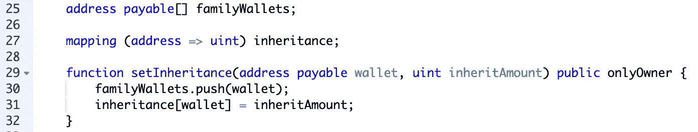

# Solidity 编程和智能合约介绍(完全初学者)

> 原文：<https://medium.com/coinmonks/introduction-to-solidity-programming-and-smart-contracts-for-complete-beginners-eb46472058cf?source=collection_archive---------0----------------------->

## 好的，等等，慢点说……到底什么是可靠，是什么让这些合同如此“聪明”？

*** *注意* *→2019 年 4 月 14 日更新实度 0.5.7**

**Solidity** 是一种全新的编程语言，原产于市值第二大的加密货币以太坊(Ethereum)，最初于 2015 年发布。以太坊不仅是一种能够存储价值或进行支付的加密货币，而且是一个成熟的平台，用于创建所谓的 [**智能合约**](https://blog.coincodecap.com/tag/smart-contact/) 。

从所有的意图和目的来看，智能合同是一种可编程的托管，一个独立的中间人或一个公正的法官，能够管理各方之间的金融交易并自主仲裁纠纷。

> [发现并回顾最佳以太坊开发工具](https://coincodecap.com/category/blockchain-node-and-api)

**这一切意味着什么？**

比方说，一个老爷爷，在他生命的最后几年里，最想做的就是在他去世时，通过遗嘱把他的遗产传给他的家人。在传统的遗嘱中，谁得到什么、得到多少、什么时候得到都很清楚，并被固定在一份具有法律约束力的文件中。当实际分发调味酱的时候，来自法院的法官需要修改文件并做出相应的决定。家庭中出现的一个常见问题是关于谁得到什么的争论，往好里说是制造紧张，往坏里说是破坏关系。在庭审期间，这可能会影响法官的决定，进而可能产生不公平的结果，并可能对家庭纽带造成进一步的损害。

也就是说，如果我们可以通过大幅减少这个问题来简化这个过程，会怎么样呢？

如果这份遗嘱是一份巧妙的合同，法官就没有必要了。这就是最棒的地方。格兰普斯实际上可以让契约代表他持有资产，并在他去世后按照他的喜好有计划地释放这些资产。在这种情况下，合同本身编写的代码将决定结果，有效地消除了对仲裁员的需要。莎拉得到 10000 美元，本得到 5000 美元，朱莉娅得到 2000 美元。代码执行，令牌或加密货币形式的资产自动分发给这些方，无需人工干预。虽然参与其中的每个人可能都不满意这个结果，但是没有人真的可以对屏幕上的代码行提出异议。听起来很实用，对吧？

记住这个例子，让我们进入你们来这里的目的。在这一课中，我们将通过一个用 solidity 编写的智能合同来建立一个简单的遗嘱。

# **设置环境**

头转向 [**混音**](http://remix.ethereum.org) 。这将作为编写您的第一个智能合同的开发平台。您的屏幕应该看起来像这样或类似:

前往左上方的下拉菜单“环境”,确保选择了“Javascript VM”。这意味着所有代码都将独立运行，不会以任何方式与实际的以太网交互。单击左上角的+图标创建一个新文件，并将其命名为“will.sol”。顶部会出现一个选项卡，表示当前正在编辑的文件。

# **2。定义版本**

在 solidity 中，第一行必须始终声明其当前版本。应该是这样的:

Version at the time of writing: 0.5.7

# **3。第一份合同**

跳过一行，键入以下内容:

每个新合同必须加上“contract ”,然后名称的第一个字母必须大写，后面跟着开/闭花括号以包含逻辑。使用双正斜杠来编写注释，这对于描述代码做了什么而不改变它是很有用的。

# **4。全局变量和构造函数**

在我们开始写代码之前，我们应该已经清楚地定义了遗嘱的条款。假设爷爷留下了 50 个乙醚。20 英镑将归他的儿子康拉德，其余 30 英镑归他的妻子丽莎。实际上，当 gramps 去世时，一个外部程序将调用契约中的一个函数来分配资金，但是出于本教程的目的，我们将自己处理这个问题。查看评论部分的讨论！

让我们首先声明:

1.  合同的所有者
2.  留下的财富数量
3.  一个告诉我们爷爷是否还活着的开关
4.  设置这些值的构造函数。

**第 5 行**声明拥有者。在 solidity 中声明变量时，必须在它们前面加上它们的**类型**。在这种情况下，所有者的类型为" **address** "，它对于 solidity 是唯一的，代表一个以太坊钱包地址。这在以后调用只对所有者(gramps)有意义的特定功能时会很有用。

**第 6 行**将保存祖父留下的财产的价值。它的类型是一个 **uint** 或**无符号整数**，这意味着它只能是一个正数。坚固有很多种类型，但我们不会在这里一一介绍。可以在官方文档中找到它们，以便进一步阅读。

**第 7 行**以**布尔**值、**真**或**假**的形式告诉我们祖父是否去世。默认情况下，它被设置为 false。

**第 9–13 行**是**构造函数**的函数。该特殊功能将在合同部署时自动执行。

“ **public** ”关键字是所谓的“可见性修饰符”，它告诉契约谁被允许调用该函数。Public 意味着该函数可以在契约内部和外部被其他人或另一个契约调用。

“ **payable** ”关键字是 solidity 真正与众不同的地方。它允许函数发送和接收以太网。构造函数有这个修饰符，所以当我们部署契约时，我们可以用一个 ether balance 初始化它，在这个例子中是 50。当契约接收到以太时，它会将以太存储在自己的地址中。

在这里，我们将所有者设置为“ **msg.sender** ”，这是一个内置的全局变量，表示调用该函数的地址。在这种情况下，将是我们(格兰普斯)。

fortune 被设置为“ **msg.value** ”，这是另一个内置变量，它告诉我们已经发送了多少以太。

尽管 isDeceased 在默认情况下设置为 false，但为了清楚起见，这里还是手动进行了设置。

# **5。修饰语**

修饰符是包含条件逻辑的函数的附件。例如，我有一个关闭电灯开关的函数和一个声明电灯开关必须“打开”的修饰符。我将修饰符添加到 function 中，这样它只能在开关为“on”时被调用，而在开关为“off”时将抛出一个错误。

**第 15 行**声明了" **onlyOwner** "修饰符。如果添加到一个函数中，只有当调用者(msg.sender)等同于上面所说的 owner 变量时，才能调用它(还记得我们如何在构造函数中设置 owner)。我们将需要这一点，以允许分配资金，这将在稍后实施。

“ **require** 关键字声明，写在括号内的所有内容必须等于 **true** ，否则 solidity 将抛出一个错误，执行将停止。

**_；**"告诉执行程序在读完修饰符后切换到实际的函数。

**第 20 行**声明了“**mustbedeated**”修饰符。一旦添加到函数中，只有当“isDeceased”的值为 **true** 时，才能调用它。我们还将利用这一点来分配资金。目前还没有办法将它设置为真的，但是我们会在以后解决这个问题。

顺便说一下，我们可以只在每个函数声明下面写“ **require** ”，但是使用修饰符是避免重复和重用代码的好方法。

# **6。遗产**

现在我们必须宣布战利品是如何在家庭成员中分配的。我们将需要他们的公共钱包钥匙(地址)和他们想要的分配。

如前所述，康拉德将获得 20 个 ETH，丽莎将继承 30 个。让我们创建一个列表来存储他们的钱包地址和一个为每个地址设置继承的函数。

**第 25 行**声明了一个名为“ **familyWallets** 的空数组，用于存储家庭成员的钱包地址。这是一个类似列表的数据结构，其中的任何元素都可以被索引并随后在其中被访问。注意括号前的关键字“**应付款**”。这允许地址接收以太网。“地址”后面的方括号表示它是一个项目数组，而不是单个变量。

**第 27 行**创建了一个从地址类型到名为“**继承**的单元类型的映射，用于存储每个地址继承的值。这是一个键/值对数据结构，其中可以调用键来获取值。它相当于 Python 和 Javascript 等其他语言中的“字典”。

**第 29 行**声明了向我们刚刚创建的数组添加地址的函数，然后根据地址设置继承。当我们调用它时，我们必须向它提供一个家庭成员的钱包地址以及他们分配的战利品。注意我们添加到这个函数中的" **onlyOwner** "修饰符。你能猜到我们为什么把它放在那里吗？(提示:看“ **public** ”关键词。)

**第 30 行**同时创建一个钱包地址，并在给定输入参数“ **wallet** ”和“**”的情况下，将其附加到我们的“ **familyWallets** ”数组中。按下**”。

**第 31 行**从我们之前创建的“**继承**”映射中获取键“**钱包**”(一个参数)的值，并将其设置为给定另一个参数“**继承数量**”的继承。

请注意这些步骤从第一步开始是如何逻辑连接的。我们为钱包和遗产创造了一个生存空间。然后，该函数将使用我们提供的信息填充这些数据字段！

# 7.给我看看钱

让我们回顾一下。到目前为止，我们已经了解了全局变量及其类型、构造函数、特殊关键字(如“payable”和“public”)、内置变量(如“msg.sender”)、修饰符和“require”、数组、映射和函数。我们已经建立了框架，现在让我们把它连接在一起，这样我们就可以完成我们的合同。

在本教程的最后一部分，我们将实现一种方法，通过查看每个家庭的地址并向他们发送各自的钱，家庭可以获得报酬。

**第 34 行**声明了**支付()**函数。注意“**私人**关键词。这个可见性修饰符与我们前面看到的“公共”相反。它只允许在契约中调用这个函数*，如第 42 行所示。安全性是主要目的，因为它不允许任何人或任何其他合同与之交互。请注意在结尾处加上的“**mustbededeated**”修饰符。由于这个原因，这个函数目前仍然无法执行。*

**第 35 行**是一个循环的**，该循环迭代“ **familyWallets** ”数组。语法如下:声明一个计数器变量(I)，声明循环的条件，并在每次循环完成时递增(I)。块内的代码将一直执行，直到计数器的长度*小于“钱包”数组的长度**。(I)将如所述从 0 开始，逻辑将执行，(I)将递增到 1，逻辑将再次执行。循环重复，直到满足条件。你能猜到它会完成多少次任务吗？(提示:查看数组的长度)***

*第 36 行是我们在整个课程中一直在谈论的实际任务。“**family walets[I]**”特指位于“**family walets**”数组中第*I*位的元素。在第一次迭代中，我们知道(I)等于 0。因此我们可以推测我们想要列表中的第一个地址，因为数组总是从索引 0 开始。然后我们介绍一个新的调用给**”。转移()"**在我们刚刚捕获的地址上。这是一种相对简单的全球方法来传递嵌入在 Solidity 中的价值。它只需要一个参数，我们要发送的数量。作为精明的程序员，我们准备了一个包含相关信息的数据结构。你记得我们把它放在哪里了吗？"**inheritance[family wallets[I]]**"直接引用我们在" **inheritance** "中指定的继承量再次映射为，每个元素位于" **familyWallets** "数组中的*I ' t*位置。因为在第一次迭代中 i= 0，所以我们希望继承列表中的第一个地址。*

*总而言之，这一行代码将资金从契约的地址转移到接收者的地址，接收者的地址是从一个列表中提取的，金额相当于同一地址的继承分配。*

***第 40–42 行**是 gramps 去世时调用的函数。这里，我们将我们在开始时声明的变量“**被取消**”的值设置为 **true** 。请注意“ **public** ”和“ **onlyOwner** ”关键字的重复使用。记住这一点，我们最终可以调用“ **payout()** ”来发送资本。*

*对于目光敏锐的读者来说，你可能会认为“**被删除**”是多余的。从技术上讲，你是正确的。我们可以将“**death()**”全部删除，并将“ **private** ”改为“**public**”&“**must bedded dead**”改为“**payment()**中的“ **onlyOwner** ”。它会产生完全相同的结果。这个转换只是为了探索另一种实现方式，在这种方式中我们练习使用修饰符。出于安全目的，通常的做法是将函数设为私有，并让公共函数在别处调用它们。*

# *我们完事了。*

*实际上，不完全是…*

*这个智能契约是完整的，但是我们实际上如何使用它呢？现在我们可以收获劳动果实了。*

# ***8。合同部署&交互***

*您的屏幕应该是这样的:*

**

*越过右上角的**编译**标签。确保您的编译器版本与下面的版本(0.5.7)匹配，然后点击**开始编译**。*

**

*在静态分析中，您应该会看到一个蓝框。欢迎您进一步调查，但现在可以随意忽略它。头回**跑。***

**

*确保为“环境”选择了“Javascript VM”。在“帐户”下，点击下拉菜单将显示 5 个地址，每个地址有 100 以太网余额。选择第一个。*

*将合同部署到区块链以太坊不是免费的。部署者必须支付象征性的费用，称为**气**。这样一个系统是为了防止人们使用所有网络资源无休止地发送垃圾邮件。如果你想了解更多，MyEtherWallet 有一篇关于这个主题的综合文章。*

*保留“气体极限”字段不变。*

*“值”字段指示当我们点击“部署”时，我们希望用来初始化合同的乙醚量。50 分钟后进入。还记得我们如何在早期给构造函数添加了一个" **payable** "修饰符吗？继续并点击“部署”。*

*你应该马上注意到三件事。首先，所选帐户的余额现在应该是 49.9999…这是由于我们给了合同 50 以太，加上部署它的小额费用。底部的控制台还将提供关于已部署实例的其他详细信息，您可以随意查看。要意识到的主要事情是:*

**

*这是我们的合同实例！它生成自己的地址，并显示我们创建的两个公共函数。作为主人，我们首先要做的是设定康拉德(20 岁)和丽莎(30 岁)的继承权。假设下拉列表中第二个是康拉德的地址，第三个是丽莎的地址。选择第二个，通过点击剪贴板图标复制并粘贴到上面的字段。*

*在我们执行之前，有几件事要记住。如果你试图点击闪亮的按钮，它会失败。你能猜到原因吗？(提示:看看我们的修饰语。)这里的另一个警告是数量。当与以太一起工作时，契约读取**微**中的数字，这是以太的极小部分。事实上非常小，一个埃特等于 1×10 微。(那就是十亿分之一。幸运的是，有一个 [**工具**](https://etherconverter.online/) 为我们做了转换。*

*用逗号分隔地址，然后将值 20 Ether 粘贴在 Wei 中。要回答上述问题，请确保选择下拉列表中的第一个地址，而不是第二个。由于“ **OnlyOwner** ”修饰符，任何其他地址都不起作用！(由于" **owner = msg.sender** "，在部署过程中选择的任何一个都将成为所有者)*

*让我们发射火箭，并为丽莎重复同样的步骤。您应该会看到控制台输出成功消息。检查它们，寻找标有“**解码输入**”的部分。*

**

*如您所见，它显示了我们提供给它的输入。*

*遗产已经确定，但坏消息来了。格兰普斯在北极探险期间因心脏病发作去世，享年 73 岁。他是一个雄心勃勃的人，总是精力充沛。他抓住生活的每一个角落，不接受否定的回答。这家伙甚至在 2017 年牛市期间投资了 crypto，赚了一些钱。他知道这一天会到来，所以他把赢来的钱写进了遗嘱，并祝愿他所爱的人生活幸福。*

*当我们纪念一个伟人的去世时，我们也在他的遗嘱中称他为“**()**”。控制台会微笑，地址会平衡增加。请记住，帐户将不得不花费一些汽油来执行该功能。打开下拉菜单，尽情享受你的成功。是的，您刚刚创建了您的第一个全功能智能合同！去吃点冰淇淋吧，这是你应得的！*

**

*如果你已经走到这一步，你自己就是一个与众不同的人。也许到你寿终正寝的时候，这项技术将成为主流，你可以为你所爱的人创建自己的自主遗产管理人。*

*为了结束本教程，我们必须讨论最后一个问题，一个你可能在整个旅程中一直想知道的问题。如果爷爷死了，他怎么调用函数呢？！？一个未来的解决方案将是以某种方式拥有一个可以远程跟踪心跳的 IOT 设备，如果心跳停止超过 x 时间，该设备将有能力执行该功能。你能想到别的解决办法吗？贴在评论里吧！*

*-艾蒂安*

**

*For the thumbnail!*

> *加入 Coinmonks [电报频道](https://t.me/coincodecap)和 [Youtube 频道](https://www.youtube.com/c/coinmonks/videos)获取每日[加密新闻](http://coincodecap.com/)*

## *另外，阅读*

*   *[复制交易](/coinmonks/top-10-crypto-copy-trading-platforms-for-beginners-d0c37c7d698c) | [加密税务软件](/coinmonks/crypto-tax-software-ed4b4810e338)*
*   *[电网交易](https://coincodecap.com/grid-trading) | [加密硬件钱包](/coinmonks/the-best-cryptocurrency-hardware-wallets-of-2020-e28b1c124069)*
*   *[密码电报信号](http://Top 4 Telegram Channels for Crypto Traders) | [密码交易机器人](/coinmonks/crypto-trading-bot-c2ffce8acb2a)*
*   *[有哪些交易信号？](https://coincodecap.com/trading-signal) | [比特斯坦普 vs 比特币基地](https://coincodecap.com/bitstamp-coinbase)*
*   *[ProfitFarmers 回顾](https://coincodecap.com/profitfarmers-review) | [如何使用 Cornix Trading Bot](https://coincodecap.com/cornix-trading-bot)*
*   *[如何在势不可挡的域名上购买域名？](https://coincodecap.com/buy-domain-on-unstoppable-domains)*
*   *[印度的秘密税](https://coincodecap.com/crypto-tax-india) | [altFINS 审查](https://coincodecap.com/altfins-review) | [Prokey 审查](/coinmonks/prokey-review-26611173c13c)*
*   *[最佳加密交易所](/coinmonks/crypto-exchange-dd2f9d6f3769) | [印度最佳加密交易所](/coinmonks/bitcoin-exchange-in-india-7f1fe79715c9)*
*   *开发人员的最佳加密 API*
*   *最佳[密码借贷平台](/coinmonks/top-5-crypto-lending-platforms-in-2020-that-you-need-to-know-a1b675cec3fa)*
*   *[杠杆代币](/coinmonks/leveraged-token-3f5257808b22)终极指南*