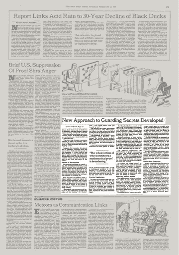
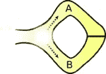
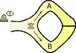
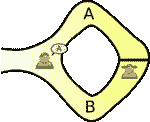
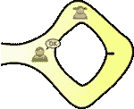

# 零知识证明导论🔏

> 原文：<https://medium.com/coinmonks/introduction-to-zero-knowledge-proofs-8e8261b4a48a?source=collection_archive---------2----------------------->

Image Credits [Alex Martinez](https://unsplash.com/@estudisimple)

零知识证明(ZKP)是一种密码方法，它允许一个人(证明者)向另一个人(验证者)证明他们拥有某些信息，而无需向验证者透露这些信息。

换句话说，ZKP 允许在不泄露信息本身的情况下传达信息在手的保证。

# 起源

零知识证明最初是在 1985 年由[沙菲·戈德瓦瑟](https://en.wikipedia.org/wiki/Shafi_Goldwasser)、[希尔维奥·米卡利](https://en.wikipedia.org/wiki/Silvio_Micali)和[查尔斯·拉科夫](https://en.wikipedia.org/wiki/Charles_Rackoff)在他们的论文《交互式证明系统的知识复杂性》中提出的。

The New York Times, February 17th, 1987 © The New York Times

这里有一份 1980 年纽约时报的剪报，报道了这些证据。最近，由于零知识证明在加密货币 [ZCash](https://z.cash) 中的使用以及通过比特币区块链进行安全支付，零知识证明重新变得相关。

# 例子

在论文“[如何向你的孩子解释零知识协议](http://pages.cs.wisc.edu/~mkowalcz/628.pdf)”中，作者提供了 zkp 如何工作的抽象说明。

考虑一个类似阿里巴巴洞穴的洞穴，里面有一扇需要密码才能打开的魔法门。洞穴有 A 和 B 两个入口，都通向魔门。

© WikiCommons

考虑两个人，普瑞亚( **p** 漫游者)和凡荣( **v** erifier)，普瑞亚知道打开魔法门的暗语，而凡荣不知道。凡荣很想知道普丽娅是否真的知道密语。

因此，他们设计了一个计划，让 Priya 证明她知道这个秘密的单词，而不用向 Varun 透露。

普丽娅走进洞穴时，凡荣在洞外等候。普丽娅要么选择 A 路，要么选择 b 路。凡荣不允许看到她选择哪条路。然后，凡荣进入洞穴，大声说出他希望她返回的路径名，A 或 B，随机选择。

Varun chooses the exit path for Priya to return

现在出现了两种情况，

案例一。普丽娅知道密语:她可以从指定的路径返回，即使这需要她穿过大门，没问题。

Priya is able to return via the path specified

案例二。普丽娅不知道密语:在这种情况下，她只能从她进来的路返回，如果这是瓦伦早先选择的路，那就好，如果不是，她就被发现在说谎。因此，有 50%的机会，她仍然可以成功地声称她知道秘密的话，即使她不知道，由于纯粹的运气。

50%不够好，所以 Priya 和 Varun 重复这个练习。随着每一次迭代，Priya 不知道密语并能够声称她知道的机会减少了。在 20 次迭代之后，它们变得非常低(百万分之一)

在这一点上，普瑞亚已经成功地向凡荣证明了她确实拥有秘语的知识。

# 定义

ZKP 必须满足以下特性:

## 完全

如果该陈述为真，诚实的验证者(即，正确遵循协议的人)将被诚实的证明者确信这一事实。

## 健康

如果陈述是假的，没有欺骗证明者可以说服诚实的验证者它是真的，除非有一些小概率。回到我们的例子，即使在 20 次迭代之后，Priya(证明者)仍然有百万分之一的机会欺骗 Varun(诚实的验证者)

## 零知识

如果陈述是真实的，除了陈述是真实的事实之外，没有验证者知道任何事情。在我们的例子中，Varun 在验证过程中没有获得打开魔法门的密语知识。

# 应用程序

## 二等兵区块链

ZKPs 可以用来保证交易是有效的，尽管发送者、接收者和其他交易细节的信息仍然是隐藏的。例[https://z.cash/](https://z.cash/)
Zcash 实现了 zkP 的一个修改版本，叫做 zk-SNARKS，其中“ZK”指的是*“零知识”*，SNARK 指的是“*简洁的非交互式知识论证*

## 私人购买

想象一下，去超市用信用卡购买商品，却不向商家透露自己的卡信息。使用零知识证明的智能卡可以向商家识别持卡人，而无需向商家提供知识，即卡号，这将使其进行非法购买或伪造新卡。

## 认证系统

ZKPs 可用于使用[零知识密码证明](https://en.wikipedia.org/wiki/Zero-knowledge_password_proof)实现无密码登录。

## 安全的比特币交易

比特币可以让你把钱汇给某人，条件是他们必须提供 SHA256 哈希码的原像，如果他们不能提供原像，你就可以拿回你的钱。ZKPs 可用于强制散列的原像是解锁某些您想要的数据的密钥，这成为构建奇异协议或执行风险事务的强大工具。比特币核心开发者 Gregory Maxwell 通过制作第一个成功的零知识或有支付证明了这一点。

## 知识的证明

其他应用包括证明你有一个数独谜题的答案，但不透露答案。这可以扩展到寻宝游戏、密封投标拍卖等(只要是[级 NP](https://en.wikipedia.org/wiki/NP_(complexity)) 的任何问题)

本文最初发表在 [Chaintope BlogChain](/chaintope-blogchain/understanding-zero-knowledge-proofs-4826401fc3a7) 上。

# 参考

1.  [https://manishearth . github . io/blog/2016/03/05/exploring-zero-knowledge-proofs/](https://manishearth.github.io/blog/2016/03/05/exploring-zero-knowledge-proofs/)
2.  [https://en.wikipedia.org/wiki/Zero-knowledge_proof](https://en.wikipedia.org/wiki/Zero-knowledge_proof)
3.  [https://bitcoincore . org/en/2016/02/26/zero-knowledge-content-payments-announcement/](https://bitcoincore.org/en/2016/02/26/zero-knowledge-contingent-payments-announcement/)
4.  [http://blog . cryptography engineering . com/2014/11/zero-knowledge-proof-illustrated-primer . html](http://blog.cryptographyengineering.com/2014/11/zero-knowledge-proofs-illustrated-primer.html)
5.  [https://news.ycombinator.com/item?id=11190830](https://news.ycombinator.com/item?id=11190830)
6.  [https://www . Reddit . com/r/bit coin/comments/47rk 85/first _ successful _ zero knowledge _ contingent _ payment/d0f 69ml](https://www.reddit.com/r/Bitcoin/comments/47rk85/first_successful_zeroknowledge_contingent_payment/d0f69ml)
7.  [https://people . seas . Harvard . edu/~ salil/research/complex ityzk . pdf](https://people.seas.harvard.edu/~salil/research/complexityZK.pdf)
8.  [https://guyrothblum.files.wordpress.com/2014/11/gnpr07.pdf](https://guyrothblum.files.wordpress.com/2014/11/gnpr07.pdf)

> [在您的收件箱中直接获得最佳软件交易](https://coincodecap.com/?utm_source=coinmonks)

**Read Today’s Top story**