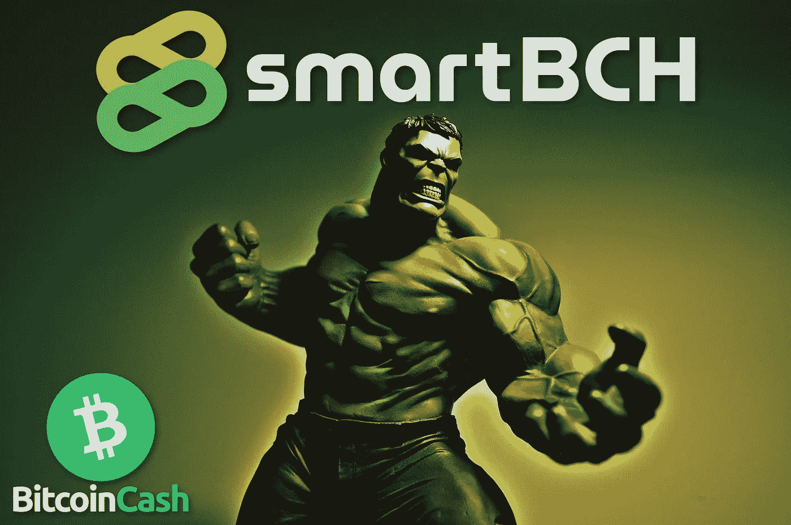
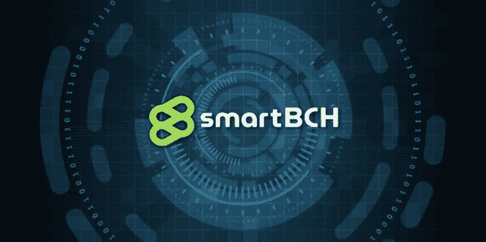
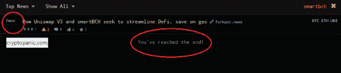

# 通过投资比特币现金来投资 smartBCH

> 原文：<https://medium.com/coinmonks/invest-in-smartbch-by-investing-in-bitcoin-cash-8a99c4a5ab27?source=collection_archive---------8----------------------->

今天的投资者正在寻找下一个热门的智能合约网络，通常会大量购买本机令牌。

**比特币现金(BCH)是 smartBCH 的原生币。**

smartBCH 最近的发展规模，以及比特币现金社区的热烈欢迎，都有利于 smartBCH 的顺利引入阶段。

smartBCH 社区预计会快速发展，用户群会增加，智能合同在所有领域的发展都会蓬勃发展。

到目前为止，营销并不重要，因为网络必须有机地发展，并在开始阶段以稳定的速度增长。

通往以太坊的桥梁和更多的 EVM 侧链目前正在开发中，预计将于 2022 年第一季度完成。这些网桥将允许与 Polygon、币安智能链(BSC)等网络的互操作性。

SmartBCH 在比特币现金社区受到了热烈欢迎。虽然，它尚未得到投资者的认可，主要是因为迄今为止保持的低调和加密货币新闻媒体的无知。

但这也将会改变。

# SmartBCH 意识

**SmartBCH 仍然被加密新闻媒体忽视**

立即从我所看到的一个主要缺点开始，这可能是目前应该解决的。

正如比特币现金的任何积极发展一样，Coindesk、Decrypt、Cointelegraph 等加密媒体忽视了 SmartBCH 的发展，限制了它的公共可见性。

原因众所周知。比特币现金经常被加密新闻报道所限制、忽视和压制。加密新闻网站不是一个可靠的信息来源。尽管如此，它们吸引了大量的流量，因为可能有数百万投资者偶尔会使用它们。

如果当前加密货币社区中有 1%的人听说过 smartBCH，那将是令人惊讶的。

只有 Bitcoin.com 报告 smartBCH。其余的只是忽视它的存在，同时促进各种其他智能合同侧链。

这在未来很可能不会有太大的改变。加密新闻从来不是一个可靠的信息来源，多年来一直压制比特币现金信息。

尽管如此，我们应该感到高兴的是，比特币现金与看起来像新闻操纵和价格炒作的方式不同。

然而可悲的是，主流媒体(彭博、美国消费者新闻与商业频道等。)再次对加密货币感兴趣，但对该领域的技术方面也不感兴趣。

比特币现金以其实用性吸引投资者的关注。

smartBCH 也是如此，这是一种具有不可估量潜力的高级智能合同技术。

## 通过投资 BCH 来投资 smartBCH

投资者通常购买智能合约网络的原生加密货币。几乎所有的侧链都带有一个本地令牌，可用作 gas。

**smart BCH 的原生代币是比特币现金**。

投资者可以通过投资比特币现金立即投资于 smartBCH 侧链的前景，比特币现金是所有交易所和大多数交易应用程序提供的顶级加密货币。

目前，零售、机构和经认证的投资者可以通过各种方式投资比特币现金，这一直是基金分散加密货币的前五大考虑因素。

> **I)PayPal:(BCH**—BTC—ETH—LTC**)**
> 
> **ii)灰度:(BCHG**—GBTC—ETHE—LTCN—ETCG**)**
> 
> **iii)摩根大通&公司:(BCH** — BTC —瑞士联邦理工大学—等 **)**
> 
> **四)SBI 控股(日本):(**XRP—**BCH**—BTC—ETH—LTC**)**
> 
> **v) 21 股**:(**BCH**—BTC—ETH**)**

这些只是比特币现金以及随后的 smartBCH 的一些投资选择。

在加密领域，很可能所有的加密货币交易所都向投资者提供 BCH。

建议直接投资 BCH，并提取到一个非托管钱包。

## 投资 smartBCH 项目、代币、DeFi、NFT

SmartBCH 是比特币现金的侧链，具有 EVM 兼容性。

它提供了一种全新的方法，使智能合同在一个分散和安全的环境中成为可能。与以太坊相比，还能以相当低的费用访问 DeFi 和 NFTs。

SmartBCH 的普通令牌交易费用仅为 0.03 美元，尽管它根据每个合同设定的 gas 限制使用 gas 和合同交互。尽管如此，无论交易类型如何，费用总是相对较低，成本也微不足道。

DeFi 很简单，费用不会减少投资利润。以太坊 DeFi 费用可能在 50-500 美元(甚至更高)之间变化，取决于网络拥塞情况。当网络用户数量激增时，smartBCH 不会出现这种问题。费用将保持低水平。

通常，我会将对新 smartBCH 项目的评估推迟数周，直到我确定不成功的可能性很低，并且该项目能提供一些有用的东西。

## 投资具有长期生存能力的代币

今天在 smartBCH 中有许多值得尊敬的代币，而有些代币并不具备实质性的前景。

我采取安全的方法，总是考虑所有的结果，因为 2018 年和 2019 年的熊市。之前的熊市教会了大家成功有多难，长期特征有多决定性。我们今天持有的代币可能在一年后，甚至一个月后就没有价值了。

投资关乎长远。虽然 smartBCH 今天在比特币现金社区中享有一定规模的宣传，但我们仍然必须找到那些包含巨大潜力和长期可行性的项目。

长期的生存能力需要一定的标准，仅仅做一个象征并在 DeFi 农场上市并不是最好的做法。白皮书和路线图为我们提供了开发和解决方案的提示。在 telegram 或 AMA 访谈中与项目背后的团队讨论也值得考虑。

## 能够吸引 smartBCH 生态系统中值得尊敬的开发人员的技术方面

我希望我们在 smartBCH 中看到更多的项目，并发现它们致力于带来专业的解决方案并扩展 smartBCH 生态系统，就像以太坊网络中的各种项目一样。

当网络吸引专业人士探索现实生活或数字解决方案时，这将是一个巨大的推动。这也是以太坊智能合约如此受欢迎的原因之一。

像安永和银行这样的会计公司测试智能合约，并在以太坊的基础上开发，通常提供他们的专业知识和开源代码。SmartBCH 需要很长一段时间才能被人们所认识和理解其意义。有时一个项目会超前于它的时间。

这在上个世纪经常发生，但在我们这个时代，发展如此之快，以至于新发展的整合没有留下选择和放弃好想法的空间。

然而，我们的世纪并没有长期忽视有价值的技术进步。最终，它会进入大规模生产或大规模采用。

## 风险和回报的多样化

多样化为我们的投资过程提供了两个基本要求:

I)降低风险，以及

ii)扩大投资组合，提供更多机会

任何投资都需要时间来成熟，任何投资都可能包含看不到的风险。透明度很重要，因为在商业世界，加密货币和代币开发商可能一直在向投资者隐瞒重要信息。

# 最后

SmartBCH 没有本地令牌，但使用比特币现金，因此投资者可以将 BCH 作为 smartBCH 的投资。

当前的网络效应是 smartBCH 的一个很好的指标。投资者还可以将效率和分散功能与其他类似的智能合同侧链进行比较，以进行研究。

如果投资者了解 smartBCH 提供的潜在价值，那么投资比特币现金就等于投资 smartBCH。

比特币现金作为一种数字货币，有一定的目标和方法来大规模采用。SmartBCH 是在它的基础上开发的，旨在提供一个有竞争力的智能合同平台。

作为加密货币分析师，我们努力寻找具有支持长期潜力并包含问题可靠解决方案的项目。用商业术语来说，一个产品就是一个解决方案，一个问题可以有很多解决方案，每一个都有独特的特征或方法。

效率是长期可持续发展和增长的关键。成本和易用性同样重要。

高收费无法维持用户群太久。炒作不会持久，反而会形成不可持续的泡沫。

投资者正在寻找为我们的社会增加价值、解决问题、改善生活条件、让我们的生活更简单的项目。

SmartBCH 正在提供一个高效的智能合同网络，准备大规模采用。

Writing at the following websites: ● [ReadCash](https://read.cash/@Pantera) ● [NoiseCash](https://noise.cash/u/Pantera99) ● [Medium](/@panterabch) ● [Hive](https://hive.blog/@pantera1) ● [Steemit](https://steemit.com/@pantera1) ●[Vocal](https://vocal.media/authors/pantera) ● [Minds](https://www.minds.com/pantera99/) ● [Twitter](https://twitter.com/Panterabch) ● [LinkedIn](https://www.linkedin.com/in/panterabch/) ● [email](https://read.cash/@Pantera/localcryptos-p2p-exchange-is-now-offering-bitcoin-cash-trading-06637230#bad-link)

> **免责声明**:本内容发布的所有材料均用于娱乐和教育目的，并符合**公平使用准则**。无意侵犯版权。如果您是或代表本文所用材料的版权所有者，并且对所述材料的使用有疑问，请发送 [**电子邮件**](https://read.cash/@Pantera/cryptouknowns-battlegrounds-the-crypto-battle-royal-part-i-0ca762da#bad-link) 。
> 
> 没有财务建议的意图。DYOR

***支持内容创作者。***

如果你喜欢这个故事，就订阅吧！

*最初发布于*[*https://read . cash*](https://read.cash/@Pantera/invest-in-smartbch-by-investing-in-bitcoin-cash-61be7dfc)*。*

> 加入 Coinmonks [电报频道](https://t.me/coincodecap)和 [Youtube 频道](https://www.youtube.com/c/coinmonks/videos)了解加密交易和投资

## 也阅读

*   [币安期货交易](https://blog.coincodecap.com/binance-futures-trading)|[3 commas vs Mudrex vs eToro](https://blog.coincodecap.com/mudrex-3commas-etoro)
*   [在印度利用加密套利赚取被动收入](https://blog.coincodecap.com/crypto-arbitrage-in-india)
*   [德国最佳加密交易所](https://blog.coincodecap.com/crypto-exchanges-in-germany) | [WazirX P2P](https://blog.coincodecap.com/wazirx-p2p)
*   [如何购买 Monero](https://blog.coincodecap.com/buy-monero) | [IDEX 评论](https://blog.coincodecap.com/idex-review) | [BitKan 交易机器人](https://blog.coincodecap.com/bitkan-trading-bot)
*   [如何在 Bitbns 上购买柴犬(SHIB)币？](https://blog.coincodecap.com/buy-shiba-bitbns) | [币安](https://blog.coincodecap.com/binance-in-india)
*   [币安 vs 比特邮票](https://blog.coincodecap.com/binance-vs-bitstamp) | [比特熊猫 vs 比特币基地 vs Coinsbit](https://blog.coincodecap.com/bitpanda-coinbase-coinsbit)
*   [如何购买 Ripple (XRP)](https://blog.coincodecap.com/buy-ripple-india) | [非洲最好的加密交易所](https://blog.coincodecap.com/crypto-exchange-africa)
*   [非洲最佳加密交易所](https://blog.coincodecap.com/crypto-exchange-africa) | [Hoo 交易所评论](https://blog.coincodecap.com/hoo-exchange-review)
*   [eToro vs robin hood](https://blog.coincodecap.com/etoro-robinhood)|[MoonXBT vs by bit vs Bityard](https://blog.coincodecap.com/bybit-bityard-moonxbt)
*   [Stormgain 回顾](https://blog.coincodecap.com/stormgain-review) | [Bexplus 回顾](https://blog.coincodecap.com/bexplus-review) | [币安 vs Bittrex](https://blog.coincodecap.com/binance-vs-bittrex)
*   [Bookmap 评论](https://blog.coincodecap.com/bookmap-review-2021-best-trading-software) | [美国 5 大最佳加密交易所](https://blog.coincodecap.com/crypto-exchange-usa)