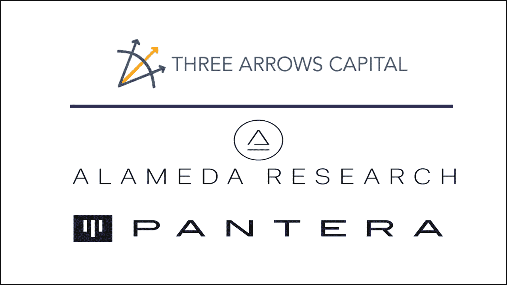
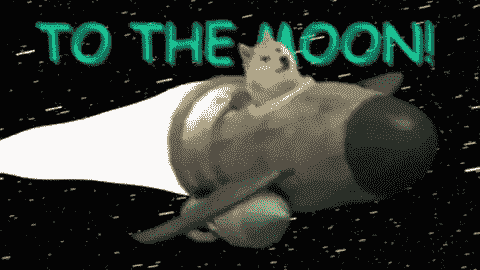
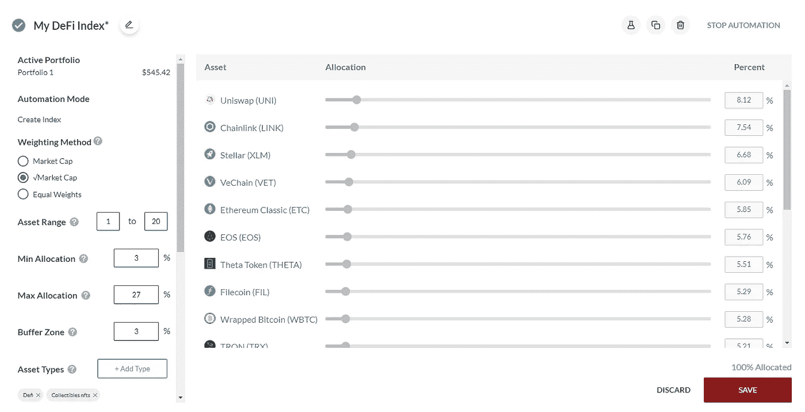
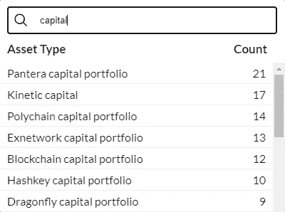

# 像专业人士一样投资，像交易基金一样——Shrimpy 公布指数标签

> 原文：<https://medium.com/coinmonks/invest-like-the-pros-be-like-a-trading-fund-shrimpy-announces-index-tags-ddf5e5520ae2?source=collection_archive---------6----------------------->

你有没有想过，如果你是阿拉米达研究公司、T2、潘迪拉和 T4 三箭资本的专家，你会有什么样的感觉？

是的，连续几个小时盯着图表寻找完美的加密货币并不理想。即使是 FA 的研究人员在花了一整天的时间审查项目、他们的团队、融资轮次和象征经济学之后也会筋疲力尽。

**> 5000% ROEs** (看着你 DOGE)可能看起来很容易成为加密市场的一部分，但事实是我们所有人都必须投入时间和精力才能成功。超乎任何人的想象。

Even space missions take years to complete

我们知道，你知道，最大的 noob 也知道:购买 crypto 不像扔飞镖。我们不能简单地 **HODL** 我们看到的第一笔资产，然后等一年后抛物线形成。

山姆·班克曼-弗里德不会在他的交易桌旁睡着，因为他整天都在看加密的推特迷因。他这样做是因为投资是你一生中最耗时的活动。

那么，有没有出路，或者你注定要在加密领域全天候工作？

答案可能就在 Shrimpy 的最新功能中找到:**索引标签**。

无法决定购买哪个 DeFi token？全部投资！

现在，您可以添加特定的标签来创建包含或排除特定类型资产的索引。你喜欢 NFT 和 T21 这两个平台吗？添加它们以形成您自己的来自分散金融世界的加密货币指数。

我们的指数最棒的一点是，我们允许你通过**确定资产范围、分配等等来管理它的每个方面！**

回答你的问题:是的，你可以通过使用我们的索引标签跳过几个小时的 TA 和 FA。选择一个像三箭资本这样的标签，你就会拥有他们确切的投资组合。既然已经有人比你强了，为什么还要去 DYOR？

通过复制最好的东西来学习最好的东西

我们推荐阅读我们的 [**公告贴**](https://blog.shrimpy.io/blog/feature-announcement-index-tags) 和 [**支持文章**](https://help.shrimpy.io/hc/en-us/articles/1260804748009-Index-Tags) 来了解更多关于使用 Shrimpy 的索引标签的信息。

或者，通过访问[**shrimpy.io/demo**](https://www.shrimpy.io/demo)亲自查看我们的最新功能，看看使用我们的自动化投资组合管理应用程序可以节省多少时间！

# 更多:

如果您喜欢阅读我们的帖子，请访问，阅读我们团队撰写的其他精彩内容:

[**施莱姆皮学院**](https://academy.shrimpy.io/) 获取关于区块链科技的免费教育内容

[**Shrimpy 博客**](https://blog.shrimpy.io/) 获取更多公告和更新。