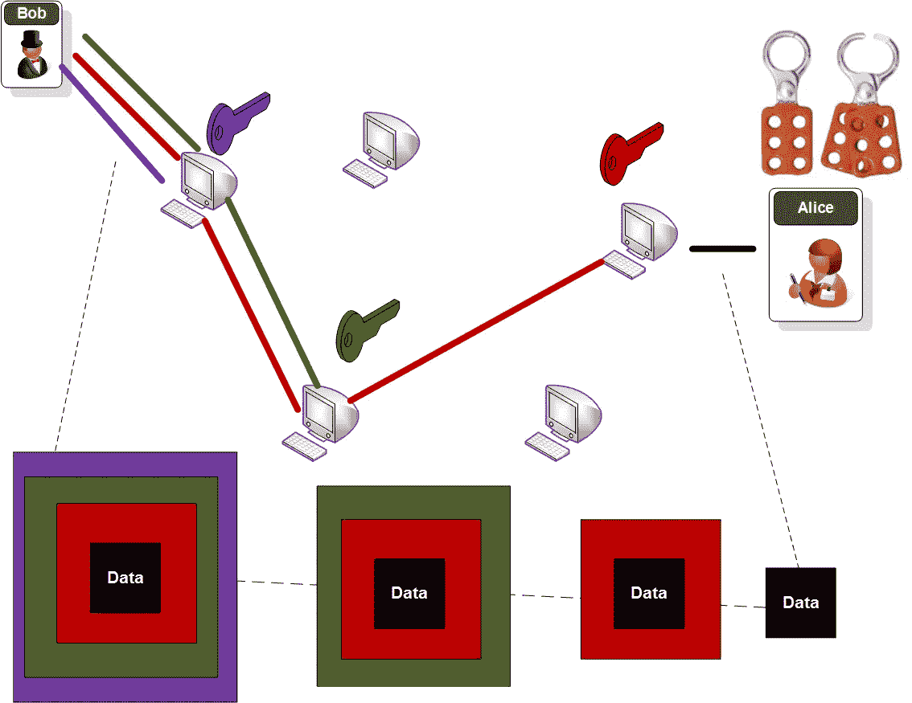

# 调查职权范围

> 原文：<https://medium.com/coinmonks/investigating-tor-d3765bfa4455?source=collection_archive---------6----------------------->

随着我们进入一个信息时代，在互联网上，那些想要跟踪用户活动的人和那些相信匿名的人之间有一场持续的战斗。最近关于“被遗忘权”的辩论表明，在互联网上可以隐藏的东西很少，而删除这些痕迹可能很困难。互联网也是一个犯罪可以通过匿名滋生的地方，所以争论的双方一直处于紧张状态…