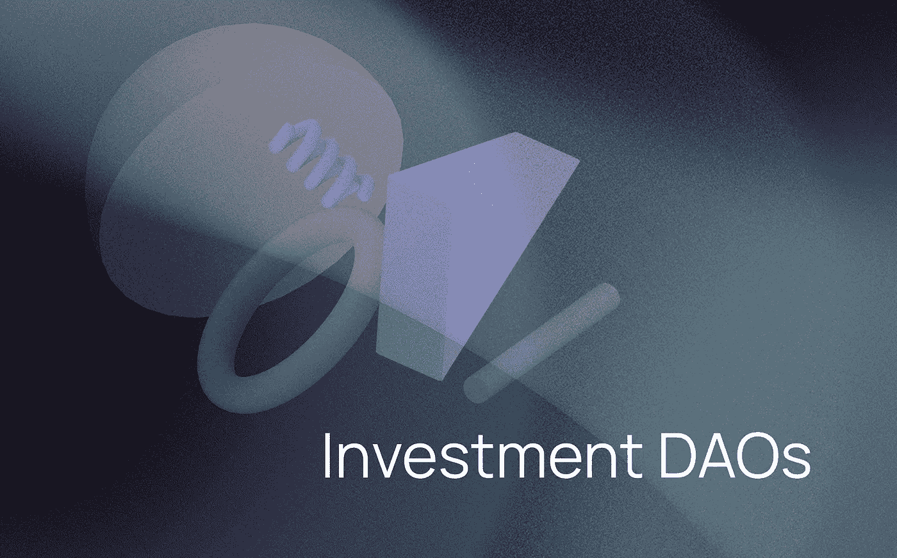

# 投资分散化组织。加入一个还是自己跑刀？

> 原文：<https://medium.com/coinmonks/investment-decentralized-organizations-join-one-or-run-your-own-dao-77fa119335e0?source=collection_archive---------3----------------------->

“道”这个词变得非常流行。就连美国大型风险投资公司红杉资本(Sequoia Capital)也在公司的推特(Twitter)上以 DAO 的身份出现，向分权治理迈出了一步。后来，这一描述被删除，但它仍然表明，道一词可以被传统的投资公司作为其营销的一部分。

## 为什么是刀？

DAO 是一个工具，它为任何实体提供了结合三个重要主题的机会:

1.  集体投资，尤其是加密资产
2.  分权治理
3.  建设一个强大的社区

两个秘密筹集资金、帮助支持者盈利并吸引大量关注的社会倡议的成功案例是 FreeRoss DAO 和 [ConstitutionDAO](https://coinmarketcap.com/currencies/constitutiondao/) 。为社会目的筹集的资金，由加密和治理令牌支持，既受欢迎又有可靠的安全性，正在赢得市场，价格也在上涨。

如果像 ConstitutionDAO 展示的那样，由社区发起的社会倡议可以成为一种有效的赚钱方式，那么由专业人士组织的**投资道可以筹集到更多的资金。**

尽管大型投资公司最近才以 DAO 的形式推出他们的计划，但毫无疑问，像 [BitDAO](https://www.bitdao.io/ru/) 这样由鲸鱼支持的大流动性 Dao 前景广阔。

收藏家道也可以被称为一种投资道。像 [JennyDAO](https://www.coindesk.com/business/2021/05/12/dao-raises-7m-to-acquire-and-fractionalize-nft-collections/) 和 [FlamingoDAO](https://www.coindesk.com/tech/2021/01/23/early-cryptopunk-digital-collectible-sells-for-762k-in-ether/) 这样的项目也看起来有着非常有前途的未来，因为 NFT 是目前加密领域的热门话题。

作为成功和众所周知的投资道的例子，我们可以看看[老挝](https://www.thelao.io/)和[元资本](https://www.metacartel.org/)。这些 Dao 在以太坊区块链上运行，使用治理令牌和智能契约。与此同时，他们在分散式商业模式中加入了法人实体的创建—特拉华州有限责任公司，这使得能够保证其成员的权利，并为任何法律目的提供官方文件支持。这两个组织都成立于 2019 年，像风险投资公司一样投资以太坊区块链的 Dapps。

顺便说一下，这种类型的投资刀，可能被称为一个老，有两个严重的问题。首先，它不是完全分散的，因为它受到特拉华州公司地位的限制。第二，这些 DAO 使用以太坊区块链和 Moloch DAO v2 智能合约，使得交易成本很高，治理程序很难。这就是为什么这种类型的刀适合大量的流动性，但不适合小投资者。另一个问题是相对较低的收益率。

然而，如果你没有数百万美元投资于 DAOs，这并不是世界末日。你可以和你的同事一起组织你自己的刀。此外，DAO 越来越受欢迎，催生了新一代的加密基金，同时减少了行业中欺诈项目的数量。

通过使用 DAO，任何人都可以组织一个小型加密基金并吸引投资者。作为一个小基金，你可以参与分配，投资于 launchpads，并做其他与基金相关的活动。

外卖？你不需要有很多钱，不需要做开发者，甚至不需要有投资分析经验。你可以简单地使用 XDAO 创建你的团队并制作你的 DAO。

> 加入 Coinmonks [电报频道](https://t.me/coincodecap)和 [Youtube 频道](https://www.youtube.com/c/coinmonks/videos)了解加密交易和投资

## 另外，阅读

*   [什么是融资融券交易](https://blog.coincodecap.com/margin-trading) | [成本平均法](https://blog.coincodecap.com/dca)
*   [支持卡审核](https://blog.coincodecap.com/uphold-card-review) | [信任钱包 vs 元掩码](https://blog.coincodecap.com/trust-wallet-vs-metamask)
*   [Exness 回顾](https://blog.coincodecap.com/exness-review)|[moon xbt Vs bit get Vs Bingbon](https://blog.coincodecap.com/bingbon-vs-bitget-vs-moonxbt)
*   [如何开始用加密贷款赚取被动收入](https://blog.coincodecap.com/passive-income-crypto-lending)
*   [BigONE 交易所评论](/coinmonks/bigone-exchange-review-64705d85a1d4) | [电网交易机器人](https://blog.coincodecap.com/grid-trading)
*   [新加坡十大最佳加密交易所](https://blog.coincodecap.com/crypto-exchange-in-singapore) | [购买 AXS](https://blog.coincodecap.com/buy-axs-token)
*   [投资印度的最佳加密软件](https://blog.coincodecap.com/best-crypto-to-invest-in-india-in-2021) | [WazirX P2P](https://blog.coincodecap.com/wazirx-p2p)
*   [7 个最佳零费用加密交易平台](https://blog.coincodecap.com/zero-fee-crypto-exchanges)
*   [最佳网上赌场](https://blog.coincodecap.com/best-online-casinos) | [期货交易机器人](/coinmonks/futures-trading-bots-5a282ccee3f5)
*   [分散交易所](https://blog.coincodecap.com/what-are-decentralized-exchanges) | [比特 FIP](https://blog.coincodecap.com/bitbns-fip) | [宾邦评论](https://blog.coincodecap.com/bingbon-review)