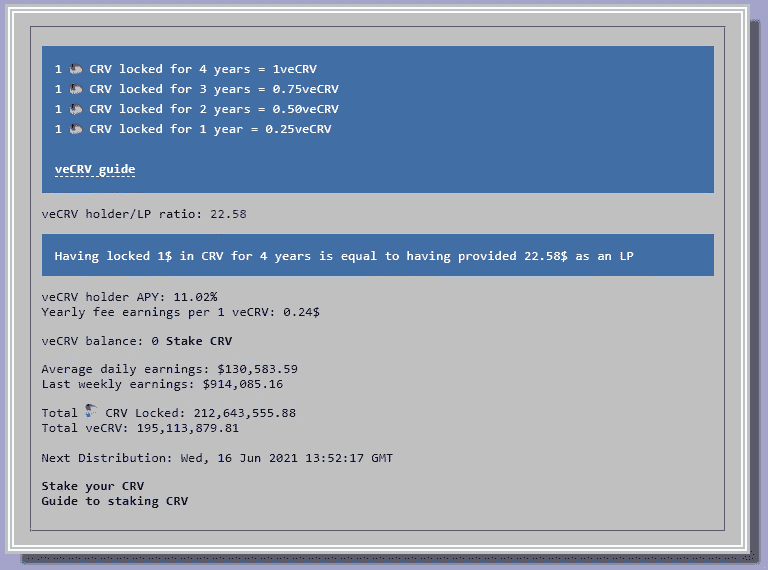
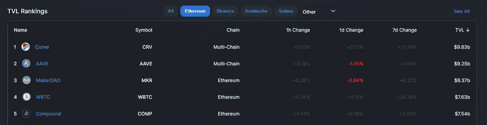
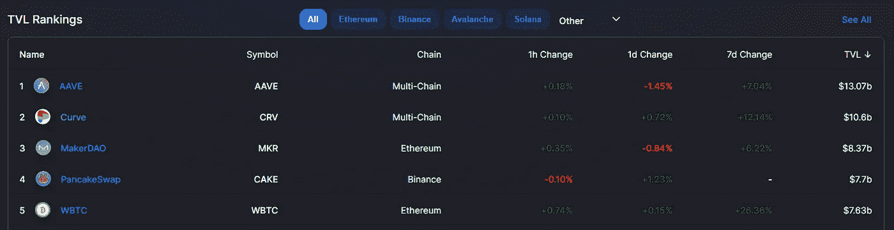
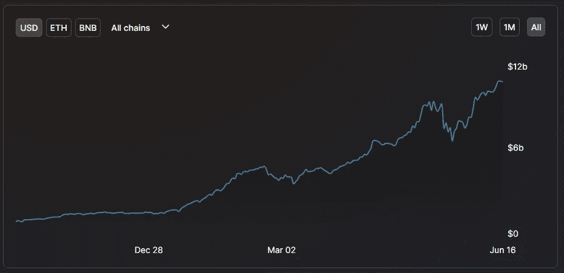
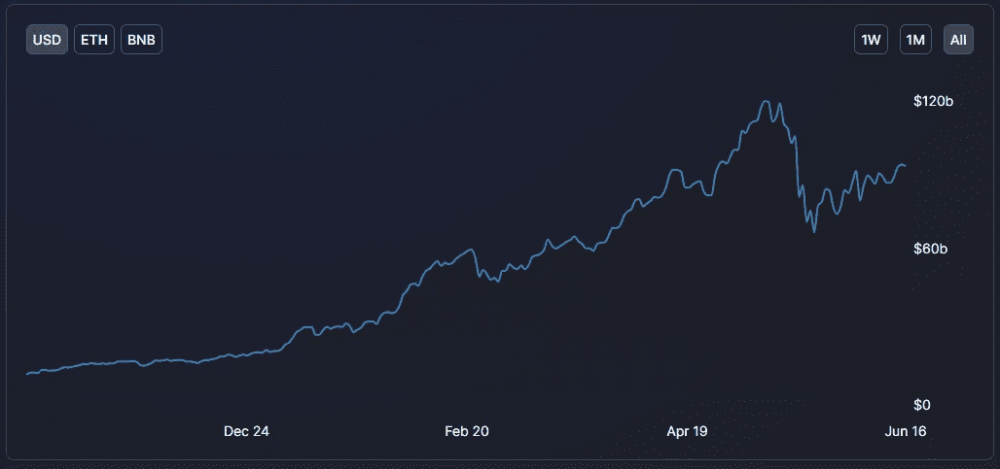
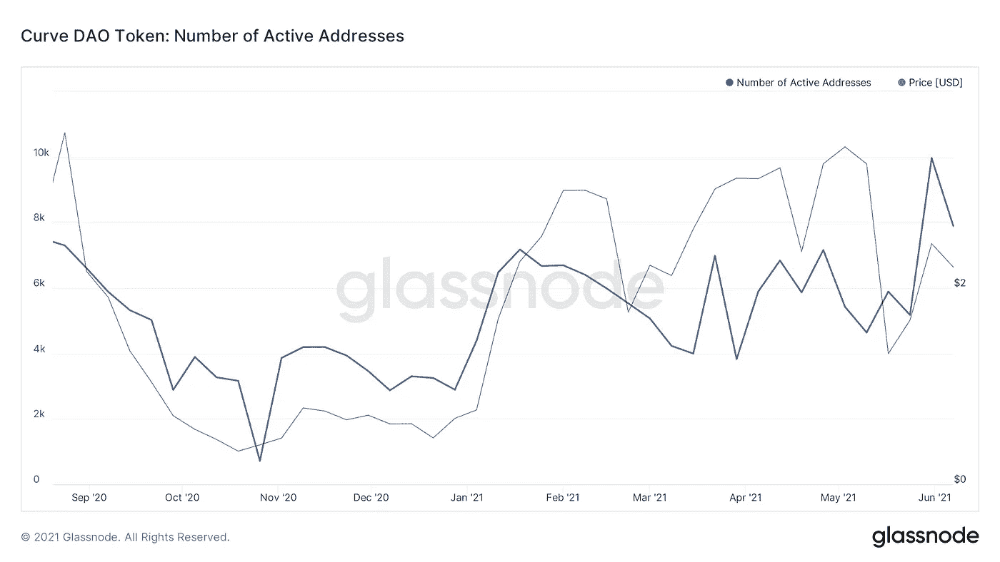
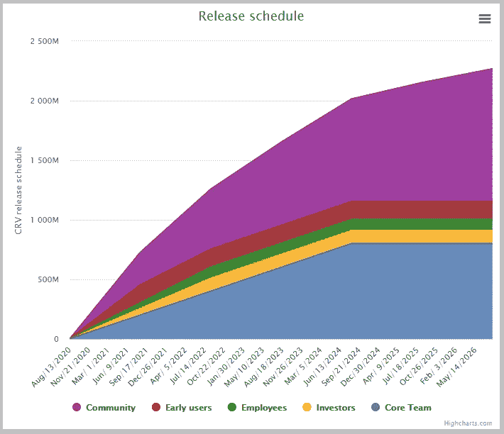
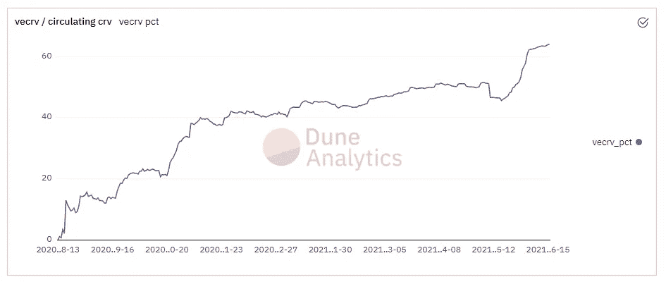
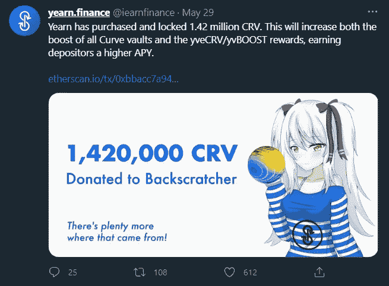

# 投资论文:曲线道令牌(CRV)

> 原文：<https://medium.com/coinmonks/investment-thesis-curve-dao-token-crv-796b68f13eba?source=collection_archive---------1----------------------->

在这篇论文中，我将总结为什么我认为 CRV 是一种被低估的数字资产，值得中长期投资。但是在我们试图评价某样东西之前，我们首先需要知道它是什么…

**什么是曲线金融？**

[Curve Finance](https://curve.fi/) 是一个自动做市商(AMM)，其主要目的是允许用户和/或分散协议以全行业最低的滑点和费用交换稳定的合约。今年迄今为止，Curve 在生态系统内的所有指数中排名第三(354 亿美元)，仅 2021 年 5 月就有近 100 亿美元。Curve 的年交易额仅次于 Uniswap 的 2365 亿美元和 SushiSwap 的 780 亿美元。可以有把握地认为，Curve 已经巩固了自己作为顶级 DeFi 协议的地位，符合基本的市场需求，因为产品的需求说明了一切(请原谅我拙劣的书呆子式幽默)。

**工作原理**

对于任何引导他们操作的指数来说，他们首先需要的是大量的流动性。为了实现这一点，需要为流动性提供者提供某种形式的激励。Curve 正是通过发行 Curve DAO token (CRV)做到了这一点。为 Curve 提供流动性的参与者以 CRV 排放量的形式获得回报，并从平台上累积的交易费用中获得平均分成。由于 Curve 还允许某些 DeFi 贷款/借款协议进入其流动性池，Curve 上的流动性提供者也从这些合同操作中赚取利息。由于 Curve 支持的大多数池都是基于稳定硬币的，因此与 Uniswap 之类的池相比，非永久性损失的风险最小，也更安全。这使得 Curve 成为有限合伙人存放资金的一个有吸引力的地方。

**CRV 用例**

如上所述，CRV 的主要功能之一是激励用户通过其自身的排放为曲线协议提供流动性。没有这种流动性，Curve 提供的低滑点/费用是不可能的。曲线平台不仅是一个自动化的做市商，它还是一个去中心化的自治组织(DAO)。用户可以将他们的 CRV 锁入托管(在预定的时间内)。如果他们选择这样做，他们将得到一个象征性的 CRV 版本作为回报:veCRV。这简单地翻译为“投票托管的 CRV”。但是 1CRV≠1veCRV，这个比率实际上是由用户选择锁定其 CRV 的持续时间得出的。为了获得最大数量的 veCRV，CRV 将需要被锁定 4 年。请参见下面截图中的明细:

veCRV 允许其持有者参与三种不同的激励性活动，而非 veCRV 持有者则被禁止参与这些活动。其中包括参与 Curve 的去中心化治理(投一票或创建一个提案)，赚取协议交易费，提高赌注奖励(一直到 2.5 倍)。

**关于连锁数据和有机增长**

既然我们已经对 CRV 是什么、它的用例以及它如何在曲线协议上起作用有了基本的概述，那么让我们深入到一些看好链度量的基本回顾中。

在撰写本文时，Curve 正在经历指数级增长，其平台上的智能合同锁定了数字资产(以美元计)。事实上，仅在过去三周，Curve 当前 TVL 的 40%已经被存入。这不是因为资产价格上涨，而是因为 Curve 获得了市场份额。

**TVL(总价值锁定)***【106 亿美元(截至 21 年 6 月 15 日)*

Curve 最近以 98.3 亿美元在所有基于 ETH 的 DeFi 平台中占据了最大价值，超过了 Aave。当考虑到我们生活的多链世界时，Curve 以前面提到的 106 亿美元轻松位居第二。

ETH based DeFi TVL (as of 6/15/2021)

Multichain DeFi TVL (as of 6/15/2021)

在下面的图表中，你可以看到曲线的 TVL 在九天内下跌了 30%(从 5/14 到 5/23)。这主要是由于比特币价格暴跌，不仅拖累了其他数字资产价格，也吓退了 DeFi 参与者，导致流动性全面减少。然而，自 5 月 23 日以来，曲线 TVL 已经从低点飙升了 64%，并继续创造新的历史高点。

Curve’s TYL Oct 2020 — June 2021

下图展示了与上述相同的场景，但不是针对宏观 DeFi 景观。如你所见，Curve 的表现明显优于其他市场，而综合 TVL 指数尚未收复 5 月份的高点。

Total DeFi TYL Oct 2020 — June 2021

另一个需要密切关注的增长指标是 CRV 的活动地址数量。这一指标最近也创下了历史新高，在 5 月 31 日那一周达到了 10，000 个地址。

这些类型的基本、连锁数据点不仅实时显示网络效应，而且通常会导致相应资产的价格上涨。

**记号组学**

CRV 2020 年 8 月 13 日正式上线，流通供应量 0。这意味着团队/投资者没有 CRV 的“预开采”。CRV 最大供应量将达到 30.3 亿。直到 2026 年 8 月，最终的 CRV 代币才能进入流通领域。总令牌供应将按如下方式分配:

*   *62%给社区流动性提供者*
*   *30%给股东(团队和投资者), 2-4 年授权*
*   *3%给有 2 年授权的员工*
*   *社区储备金的 5%*

CRV 可能有一个最可持续的，被误解和低估的象征性结构。其核心是恶性通胀，但内部和外部的通缩压力正在对 CRV 代币供应造成供应冲击。由于这种独特的令牌结构，Curve 能够为利益相关者和流动性提供者带来持续和丰厚的收益，同时也极大地限制了非永久性损失风险。这些激励是他们在如此短的时间内获得如此多流动性的驱动力。

如前所述，为了在 CRV 上获得最大的提升，用户需要锁定他们的 CRV 4 年。这正是正在发生的事情。2.12 亿 CRV 的平均锁定时间目前为 3.67 年。将 CRV 转化为 veCRV 的过程是不可逆转的，这意味着 2 . 12 亿 CRV 人中的大部分在近 4 年内是不可触及的。CRV 被锁定的速度也没有减缓，而是加快了。那么，是什么推动了这一点呢？好吧，让我们揭开一些人所谓的“曲线战争”的神秘面纱，以及为什么它会让 CRV 持有者受益匪浅。

**弯道大战**

Convex Finance 是 DeFi 环内的最新竞争者，通过在 TVL 捕获超过 37 亿美元的资金而崭露头角，同时还通过 max boost 锁定了超过 3600 万 CRV。Convex 是一个金钱乐高协议，旨在为 CRV 持有者和流动性提供者提供更多激励，以获得已经丰厚的 CRV 赌注回报。用户可以将他们的 CRV 换成 Convex 的令牌化版本的 CRV (CVXCRV ),并在 Convex 上下注，以获得> 100%的 APR，而不是在 Curve 平台上锁定 CRV。同样，这对于希望在 CRV 下注以获得 max boost 的 CRV 持有者来说，也是相当诱人的，而不必锁定他们的令牌 4 年。由于用户希望最大化他们的 CRV 赌注收益，这导致 CRV 被锁定的数量像曲棍球棒一样增长。反过来，veCRV 现在占 CRV 目前流通供应量的 64%。简而言之，CRV 的大部分流通供应都不能在市场上出售——它们被封存了 3-4 年。

那么，为什么人们称之为曲线战争呢？嗯，渴望金融(DeFi 收益率发电机之王)已经公开购买了大量的 CRV，并将其锁定为 veCRV。随着 Convex 的推出，渴望增加了他们对 CRV 的购买，以便将他们自己存入 Convex 的平台。

在我看来，“曲线战争”是一个不恰当的命名惯例。我理解为什么有些人把渴望和凸视为直接对手，争夺 TVL 和 veCRV。但归根结底，这两个项目都主要是为了支持 CRV 令牌和提高用户收益而存在的。我们可以确定的是，越来越多的 CRV 代币被长期封存，而对 CRV 的需求却在持续增加。

**结论**

曲线平台是稳定交易、低滑点和最小非永久性损失风险的强大而有用的工具。他们的本地令牌，CRV，服务于重要的用例，具有强大的链增长指标的基本面，采用独特的令牌组学，并有一个迫在眉睫的供应危机。出于上述所有原因，加上 CRV 目前的市值只有 7.1 亿美元(每 CRV 2.09 美元)——我敢打赌，CRV 被合理低估了。在我个人看来，CRV 应该在 marketcap 的五大 DeFi 项目中占有一席之地。为了实现这一目标，它需要相对于当前市值升值 500%。

**来源:**

 [## DefiLlama - DeFi 仪表板

### DeFi(分散财务)协议的等级和度量。

defillama.com](https://defillama.com/home)  [## 链上玻璃节点市场智能

### Glassnode 让每个人都可以访问区块链数据。我们收集并仔细分析链上数据，以提供…

glassnode.com](https://glassnode.com/)  [## 曲线. fi

### Curve 是以太坊上的一个交易所流动性池，旨在:极其高效稳定的货币交易，低风险…

曲线. fi](https://curve.fi/)  [## 仪表板

### 仪表板和查询？借助 Dune Analytics，任何人都可以免费对区块链数据创建 SQL 查询。结果是…

duneanalytics.com](https://duneanalytics.com/browse/dashboards) 

> 加入 [Coinmonks 电报频道](https://t.me/coincodecap)，了解加密交易和投资

## 另外，阅读

*   [什么是融资融券交易](https://blog.coincodecap.com/margin-trading) | [成本平均法](https://blog.coincodecap.com/dca)
*   [网格交易机器人](https://blog.coincodecap.com/grid-trading) | [印度的加密交易所](/coinmonks/bitcoin-exchange-in-india-7f1fe79715c9)
*   最好的[加密税务软件](/coinmonks/best-crypto-tax-tool-for-my-money-72d4b430816b) | [期货交易机器人](/coinmonks/futures-trading-bots-5a282ccee3f5)
*   最佳[加密借贷平台](/coinmonks/top-5-crypto-lending-platforms-in-2020-that-you-need-to-know-a1b675cec3fa) | [杠杆代币](/coinmonks/leveraged-token-3f5257808b22)
*   最佳[加密制图工具](/coinmonks/what-are-the-best-charting-platforms-for-cryptocurrency-trading-85aade584d80) | [最佳加密交易所](/coinmonks/crypto-exchange-dd2f9d6f3769)
*   [如何在印度购买比特币？](/coinmonks/buy-bitcoin-in-india-feb50ddfef94) | [比特币储蓄账户](/coinmonks/bitcoin-savings-account-e65b13f92451)
*   [CryptoHopper 替代品](/coinmonks/cryptohopper-alternatives-d67287b16d27) | [加密货币储蓄账户](https://blog.coincodecap.com/cryptocurrency-savings-accounts)