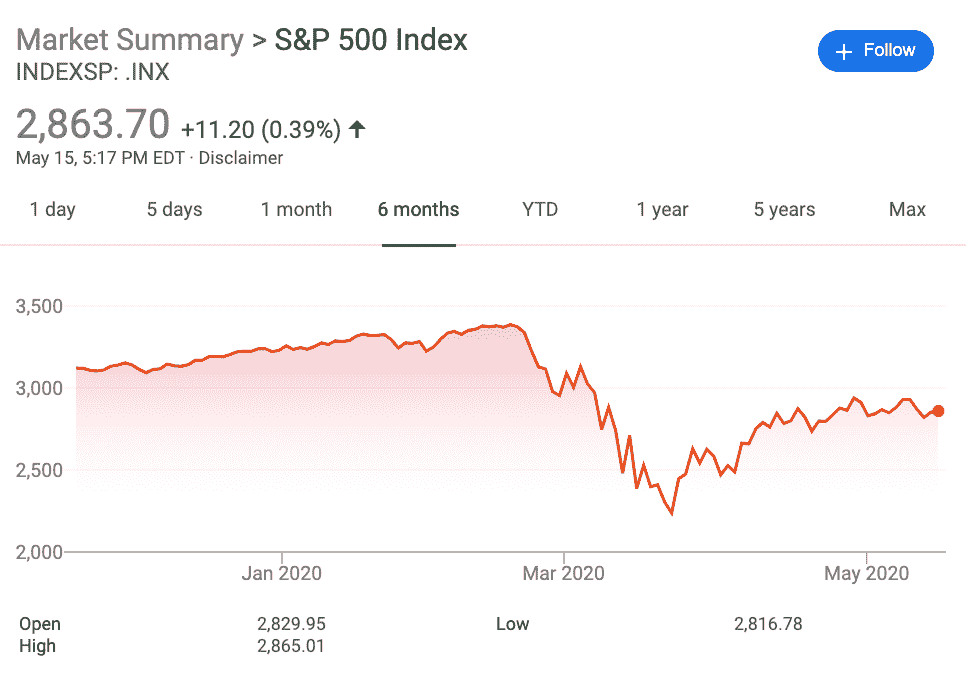
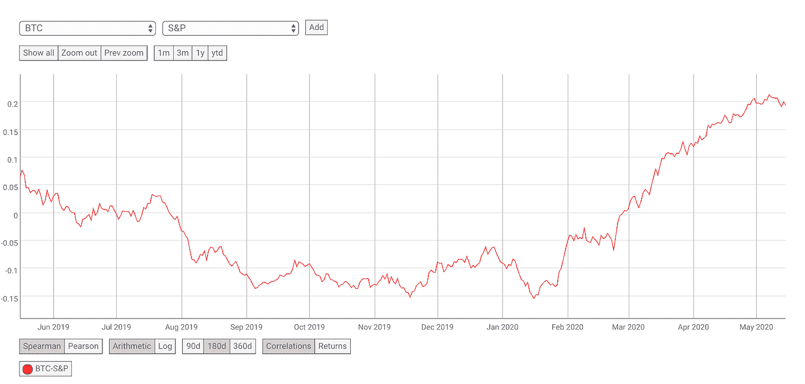
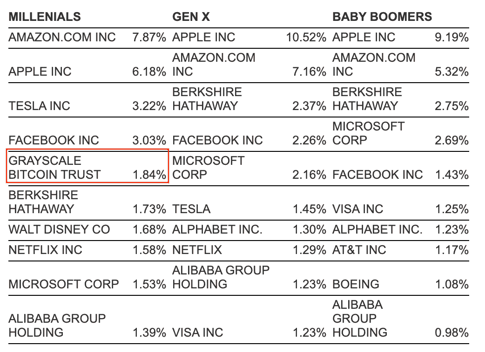
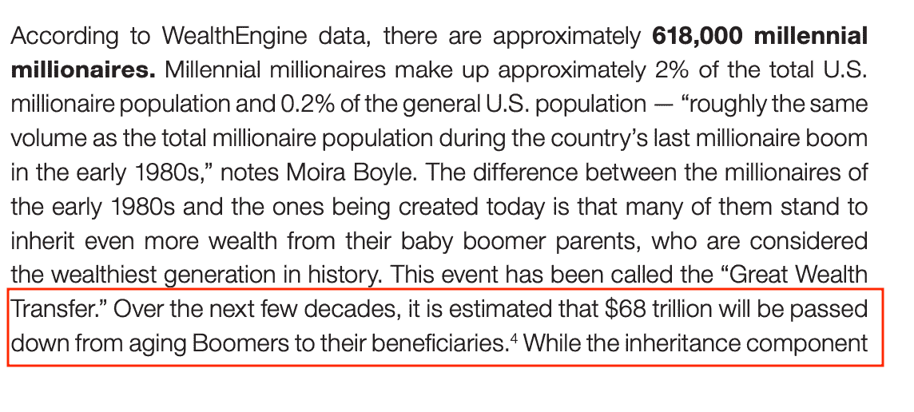
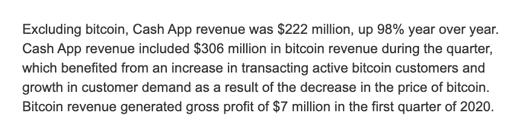
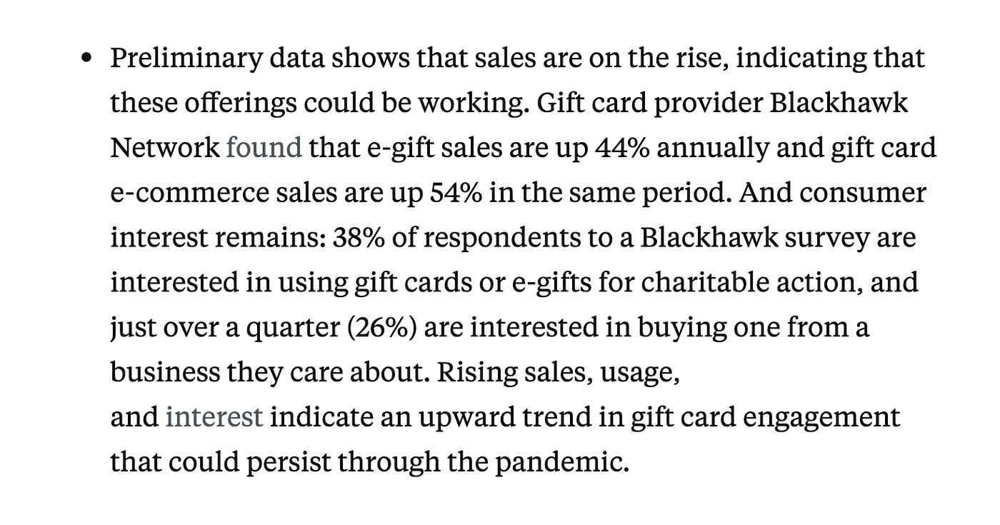

# 比特币和 Fold 的投资主题

> 原文：<https://medium.com/coinmonks/investment-thesis-for-bitcoin-and-fold-2aa5c84a631?source=collection_archive---------0----------------------->

## 你会如何投资 100 万美元？选择 1 项加密资产和 1 家公司。

*   加密资产:60 万比特币。
*   公司:折上 40 万美元。

# 比特币的案例

关于比特币的价值主张，人们已经写了很多，包括它的股票流量比、它作为数字黄金的属性以及它作为互联网数字货币的实用性。然而，目前有三个趋势表明，比特币将在未来 5-10 年内大幅增长:

1.  全球经济状况
2.  比特币是千禧一代的投资
3.  零售市场中尚未开发的那一半

## 1.全球经济状况

在过去的 6 个月里，世界见证了前所未有的经济政策的实施，以解决由 COVID19 促成的全球经济危机:

*   欧洲实行负利率以鼓励消费
*   美国通过发行新国债筹集了 2 万亿美元的刺激计划资金
*   美国美联储的基金利率目标为 0%至 0.25%

最重要的是，这些前所未有的政策在不确定时期引发了恐惧。自 2008 年以来最大的一次股市崩盘加剧了这种情况，截至 2020 年 5 月 14 日，超过 3600 万人申请失业救济，整体经济看起来不会在近期内有所改善。

随着越来越多的人担心关闭非必要业务不确定时间的经济影响，通过非相关资产寻求稳定从未如此之大。符合这一类别的两种资产是黄金和比特币。但正如我们将在文章后面看到的，比特币是千禧一代正在购买的投资。

*Bitcoin’s correlation chart to the S&P500 taken from* [*CoinMetrics.io*](https://coinmetrics.io/correlation-charts/#assets=btc-s&p)*.*

过去一年，比特币的系数在 0.2 到-0.15 之间，与标准普尔 500 指数(S &)的相关性相对较低(T3)。

如果说比特币 12 年的数字黄金叙事有机会获得回报，那就是现在。

随着 COVID19 启动全球经济的历史性转变，未来十年的主导叙事将围绕货币和经济政策，而其他一切都将退居幕后。因此，随着世界范围内对可靠货币的搜寻开始，比特币作为一种不相关、抗审查和中立的资产，将成为国家和文化对话的话题。

其他加密货币不存在同样的机会，这些货币通常可以归入智能合约、单一用途硬币和隐私，因为它们都没有比特币那样好的价值和金钱存储。

## 2.比特币是千禧一代的投资

2019 年 12 月 4 日，查尔斯·施瓦布发布了一份报告，显示灰度比特币信托是千禧一代自我导向的 401(k)计划中的五大投资之一

[https://pressroom.aboutschwab.com/press-release/schwab-corporate-retirement-services-news/schwab-report-self-directed-401k-balances-ho](https://pressroom.aboutschwab.com/press-release/schwab-corporate-retirement-services-news/schwab-report-self-directed-401k-balances-ho)

另一个需要考虑的因素是，Coldwell Banker and Global Luxury 估计，68 万亿美元将作为受益人从美国历史上最富有的一代人那里传承下来。

[https://blog.coldwellbankerluxury.com/wp-content/uploads/2019/10/CBGL-Millennial-Report_SEP19_FINAL-4a.1-1-1.pdf](https://blog.coldwellbankerluxury.com/wp-content/uploads/2019/10/CBGL-Millennial-Report_SEP19_FINAL-4a.1-1-1.pdf)

如果千禧年倾向于将比特币作为投资的趋势继续下去，那么预计数万亿继承财富中的很大一部分将被分配给比特币。

*P.S .【大声喊出来】以*[菲尔·博内洛](https://twitter.com/PhilJBonello) *为题发表了他的伟大文章。你可以阅读更多关于* [*他的子栈*](https://philjbonello.substack.com/p/the-many-angles-of-bitcoin-adoption) *。*

## 3.零售市场中尚未开发的那一半

过去几年，比特币主要通过 GBTC 的形式被引入传统金融领域。比特币也通过富达(Fidelity)等久负盛名的金融公司提供。然而，通过 neobank 公司，零售和经纪业务方面的比特币需求正在超过他们。

让我们比较一下 GBTC 和像 CashApp 这样专注于零售的 neobank 应用程序的容量。

根据雅虎财经的数据，2020 年的 Q1，GBTC 在 90 天内的日交易额总计为 3.245 亿美元。这大约是 Q1 2019 年报告的 1.156 亿美元的三倍。现在，让我们将这些数字与 CashApp 进行比较，cash app 的目标人群是几乎没有投资经验的人。

仅在 2020 年的前 3 个月，CashApp 超过 50%的收入来自总额为 3.06 亿美元的比特币订单。这个数量是 2019 年 Q1 收入广场报道的[6500 万美元](https://blockonomi.com/square-cash-app-bitcoin-revenue-hits-65-million/)的四倍半以上。

[https://sec.report/Document/0001193125-20-134892/](https://sec.report/Document/0001193125-20-134892/)

这些数字表明，通过以零售为重点的金融科技应用对比特币的需求增长超过了传统的股票市场平台。这是一个强烈的信号，表明人们将为简单的比特币购买体验支付高额溢价。当我们考虑到 [47%的美国人口](https://finance.yahoo.com/news/more-40-americans-aren-t-090000530.html)尚未进行任何形式的投资时，比特币在零售市场的应用仍有充足的机会。

## 未来 10 年

根据上面提到的三个趋势，我们看到比特币作为数字价值储存手段的角色正通过最近的全球经济政策变得合法化。我们看到一种趋势，即比特币是千禧一代中一种受欢迎的投资，他们将从父母那里继承大量财富。最后，我们看到零售市场对比特币的强劲需求，这比经营一家交易所要有利可图得多。所以问题是:我们投资哪家公司来利用这一趋势？

一个答案是投资一家经纪公司。然而，这个领域竞争非常激烈。不仅有比特币基地、Gemini 和 CashApp，过去一年还推出了其他纯比特币初创公司，如 River Financial 和 Swan Bitcoin。

那么我们如何以不同的方式渗透零售市场呢？肯定有另一种途径来利用他们为比特币支付溢价的意愿。答案是折叠。

# 折叠

Fold 是一款比特币奖励应用，允许用户购买礼品卡，并获得比特币返现。这个系统的美妙之处在于，它完全消除了去比特币基地这样的交易所购买比特币的体验。他们没有强迫自己踏上一段完全陌生的旅程，而是将赚取比特币融入到自己熟悉的行为中。

在这个世界里，没有费用模板，没有价差，也没有价格图表。这对于从未做过投资的人来说再合适不过了。此外，他们花的 100 美元还给他们 100 美元外加一些比特币。这种获得购买的全部价值以及奖励的感觉对于消费者的心理非常重要，因为它大大降低了购买的障碍。将这种体验与购买比特币并为 100 美元的购买支付高达 2.00 美元的费用进行比较。

这就是为什么 Fold 准备进入从未投资过比特币的大众消费者市场，同时为他们提供投资比特币的机会。

## 市场

他们追求的礼品卡市场是相当大的。2017 年，全球估计有 3150 亿美元，预计到 2026 年将增长到 7500 亿美元。Fold 相对于其他礼品卡零售商的一个重要竞争优势是，他们能够通过不可逆的比特币购买来减少欺诈，从而防止退款。大约 1-4%的购物卡购买是欺诈性的，仅在美国，2019 年就导致[9.5 亿美元](https://www.researchandmarkets.com/reports/4898047/digital-gift-cards-u-s-market-2019)的损失。这使得 Fold 拥有更高效的业务，并利用更多资本实现增长。

需要注意的一点是，7500 亿美元的估计值是在 COVID19 之前建模的。然而，初步数据表明，鉴于疫情，礼品卡行业实际上有所增长。

[https://www.businessinsider.com/coronavirus-could-change-us-gift-card-landscape-2020-4](https://www.businessinsider.com/coronavirus-could-change-us-gift-card-landscape-2020-4)

## 公司

该公司由威尔·里维斯和马特·朗格领导。一年之内，他们在[获得了超过 30 万个月会话](https://twitter.com/wlrvs/status/1257750697019228166)，并推出了 Visa 奖励卡，每次购买都可以获得比特币。这将使赚取比特币对消费者来说更加顺畅。他们还从 Craft Ventures、Slow 和 CoinShares 等知名投资者那里筹集了 250 万美元的种子资金。

他们目前服务于美国市场，但也能在其他国家提供精选的礼品卡，如墨西哥、加拿大和爱尔兰。他们的目标是下一步扩展到英国和欧盟。

Fold 也有很棒的品牌。它有趣、明亮，对千禧一代和 z 世代来说都非常容易理解。这给了他们创造性的自由去尝试一些病毒式和幽默的营销活动。这也让他们有更多的机会与有影响力的人合作，正如我们已经看到的 DJ Kam。

这是其他交易所或者券商做不到的。在为投资提供金融服务的同时拥有有趣的大众市场吸引力是相互正交的。但 Fold 有能力创建一个类似于 CashApp 的富有表现力的品牌。另一个例子是他们最近增加的“旋转轮子”功能，通过购买礼品卡提供额外的 satoshis 来刺激销量。

## 最终游戏

如果 Fold 到 2026 年仅占据预计 7500 亿美元礼品卡市场的 5%，它将处理超过 37.5 亿美元的交易。假设利润率为 5%，收入为 1.875 亿美元。这本身将使 Fold 成为一项有价值的投资。在第一年内，Fold 的发展势头良好，已经处理了数百万美元的交易。

然而，我也预计 Fold 会如此具有破坏性，以至于在未来 10 年内，他们会收到来自三个潜在来源的几笔 M&A 交易:礼品卡供应商、Visa 或加密货币交易所。

## M&A 机遇

**购物卡商家**

传统礼品卡企业可能会看到自己的市场份额被 Fold 夺走，不得不做出决定，要么增加比特币功能，要么收购它们。我相信不收购 Fold 的机会成本会太高。其中包括:

*   成功实施需要 1-2 年的测试
*   市场份额的持续损失
*   失败的风险和无法适当保护比特币基础设施的风险
*   他们目前的客户对比特币不感兴趣

**签证**

另一家准备收购 Fold 的公司是 Visa，因为它能够向 B2B 客户提供比特币奖励，特别是考虑到比特币支付有助于减少欺诈。事实上，Fold 之所以能够提供他们自己的借记卡，是因为他们正在试行一个项目。

**加密货币交易所**

但最有意义的收购是加密货币交易。这里有一个例子。比特币基地以 1 亿美元收购了 earn.com。其理由是首先获得人才(Balaji ),但也用它来推出一个教育平台，因为假设加密货币很难理解，因此新来者希望在投资前接受教育。他们的商业模式是与基金会和加密货币公司合作，他们将支付和资助这项新举措。

然而，这是非常短视的。比特币基地能上市的加密货币只有这么多，它们有资本支付自己的 Earn 计划。它也在重新吸引同样的投资者群体，而不是接触新的人群。

对于加密货币交易所来说，收购 Fold 以实现其漏斗顶端战略更有意义:

1.  它产生收入，因此降低 CPA
2.  它渗透到对投资不感兴趣的人群中
3.  它通过让他们接触比特币，将他们转化为投资者

用户旅程将如下所示:

1.  用户听说折叠赚取比特币返现
2.  用户已经购买了礼品卡，并认为他们不妨尝试折叠以获得额外奖励
3.  用户通过购买礼品卡赚取比特币
4.  随着比特币价格的上涨，用户看到他们的 satoshis 的价值波动
5.  用户单击知识库文章了解原因
6.  用户点击文章中的 CTA，将其转换为投资者和加密货币交易所用户

随着 earn.com 将基准设定为 1 亿美元，Fold 很有可能以更高的估值被收购，以填补北海巨妖、双子星或 Bittrex 等交易所的类似角色。

# 常见问题解答

***为什么分配 60 万美元给比特币，40 万美元给 Fold？***

鉴于“最后阶段”一节中概述的机会，我认为在种子阶段投资 400，000 美元是合适的。剩下的分配给比特币。

***下一个十年内，有没有另一种加密货币跑赢比特币的可能性？***

是的。总有可能，但可能性不大。正如我之前所讨论的，加密货币通常可以分为智能合约、单一用途硬币和隐私。这三者都是通过液体进入比特币的。但即使没有流动性，这些加密货币也必须克服重大挑战。

例如，智能合约区块链将最有可能在一个过饱和的市场中互相蚕食。单一用途的硬币可以解决越来越快的许可区块链或中央数据库。隐私硬币有很大的价值，但当涉及到监管时，会打一场巨大的硬仗，随着政府对 COVID19 采取更多紧急措施，情况只会变得更糟。

***Fold 的首要竞争对手是谁？***

Fold 的主要竞争对手是 Lolli。然而，Fold 的与众不同之处在于它提供了一种 Visa 借记卡，这是一种易于使用的手机应用程序，可以在旅途中进行购物，同时还提供隐私保护。通过购买礼品卡，您不会向您购买的公司透露任何财务数据。

S/O 给[区块链资本](https://medium.com/u/9737c5ab2ab1?source=post_page-----2aa5c84a631--------------------------------)的提示和启发。

交给[斯蒂芬·科尔](https://medium.com/u/885fdf0b1d7f?source=post_page-----2aa5c84a631--------------------------------)审阅。

> [在您的收件箱中直接获得最佳软件交易](https://coincodecap.com/?utm_source=coinmonks)

