# 2020 年加密投资者指南

> 原文：<https://medium.com/coinmonks/investors-guide-to-crypto-72f8f9da2b77?source=collection_archive---------0----------------------->

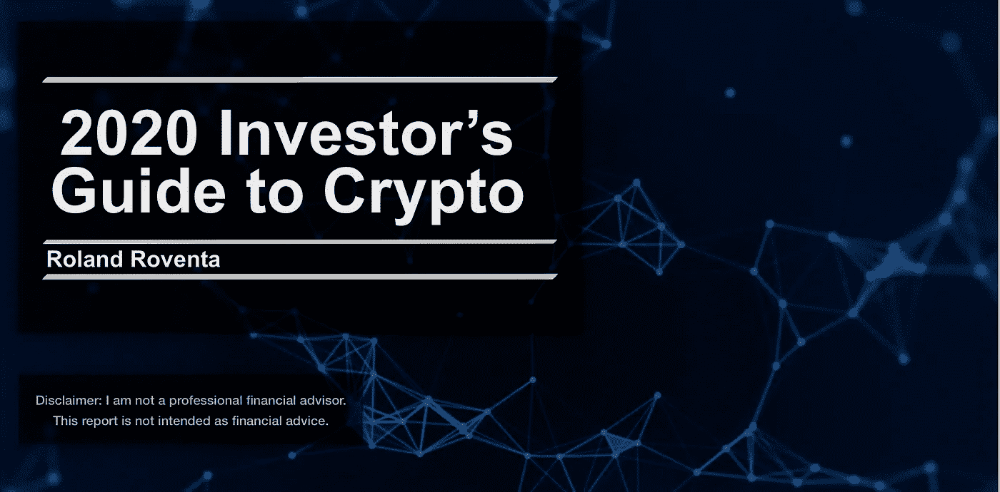

## 了解加密货币在不断发展的全球金融生态系统中日益增长的重要性

本指南旨在为投资者提供关于比特币和加密资产的重要信息。随着我们从流动性时代走向多元化时代，作为一种反通胀资产，加密资产在现代投资者的投资组合中变得至关重要。尤其是在最近的 QE 紧急措施期间，这些措施迟早会导致通货膨胀。

## 泰勒:博士

机构对加密资产的需求来自客户方。加密资产正在成为一种趋势，这使得大型投资者也加入到这股潮流中来，从阿尔法世代和多样化中获益。

回溯测试业绩在过去 6 年中，与没有加密资产的投资组合相比，全球 60/40 + 5%加密资产的投资组合将受益于 95%的夏普比率改善和 215%的累计回报增长。

专业加密对冲基金越来越受欢迎，其特点是年同比波动幅度很大，从-60%到+2，278%。投资者面临着一个艰难的选择:增加美元，还是积累 BTC。

## 目录:

*   一种新的资产类别:加密资产
*   多元化时代
*   数字稀缺
*   黄金 2.0
*   加密基金概述
*   秘密对冲基金
*   加密对冲基金业绩
*   案例研究:多链资本
*   投资者关键决定因素
*   获得美元与积累 BTC

# 一种新的资产类别:加密资产

区块链技术于 2009 年公开推出，作为中本聪对中央银行系统缺乏信任和透明度的回应。区块链通过允许去中心化、透明和不可变的交易，将这种信任带回给人们。当时，比特币是唯一的加密资产，而今天有超过 2500 种加密资产，分为以下几类:货币、公用令牌、安全令牌、加密商品和稳定硬币。

随着机构投资者越来越多的参与，加密资产作为一种新的资产类别，在 2017 年开始受到关注。被称为数字黄金的比特币正在经历缓慢而稳定的制度化，如图 1 所示:

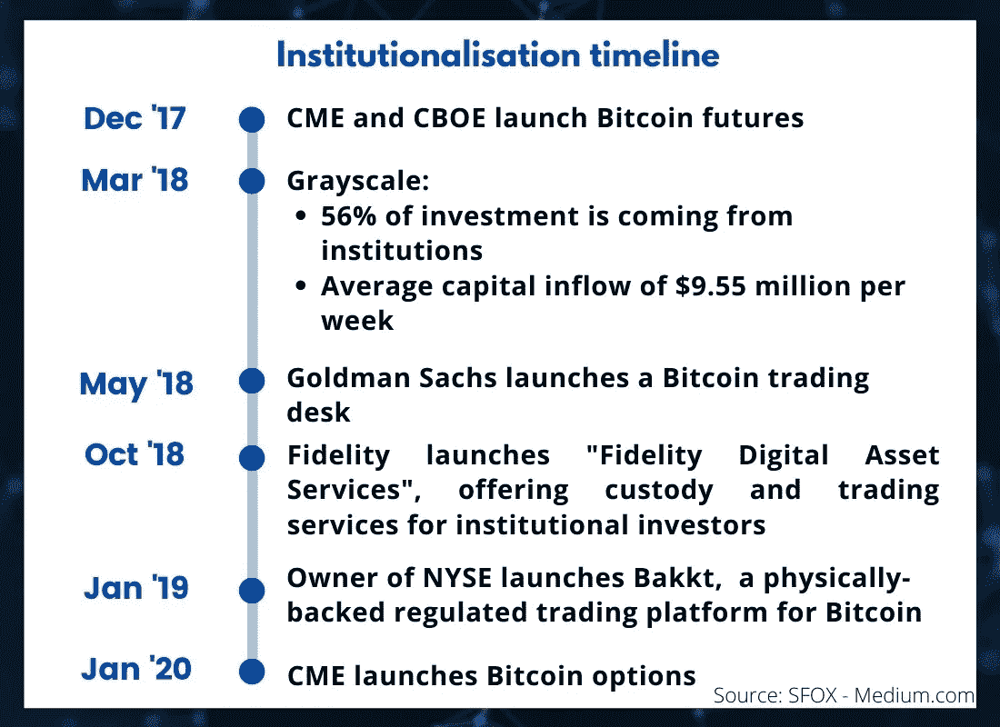

Figure 1: Bitcoin becoming a new asset class [1]

比特币已被证明是十年来世界上表现最好的资产，在 2010 年代增长了 9，000，000%。尽管这种飞速增长，加密资产只是世界货币和市场的一小部分，如图 2 所示。区块链技术越来越多地在更多行业实施，包括医疗保健、供应链、银行和金融服务。该技术正在采用曲线上移动，从早期采用阶段到早期多数阶段。

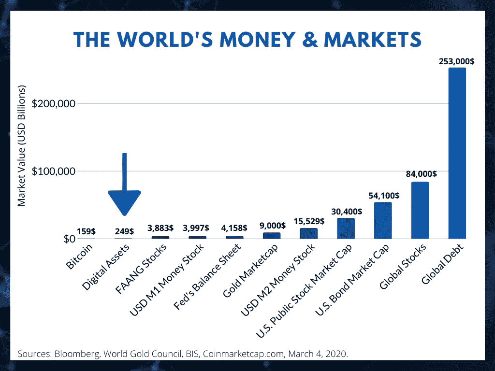

Figure 2: Digital Assets Into Perspective

## 多元化时代

根据美国银行的说法，本世纪 20 年代将是一个多元化的时代，不同于之前 2010 年的流动性时代。流动性时代是由央行创造的，自雷曼兄弟破产以来，央行降息超过 799 次，并购买了超过 12 万亿美元的金融资产。这创造了一个“流动性超新星”，引发了历史上持续时间最长、几乎是最大的股票牛市。美联储制造了一个流动性陷阱，如果停止量化宽松，就有陷入衰退的风险。随着 QE 的继续，泡沫将继续增长。这种低通胀环境有利于美国股市，但不利于大宗商品和其它反通胀资产。美国银行估计，流动性时代将再持续 3-6 个月，之后我们将看到价格见顶，由于全球负利率，通胀将开始上升。从这一点来看，多元化时代将开始，反通胀资产将超越今天的 QE 赢家[2]。

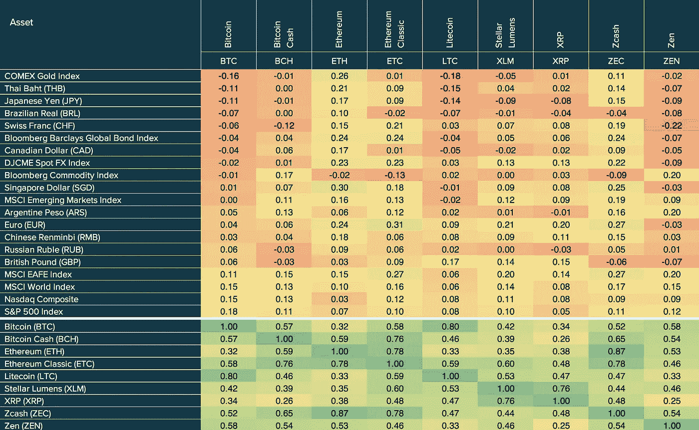

Figure 3: Correlation Matrix September 25, 2013 — August 13, 2019 [3]

作为一种反通胀资产类别，加密资产可能是机构投资者实现未来业绩目标、同时降低投资组合风险所需要的。

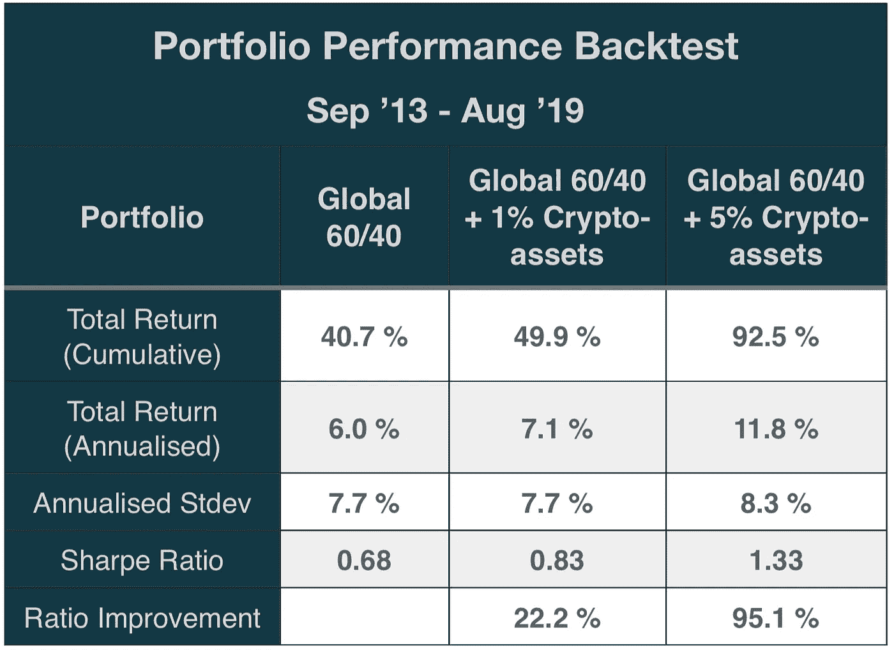

Figure 4: Crypto-Assets in a Traditional Portfolio [3]

已经证明它们与任何其他资产类别都不相关，而且它们之间也不完全相关，如图 3 所示。由于多样化，在传统投资组合中包含加密资产降低了投资组合的总体风险。在过去的六年里，少量的加密资产帮助传统投资者提高了业绩，如图 4 所示。随着加密资产的加入，总回报和夏普比率显著增加。

## 数字稀缺

比特币被硬编码为每 210，000 个区块减少一半的区块奖励，这种现象被称为减半。区块奖励是 PoW 共识的一部分，是矿工成功开采一块比特币时获得的比特币数量。目前的区块奖励是 12.5 比特币，2020 年 5 月将减少到 6.25 比特币。在 2100 万比特币的最大供应量被开采出来之前，比特币将会减少一半，其中 1820 万已经被开采出来。

采矿奖励的减少将增加比特币的数字稀缺性，如图 5 中绘制的存量-流量模型所示。S2F 模型被认为是基于股流比的比特币估值模型。存量-流量比率衡量比特币矿工生产的新供应量相对于比特币未偿存量的流量，显示在当前生产率下，实现总供应量所需的年数。2020 年 5 月，S2F 比率将翻倍，达到 50，从而增加比特币的稀缺性。根据该模型，由于稀缺性的增加，比特币的价格应该达到 10 万美元。该模型一直在准确预测比特币的价格，R2 相关度为 95% [4]。此外，该模型在与黄金和白银进行对比测试时也具有很高的相关性。随着比特币的股流比增加到 50，它越来越接近黄金的股流比 62。这表明比特币的市值应该向黄金的市值靠拢。

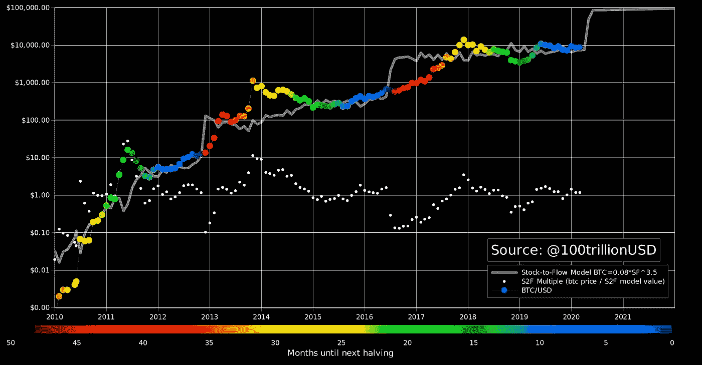

Figure 5: Bitcoin’s S2F Model [4]

此前，数字稀缺性的增加已经导致比特币达到新高。这可以在图 5 中看到，其中减半由深蓝色点向深红色的移动来表示。这是因为矿商被迫出售开采的比特币来弥补成本，给市场造成了持续的抛售压力。从 2020 年 5 月开始，他们只能卖出以前一半的数量。具体来说，他们目前每月销售约 4 亿美元，在 5 月减半后将减半。假设需求保持不变，这将打破供需平衡，导致比特币价格飙升。

## 黄金 2.0

比特币通常被称为数字黄金。黄金已被证明是一种价值储存手段，比特币也越来越被认为是一种价值储存手段。

在信任方面，对比特币的信任大于对黄金的信任。这是因为确切知道有多少比特币存在，以及未来通货膨胀率将如何演变。至于黄金，没有人确切知道开采的黄金数量、全球天然黄金储备的规模以及未来的生产率。然而，数千年来，黄金已经证明了自己是一种价值储存手段，而比特币却没有。假以时日，区块链科技将有机会证明自己。

从便携性来说，比特币不是实物资产。因此，一个比特币可以按照你认为合适的方式进行分割。另一方面，支付大量的黄金是不安全的，而且很难把它分成相当于你日常生活所需的小额。此外，比特币的交易是不可改变的，并且是私有的。

与黄金资产相比，进入和退出加密资产的障碍更小。您不需要购买任何最低金额，您可以随时以非常低的费用出售。

比特币和黄金最大的区别就是去中心化。比特币不受任何央行或政府机构的监管。

# 加密基金概述

加密生态系统的增长以及国际监管框架的加强允许各种资金进入市场。超过 800 种不同的加密基金被创造出来，包括对冲基金、风险资本基金和指数基金。如图 6 所示，随着加密资产开始超越传统投资，加密基金也在增长。

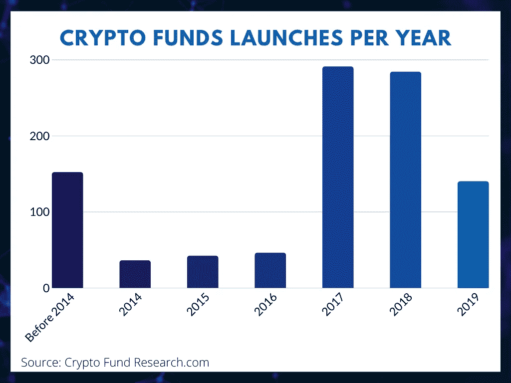

Figure 6: Launches of Crypto Funds [5]

在投资者兴趣增加的帮助下，加密基金的发行在 2017 年牛市期间达到顶峰。2019 年，该行业处于“加密冬天”的中途，投资者兴趣下降，因此估计该年有 90 只基金关闭。

该行业的主要基金如下图 7 所示。该领域由对冲基金模式主导，而一些人选择混合对冲基金——风险资本模式。对冲基金和指数基金是流动的，有 12 个月的锁定期，它们也接受额外的资本进入基金。另一方面，风险基金有 10 年的锁定期，一般不接受追加资本。

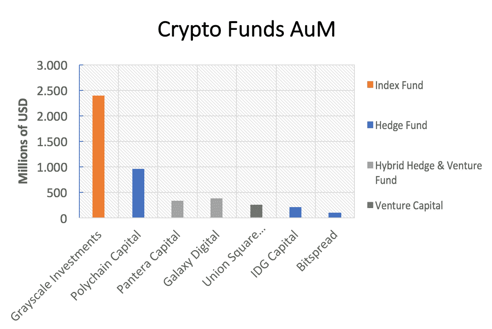

Figure 7: Main Competitors [6]

## 秘密对冲基金

从 2018 年开始，对冲基金一直在从一般化的策略转向这些专业化的策略:基本面、量化和机会主义[7]。这些策略在加密对冲基金市场中具有以下优势:

*   基本面——19%

这些基金只是做多，而且是长期投资。他们根据资产的内在价值进行投资。

*   定量— 37%

定向基金或市场中性基金，采用定量方法，包括:做市、套利和高频交易。

*   机会主义者——44%

这种策略利用了长期趋势转变所创造的机会。他们有混合策略，可能包括采矿和早期投资。

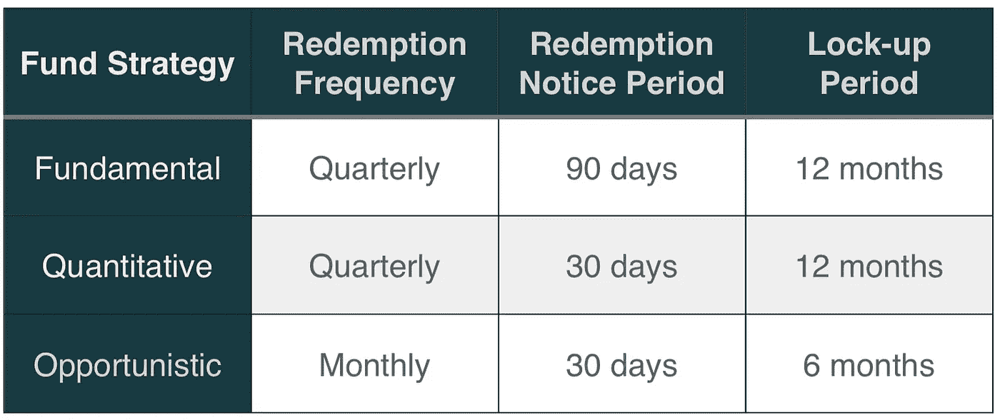

Figure 8: Redemption Terms by Strategy [7]

根据普华永道 2019 年初的报告，约有 150 只活跃的对冲基金，它们总共拥有约 10 亿美元的资产管理规模。加密对冲基金的团队平均有 7.5 人，平均每人的投资管理业绩为 3.5 年。有趣的是，25%的加密对冲基金董事会中有独立董事。这表明全球高级管理层缺乏加密专业知识。随着传统投资将与加密生态圈融合，这些数字有望增长。

2019 年 Q1 的中值加密对冲基金拥有 430 万美元的 AuM，只有 10%的对冲基金管理着超过 5000 万美元的资产。2019 年 AuM 中值较 2018 年同比增长 358%，随着市场的成熟，预计 2020 年将进一步增长。费用中位数与传统投资经理一致，为 2%的管理费和 20%的绩效费[7]。

这一数据显示，即使在漫长的熊市中，加密对冲基金也在持续增长。这证明投资者愿意尝试这种新的资产类别，并相信其长期潜力。随着时间的推移，传统投资和加密资产之间的差距将被弥合，这将增加现有传统投资经理对加密资产的采用。

## 加密对冲基金业绩

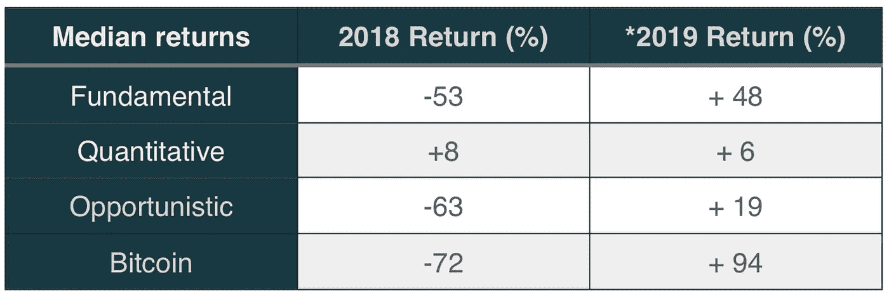

Figure 9: Median Returns by Strategy [7] * Based on estimated returns

众所周知，加密资产的价格波动很大。对冲基金有能力利用自己的专业知识将这些波动转化为对自己有利的因素，并为客户增加阿尔法生成。

根据对冲基金的策略，回报会有所不同，如图 9 和图 10 所示:

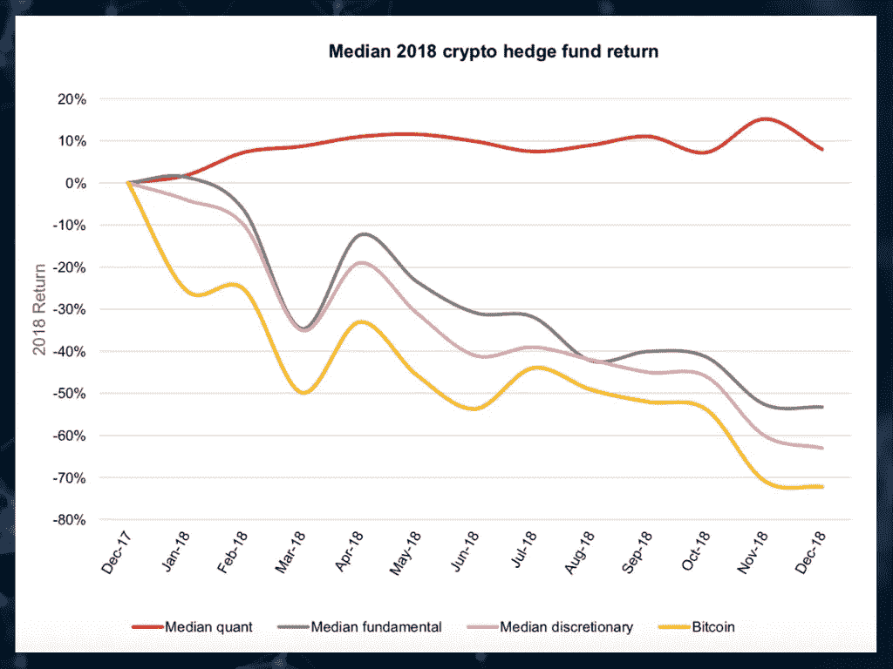

Figure 10: 2018 Median Returns [8]

根据投资者的偏好，他或她可能会选择适合自己需求的对冲基金。2018 年的中值回报显示，基本面和机会主义基金降低了资产的下行潜力，但在熊市中仍有负回报。相反，量化策略是市场中性的，在所有市场条件下都能盈利。2018 年量化基金中值与市场负相关，beta 为-2.33。

加密对冲基金在高波动时期限制其风险敞口。因此，采用基本面和机会主义策略的对冲基金在熊市中表现优于标的资产，而在牛市中表现不佳。这降低了他们的风险，从而增加了他们的夏普比率。

## 案例研究:多链资本

Polychain Capital 是领先的加密资产对冲基金之一。它成立于 2016 年，2018 年初管理的资产接近 10 亿美元。分析其多年来的表现，可以让投资者更好地了解投资于秘密资产对冲基金时会发生什么。

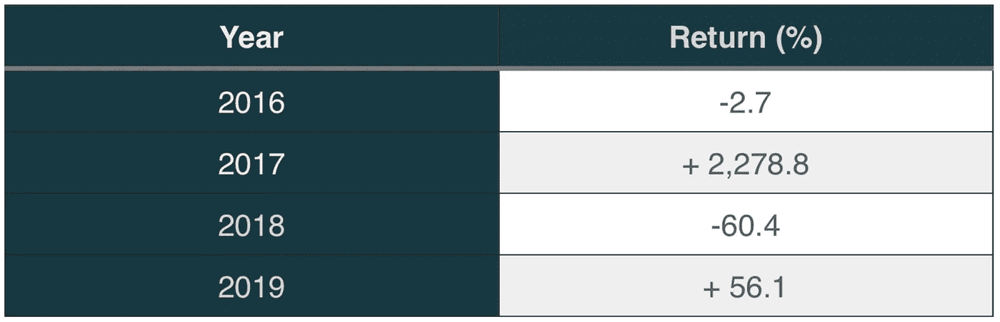

Figure 11: Polychain Capital Yearly Returns [9]

对冲基金自成立以来的投资回报率为 1，332%，如图 11 所示。

他们基金的年回报率反映了加密资产生态系统中的高波动。为了让投资者获利，他们必须长期应对这些高波动。例如，在 2018 年 7 月至 12 月最糟糕的 6 个月期间，该对冲基金损失了 47.6% [9]。因此，根据投资者进入该基金的时期，他可能获得巨额收益，也可能遭受巨额损失。

# 投资者关键决定因素

为了更好地了解这个市场中的投资者，了解他们的心理以及决定机构投资者和散户投资者进入这个新资产类别的原因是很重要的。

在与富达数字资产欧洲负责人 Chris Tyrer 讨论时，他表示，由于客户需求的增加，机构正在进入市场。秘密资产已经成为一种趋势，引起了更多的关注，这反过来又使更多的投资者跟风。家族理财室听说了这件事，并开始询问机构在这些市场内交易的可能性。因此，机构对客户需求做出反应，进入这些市场。根据他的说法，投资者有兴趣进入加密资产，既是为了阿尔法生成的目的，也是为了多样化。公司喜欢加密贷款带来的低而稳定的收益，也从多样化中受益。例如，根据 GSR(一家提供做市、场外交易和结构化产品等加密服务的香港公司)的说法，机构希望将其投资组合的 0.5-1%分散到加密资产中。

机构将进入该市场的另一个原因是，企业和银行在过去 12 年的美国股市牛市中获得了巨额利润，它们需要将资金投资于其它地方，投资于一种新的资产类别。

在零售方面，关键决定因素各不相同。根据欧洲领先的数字交易所 BitPanda 的数据，零售投资组合平均在 20，000 到 50，000 欧元之间。他们的投资组合如此庞大的原因之一是，他们中的一半以上是加密资产的早期采用者，能够以比目前低得多的价格购买这些资产。

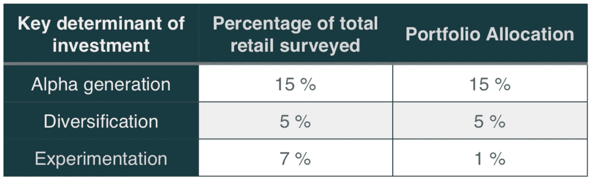

Figure 12: Retail Investors Key Determinants

根据我的研究，我发现这些是散户投资者的关键决定因素，以及他们各自的投资组合配置，如图 12 所示。

只关注阿尔法一代的投资者通常是那些“投机取巧”的人，他们投资主要是因为害怕错过机会。他们缺乏金融市场知识。对多样化感兴趣的投资者在这三者中拥有最高的金融市场知识，并长期投资于比特币和区块链技术。另一方面，勤奋的投资者只投资非常少的投资组合用于实验目的。他们想更多地了解区块链以及加密资产生态系统是如何运作的。

## 获得美元与积累 BTC

在我看来，散户投资者应该在开始投资加密资产之前确定一个明确的策略。他们应该专注于增加投资组合中的美元或者积累 BTC。这将影响他们的交易方式和他们将使用的交易对。对用美元获利感兴趣的人应该直接用美元对交易。如果他们在比特币对上交易替代比特币，他们的投资组合将受到比特币额外波动的影响。

另一方面，有一种趋势是散户投资者不一定想用美元获利，但他们的目标是长期积累尽可能多的 BTC。这些交易者将参与 altcoin 市场并进行交易以获得 satoshi。Satoshi 是比特币的计量单位，它代表单个比特币的百万分之一:0.00000001 BTC。

散户投资者应该从研究基本的图表分析指标和交易技术开始，以便了解趋势和如何有效地建仓。这些包括 RSI，移动平均线，平均成本和位置阶梯。

## 关于作者

我的名字是 [Roland Roventa](https://www.linkedin.com/in/rolandroventa/) ，我于 2017 年初进入加密货币生态系统，从那以后一直根据基本面进行交易。我很高兴看到加密货币作为一种资产类别不断发展，与传统的金融世界融合。

参考资料:

[1] Sfox。“比特币缓慢但稳步的制度化。”中，SFOX Edge，2020 年 1 月 21 日，【https://blog.sfox.com/bitcoin-institutional-】T2 期货-ETF-托管-时间线-e3cd622a738f

[2]哈尼特、迈克尔和汤米·里基茨。“全球投资战略——最大的图景。”美国银行全球研究，2020 年 2 月 12 日。

[3]“灰度投资者套牌。”灰度，2019 年 9 月。

[4]计划 b。"有效市场假说和比特币存量-流量模型."中，2020 年 1 月 26 日，medium.com/@100trillionUSD/efficient-市场-假设-和-比特币-股票-流量-模型-db17f40e6107。

[5]cryptofundresearch.com/.加密基金研究

[6]加密基金研究，cryptofundresearch.com/.LetKnowNews.“十大加密对冲基金”中，2018 年 10 月 12 日 medium.com/letknownews/top-10-crypto-hedge-基金-5479df56b4a3。

"灰度数字资产投资报告."灰度，2019 年 10 月。
钱德勒，西蒙。"最大的加密对冲基金和他们告诉市场什么."Cointelegraph，2019 年 8 月 19 日，coin telegraph . com/news/maximum-crypto-hedge-funds-and-they-they-tell-on-the-market。

[7]普华永道和埃尔伍德。“2019 年加密对冲基金报告。”cryptofundresearch.com/.加密基金研究

[8]普华永道和埃尔伍德。“2019 年加密对冲基金报告。”

[9]惠，阿达。Polychain Capital 的加密对冲基金的投资者看到了 1，332%的收益——如果他们忍受了下跌的话。CoinDesk，2020 年 3 月 30 日，[www . coin desk . com/investors-in-poly chain-capitals-crypto-hedge-fund-saw-1332-gains-if-theed-the-dips。](http://www.coindesk.com/investors-in-polychain-capitals-crypto-hedge-fund-saw-1332-gains-if-they-stomached-the-dips.)

> [在您的收件箱中直接获得最佳软件交易](https://coincodecap.com/?utm_source=coinmonks)

