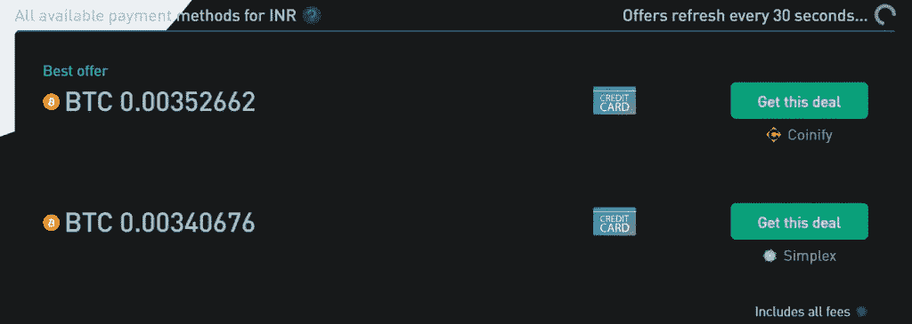
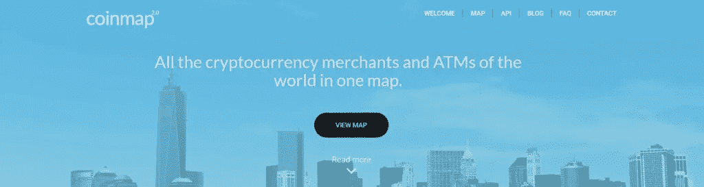
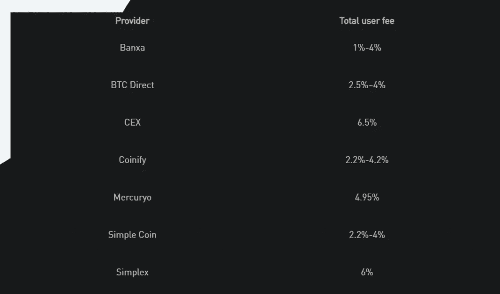
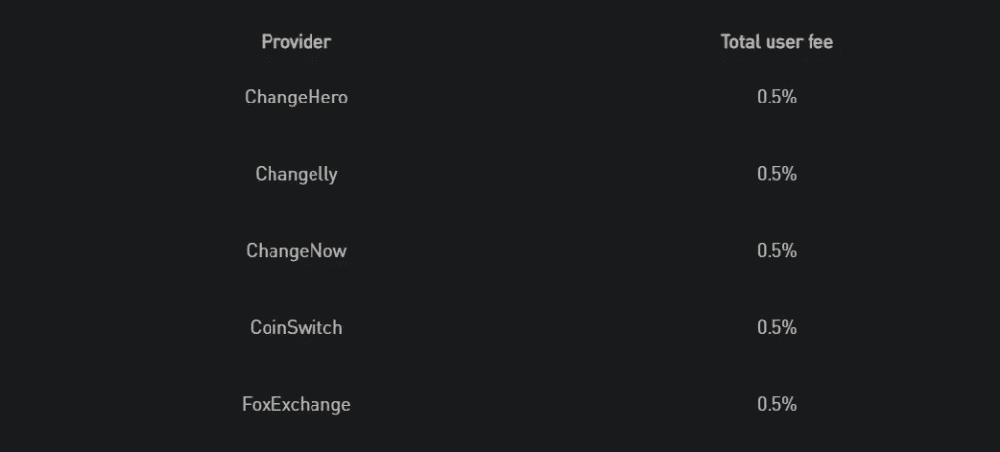
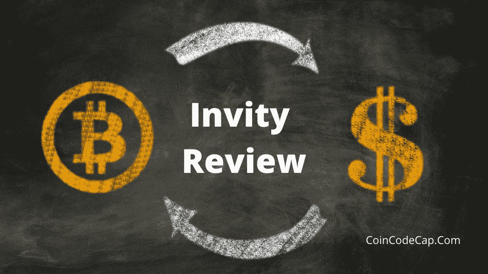

# 邀请评论—使用该平台安全吗？

> 原文：<https://medium.com/coinmonks/invity-review-70f3030c0502?source=collection_archive---------5----------------------->

本文将对捷克成立的加密货币比价网站 [**Invity**](https://coincodecap.com/go/Invity) 进行回顾。它最初是为了帮助 Trezor 用户在 [Trezor](https://blog.coincodecap.com/go/trezor) 套件中比较和执行交易而设计的。然而，现在每个人都可以使用它，不管他们的钱包。

## 邀请评审:摘要

*   用户无需注册或完成任何 KYC 即可使用[邀请](https://blog.coincodecap.com/go/invity)。
*   Invity 上的交易所是经过验证的提供商，值得信赖。
*   它还支持 [Trezor 硬件钱包](https://coincodecap.com/ledger-nano-s-vs-trezor-one-vs-trezor-t-vs-ledger-nano-xledger-nano-s-vs-trezor-one-vs-trezor-t-vs-ledger-nano-x)直接使用它们完成交易。
*   购买、销售和交换只需点击几下鼠标。
*   用户可以根据他们喜欢的支付方式、法定货币和特定的加密货币对结果进行排序。
*   它们包括用户订单中的费率，确保没有隐藏的费用。
*   投资加密货币是 [**Invity**](https://blog.coincodecap.com/go/invity) 目前正在开发的另一个功能。
*   他们有一个专门的简化的 FAQ 部分，满意地涵盖了大多数用户的问题。
*   它高度关注安全性，因此不会存储用户的资产信息。

## Invity.io 是什么？

[**Invity**](https://coincodecap.com/go/Invity) 是一个基于捷克共和国的平台，用于比较加密货币的汇率。它是由 Trezor 硬件钱包创造者 [SatoshiLabs](https://satoshilabs.com/) 于 2019 年创立的。早期它只是为了帮助 Trezor 用户在 Trezor 套件中比较和执行交易。然而，现在 Invity 对所有人开放，不管你用的是什么钱包。

Invity 提供了一个简单的用户界面，它的设计考虑到了非技术交易者的需求。不仅如此，它还消除了寻找费率更低、支付方式合适的值得信赖的交换平台的开销。Invity 也是一个有安全意识的平台，是用户的一站式商店。

## 关于 SatoshiLabs 和 Trezor

SatoshiLabs 集团是一个致力于提供安全加密生态系统的公司集团。他们的第一个目标产品是 Trezor 硬件钱包。 [Trezor](https://blog.coincodecap.com/go/trezor) 的首款车型 Model One 于 2013 年推出，另一款是几年后的下一代 Model T。他们的下一步是 2019 年的 Invity，其目的是作为 Trezor 套件接口的一部分，为新用户比较和完成加密交易。

请注意，一直有传言称 play store 上有 Trezor Android 应用，但事实并非如此。他们已经[正式发推特](https://twitter.com/trezor/status/1377524501760598017?lang=en)说他们还没有启动任何应用程序，尽管他们将来肯定会这么做。

## 如何使用 Invity 在 Invity 上购买 Cryptos？

*   进入 [Invity 的](https://coincodecap.com/go/Invity)官网，从屏幕上方的菜单中选择购买加密。

*   从“如果你支付”下拉菜单中选择你喜欢的法定货币。
*   在金额框中输入您想要花费的金额。您可以使用符号**↓↓**来切换您是否希望输入加密货币或法定货币的数量。您必须根据您需要购买的最低金额输入一个有效金额。
*   从下拉列表中选择您喜欢的加密货币。
*   Invity 将显示您想要的加密货币的金额列表，以及您愿意花费的现金。该费用将仅包含在房价中，并且记住要尽快行动，因为报价每 30 秒刷新一次。

*   选择您喜欢的交易，然后点击“获得这笔交易”
*   输入您的钱包地址，然后点击“完成交易”
*   下一页将显示您的交易摘要。如果一切如你所愿，请点击“我确定我想要这笔交易”，或者点击另一个选项进行复查。
*   完成您的交易，您将收到钱包中的资产。

请注意，出售和兑换加密货币的程序与上面给出的类似。

## 什么是 Coinmap？

Invity 已经启动了一个非盈利项目 [Coinmap](https://blog.coincodecap.com/go/coinmap) 。这个项目只专注于收集用户可以花费资产的企业和比特币自动取款机的列表。根据目前的统计，它有大约 20，000 个条目，并且还在增长。你可以浏览热图来发现你周围的企业。另外，你还可以免费添加一个新的列表。

## 邀请费结构审查

[**Invity**](https://blog.coincodecap.com/go/invity) 的费用结构是根据用户正在进行的交易划分的，包括购买、出售、交换或消费。

## 购买加密费

费用很大程度上取决于提供商。此外，对于同一个提供商，费用仍然因支付方式、货币或地点而异。请注意，接受以当地货币而不是重要储备货币报价的提议可能会有好处，但一定要仔细检查。您可能会被收取额外的转换费。

## 出售加密费

到目前为止，只有一家供应商可以让用户出售他们的密码。特定供应商(BTC 直销)的费用为订单的 2.5%。

## 邀请费:与其他服务的比较

有五个提供商供用户兑换他们的硬币，包括 [ChangeHero](https://blog.coincodecap.com/go/changehero) 、[change ly](https://blog.coincodecap.com/go/changelly)、 [ChangeNow](https://blog.coincodecap.com/go/changenow) 、 [CoinSwitch](https://blog.coincodecap.com/go/coinswitch) 和 foxchange。这些供应商的费用都是订单的 0.5%。

## 消费密码

在这种情况下，用户可以用礼品卡兑换他们的密码来购买他们想要的东西。Bitrefill 是目前唯一一家提供每单(3–4)%费率的供应商。但是，该功能仅在 Trezor 套件中可用。最有可能的是， [**Invity**](https://blog.coincodecap.com/go/invity) 会在他们的下一次更新或发布中加入这个新特性。

## 邀请评审:支持

Invity platform 有一个专门的 FAQ 部分，几乎回答了用户的每一个问题。除此之外，你也可以发表你的问题、疑问或评论。但是，没有紧急服务或呼叫选项。所以，总的来说，他们的支持系统很一般。

## Invity.io 评论:安全和隐私

[Invity](https://blog.coincodecap.com/go/invity) 没有任何注册或 KYC 过程，这意味着该平台不保存用户的详细信息，如姓名、电子邮件等。它也没有自己的钱包，所以它甚至不能存储或保存用户的资产。所以，邀请不存在安全和隐私的问题。然而，根据他们的说法，他们保留了用户的设备 id，他们访问他们网站的次数等数据。如需详细信息，您可以访问他们的“常见问题”部分。

## Invity.io 评论:利弊

进行交易需要 ProsConsNo 注册流程。没有移动应用。经过验证和值得信赖的提供商。有限的供应商。没有隐私或安全相关的问题。精心设计的常见问题解答部分。用户友好平台。一站式购物平台(购买、销售、交换)。没有隐藏的费用。

## Invity.io 审查:结论

总的来说， [**Invity.io**](https://coincodecap.com/go/Invity) 是完成你的交易，包括买、卖、交易，最安全的平台之一。此外，该平台本身非常优雅，使用起来非常简单。用户不再需要在交易前等待验证，这也是无限的。在即将到来的未来，它将引入一些诱人的功能，如投资，从而将朝着其目标前进一步。

# 常见问题

**Invity 上有哪些加密货币？**

目前 Invity 支持比特币；Altcoins 包括莱特币，Ripple，Ether，比特币现金，Stellar，OMG，[币安](https://blog.coincodecap.com/go/binance)币，本体，[双子](https://blog.coincodecap.com/go/gemini)美元，Dash，TRON，Zcash。他们也有一个稳定的硬币，包括系绳(USDT)。

**哪些国家不允许使用 Invity.io？**

由于合理的原因，Invity 不支持某些国家，包括夏威夷(美国)、伊朗、纽约(美国)和朝鲜(朝鲜)。

**该平台有哪些支付方式？**

除了受限制的国家和地区，所有国家和地区的用户都可以使用信用卡(Visa/Mastercard)或借记卡(Visa/Mastercard)作为支付方式。

***包括附属链接**

