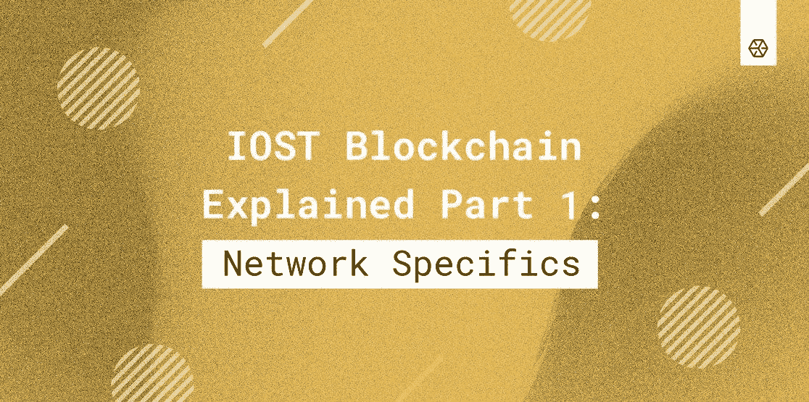

# IOST 区块链讲解第 1 部分:网络细节

> 原文：<https://medium.com/coinmonks/iost-blockchain-explained-part-1-network-specifics-5bd33dac3ba6?source=collection_archive---------4----------------------->

在过去的几年里，区块链的技术逐渐得到改进，最终脱离了初级阶段。现在，公司、银行和其他机构发现了这项技术的好处，并积极地将它应用到他们的解决方案中。虽然工作证明等网络共识算法慢慢消失，但利益证明解决方案有条不紊地确保了该行业的大多数。

IOST 区块链是那些提供各种有用津贴的网络之一，从改进的分片开始，到破坏被称为可信度证明的共识协议结束。该网络通过高效的分布式分片、传输、微状态块等解决方案，解决了与事务吞吐量、可伸缩性和去中心化相关的众所周知的问题。

**共识算法**

IOST 的目标是开发一个能够为软件开发、游戏、金融科技、媒体和娱乐行业提供分散服务的平台。

该项目开发了一个平台，该平台不同于现有的基于分片原则的证据证明解决方案。主要地，IOST 使用一种内部可信第一的方法，这意味着将所有的验证者分成两组，称为可信联盟和正常联盟。

第一组快速处理事务，而第二组仅确保可验证性并提供终结性。可信联盟节点是基于称为可信度分数的唯一度量来选择的，可信度分数是基于节点提供的服务数量、做出的贡献、声誉及其行为来分配的。换句话说，这个分数叫做 Servi，一旦一个节点验证了一个块，这个分数就会被销毁。通过实施如此复杂的指标，网络变得更加安全，因为很难人为伪造所有这些参数。

**细节**

**分布式随机性协议**

为了避免不同类型的网络攻击，IOST 提出了分布式随机性协议(DRP ),该协议允许通过可公开验证的秘密共享(PVSS)和非交互式零知识证明(NIZK)产生不可伪造的均匀随机值。该协议用于将节点组合成碎片，将节点分配到这些碎片中，并在每个碎片中选择领导者。

DRP 机制分为两个阶段，随机性生成和随机性验证。首先，客户端通过随机生成的平衡分组广播消息，然后服务器生成随机输入值，并通过 PVSS 为同一组的成员创建共享。一旦所有服务器接收到加密的部分，客户端就从每个组中提取输入的子集。这就是客户端获取协议输出和每个组的秘密的方式。在第二阶段，服务器将解密的部分发送给客户端，客户端链接恢复的组秘密，这允许它们获得随机输出。

**带备用协议的领导人选举**

备份协议旨在防止恶意节点做出违反正确网络进程的行为。该协议推动所有节点选择两种行为中的一种，或者通过运行 DRP 或传递该动作来合作，并且在节点通过 DRP 运行的情况下，它被排除在共识过程之外。

**分片间交易**

这一功能是通过使用专有的 Atomix 协议实现的，该协议允许进行原子跨碎片事务。需要强调的是，该协议类似于 Omniledger，并且在设计上防止了重复支出。此外，Atomix 甚至在碎片间事务级别上也允许智能合约。

通过订阅我们网站上的时事通讯，关注来自 [Everstake](https://everstake.one/) 的新闻和更新，并通过下面的链接加入我们社交渠道上的讨论。

网址: [everstake.one](https://everstake.one/)
推特: [@Everstake_pool](https://twitter.com/Everstake_pool)
电报: [@Everstake_chat](https://t.me/everstake_chat)
脸书:[fb.me/everstake.one](https://www.facebook.com/everstake.one/)
Reddit:[/r/ever stake/](https://www.reddit.com/r/Everstake/)

> [直接在您的收件箱中获得最佳软件交易](https://coincodecap.com/?utm_source=coinmonks)

