# IOT 教程:从头开始用 USB RFID 阅读器、Raspberry Pi 和 Node-RED 读取 RFID 标签

> 原文：<https://medium.com/coinmonks/iot-tutorial-read-tags-from-a-usb-rfid-reader-with-raspberry-pi-and-node-red-from-scratch-4554836be127?source=collection_archive---------0----------------------->

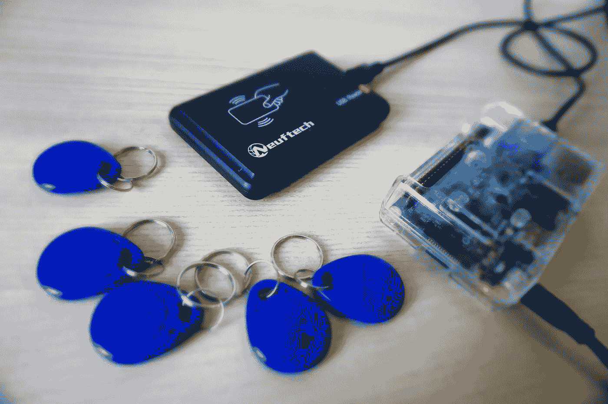

The setup: Neuftech USB RFID reader and Raspberry Pi 3

对于一个 IOT 的演示者，我想用一个连接到树莓派的廉价 USB RFID 阅读器来读取 RFID 标签。尽管插入笔记本电脑的相同 USB 设备直接发送读取标签 ID 作为键盘输入，但用 Raspberry Pi 检索这个 ID 要复杂得多。

使用 Raspberry Pi，USB RFID 阅读器发送字节数组，在获得普通 ID 之前需要对这些字节数组进行解析。

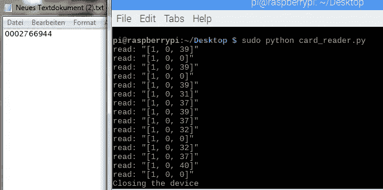

On the left hand side, when connected to my Windows Laptop, you directly get the ID, whereas on the right hand side we see the byte arrays.

使用 Node-RED，您可以很容易地以一种方便的方式构建这种解析的原型，这将在本教程中介绍。关于字节数组的格式和 HID 消息的格式，我不会说得太详细。一般来说，这种方法更直接，可以快速得到结果。

## 你需要什么

[树莓派](https://amzn.to/2U67IMZ)(代销商)
[USB RFID 阅读器](https://amzn.to/2TrTuSf)(代销商)

# 准备

对于当前的 raspbian 映像，Node-RED 已经预装。不过，我们将使用流[**node-red-contrib-usb hid**](https://flows.nodered.org/node/node-red-contrib-usbhid)**来连接 USB 阅读器。
我们使用以下命令安装流:**

```
npm install node-red-contrib-usbhid
```

**如果你还没有在你的 raspberry pi 上安装 npm，你可以在这里找到一个快速解决方案。**

**由于标准 pi 用户不允许读取/写入 USB 设备，请不要忘记按照“如何使用”一节中的[流程图](https://flows.nodered.org/node/node-red-contrib-usbhid)所述，授予对这些设备的访问权限。**

# **开始节点-红色**

**现在我们准备开始了。因此，只需在命令行中输入并执行`node-red-start`,并使用 Node-RED 启动后将在命令行中显示的 IP 地址访问仪表板。**

**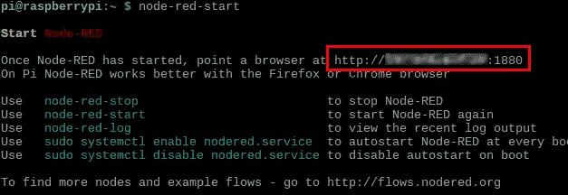**

**Message after the start of Node-RED: Find the IP address to access the node-red frontend**

# **找出你的 RFID 阅读器的供应商 ID (VID)和产品 ID (PID)**

**为了读取你的 [USB RFID 阅读器，](https://amzn.to/2T7lQC4)你必须注册供应商 ID 和设备 ID。我们之前安装的流包为此提供了节点`getHIDdevices`。将它拖放到流中，并将其与一个作为输入的`inject`节点和一个作为输出的`debug`节点连接起来，如屏幕截图所示。**

****

**Flow for reading the vendor ID and device ID of your RFID reader**

**注入节点被自动参数化为 timestamp 类型，但这并不重要，因为我们只需要任何类型的事件来触发第二个节点。**

**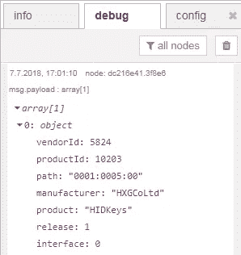**

**Message created by the node getHIDdevices**

**现在，您可以部署该流，并单击`inject`节点的激活部分，以探索 USB RFID 阅读器的 VID 和 PID。**

**对于我的 Neuftech USB-RFID 阅读器，供应商 ID 是 5824，产品 ID 是 10203。**

# **创建流来解析 RFID 读数**

**正如我们在开始时看到的，一个读取的 RFID 标签的 ID 在具有三个字节的多字节数组中传输。我们现在将构建流来捕获这些 byta 数组，并将它们解析成一个 ID。**

## **连接 HID 设备**

**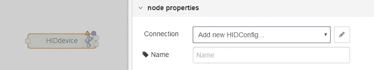**

**Double click a node to enter the configuration**

**首先，将类型为`HIDdevice`的节点拖放到流中，双击它进行配置。通过点击 pensil 图标创建一个新的 HIDConfig。**

**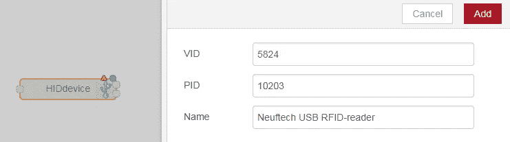**

**Configure the HIDdevice with the vendor Id and the product ID you retrieved earlier**

**然后输入检索到的供应商 ID 和产品 ID。您也可以给这个配置起一个富有表现力的名字。**

**与`Add`确认**

**如果您想探索字节数组，将`HIDdevice`节点连接到`debug`节点，部署流并使用您的设备读取 RFID 标签。在调试窗格中，您可以看到包含字节数组的消息。**

## **仅选择字节数组中包含 ID 的部分**

**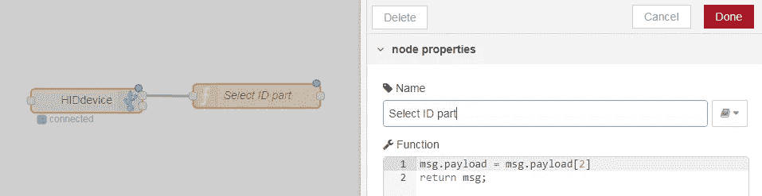**

**Configre the function to select only the ID byte of the byte array**

**字节数组由三个字节组成，其中只有最后一个字节是 ID 的一部分。为了只选择那个字节，wee 将使用一个`function`节点并插入一些 javascript。**

**PS:确保将该函数连接到 HIDdevice-node 的第一个输出，因为第二个输出只发送错误。**

**您可以使用调试节点再次检查您的中间结果。**

## **对 ID 部分进行筛选以排除无表达的字节**

**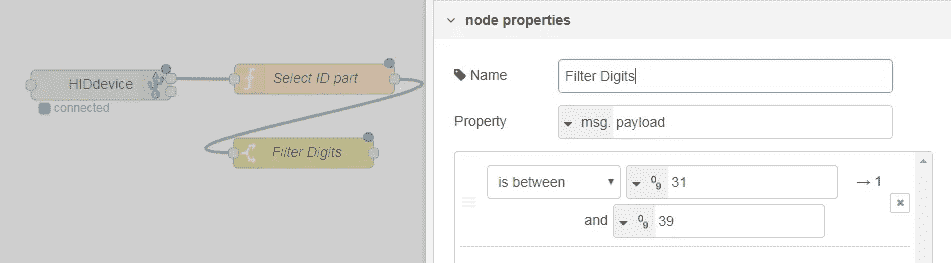**

**Configuration of the switch for filtering the ID bytes**

**一些 ID 字节只是空的或换行的，所以我们将使用一个`switch`节点过滤掉它们，该节点允许在 Node-RED 中进行消息路由。因此，我们只保留 31 和 39 之间的数字，它们映射到数字 0–9。为了将数字映射到这些数字上，我们将使用另一个函数节点，我们将在下一节描述它。**

## **将 ID 字节映射到数字 0–9**

**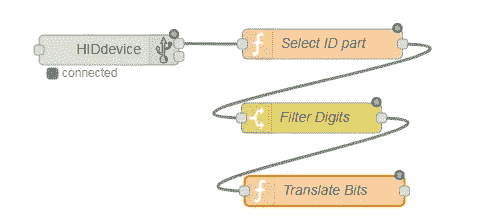**

**Adding another function for translating the bits**

**使用另一个`function`节点，我们将把字节映射成实数。我在大 git repo[https://github.com/riklaunim/pyusb-keyboard-alike](https://github.com/riklaunim/pyusb-keyboard-alike)中找到了一个[映射表](https://github.com/riklaunim/pyusb-keyboard-alike/blob/master/keyboard_alike/mapping.py)，它实现了我们在这里用 Python 中的 Node-RED 构建的相同逻辑。提供了许多例子，所以很容易理解。**

**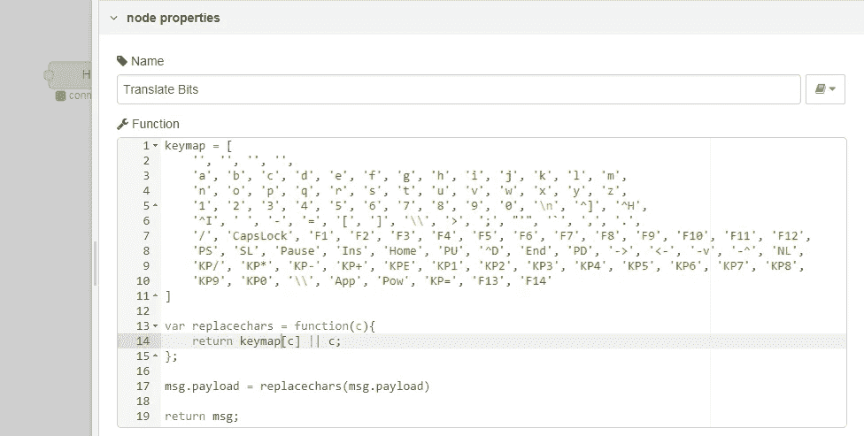**

**Javascript code for the “Translate Bits” node**

## **将数字组合成一个 ID**

**使用我们将在手动模式下使用的`join`节点，可以将消息连接在一起，例如字符串或数组。我们使用一个小的 timemout 作为标准，将哪些消息连接成一个字符串，并且消息之间没有任何字符。**

**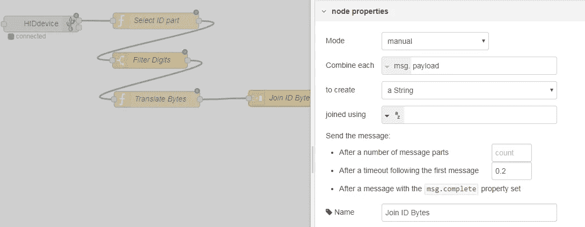**

## **完整的流程**

**在这一步之后，我们已经完成了所有必要的步骤，以便根据从 USB RFID 读取器中检索到的字节数组来重建标签 ID。**

**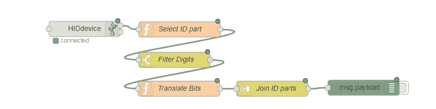**

**The final parser flow**

# **任务完成**

**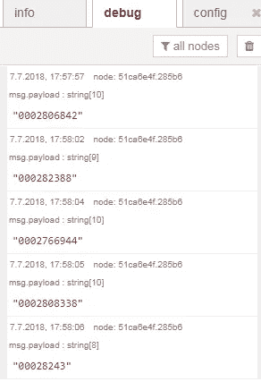**

**在我们构建了解析流程之后，当我们用阅读器读取 RFID 标签时，我们可以在调试面板中检查结果。**

**基于 Node-RED，我们现在可以进一步消化这个 ID，将其存储到数据库或触发其他事件和流。**

**我将使用解析流在一个工业 IOT 演示器中使用标签 id 来尝试以产品为中心的过程数据采集。这意味着我希望将唯一的零件 id 附加到过程参数、传感器读数和质量检测结果上，以便为分析方法创建数据。**

# **[更新 USB RFID 阅读器上的一个字**

**我从亚马逊德国订购了我的 USB RFID 阅读器(这里是链接:[https://amzn.to/2HlTcLW](https://amzn.to/2HlTcLW))(附属链接)。**

**我没有在 Amazon.com 上找到那个产品，但是类似的产品看起来完全一样，但是有不同的名字，[喜欢这个产品](https://amzn.to/2Ub6Tzd)(附属链接)。**

**我没有使用这款产品的经验，但如果它们和我的产品看起来一样，我可以推荐它们，并给它们比亚马逊上的 3 颗星更多的评价。**

# **得到一个树莓派**

**在我的设置中，我使用了一个 Raspberry Pi 3 B+，但它应该可以很好地与旧型号配合使用。如果你还没有树莓派，订购一个套装和一些额外的东西是有意义的，比如盒子和 SD 卡。中型的 [CanaKit](https://amzn.to/2Wh7WhP) (附属链接)包含了所有这些。当然，你也可以从树莓派的制造商提供的树莓派的准系统开始。**

> **加入 Coinmonks [电报频道](https://t.me/coincodecap)和 [Youtube 频道](https://www.youtube.com/c/coinmonks/videos)获取每日[加密新闻](http://coincodecap.com/)**

## **另外，阅读**

*   **[复制交易](/coinmonks/top-10-crypto-copy-trading-platforms-for-beginners-d0c37c7d698c) | [加密税务软件](/coinmonks/crypto-tax-software-ed4b4810e338)**
*   **[电网交易](https://coincodecap.com/grid-trading) | [加密硬件钱包](/coinmonks/the-best-cryptocurrency-hardware-wallets-of-2020-e28b1c124069)**
*   **[最佳加密交易所](/coinmonks/crypto-exchange-dd2f9d6f3769) | [印度最佳加密交易所](/coinmonks/bitcoin-exchange-in-india-7f1fe79715c9)**
*   **[面向开发人员的最佳加密 API](/coinmonks/best-crypto-apis-for-developers-5efe3a597a9f)**
*   **[密码电报信号](http://Top 4 Telegram Channels for Crypto Traders) | [密码交易机器人](/coinmonks/crypto-trading-bot-c2ffce8acb2a)**
*   **最佳[密码借贷平台](/coinmonks/top-5-crypto-lending-platforms-in-2020-that-you-need-to-know-a1b675cec3fa)**
*   **杠杆代币的终极指南**
*   **[加密交易的最佳 VPN](https://coincodecap.com/best-vpns-for-crypto-trading)**
*   **[火币的加密交易信号](https://coincodecap.com/huobi-crypto-trading-signals) | [HitBTC 审查](/coinmonks/hitbtc-review-c5143c5d53c2)**
*   **[TraderWagon 回顾](https://coincodecap.com/traderwagon-review) | [北海巨妖 vs 双子座 vs BitYard](https://coincodecap.com/kraken-vs-gemini-vs-bityard)**
*   **[如何在 FTX 交易所交易期货](https://coincodecap.com/ftx-futures-trading)**
*   **[OKEx vs KuCoin](https://coincodecap.com/okex-kucoin) | [摄氏替代品](https://coincodecap.com/celsius-alternatives) | [如何购买 VeChain](https://coincodecap.com/buy-vechain)**
*   **[3 commas vs . Pionex vs . crypto hopper](https://coincodecap.com/3commas-vs-pionex-vs-cryptohopper)**
*   **[如何使用 Cornix 交易机器人](https://coincodecap.com/cornix-trading-bot)**
*   **[Bitget 回顾](https://coincodecap.com/bitget-review) | [双子座 vs BlockFi](https://coincodecap.com/gemini-vs-blockfi) cmd| [OKEx 期货交易](https://coincodecap.com/okex-futures-trading)**
*   **[用信用卡购买密码的 10 个最佳地点](https://coincodecap.com/buy-crypto-with-credit-card)**