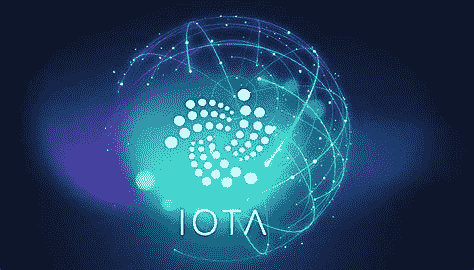

# IOTA 2.0 所有重要术语列表

> 原文：<https://medium.com/coinmonks/iota-2-0-list-of-all-important-terms-3306965365a1?source=collection_archive---------1----------------------->

## IOTA 2.0 以可理解的方式解释

物联网是区块链和加密货币领域最有前途的创新之一。特别是 IOTA 基金会是最受欢迎的，它可以在这个领域提供一个坚实的基础设施。随着 IOTA 2.0 的发布，加密货币可能会朝着大规模适应迈出又一个重要的步骤。