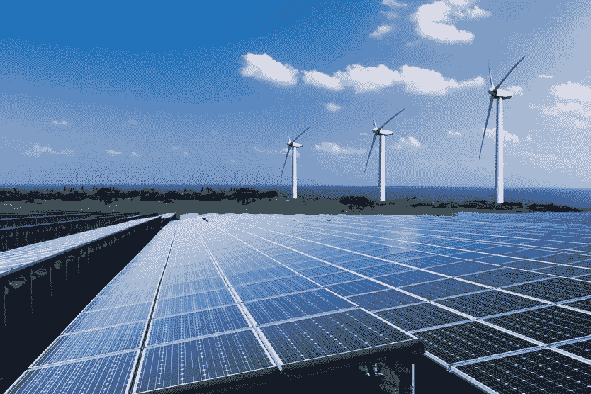
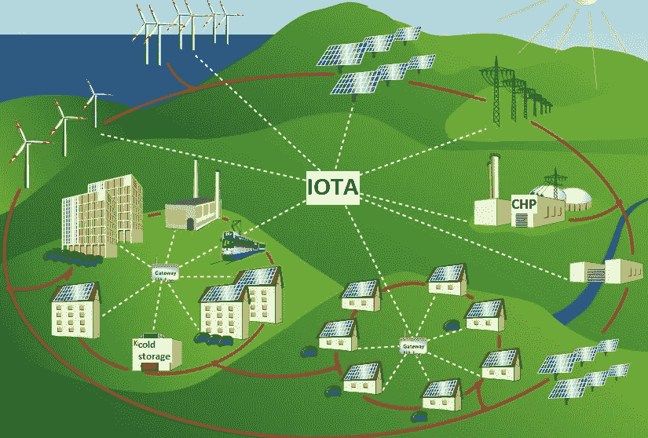

# IOTA:全面的能源转换

> 原文：<https://medium.com/coinmonks/iota-allrounder-in-the-energy-transition-a53232e9fa55?source=collection_archive---------2----------------------->

2016 年 11 月生效的气候变化《巴黎协定》，本质上是全球能源体系转型的协议。占全球温室气体排放量很大一部分的能源部门的彻底改革对于实现商定目标至关重要。世界上几乎所有国家都承诺实现这些目标。2014 年，全球约 80%的一次能源来自化石燃料(石油、煤炭、天然气)。未来，全球能源将越来越少以煤和石油为基础。

**经济视角:IOTA 在能源转型中的应用**

资本也出现了转向，这意味着资本流动正在从化石燃料转向可再生能源。与此相关的是整个能源格局的分散化。许多大型发电厂将来可能或多或少只有备用功能。无数的小型风力和光伏系统将越来越多地提供所需的电力，但它们需要以最佳方式协同工作，并相互共享数据。这将使能源转型成为有史以来最大的 IT 项目，只有与数字化相结合才能取得成功。

在各国，无数的可再生的、大部分是分散的发电厂必须被整合并控制到现有的系统中。为了调和光伏和风力发电厂的波动馈入与能源需求，使用数字技术是必要的。此外，必须继续创建最先进的基础设施，以便在未来实现实时能源行业。

而且，支付流程必须能够在这样一个系统中快速可靠地来回传输，数据传输量巨大。在未来，数百万生产者和消费者将需要实时交流，不仅共享信息，还共享数字价值。所有这些都必须自动化，因为出于时间和金钱的原因，人们不可能手动执行这样的交易。这就是 IOTA 发挥作用的地方。例如，作为一台机器的风力涡轮机必须与作为另一台机器的电网快速通信，并且必须支付电费和电网使用费。

**电网独立支付能源费用**

IOTA tangle 是一个真正的点对点网络——机器对机器。这种方法有很多好处:去中心化、可伸缩性和无交易费用等等。

通过允许并行验证事务，IOTA 可以实现更高的吞吐量——在任何随网络扩展的分布式分类帐中每秒最高的事务。这一点至关重要，因为在“能源系统世界”中，有大量的纳米和微米交易，因此接近零或零交易费对于这种经济可行性至关重要。

例如，为光伏系统等机器提供钱包具有根本性的意义。今天，没有一家传统银行是光伏系统的银行账户。但有了数字钱包，光伏系统可以从物理或数据服务中产生收入，无需任何中间人，并将其用于购买，如维护。正如银行使用“了解你的客户”的标准一样，IOTA 通过安全的身份提供了“了解你的机器”的保证。

然而，在所有巨大的机会和愿景中，将物品的使用者纳入这些大发展并使其可理解是一项紧迫的任务。只有这样，能源系统和社会的转变才会成功。例如，如果洗衣机在充足的阳光和风的情况下自动运转，但里面没有衣物，这有什么用呢？在所有的大动荡中，人作为关键因素必须被考虑进去，这样它才会起作用。

**能源行业的第一家公司依赖 IOTA**

Kontrol Energy 于 2018 年 1 月 31 日宣布，他们希望收购一家软件公司，并加入 IOTA 加密货币部门。例如，德国能源巨头 Innogy 也一直忙于 IOTA 及其应用。越来越多的公司看到了好处。

**结论:双赢的可能性:IOTA 应用在能源行业的发展**

IOTA 的灵活性可以使 IOTA 在电力行业的应用成为发电和用电之间沟通管道的接口。因此，这些应用可以成为能源价值链的重要接口，并有助于这一新系统的系统稳定性。

IOTA 可以成为实现能源系统转型目标的理想合作伙伴。我们的项目“ [public IOTA](http://publiciota.com) ”在未来也将更加关注这一领域，支持应用程序以及应用程序的开发者。无论如何，我们将把我们在能源领域的经验带到这个项目中来。

## 请为我们的项目捐款

请记住，我们是一个独立的小团体，没有财务空间。我们感谢对这个项目的任何财政和其他援助。

如果你喜欢我们的项目，我们很乐意得到支持！捐款将用于资助和实现公共 IOTA 项目和一些咖啡。

IOTA 地址:bemrvbmd 9 xtcywkxzomauj 9 odttvmfgayzkbwldxyztzezerbmxq 9 etu 90 omqnlmbbcrnro 9 tqybssvatzxjkyfztnd

应该再说一遍。我们**不是 IOTA 基金会**的一部分，也没有任何其他联系，我们是一个独立的项目。你应该在投资前做自己的研究，特别是关于加密货币。

联系人:info@publiciota.com