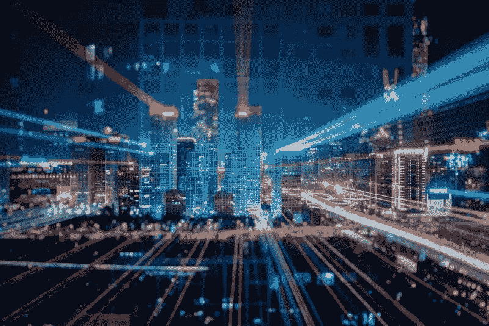
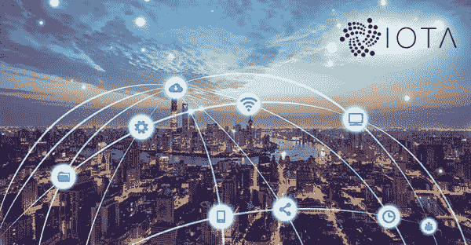
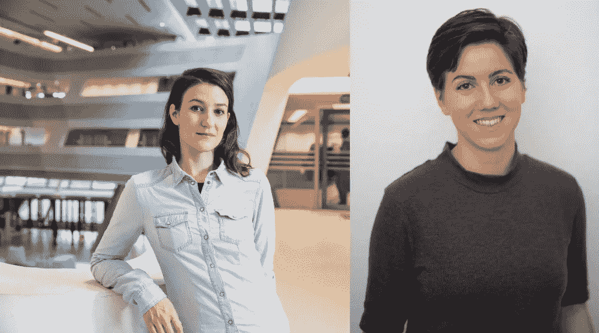

# IOTA 和智慧城市

> 原文：<https://medium.com/coinmonks/iota-and-smart-cities-f2a6c0a16f4f?source=collection_archive---------1----------------------->

几周前，我们在 publiciota.com 的博客上发表了以下帖子。为了进一步关注这篇文章，我们现在发布它，有点过度了，在这里。

在本文中，我们将继续我们的智慧城市之旅。特别是，我们将讨论 IOTA 在这方面可以发挥的作用。公共 IOTA 联系各个主题的专家，以开展基础研究。我们特别高兴能够接待来自“[zukuftsinstitut](https://www.zukunftsinstitut.de/)”的客座作者[妮娜·普芙德勒和莉娜·帕帕萨巴斯](http://publiciota.com/future-challenges-in-urban-spaces-how-technology-can-help-us-to-live-better-lifes-2)。这些作者的客文转载于正文的后半部分。“Zukunftsinstitut”成立于 1998 年，从一开始就决定性地塑造了德国的趋势和未来研究。如今，该公司被认为是欧洲趋势和期货研究领域最具影响力的智库之一。我们的客座作者 Lena Papasabbas 探讨了网络社会、其人员、价值观和技术的转变。作为一名文化人类学家，她对我们日益多样化的文化的所有方面都感兴趣，并研究中心发展动态。

从全球角度来看，城市正在变得越来越大。每 16 个月，一个城市的人口就超过一千万大关。因此，这一持续的城市化进程带来了挑战，需要加以应对，以确保高生活水平。没有智能技术，巨型城市可能会变成怪物城市。因此，我们面临的挑战是将未来的城市设计成科技智能和网络化的城市，这样城市生活空间才能更清洁、更安全、更没有压力。加密货币 IOTA 将在未来的互联城市中发挥至关重要的作用。

**机遇:提高所有居民的生活质量**

根据预测，不迟于 2050 年，60%的人类将居住在城市。为了提高大城市的生活质量，一系列的事情都是可取的。特别是在大城市，贫富差距往往大得令人难以置信。未来的城市，智能城市，使用智能和互联技术来简化我们的日常生活。它们帮助我们节省时间，使用新的交通方式，呼吸更干净的空气。简而言之，智能城市技术正在努力提高居民的整体生活质量。减少拥堵、智能家居和建筑节能只是其中的几个好处。所有这些也是引导人们走出城市的贫困郊区，让他们了解智能城市项目所必需的——因为只有当居民利用它时，它才能成功。

# 到底什么是智慧城市

在智能城市中，来自能源/电力、移动性、城市规划、管理和通信领域的现代技术相互关联，以提高所有居民的生活质量，使城市的可持续性和气候也受益。互联领域需要快速的数据和财务传输，以便发挥最佳作用。

“智能城市”一词有着广泛的含义，不能缩小为一个定义。它起源于政治环境，总结了一个值得居住的绿色城市的经济、技术和社会概念。

与传统城市相比，智能城市的目标是更加高效、可持续和进步。智能城市以创新的概念和技术解决人口变化和增长、污染、气候变化和资源短缺带来的问题。居民和周围技术之间的不断互动允许人类和技术融合并设计一个联合的基础设施。采用新的信息和通信技术是为了保护资源，改善每个居民的生活质量，并提高城市及其经济的竞争力。

然而，不仅技术因素起着重要的作用，社会因素也是智能城市感兴趣的关键问题。智慧城市的核心焦点是以下几个方面:

*   移动性和基础设施
*   能量效率
*   环境和资源保护
*   经济吸引力
*   对居民友好的管理
*   居民生活质量

智能城市的概念影响着现代城市的许多领域。能源部门要实现的目标之一是长期停止使用化石燃料，并建立电力交通。正在为公共、私人和商业领域制定综合能源战略。基础设施、交通和能源之间的互联互通创造了额外的协同效应。居民积极参与这些措施。为了实现其目标，智能城市将成为所有事物和服务的某种互联网，并将配备传感器，以执行广泛的数据收集和支付。收集的数据将通过云进行分析，并与每个区域和措施共享。数字系统实时管理整个基础设施，或者建筑结构变成能源供应商。概念中包括的另一个方面是不同的循环过程，例如水和废水/污水系统或垃圾回收。移动领域主要侧重于推广零排放车辆和移动概念。所有服务都将在网上提供，以提供方便居民的管理。整个公共行政部门将代表一个服务提供者和创新城市应用的提供者，同时让居民充分参与他们的活动和服务。这也包括公共安全和保健领域。

**慢慢实施智慧城市的概念**

今天，许多城市已经在努力实现不同的智能城市概念，并积极实施不同领域的项目:为了提供更多的移动性，灵活的汽车共享，电动汽车充电站或通过主动访问用户的应用程序数据优化的旅行路线已经可用。在交付服务领域，存在一些项目，这些项目利用仓库箱为交付服务创建中心位置，作为再装载和收集点。这使得收件人可以随时收取他们的交货，或者让自行车快递员负责交货的最后阶段。

当车辆或人员靠近时，路灯会自动打开，公共汽车的交通灯会延长绿灯时间，确保更高的能效、安全性和机动性。

许多城市在学校或市政厅等公共建筑上安装光伏系统，以避免使用化石燃料，并培养可再生能源。如果市政当局也经营城市供电系统，它可能成为其居民的电力供应商。

# 愿景:智慧城市

信息技术的飞速发展深刻地改变了现代城市的形象。为了确保正常的城市生活，一个本质上不同并使用智能网络的基础设施是必要的。智能技术将成为未来大城市建设的基础。10 年后，许多基础设施措施将会实施。

智能城市和智能家庭将受益于 IOTA 等数字账本技术的引入。通过在 Tangle 中结合传感器、智能合同和高安全性，特大城市的管理将能够明显改善人口的生活质量。

麦肯锡的预测表明，在 2020 年，这个星球上将有至少 600 个城市拥有智能技术。到 2050 年，这些城市群将提供约 70%的国内生产总值。这些城市的市场规模将达到每年 4000 亿英镑左右。我们假设在 10 年内，这个世界上所有的大城市都与 IOTA 在很多方面实现了互联和链接。当然，这还有很长的路要走，但是 10 年后，跟随愿景可能已经成为现实。

智能建筑:在统一控制系统中管理信息网络和技术通信的场所。这实现了不同服务系统之间的交互。例如，办公大楼可以在工作日开始前加热，并且可以根据房间的当前温度调节气候。控制系统会考虑建筑物中的人数，并对空气质量进行评级，以确保入住愉快。所有人都离开后，大楼自动开启节能模式。诚然，智能城市需要相当大的技术能力，以使数百万智能家庭能够工作。

智能基础设施:智能网络监控交通，收集交通法规，并立即对事故做出反应。没有必要担心创新的停车场，因为系统计算出最后勤路线。

合理消费:能源和水消费的创新。这可能指的是管理与可再生能源相关的水和技术消耗的进步项目。它们有助于控制水消耗和改善通信网络，以便为系统提供环境安全。

在接下来的几个月里，今天已经开工的所有 IOTA 项目都将成为无数新的智慧城市项目开始的试点项目。仅举几个例子:

**哈勒姆**
去年，荷兰是第一个在政府组织中实施 IOTA (MIOTA)的国家，首先从哈勒姆市开始。
受哈勒姆市政府的委托，ICTU 和 Xurux 开发了一个概念证明，通过 IOTA 基金会创建的开源网络“Tangle ”,管理和验证公共登记册中有关住房的法律文件。

**台北**
台北与德国 IOTA 基金会签署合作协议，探索基于 Tangle 的智慧城市解决方案。该市已经启动了许多项目，包括数字识别和空气质量监测系统。台北已经成为世界上第一个测试 IOTA 的城市之一。“很多人可能认为区块链的技术是通用的，但事实并非如此，”Biilabs 的联合创始人 Lman Chu 说，bii labs 是一家寻找比区块链更好的智能城市解决方案的初创公司。这家台湾初创企业正与台北市政府合作，并与 IOTA 基金会合作，为智能城市项目提供核心技术。参见我们的文章[基于 IOTA 的 BiiLabs ID 系统支持台北迈向智慧城市](/@markusgebhardt/biilabs-id-system-based-on-iota-supports-taipei-on-the-way-to-smart-city-8e52164818c5)

IOTA 基金会所属的财团/财团+city exchange 获得了一个灯塔项目的财政援助，作为欧盟研究和创新计划的一部分。

为了尝试智能能源创新，七个欧盟城市获得了总计 3000 万欧元的资助。包括分布式账本技术 IOTA 在内的 25 家公司和组织组成了财团“+city exchange”。由挪威科技大学(NTNU)领导的小组与其他 11 个发展能源独立城市的建议进行了竞争。区块链技术将被用于改善欧洲城市的生活质量。

在未来五年内，欧洲城市特隆赫姆、利默里克、阿尔巴尤利亚、皮塞克、塞斯陶、斯摩良和沃鲁将测试数字服务，以提高生活质量，并产生更多的能源。他们将与全欧洲的城市分享他们的经验，以推动“智能城市”的进一步发展。

2020 年，欧洲研究和创新计划地平线将提供 2000 万欧元的资金。一些项目合作伙伴将提供 1000 万欧元的实物，用于在特隆赫姆和利默里克实施展示项目。项目+city exchange 受到了独立专家的称赞，认为它有助于未来的进一步推广。

所有提交的能源解决方案都包括地方当局和居民，他们将“包括该地区的整个能源供应链，但不包括盈利组织，而是包括高级政治决策者、城市、大学、大型企业、分布式网络运营商和 KMU”。

**基于 IOTA**

IOTA 基金会业务发展负责人威尔弗里德·皮门塔将该项目描述为“完全基于 IOTA 基金会”:

对于 IOTA 而言，智能城市属于各行业中增长最快的创新领域。巴森介绍了我们在移动、能源或数据市场方面的工作和合作伙伴关系，智能城市生态系统将一切联系在一起。

IOTA 基金会的挪威联合创始人 David Sø nstebø期待着该项目以及与挪威最大的大学 NTNU 的合作:

“在众多欧洲城市的智能城市背景下，探索和展示 IOTA 潜力的机会对未来具有很高的价值。”

**智慧城市的未来属于 IOTA**

越来越多的智能城市已经到来。IOTA 可能是未来数据传输和支付概念的关键。

# 城市空间的未来挑战——科技如何帮助我们过上更好的生活

城市是未来的国家。世界上越来越多的人居住在城市空间，使城市成为强大的经济参与者和政治利益相关者，以及我们全球化世界中最重要的问题解决者。但是，城市不仅仅是地方:它们是全世界人类最重要的生活空间，这使得城市问题成为人类最紧迫的问题。

**城市的挑战是未来的挑战**
我们在城市中面临的挑战决定着我们星球的未来、我们的经济和我们未来的生活质量。世界上已经有 70%的人口居住在城市空间——根据联合国的预测，到 2050 年，居住在城市的世界人口总数将超过 60 亿。有人可能会说，城市是世界未来的实验室，浓缩的空间就像是变革的催化剂。

与农村生活不同，城市空间人口如此密集，以至于我们需要智能技术和环境的帮助来确保高质量的生活。城市发展越快，污染、交通堵塞、噪音和空间短缺等问题就变得越紧迫。尤其是在发展中国家，城市发展得越来越快，因为来自农村地区的人们努力来到城市碰碰运气。一个人去大城市寻找成功和幸福的故事和城市的存在一样古老。然而，它也从未如此准确过。许多农村地区不仅在经济上，而且在社会或文化意义上失去了吸引力。

农村人口的大量涌入正在创造拥有超过一百万居民的城市。特大城市是指人口超过 1000 万的城市或大都市地区。根据联合国的数据，最大的城市是东京大都市地区，约有 3700 万居民，其次是德里，有 2900 万居民，上海有 2600 万居民，墨西哥城和圣保罗各有 2200 万居民。联合国预测，到 2030 年，将有 43 个特大城市，其中大多数在发展中国家(UN 2018)。

从特大城市到巨型城市
未来人口超过 1 亿的巨型城市的发展主要是在中国。在世界其他地区，由于农村人口的个体迁移，城市越来越多，而在中国，政府正在推动农村人口向城市迁移。为此，不仅现有大都市地区的控制增长得到促进，而且城市也是从零开始设计的。然而，正如我们所知，这些城市与历史上发展起来的城市没有什么关系。规划中的京津冀 Giga 地区，包括北京、天津和周边的河北省，将在 20 多万平方公里的面积上容纳超过 1.3 亿人。这不仅仅是权力的展示，更重要的是缓解城市中心的压力。北京正处于交通崩溃之中:街道上永久的交通堵塞，地铁极度拥挤，空气污染无处不在——然而，房租已经飙升到了让大部分人都负担不起的程度。

在城市中，可持续性和生活质量的相互关系变得越来越明显。清洁的空气、很少的噪音、畅通无阻的流动性和足够的空间——这些事实上是未来的巨大挑战，在某种程度上，每个城市都面临着这些挑战，并决定着一个城市能够提供的生活质量。

**科技会拯救我们吗？**
我们在今天的城市中建设美好未来所需的一些技术已经在这里了。数字化给我们带来的可能性正等着我们去利用它们，并朝着更智能的生活方式迈进。例如，用于共享汽车和乘车以大幅减少城市噪音和空气污染的数字工具已经存在。如果人们使用这些服务来拼车，市中心的交通流量可能会减半，这意味着噪音更小，污染更少，对多车道街道的需求也更少。这也意味着对停车空间的需求减少，这将为更有吸引力的空间用途腾出空间，如宽阔的步行道、街头咖啡馆或艺术。载有更多人的更少的汽车也将加快交通速度，交通在繁忙时间经常堵塞。将电动交通加入其中，你会得到一个更加干净、安静和可持续的居住地。

但是单靠技术创新不足以改变现状。尤其是在欧洲，需要一种社会创新:利用共享服务提供商、改变日常出行习惯，以及——也许是最困难的——放弃拥有和驾驶自己的汽车是身份象征或舒适享受的想法。城市必须在技术和社会方面变得更加智能。所有连接的智能设备都是无用的，如果我们不智能地使用它们。

其他能极大地帮助解决城市面临的巨大挑战的技术也刚刚起步。基于区块链的技术使电力分配更加智能，例如包括当地消费者和可再生能源。像 Iota 这样的其他项目试图增强机器对机器的通信，这在如此多的小工具和机器必须纠缠在一起时是至关重要的，例如，确保如此多的车辆和人员的无缝移动性，这些车辆和人员一起形成了汽车、停车场、电动自行车、公共交通、交通灯、加油站等网络。如果他们能更有效地与所有需要的数据互动，整个城市会变得更好。

想象一下，在不久的将来，你的电动汽车会自动驾驶你，而你可以做你的日常冥想，与你的朋友聊天，或者与定期在城市中走相同路线的人一起乘车。想象一下，无人驾驶汽车将自己支付智能电子站，电子站被集成到智能能源电网中，智能能源电网反过来利用可再生能源运行，其中包括当地生产商。智能数据可以控制交通灯，因此各种交通(汽车、自行车、行人)将无缝交织。城市会变得更安全、更舒适。

单靠一台智能设备无法打造智能城市和智能未来。只有物联网中许多不同智能设备的协同工作和互锁才能迈出下一步。城市基本上是人、物和技术的密集网络。让这些网络变得更智能，也就是说，让不同的代理更轻松地一起工作，减少空间、时间和自然资源的浪费，是提供高质量生活的关键。作者:尼娜·普富德勒和莉娜·帕帕萨巴斯

## 您对 coffee 和[公共 IOTA 项目](http://publiciota.com/)的支持

请记住，我们是一个独立的小团体，没有财务空间。我们感谢对这个项目的任何财政和其他援助。

一杯咖啡总是有助于让漫漫长夜变成美妙的夜晚，如果你喜欢我们的项目，我们很乐意得到你的支持！非常感谢！

我们的 IOTA 捐赠地址:

fkmqehieoxzqqqvhrm 9 cpktngvwfhrukhl 9 ycilyoyrteayzqawwqfwumwzzpadurgdavjtwnolmi 9 rmxcnzaobixz

谢谢大家！

“公共 IOTA 项目”不是 IOTA 基金会的一部分，也没有任何其他联系，它是一个支持 IOTA 及其应用的独立项目。

我们期待你的消息。联系人:info@publiciota.com

我们的愿景:“真正的 IOTA 革命将会发生，当应用程序能够使行业和投资者受益，当更多的人理解和接受 IOTA，并认识到其在日常生活中的好处。我们希望作为一个独立的团体支持这一进程”

> [在您的收件箱中直接获得最佳软件交易](https://coincodecap.com/?utm_source=coinmonks)

