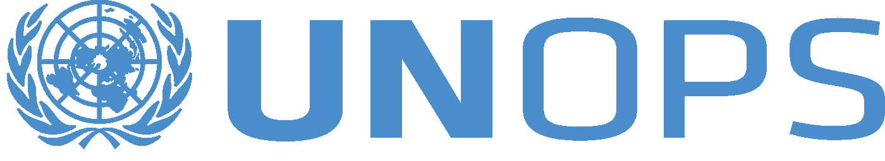
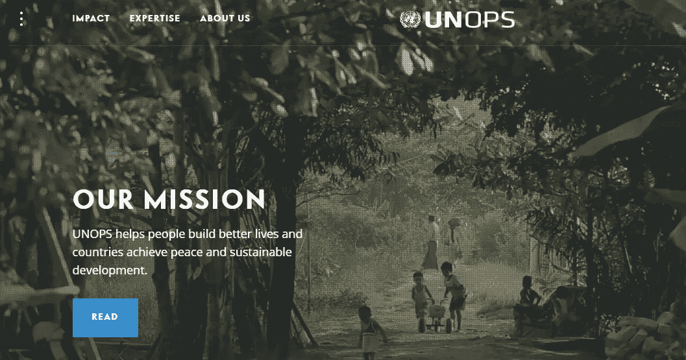
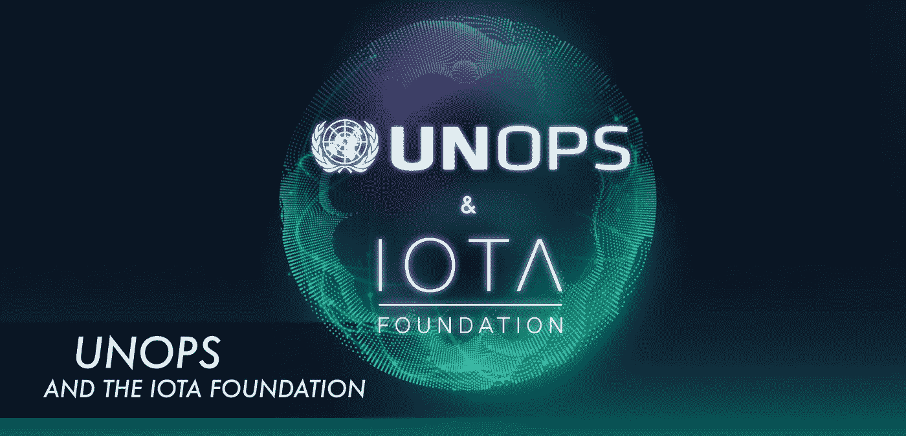

# IOTA 和项目厅的重要合作

> 原文：<https://medium.com/coinmonks/iota-and-unops-an-important-cooperation-4ec3ecd8b81b?source=collection_archive---------5----------------------->

5 月 22 日，项目厅与 IOTA 基金会签署了合作启动协议。在许多情况下，我只是在报纸上看到 IOTA 与联合国合作。我想通过这篇文章来更仔细地审视这些事实，并带来更多的澄清。

我已经在几篇[文章](/@markusgebhardt/iota-and-iota-applications-help-save-our-planet-and-create-a-more-peaceful-world-de588acba4d)中写道，IOTA 有潜力为解决我们这个时代的重要挑战做出贡献。全球方法，结合跨境真实世界 IOTA 应用、大数据和工业 4.0，为用户在全球背景下进行连接铺平了道路。IOTA 作为加密货币和数据载体的能力可能会对人类产生巨大影响，并带来一场真正的革命。这场革命可以将全球人民和用户聚集在一起，并有助于和平共处。这种全球办法建立了与项目厅的联系，

UNOPS Logo

**什么是项目厅？**

联合国项目事务厅(项目厅)是联合国的一个业务部门，致力于为联合国系统、国际金融机构、各国政府和世界各地的其他伙伴实施项目。总部设在哥本哈根的联合国项目事务厅(项目厅)于 1995 年从联合国开发计划署(开发署)分离出来。在联合国系统内，项目厅现在是一个独立的发展合作服务组织，将联合国的原则与私营部门的效率相结合。

项目厅本身并不资助项目，但受联合国机构和其他捐助者的委托，执行具有成本效益的发展方案。自 2008 年以来，项目厅通过接管其他联合国附属机构，也在联合国系统的采购中发挥了核心作用。该办公室完全通过其收入自筹资金。

**项目厅提供什么服务？**

项目厅每年在 80 多个国家为其合作伙伴实施价值超过 10 亿美元的和平与安全、人道主义和发展项目。其活动范围广泛，从管理阿富汗的学校建设，到在海地建造庇护所，再到采购救护车以支持利比里亚的埃博拉应对行动。

项目厅在其五个核心专长领域提供实施、咨询和交易服务:

基础设施

采购

项目管理

财务管理

人力资源

项目厅向一系列合作伙伴提供专门服务，包括:联合国及其机构、基金和方案；国际金融机构；政府；政府间组织；非政府组织；基金会；和私营部门。

2016 年，项目厅为受益人创造了 300 多万个带薪工作日。本组织支持其合作伙伴建设、设计和/或修复 3 000 多公里的道路、50 所学校、74 所医院和 278 个诊所等。

UNOPS Website: [https://www.unops.org/](https://www.unops.org/)

**目标显示在项目厅** [**网站**](https://www.unops.org/) 上

> “项目厅注重实施，致力于联合国价值观。我们支持我们的合作伙伴努力为世界上一些最具挑战性的环境带来和平与安全、人道主义和发展解决方案。
> 
> 虽然项目厅可以扩大实现所有可持续发展目标的能力，但重点始终是由人、合作伙伴和国家的需求来确定的。"

**项目厅和 IOTA 基金会合作**

*IOTA 基金会和项目厅于 22 日签署了谅解备忘录。2018 年 5 月。* [项目厅新闻稿](https://www.unops.org/news-and-stories/news/unops-and-iota-collaborate-to-bring-transparency-and-efficiency-to-un-work)称:

“这两个组织合作探索 IOTA 的创新技术——为数据管理提供开源分布式分类账——如何提高项目厅的运营效率。

> “我们有一个共同的愿景，机器、设备、传感器和人可以相互连接和交流，这就是‘工业 4.0’的世界。”项目厅区块链技术特别顾问 Yoshiyuki Yamamoto 表示:“利用技术使这些过程同时进行，而不需要中介，这将有助于加快我们作为一个组织的使命。
> 
> IOTA 联合创始人张秀坤·希内尔对合作表示欢迎，他说:“我们很高兴能与项目厅开始合作，共同应对当前和未来的挑战。IOTA 基金会完全致力于将 IOTA Tangle 投入到重要的人道主义和发展事业中。”

IOTA 的分布式分类账可提高实时管理和跟踪联合国文件、供应链和交易付款的效率，项目厅及其合作伙伴均可访问。"

Source: [Julie Maupin](https://blog.iota.org/@julie_13810?source=post_header_lockup): UNOPS and IOTA collaborate to bring transparency and efficiency to UN work

这种伙伴关系是全球方法的重要组成部分。发展中国家的人们将无法使用 IOTA，项目厅需要指导他们并建立第一个结构，这是一个至关重要的角色。我祝愿这一伙伴关系有一个美好的未来。

## 您对 coffee 和[公共 IOTA 项目](http://publiciota.com/)的支持

请记住，我们是一个独立的小团体，没有财务空间。我们感谢对这个项目的任何财政和其他援助。

一杯咖啡总是有助于让漫漫长夜变成美妙的夜晚，如果你喜欢我们的项目，我们很乐意得到你的支持！非常感谢！

IOTA 地址:pnhbwsysovlecdpxigvgmqyhcyl 9 hikwzeymjctpqjmijhcvrjzwhpawadrojwbbbhrcqzjnkqoguqcxrkskcjkww

“公共 IOTA 项目”不是 IOTA 基金会的一部分，也不与任何其他方式相联系，它是一个支持 IOTA 及其应用的独立项目。

联系人:info@publiciota.com