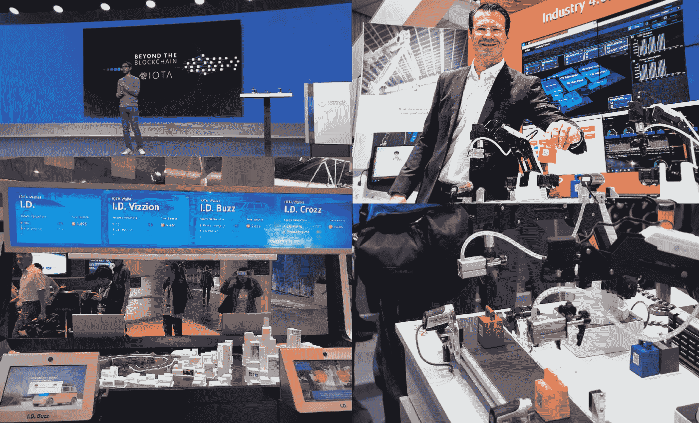
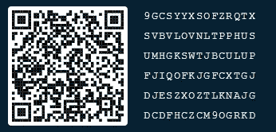

# IOTA 扩大工业合作伙伴关系…

> 原文：<https://medium.com/coinmonks/iota-expands-industrial-partnerships-13b6d7145ad0?source=collection_archive---------3----------------------->

本文描述了 IOTA 当前的主要工业伙伴关系。在这方面特别值得一提的是与博世、大众和富士通的伙伴关系。今年是一个真正的 IOTA 节日，在各种展会和活动中展示了伙伴关系和合作。

IOTA demonstrated at various fairs and events in 2018

**博世全球合作伙伴**

首先，在博世互联世界 2018 上，张秀坤·希内尔向大量专业观众介绍了 IOTA。这里展示了 IOTA 的优势，并强调了博世与 IOTA 之间的合作。

Dominik Schiener at the Bosch Connected World 2018

在 IOTA 的帮助下，汽车供应商博世希望影响汽车和物联网领域的价值链。罗伯特·博世风险投资有限公司(RBVC)投资了数字加密货币 IOTA。根据该公司的一份声明，RBVC 已经获得了“大量”IOTA 令牌。

## 博世描述了物联网:

“物联网(IoT)的物理本质是数十亿台互联设备提供数据(在许多情况下是实时的)，并将数据发送回能够远程自动控制该物理基础设施的企业。
物联网的神奇之处在于它使互联世界成为可能:随着连接设备的技术变得更小、更便宜、更快，这个世界变得越来越大。
物联网不仅仅是一次技术变革，它正在创造以服务和用户体验为中心的新型业务。这将对我们的组织结构和合作方式产生巨大影响。虽然这些变化只会一小步一小步地发生，但它们会很快到来，并产生巨大而持久的影响。"

Bosch XDK

顺便提一下，去年年底，博世在芝加哥 I [OTA 市场会议](http://untangled.world/bosch-xdk-using-iota-mam-masked-authenticated-messaging/)上推出了新的传感器 XDK 或跨域开发套件，从而在物联网(IoT)即机器对机器(M2M)方面又迈出了一步。并演示了与 IOTA 和 Tangle 的交互。

**拥有众多品牌的汽车公司**

在 CEBIT 2018 上，德国汽车制造商大众与 IOTA 一起展示了一种新的概念证明。这是关于使用 tangle 进行安全的软件传输。大众汽车希望将这项技术整合到其产品中。这是确保所有汽车获得运行特定更新所需的数据并作为不断增长的数字世界的一部分的一种方式。这也对无人驾驶和自动推进的自动车辆产生了影响，因为该行业正努力成为未来的模式。

利用所发现的方法，人们打算用 IOTA 的缠结来记录软件通过无线电波向车辆的传输。Jungwirth 称之为“分布式账本技术在未来应用的一个很好的例子。”

IOTA demonstration at CEBIT 2018

除了预计 2020 年道路上行驶的 2.5 亿辆联网汽车外，75%的汽车将具有互联网连接。

大众集团首席数字官 Johann Jungwirth 今年加入 IOTA 团队，成为监事会成员。该计划是为了互惠互利而合作，其中基金会受益于 Jungwirth 的经验，并探索 Tangle 的可能性。

**富士通:140，000 名富士通员工为 100 多个国家的客户提供支持**

作为 IT 服务提供商，富士通希望向其制造业和汽车行业的客户提供其 IOTA 测试项目。富士通工业 4.0 能力中心的项目经理 Leopold Sternberg 表示:

“富士通完全有能力引入 IOTA 作为新的协议标准，因为我们都是 IT 服务和制造 IT 产品的专家。”

值得注意的是，富士通已经将 IOTA 视为新的协议标准。显然，富士通不再怀疑 IOTA 将在工业 4.0 中发挥关键作用。

时任富士通中欧负责人的 Rolf Werner 博士在 HMI 2018 上使用了富士通现场展示案例的例子来解释智能工厂如何工作以及 IOTA 提供了什么:代表两家工厂的两个微型机器人将用于演示形成分布式账本基础的纠结如何帮助识别和自我驱逐产品操纵。

Fujitsu Live Show Case at the HMI 2018

4 月，罗尔夫·沃纳博士加入了 IOTA 基金会的董事会。他对主要应用的描述如下:“基于 IOTA Tangle 作为分布式账本技术的分散和安全应用的可能性是巨大的。它们远远超出了机器对机器的支付，例如，包括供应链的防篡改监控和安全身份管理等。我很高兴加入 IOTA 基金会监督委员会，为全球许多行业提供一次有意义的旅程。”

Dr Rolf Werner talks about IOTA technology

**公共 IOTA 将密切关注进一步的发展**

这些大型的工业合作伙伴，以及更多的合作伙伴，将会成为 IOTA 大规模应用的支柱。第一款使用 IOTA 的 Tangle 的大众产品预计将于明年某个时候发布。

我属于独立的公共 IOTA 项目，希望推动 IOTA 和 Tangle 向前发展。公共 IOTA 将密切关注进一步的发展并就此进行报告。请记住，我们是一个独立的小团体，没有财务空间。我们感谢对这个项目的任何财政和其他援助。

一杯咖啡总是有助于让漫漫长夜变成美妙的夜晚，如果你喜欢我们的项目，我们很乐意得到你的支持！非常感谢！

IOTA 地址:9 gcsyyxsofzrqtxsvbvlovnltpphusumhgkswtjbculupfijofkjgfcxtgjdjeszxoztlnknajgdcdfhczcm 9 ogrkd

Trinity QR-Code von publicIOTA — Thank you for yor Donation!

“公共 IOTA 项目”不是 IOTA 基金会的一部分，也不与任何其他方式相联系，它是一个支持 IOTA 及其应用的独立项目。

联系人:info@publiciota.com

> [在您的收件箱中直接获得最佳软件交易](https://coincodecap.com/?utm_source=coinmonks)

