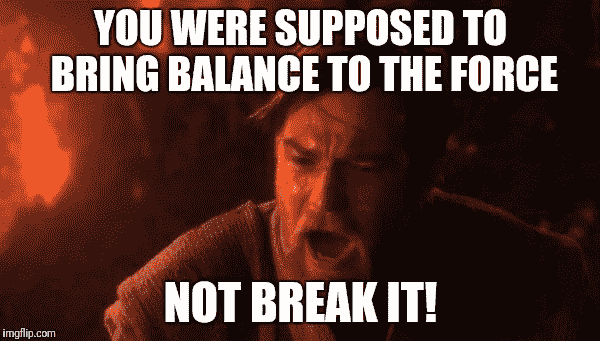

# 我经历了一个真正的白痴

> 原文：<https://medium.com/coinmonks/iota-experienced-as-a-real-idiot-ec72e872f753?source=collection_archive---------0----------------------->

## 为真正的白痴解释的 CAP 定理

IOTA 不是你正常的日常比特币源代码分叉区块链。IOTA 更像学校里那个疯狂的书呆子，真的很不同，你不知道他以后会不会成为比尔·盖茨或者只是某个肥胖的地下室居民。在区块链的世界里，IOTA 是如此的不同，它甚至不是区块链。等等，这不是区块链吗？不，这是一个有向无环图。或者简而言之，同样令人困惑的 DAG。我们应该永远记住，我们是真正的白痴，需要为一些令人讨厌的书呆子短语找到一些简单易懂的术语，以迷惑人们，让他们认为这是下一件大事。这是否意味着 IOTA 想欺骗人们认为它是下一个大事件？不，还是那个和学校里不一样的书呆子。我们还不知道他是否会成为比尔·盖茨或者只是一个肥胖的地下室居民。不要误解我，我不想贬低肥胖的地下室居民。我喜欢他们在 4chan 上发布的内容。只是我不希望我的新技术由他们制造，只要还有比尔·盖茨在那里。

Not only does IOTA redefine trust, value and ownership, it also feels like a train running through our head.

好的，那么这个有向无环图是什么？图是节点指向其他节点的东西。例如，如果你有这些图片，节点问“这项投资会在几周内收回成本吗？”，则一个箭头指向另一个节点，用“是”表示，另一个箭头指向另一个节点，用“否”表示。这些连接是有方向的，因为它们是单向的。用“是”回答这个问题，你就进入了下一个节点，它会问你“这个投资机会是不是叫做‘智能金字塔高收益项目’之类的东西，你喜欢吗？”“你又会被引导到其他一些节点。在结尾有一个结论节点，比如“是的，你被骗了”。

This is a directed acyclic graph

接下来的事情是无循环的。它只是意味着非循环，因此没有连接或让我们称之为边，可以直接到一个节点，你以前访问过。既然我们已经知道了 IOTA 是什么样的图，我们应该记住什么是区块链。

> 区块链以块的形式存储网络中发生的所有事情。这些块以线性一维方式相互连接。下一个块是指当前块。

所以可以说区块链是一个有向无环图。但是有一点很重要，一个图允许一个节点有许多边将这个节点连接到多个其他节点。区块链中的块只有前一个和下一个块。所以一个有向边进去，一个出来。一些聪明的家伙现在可能会打断并说“等一下，福克斯怎么样？当分叉发生时，有两个不同的块指向与它们的最后一个块相同的块。是的，这是真的，但是在一个链条中，只有一个现实而没有另一个链条。分叉链在另一部分不存在。

这是不同的，基于 DAG 的区块链不是区块链，而是基于 DAG 的分布式总账。所以有人可能会想，它们不断地分叉，它们的块不仅仅指向另一个块。嗯，差不多了。因为不仅没有链，也没有块。块是事务的集合。网络必须同意一个块，然后这个块中的所有事务都是有效的，并且不能被改变，除了网络切换到另一个分叉链，但是对于这个特定的链，该块不能被改变。这些块是区块链的心跳，每当发现新的块时，所有网络节点都同意这个块，并从那里开始搜索下一个块。由于 IOTA 没有这些块，我们想知道人们是如何就有效事务达成一致的。

一个区块包含所有交易，如果这些交易是有效的，它可以很容易地被检查，这意味着有足够的资金，如果区块的提议者正确地解决了难题，它也可以很容易地被检查。对于提议者来说，伪造一个包含无效交易的区块是一个非常糟糕的主意，因为它会被拒绝，他的工作是徒劳的。那么，如果我们放弃这些街区，会有什么变化呢？不多。用户只是将一个事务推入网络，而不是一个块。网络必须验证单个事务，而不是整个块。好的，IOTA 是一样的，但是没有收集事务集的块，而是单独验证每个事务。嗯，是的，这一部分是对的，但现在下一个冲击来了。如何验证这些交易？靠采矿？不，IOTA 中没有矿工，答案是，新事务验证旧事务。这是如何工作的？如果您将一个新事务推入网络，您必须验证 2 个以前的事务。验证 2 个以前的事务意味着验证这些事务验证的每个事务，也验证这些事务指向的所有内容，以此类推。这意味着比特币中的独立实体、交易发起者和交易验证者在 IOTA 中是相同的。这真是他妈的天才。

Sometimes an image speaks for itself. The reader can decide if this is the case here.

在比特币中，插入整个采矿概念似乎很自然，我总是问自己，你还能做什么？这是激励人们验证交易的最简单的方法。这确实是个问题。总得有人做，但这是工作。如果没有人为工作付钱，就没有人去做。因此，比特币有一个未决交易的自由市场，矿商只需挑选收益最高的交易，将其放入下一个区块。为什么 IOTA 抛弃这部分那么天才？因为如果你设计了一个系统，你可以省去一些部件，那么这是非常好的。你常常只看到如何插入一个新的片段来解决一个问题，但不幸的是，新的片段产生了新的问题，而对于这些新的问题，你需要新的片段等等。所以让我们回头来理解这一切意味着什么。总之，我们没有每个人都同意的最新区块，而是一些交易，在混乱的前沿没有被验证，所谓的 tips。如果您推送另一个交易，您将验证 2 个交易，在您看来这是提示。在你看来是因为你不知道别人是否也验证了这些。它可能已经发生在一个遥远的节点，直到这个信息到达你已经过去了一段时间。**令人纠结的是这个由经过核实的交易和未经核实的信息组成的网络。**

Transactions in the tangle of IOTA, numbers are just a chronological iteration.

在上图中，交易 1–10 已验证，交易 11–15 为小费，未验证。让我们假设交易 14 是无效的，有人想用它进行双倍消费。现在一些其他用户想要推送新的交易，他们会意识到 14 是无效的，不会指向它并选择其他 2 个 txs。比如 12 和 15。纠结会越来越多，但 tx 14 永远不会被验证。所以这完全没有问题？这只是一个简单的例子。因为没有一个大家都同意的缠结的全局状态，缠结的一些遥远的分支可能独立地进化并生长一段时间，直到它们再次相互接触。也不能保证遥远的分支会再次相遇。随着时间的推移，它们越来越有可能走到一起，但是如果有冲突的事务，那么它们可能永远不会走到一起。这是 IOTA 的大问题。不存在每个人都同意的全球状态。为了解决这个问题，IOTA 基金会引入了**协调员**。这是一个特殊的节点，它将整个网络连接在一起。它不时地记下网络的特定状态，作为一个里程碑，并且它令人惊讶地被称为里程碑。每个节点都可以从那里开始同步。这实际上是这样一首曲子，它带来了新的问题，你可以引入新的曲子来解决它。为什么？因为协调人减少了分权。它应该给网络带来平衡，但也可能破坏它。

Anakin was the chosen one and he was supposed to bring balance to the force.

许多人认为 IOTA 中的协调器很成问题。我完全同意。我们不知道没有协调器 IOTA 是否工作。里程碑很重要，因为如果没有它们，分类帐的大小将会变得太大，以至于大多数节点都无法处理。它们还大大减少了同步时间。但是协调者也决定哪些独立的武器被丢弃，哪些幸存。这给了它很大的权力，它是由 IOTA 的创始人控制的。这是加密领域的人不喜欢的。让 crypto 如此伟大的是它的网络的分区容忍度和对审查的抵抗力。现在是介绍 CAP 定理的好时机。

This triangle is alsmost self-explanotry with the edges being labelled with C, A and P.

该定理指出，分布式系统不可能同时完全部署所有三个属性。这些属性是一致性(C)、可用性(A)和分区容差(P)。不幸的是，你想同时拥有这三者。

一致意味着对什么是真理没有争议。没有主观性，即使有，也只会持续很短的时间，一段时间后客观真理就会出现。例如，比特币的一致性非常高，因为一个区块要么有效并被接受，要么无效并被丢弃。有可能有更高的一致性吗？是的，在比特币中，区块不是最终的。它们的终结性随着时间增长到“如此终结，以至于需要比地球上可用的更多的工作来撤销它”，但也有区块链在它们被张贴后就有终结块。因此，它们的一致性更高。那么 IOTA 怎么样？嗯，低浓度。不存在人人都同意的全球状态。只有在里程碑之后。你只看到了网络的一部分，这与你的想法一致。对其他人来说，另一部分可能是一致的。如果您等待几分钟或几个小时，那么一个小时前的所有内容现在对您来说可能是一致的，但是当然已经有新的事务了。

接下来是可用性。这主要意味着，网络的可用性是多么的惊人。每笔交易都会处理吗？如果是的话，那么它是非常可用的。在大量的交易中会发生什么？txs 最后会排很长的队，最终被永远丢弃吗？如果是，可用性低。我们在这里看到， ***比特币可用性低，IOTA 可用性巨大。***IOTA 中没有像块大小和块间隔这样的限制。当然，如果节点不能跟上所有事务，就会出现一个新的限制。这个限制不容易计算，因为它取决于所有因素，如带宽、网络拓扑和节点的计算能力。

那么只剩下分区容差了。这意味着，如果有一半的节点被切断，会发生什么？例如，因为长城防火墙切断了它们。网络会停止吗？交易是否丢失？网络能够恢复还是继续，网络分裂不是真正的问题？事实上，这对密码非常重要。如果您只追求高一致性和高可用性，那么您可以运行一个分片数据库，这很好。只有对分割的宽容才会带来审查抵制和权力下放。这就是为什么同样的人说瑞波甚至不是一种真正的密码货币。因为该网络由瑞普实验室运营。如果瑞波实验室被美国政府接管了怎么办？这也是涟波令牌的结束。另一个例子是 NEO，7 个节点，大部分在中国，几周前，我们已经看到一个节点停止意味着整个网络停止。为了获得较高的分区容差，您的网络必须能够工作，即使您切断了它的大部分。没有协调者，IOTA 在这方面是相当好的，有协调者，它看起来更糟。相比之下，比特币在这方面表现非常好。它是无权限和分散的，唯一的问题是随着时间的推移，采矿已经变得集中，而且看起来这不会很快逆转。CAP-定理是一个很好的东西来分类一个新的密码货币或密码平台。以太博物馆怎么样？嗯，它有 PoW，就像比特币一样，所以和比特币完全一样。

Partition tolerance is very important. Because every time the network halts god kills a crypto-kitten.

哪些房产是最重要的？这取决于你想做什么。如果你想建立一个分散的交易所，那么你需要一致性。如果您必须等待 30 分钟，直到您知道某个交易有效，那么您的 DEX 上的交易需要很长时间。如果您想连接全球数十亿台交换一些价值和大量数据的机器，您需要大量的可用性。如果你想拥有一个非常安全的价值存储，比如说数字黄金，那么你需要分区容忍度，达到一个网络可以在核战争后再次产生并运行的水平。不同的需求意味着不同的房产应该受到青睐。对于一个运行 DEX 的平台来说，一些可互操作的 PoS 区块链可能是最明智的，例如，Cosmos、Dfinity 或 Polkadot，对于物联网 IOTA 来说，正如我们所看到的，这是有意义的，对于数字黄金比特币来说，这可能是一个很好的选择。既然我们在这里提到了互操作性，应该注意的是，IOTA 很难让它与其他区块链国家对话，因为没有全球性的国家。总是很难确定，交易是最终的，所以另一个区块链可以确定它们发生在 IOTA。但这是另一个大话题。

IOTA makes the windmill in our head spin

在我被 IOTA 的概念激动之后，我尝试了一下。我尝试了钱包，运行了无头节点，并与社区进行了交流。开始时，这是一个真正的痛苦，没有什么真正的工作，这是非常困难的启动节点和钱包有很多错误。运行一个节点是可怕的。在 Ubuntu 上我没有让它工作，它只在 Antergos (Arch)上工作。没有自动邻居发现？Wtf。在比特币或以太坊中，当你启动客户端时，它会自动找到邻居并与之连接。大多数用户可能甚至不知道这发生在后台。在 IOTA 中，您必须进入一个松弛通道，并找到一些其他节点进行连接。我不明白为什么这个繁琐的过程是必要的。过了一段时间，我了解到这是为了防止西比尔发作。Sybil 发作就像带着 200 个朋友去参加聚会，并封锁酒吧，直到啤酒价格降低。由于 IOTA 是无权限的，所以有人可以启动数千个节点，连接到网络，然后通过冻结节点使网络停止运行。如果没有自动的邻居发现，则需要大量的连接工作，因此无法实现自动化。另一方面，人们被激励连接到相同的节点并保持他们的节点运行。此外，发布的新版本越多，它们就越不起作用，java 必须是另一个版本才能使 IRI (IOTA 参考实现)起作用，以及在使用 beta 或 alpha 软件时会遇到的所有此类问题。通常你在开发这样的软件时会遇到这些问题，一旦你设置好了，运行它应该就可以了。但绝不是。这比运行一个比特币或以太坊节点要麻烦得多。如何使用 API 和 IOTA 编程？这是确定的，不是超级开发人员友好，但不是真的很难。我从来不明白为什么他们依赖三进制，一些奇怪的原因被到处提出，但没关系。唯一让我信服的是，他们来自开发使用三进制的芯片，在以后的某个时候，他们想出售这种芯片，这种芯片的速度非常快。物联网设备可以使用这些芯片来节省电力。如果这是真的(我不知道)那么我不喜欢它。我认为人类选择二进制是有原因的。然后也有一些被冻结的账户，要收回哪个帽子，我没有这个问题，但是很奇怪。一些人声称 IOTA 不安全，并且他们的散列函数不好。他们设计了自己的散列函数，但是在评论之后他们改变了它。好吧，我不知道为什么你做你自己的散列函数，而不使用一些已证实的函数。IOTA 团队给出的答案是，为了有一个复制猫保护，这是必要的。好吧，这可能是真的，但还是很奇怪。12 月下旬，IOTA 开始成为一件大事。人们完全吓坏了，与微软的合作和一切。后来有人说，不，不，这是假新闻。IOTA 团队从未说过这些等等。仍然有很多与大企业的合作。然后 slack 频道变得太拥挤，IOTA 变得不和谐，社区变得越来越像“当月亮，兰博现在，哦狗屎 IOTA 应该很快达到 10 美元，这是怎么回事？”。

The community of every big crypto project in a nutshell

现在 IOTA 已经大宣布“ **qubic** 要来了。什么是 qubic？我们不知道。我们只看过一个励志的视频，没有任何口语文字，只有一些底部的流行语和牛逼的动画。这让我想起了 12 月，当时他们宣布，很快就会有令人敬畏的消息，然后宣布了令人敬畏的合作伙伴关系，并(部分)撤销。发布的关于 qubic 的新视频是我目前不喜欢的加密空间。似乎营销、戏弄和炒作才是最重要的。他们放弃了“神谕”、“智能合同”和“外包计算”这些词。好的。他们是怎么做到的？有白皮书吗？我真正喜欢加密空间的是，人们发布他们的白皮书，解释他们想如何做某事，你可以想想这有多难，是否有意义。但最近人们不在乎了，一切都是为了炒作。与此同时，David snsteb 经常在讨论中发飙，声称 IOTA 更优越，因为它可以处理无限的事务，而事实上它不能，我们只是不知道它能处理多少。同样的道理，IOTA 越大越安全，越好。这在 IOTA 社区中非常频繁地重复，并且仅对于交易需要被确认的时间的统计方差是真实的。但是除此之外，我不明白为什么网络在增长的时候会变得更快。我认为它会更慢，因为事务传播到所有节点需要更长的时间。所以回到我最初的台词，我持怀疑态度。我在 IOTA 中看到了巨大的潜力，但是我们只是不知道它是否像预期的那样工作，以及协调器是否可以被关闭。qubic 宣布的功能听起来不像是协调器将很快关闭，更像是它将永远是必要的。所有这些是否意味着是肥胖的地下室居民推动了炒作浪潮？不，我们只是不知道。时刻牢记 IOTA 是新的，是有进步的。如果进展像比特币一样缓慢，我会非常怀疑，但也许 IOTA 团队提供了服务，炒作是合理的。我们会看到的，我很兴奋。

Yeeeees qubic. I have no fucking clue what it is, but it looks awesome.

编辑:
我完全忘记了一件重要的事情:费用。这是人们谈论 IOTA 时经常提到的事情。讨论主要围绕着“IOTA 不收费，就是优越！”“我一点都不在乎，你这个白痴！！11 一个”。因此，IOTA 不收取任何费用，也就是说，你必须支付一些货币才能进行交易。为什么比特币等这么多都有这样的费用？因为这是必要的垃圾邮件防护。有时这个概念也被称为“hashcash”。这个概念最初的想法是，如果已经计算了一些散列值，则只允许发送电子邮件，这样垃圾邮件发送者就不能发送无限的电子邮件。因为你用这些 hashs 支付，他们称之为 hashcash。现在 IOTA 也这样做了。如果你发送一笔交易，你必须解决一个典型的工作证明难题，就像矿工在比特币中做的那样。所以，是的，你必须支付一些东西来发送交易，如果你称之为费用与否，在我看来是不相关的。如果你的立场是，费用只是向某人支付的费用，那么 Ripple 也是没有感觉的，因为你烧了 XRP。这个概念仍然有一些很棒的地方。因为寄件人和由寄件人付费的矿工之间没有区别，所以没有费用流失。在比特币中，如果交易太多，费用就会攀升至荒谬的水平，矿商实际上希望这种情况发生。总之，这种荒谬的事情不会发生，这显然是一个优势。另一方面，强迫物联网设备进行计算来发送 txs 似乎很不直观。如果这些设备是远程的，用电池供电，你不会想用电池的剩余电量来供电。但我认为这服务于使用 IOTA 为物联网设备销售一些三元 PoW 芯片的最终目标。

