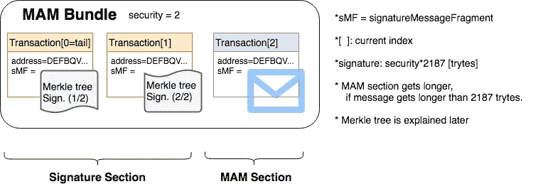
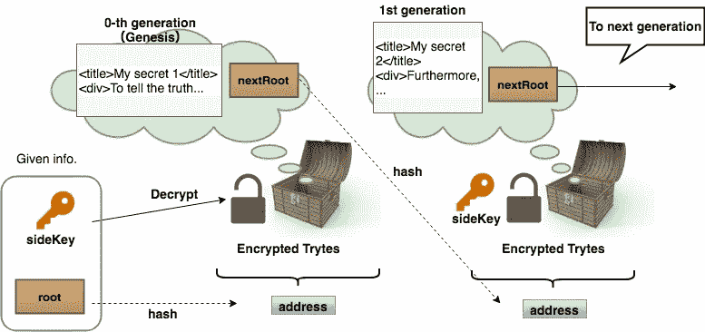
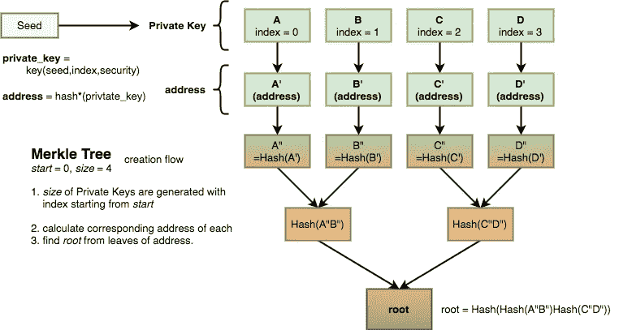
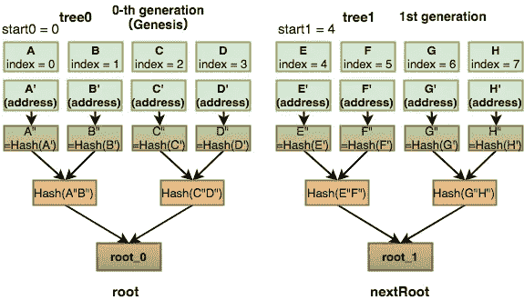
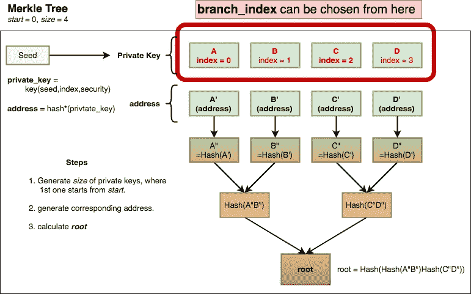
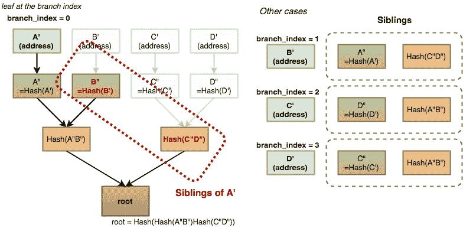
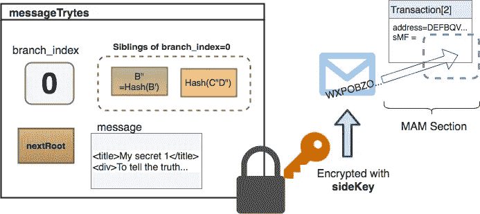
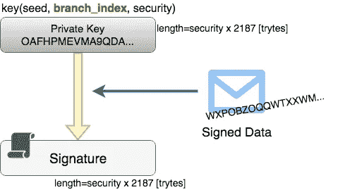
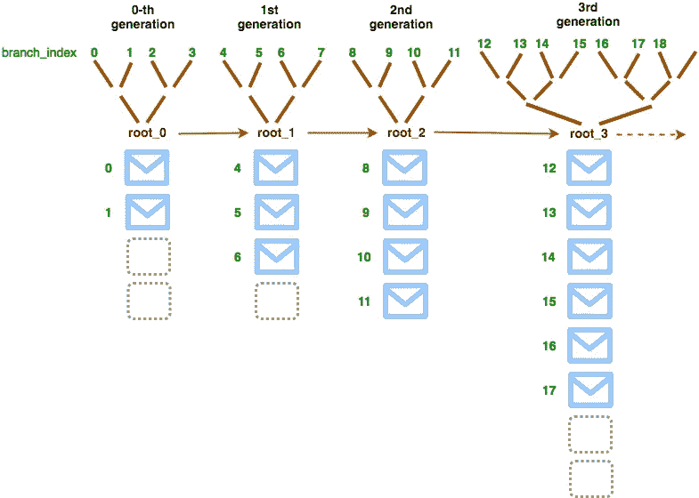

# 妈妈雄辩地解释道

> 原文：<https://medium.com/coinmonks/iota-mam-eloquently-explained-d7505863b413?source=collection_archive---------0----------------------->

屏蔽认证消息是 IOTA 最显著的特征之一。让我们推测这个充满小型物联网设备的世界，它们的小型工作、微观数据流动和纳米支付在全球各地来来去去。

IOTA 的目标是成为这样一个社会的最基本的一层，它是这个时代最有远见的项目，挑战即将到来的范式转变。MAM 是其核心驱动力，通过使数据流和交易更便宜、更安全和无处不在，使 IOTA 区别于其他分布式分类账。

然而，尽管 MAM 对 IOTA 及其未来非常重要，但由于它仍处于开发阶段，因此公众可获得的关于其技术实现的信息非常有限。

本文以尽可能易懂的方式揭示了这一点，以便更多的人能够理解这一新技术。

> [发现并回顾最佳区块链软件](https://coincodecap.com)

# 主频道

像 Youtube 和其他媒体一样，MAM 也有**频道**，发布者和订阅者可以在这里见面。观众订阅频道以获取可用数据。频道所有者在他们自己频道上发布新数据。这种所有权由 **Seed** 在 IOTA 中实现和保护。如果你告诉别人你的种子，他们可以在你的频道上发表他们的任何消息。同样，Seed 拥有其 81%的隐私权和财产权。千万不要暴露，安全存放。

# 通道方式

发布者在渠道上发布新消息时，有三个选项可供选择。**公开:**所有人都可以查看，**私人:**只有您(即种子所有者)可以查看，**受限:**您可以通过告诉他们一个密钥来指定您的查看者。这个键在源代码中被命名为 **sideKey** 。所以，在这篇文章里，我也要把这个键叫做`***sideKey***`。并且，对于任何模式，将作为消息标识符的`***root***`给予观看者，以便从 tangle 中找到消息。

> ***公开:*** *屏蔽——消息使用* `*root*` *解密。*
> 
> ***私:*** `*address＝hash(root)*` *。使用* `*root*` ***解密被屏蔽的消息。***
> 
> ***受限:*** `*address＝hash(root)*` *。使用* `*sideKey*` *解密屏蔽的消息。*

# 消息链

在 IOTA 协议中，像许多其他密码一样，人们可以在交易中附加任意消息。但是，一点感觉都没有！然而，它限制了发送者一次只能附加一条消息，并且不能发布具有任意上下文的连续相关消息。

例如，如果你想每 15 分钟发布一次当前温度数据，没有 MAM，你必须将每条消息都发布到同一个地址。因为包括 tangle 在内的任何分布式分类帐都是公开可访问的，所以附加者很容易识别这样一个每 15 分钟更新一次的地址，并干扰它进行垃圾邮件交易。即使您决定在每次发布新数据时更改地址，您也必须跟踪所有地址。仅在网上存储信息而言，监控它们的成本相对较高。

然而，由于 MAM 的**消息链**设计，我们可以保护我们的频道免受任何令人不安的垃圾邮件，并让我们从管理累积地址中解脱出来。

MAM 将每一条消息发送到不同的地址，但是用详细的信息将它们连接起来。在这条消息链上，一代**到下一代**的**到**，旧的消息总是导致新的。它的流动是单向的。

# MAM 束的基本结构

MAM 包大致有两个部分，**签名部分**和 **MAM 部分**，每个细节将在本文后面解释。他们的数据被存储为捆绑包中交易的`signatureFragment`。签名用于 MAM 的所有权，并因此检查其有效性。MAM 部分存储实际的屏蔽消息。



# 地址:存放 MAM 的地方

存储屏蔽消息的地址从`root`开始散列。哈希是一种复杂的计算，在这种计算中，人们无法通过知道输出来猜测输入是什么。

```
if (channel.mode !== 'public') {
    // private, restricted mode
    address = Crypto.converter.trytes(Encryption.hash(81, Crypto.converter.trits(mam.root.slice())));
} else {
    address = mam.root;
}
```

> ***注意:***
> 
> *保罗·汉迪的* [*文章*](https://blog.iota.org/introducing-masked-authenticated-messaging-e55c1822d50e) *显示受限模式地址=* `*hash(root+sideKey)*` *。但是，从上面的源代码可以看出，地址=* `*hash(root)*` *。所以，在本文中，我将解释为地址=* `*hash(root)*` *为受限模式。这可能与事实有出入，所以如果任何对此有详细了解的人。请评论或联系我。我很感激。*

# 公共模式

> `*root*` *是称呼。* `*root*` *是加密&的解密密钥。*


`nextRoot`是指向下一条消息的连接指针。当一代被屏蔽的消息被解密时，未被屏蔽的消息包含`nextRoot`,用于查看者找到该频道的下一代消息。简单来说，就像你在第一个宝箱里找到了打开第二个宝箱的钥匙。重复地，人们可以从渠道起源开始追踪链条上的所有信息。如果你是中产阶级，你可以从这一点开始阅读链。不能回溯看到过去的消息。

# 受限模式

> `*hash(root)*` *是称呼。* `*sideKey*` *是加密&的解密密钥。*



主要思想与公共模式相同。唯一的区别是`sideKey`被用来解密被屏蔽的消息。没有`sideKey`的人可以用`root`找到消息的位置，但是不知道那里装了什么。

# 渠道所有权

考虑以下情况:

Alice 刚刚在她的频道上发布了她的第一条消息，并希望 Bob 阅读她的帖子。于是，爱丽丝给了他她的`root`和`sideKey`。鲍勃通过生成地址(= `hash(root)`)并用`sideKey`解密来访问她的消息。鲍勃很喜欢她的帖子，心想“下一篇想看吗！”。并且他在解密的当前消息中有`nextRoot`，并且可以从中生成下一个地址。但是，他意识到爱丽丝还没有在下一个地址发布下一条消息。鲍勃突然变得邪恶。他有`nextRoot`和`sideKey`。他可以将他用`sideKey`加密的消息投递到地址`hash(nextRoot)`。他可以劫持爱丽丝的频道。

你认为这行得通吗？从目前解释的信息来看，没有矛盾。...然而，这是妈妈的失败。别担心，MAM 是为像 Bob 这样的人设计的，所以他们不会搞乱频道。下一个主题是爱丽丝如何防止她的信息链被其他人编辑。

这里我们需要妈妈的签名。

# 基于 Merkle 树的签名方案

基于 Merkle 树的签名方案是在 MAM 中使用的技术。更多感兴趣的可以去链接。

# MAM 发布 101: `root`

`root`是 Merkle 树的根。要得到`root`，首先要创建 ***Merkle 树*** 。而 ***种子*** 是用来创建 Merkle 树的。

Merkle 树有整数参数`start`和`size`。这些表示从种子生成的地址的索引。回想一下，当生成地址时，我们将`index`作为参数之一(`seed,index,security`)。最近解释的[这里的](/@abmushi/iota-signature-and-validation-b95b3f9ec534)。

A、B、C、D 后面分别是用`index = 0,1,2,3`生成的私钥。和 A’、B’、C’、D’是对应地址。



那么 A”、B”、C”、D”都是`hash(address)`。直到`root`，通过散列每一对的组合来缩小范围。请注意，您无法从`root`中获取上一个。

现在，我们有了`root`。在公共模式下，这个`root`直接作为 MAM 地址，在其他模式下，address = `hash(root)`。

# MAM 发布 102: MAM 部分

***MAM 部分*** 包含发布者将要发布的屏蔽消息、他/她的原始消息、任意长度的 ascii 码串。但是，在附加之前，它应该被转换为 tryte(使用库函数`toTrytes(ascii); // from asciiToTrytes.js`，并存储为`message`。

# MAM 发布 102: MAM 部分— `nextRoot`

为了张贴一代的屏蔽消息，必须生成两个 merkle 树。第一棵树是现在这一代，另一棵树是下一代。

对于 Genesis 代(即第 0 代)，merkle 树`tree0`有参数`start0`和`count(= number of leaves)`。对于下一代(即第一代)，用`start1 = start0+count`和`count`生成 merkle 树`tree1`。



顺便说一下，每个 merkle 树可以有不同的大小。

# MAM 发布 102: MAM 部分— `Branch Index`

分支索引`branch_index`选自当前代 merkle 树的任意一片叶子`index`。在下面的例子中，merkle 树是用`start=0`和`count=4`制作的，所以`branch_index`应该是`0,1,2 and 3`中的一个。



# MAM 发布 102: MAM 部分-兄弟姐妹

比方说，给定了叶子`A'`，要获得`root`，你需要拥有其他所有叶子`B'C'D'`。但是，如果你不能访问这些，你怎么得到`root`？**同辈**是互补哈希的集合，通过与给定的叶子组合，可以生成`root`。看下图。



该图举例说明了`branch_index=0`的情况，其中仅给出了`A'`。在这种情况下，`B"`和`Hash(C"D")`都是获得`**root**`的必要条件。你不必有其他的叶子。

在这个例子中，`B"`和`Hash(C"D")`被称为 `**A'**`的**兄弟。在 MAM 中，它被称为** `**branch_index=0**`的**兄弟姐妹。不同的`branch_index`有不同的同胞。**

# MAM 发布 102: MAM 部分-已完成

在 MAM 段中，`message`、`nextRoot`、`branch_index`和`Siblings`的组合，称为`**messageTrytes**`，用`root(Public mode)`或`sideKey(Restricted mode)`加密。下图是 MAM 部分的受限模式加密示例。



# MAM 发布 103:签名部分

正如我提到的，为了检查 MAM 部分的有效性，发布者在包中添加了**签名**。签名存储在事务的`signatureFragment`中，这些事务在 MAM bundle 中称为 ***签名段*** 。

# MAM 发布 103:签名部分-签名

屏蔽消息的签名由私钥`=key(seed,***branch_index***,security)`创建。签名数据是 MAM 段的`messageTrytes`。这里解释[签名方案。](/@abmushi/iota-signature-and-validation-b95b3f9ec534)



# MAM 获取

要获取屏蔽消息，在受限模式下需要`root`和`sideKey`。

首先，根据给定的`root`计算地址。和地址的搜索包。然后解密找到的包的 *MAM 段*的`messageTryte`。公开模式的解密密钥为`root`，受限模式的解密密钥为`sideKey`。现在，从解密的数据来看，我们有`message`、`nextRoot`、`branch_index`、`Siblings`。

下一步是检查未屏蔽消息的有效性。现在，看看*签名部分*。签名段中的签名用于将 bundle 的 *MAM 段* 的`**messageTryte**` **验证为签名数据**。**此处解释[验证过程。](/@abmushi/iota-signature-and-validation-b95b3f9ec534)**

经过验证过程，得到的是 address，作为 merkle 树 index= `branch_index`的一个叶子地址，结合`Siblings`计算树的根，命名为`temp_root`。

**如果** `**temp_root**` **等于给定的** `**root**` **，则该非屏蔽消息为该通道的有效消息。**如果不是，则不是渠道所有者(=种子所有者)发布的。

> [直接在您的收件箱中获得最佳软件交易](https://coincodecap.com/?utm_source=coinmonks)

[](https://coincodecap.com/?utm_source=coinmonks)

# 链条叉

MAM 的消息链可以分叉。而且很容易分叉。对于您选择分叉的生成，您只需发布带有不同`branch_index`的消息。但是，一代中可以分叉的分枝的极限是一代的 merkle 树的大小。如果你分叉超过这个数，新的分支索引会溢出到下一代的`branch_index`中。您可以在子链之间设置不同的`sideKey`和通道模式。



# 快照

屏蔽消息存储在事务的`signatureFragment`中。因此，在消除所有事务和零余额地址的快照之后，在快照之前的所有 MAM 都被删除。

为了防止这种清除发生，MAM 存储在 ***Permanode*** 中，不做快照。尽管 permanode 需要大容量存储、高带宽和高速度，但目前它的运行没有任何经济刺激。我们的社区必须讨论如何维护 IOTA 的基础设施，并对其进行奖励以保持其稳定性。

# 参考

> **MAM JS 库***:*[*https://github.com/iotaledger/mam.client.js*](https://github.com/iotaledger/mam.client.js)
> 
> **IOTA github**T3:T5*https://github.com/iotaledger/iota.lib.js*
> 
> **介绍 MAM***:*[*https://blog . iota . org/Introducing-masked-authenticated-messaging-e55c 1822d 50e*](https://blog.iota.org/introducing-masked-authenticated-messaging-e55c1822d50e)

# 关于作者

@abmushi 在[推特](https://twitter.com/abmushi)上，不和谐

翻译自我用日语写的原文[这里](https://qiita.com/ABmushi/items/f49a431c5c4a94abf33c)

捐赠总是受欢迎和赞赏的！

BTC: `1ACGpgpAMgaAKbGpPq2sDa467MnRNdW4wX`

IOTA:g 9 xncnyyhrknpklxfkusinz 9 oiaqgsngjvodc 9 tnwqmilxzh 9 pnhxdgneufleqnnvjuciwwkzbtjldxayozhzesn 9

【gist.github.com】原载于[](https://gist.github.com/abmushi/61d65059689f10d4ac4e5571b4573cda)**。**

*[](https://coincodecap.com)*