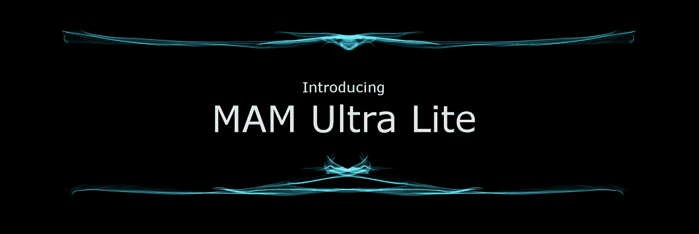

# IOTA MAM Ultra Lite

> 原文：<https://medium.com/coinmonks/iota-mam-ultra-lite-493d8d1fb71a?source=collection_archive---------1----------------------->

## 面向 IOTA 的最轻掩码认证消息协议



Created with [Silk — Interactive Generative Art](http://weavesilk.com/)

受 [MAM Lite](/@samuel.rufinatscha/mam-lite-a-more-flexible-messaging-protocol-for-iota-562fdd318e1d) 协议的启发，由[Samuel rupinatscha](https://medium.com/u/589112703eef?source=post_page-----493d8d1fb71a--------------------------------)编写的 IOTA 中 MAM 流的轻量级替代方案，我决定用 Python 重新实现它。这样做的时候，我无意中遇到了一些限制，这些限制源于 MAML 使用的 RSA 签名方案，因此我选择切换到另一个签名方案，[ed 25519](https://github.com/warner/python-ed25519)(NANO 使用的那个)。它具有短得多的公钥和签名，因此提供了几个优点，这将在后面讨论。努力的结果是有了 MAML_Ed25519 协议库(不，不是 MAMUL😃)，你可以在这里查看代码和例子[。
除了使用不同的签名方案之外，它具有相似的特征:](https://github.com/stkubr/MAML)

*   证明
*   前向保密
*   从每个地址进行流访问
*   频道分裂
*   AES 加密

现在我们来讨论一下区别。

## 首先，考虑 RSA 签名方案:

RSA 密钥可用于加密和签名，但它们相当长，例如，trytes 中的 RSA-3072 pubkey 和 signature 是:

因此，将 RSA 公钥与数据一起发送大约需要 1000 trytes，这只是目前的公钥，签名也需要大约 1024 trytes。请记住，Tangle 上的一个事务的长度为 2187 trytes，很难在一个事务中放入任何其他有意义的内容。处理这种情况方法是只保留 pubkey 的散列，并将 JSON 数据分割成块，放在一个包中的几个纠结的事务上，就像 MAML 所做的那样。

还有另一个缺点——仅提供公钥的散列需要预先知道相应的公钥**并存储它**,以便能够在 MAML 验证签名。否则，如果你中途加入一个公共流，你将无法验证和识别消息。潜在地，这可以通过下面的技巧来解决:

h(pubkey)→try tes[0:81]→Address→send _ tx _ to(Address)with _ data({ ' pubkey ':pubkey })

因此，任何知道 pubkey 散列的人都会知道在哪里搜索或*监听*相应的 pubkey，与散列进行比较并存储它。但是与传统的区块链不同，Tangle 经常自我修剪(现在更加频繁了)，所以有必要定期重播你的 pubkey。

最后，使用相同的 RSA 密钥同时对受限访问消息进行签名和加密可能会有问题，因为签名和加密密钥应该具有不同的生命周期。

## Ed25519 signature 的核心是短键和速度:

一分钟有多短？让我们来看看:

这是一个巨大的差异！现在，您可以为您的 JSON 提供 pubkey，而不仅仅是一个 hash，它具有与上面的 RSA-3072 大致相似的安全级别。

由于 Ed25519 不能用于加密，因此对于流内的细粒度访问消息传递，通信实体仍需要交换它们的 RSA 公钥，从而确保签名密钥和非对称加密密钥的不同生命周期。

作为结论，我想指出，这不是 MAML 协议“哪个更好”的争论，而是对统一 MAML 流的建议，这可以通过向 JSON 添加一个额外的字段来轻松完成:

```
{**'MAML_protocol': MAML_Ed25519 (or MAML_RSA)**
'data_payload': Some data here ....
'pubkey/hash': fgdwer8s7d6gdfg6d6fg8.....
'signature': fd7g9s8df7g98df7g...}
```

以便代码可以切换，并且与 MAML 协议的类型无关。

基于这个建议，我计划扩展代码，以便能够动态处理 Ed25519 和 RSA 流。代码库可以在这里找到。你可以通过 **stkubr#1936** 或 Twitter [@KubrakStan](https://twitter.com/KubrakStan) 联系我。如果你喜欢我的工作，想让我继续下去，请随时给我买瓶啤酒，地址是:

ehnqjbgfaiutjkpmsucsdmih 9 xthanmjbvezlfyuruxjuartgkg 9 kdbhtczhdkzzogt 9 engemhposlhpwxaelupsdx

感谢您的关注:)

**UPD** :是的，设计方案被破坏了——请看[这里](https://www.di.ens.fr/~pnguyen/pub_DuNg12a.htm)

> [直接在您的收件箱中获得最佳软件交易](https://coincodecap.com/?utm_source=coinmonks)

[](https://coincodecap.com/?utm_source=coinmonks)