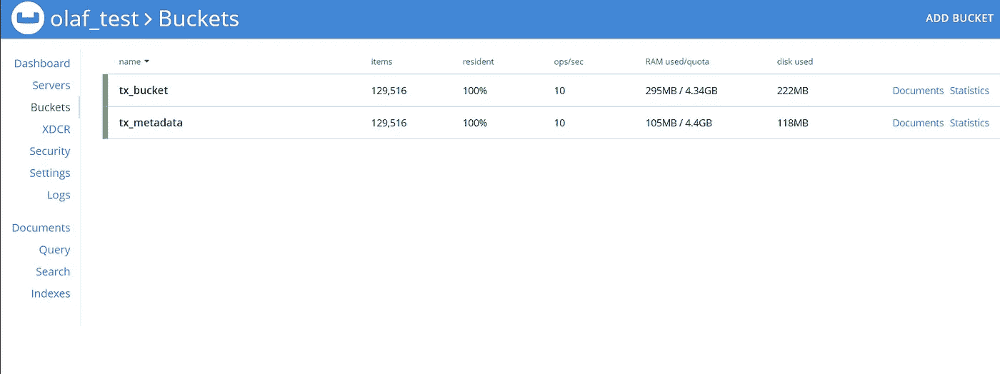

# IOTA 遇见 Couchbase

> 原文：<https://medium.com/coinmonks/iota-meets-couchbase-92cafe5eded2?source=collection_archive---------3----------------------->

## 离(半)永久节点又近了一步。

关于永久节点的讨论由来已久，而且似乎总是会卷土重来。随着本地快照的发布，越来越不确定您的数据是否会在混乱中存活超过 30 天。然而，有了本地快照，关注点的分离也成为可能！这真是太棒了！

对于我们的项目[www.mysoundsafe.com](https://www.mysoundsafe.com/)，就像许多其他项目一样，我们想要选择是否让数据在 tangle 上可用，或者不用于应用程序特定的目的。简单地说，快照是一个棘手的问题，当遇到这种情况时，随着本地快照被激活，在混乱中保持数据的活力变得越来越困难。理想情况下，我们希望有选择地保留数据并删除不想存储的内容，但要做到这一点，我们首先需要能够存储所有内容并从那里转移。

所以我决定进行一个小实验来实现一个不同于 RocksDB 和 ZeroMQ 的持久性提供者。**一个用于外部数据库 couchbase！。**

## 好处！

通过使用外部持久性提供者，我们可以保持 IRI 的运行实例相对较小，而不会牺牲存储和数据可用性功能。

*   我们可以运行多个使用集群后端存储的 IRI 节点，因此我们可以运行接近 100%的更新。
*   我们可以为 IRI 节点设置不同的角色:活跃的大部分活动的缠结和一些专门用于访问缠结的历史部分的 IRI 节点。
*   API 没变！
*   我们可以独立扩展后端存储服务，而无需关闭我们的 IRI 节点。
*   开启了对可以选择性存储数据的半导体节点的研究。

## 为什么是 couchbase？

几个月前，在一次创建 permanode 的大型社区活动中(当时 localsnapshotting 等都是未知的)，我已经写了一篇文档，其中包含了一些在本次讨论中仍然有效的考虑因素(宽列、图形、键值等与 CAP 的对比):[https://docs . Google . com/document/d/1 cnxv 8-auigxgxpc 0 ax _ WIfq _ Key 2 reuoreemptppo h 0/edit？usp =分享](https://docs.google.com/document/d/1cnXv8-aUigxgXpc0aX_WIfq_KEY2REouoreEMPtpOH0/edit?usp=sharing)

结论是，选择 RiakDB 带有个人偏见，与 couchbase 相比有更好的体验，并且更高级的特性是开源版本的一部分(如跨数据中心复制)。社区成员通知说，来自 Basho 的 Riak 团队遇到了一些麻烦，Riak 很有可能会停产。

那么现在…为什么选择 couchbase？

*   从文档中可以看出:键值存储对于复杂类型的数据来说是最好的全面存储。
*   Couchbase 有一个无主机设置，这意味着所有节点都可以参与写操作。这与 mongodb 等其他主从式设置相反，在 MongoDB 中写入是一个瓶颈。无母盘允许在读写时进行适当的水平缩放。
*   由于 tangle 本质上是异步的，后端节点和索引不立即一致不是问题。(它是写入器一致的，这意味着如果您向一个节点写入一些内容，同一个节点将拥有一致的数据视图和更新)
*   它允许键索引驱逐:大多数系统将主键保存在内存中。对于基数非常高的数据，这个特性对于控制不断增长的数据库系统的内存使用非常重要。(大部分数据未使用)
*   设置和管理非常简单
*   它可以处理二进制数据，这很重要，因为以 UTF-8 编码的文本格式存储 Trits 在大规模上效率不高。
*   服务(存储、索引、缓存等)是独立可扩展的。对于每个特定用例的性能调优，这一点非常重要。

## 边注

这是一次努力，向我自己、我的声音安全和社区展示这是可以做到的，并且非常希望得到一些反馈。尽管大多数 API 功能工作正常，但该项目仍处于初级阶段(1 次提交),还远未完成。当前版本的一些补充说明:

*   还没有测试(所有以前的测试都通过了，并且是向后兼容的！)
*   它只在个人测试网上测试过(有 coo 和所有人),每秒可以轻松处理 40tx(有点欺骗了 MWM3)
*   我做 Java 已经是很久以前的事了，欢迎建设性的反馈；)
*   交易的排序发生了变化，在 IRI 中，排序取决于 IRI“看到”交易的顺序，而在 couchbase 中，排序基于交易 ID 的 ASCII 顺序 9 abcde……
*   可能会有更多的事情出现

## 自己测试一下！

遵循关于从 git 构建的正常安装说明，但是使用我的回购:[https://github.com/ovanwijk/iri](https://github.com/ovanwijk/iri)

在您的机器上安装 couchbase，创建两个存储桶:“tx_bucket”和“tx_metadata”，并向创建的存储桶添加一个具有应用程序权限的单独用户(不要害怕，使用 UI 真的真的很容易)，并手动执行这些查询注释来创建相对索引:

在“tx_bucket”上创建主索引；
在“tx_metadata”上创建主索引；
在“tx_metadata ”(地址)上创建索引 ix _ address
在“tx _ metadata ”( bundle)上创建索引 ix _ bundle
在‘tx _ metadata’上创建索引 IX _ trunk(trunk)；
在‘tx _ metadata’上创建索引 ix_branch(分支)；
在“tx _ metadata ”( tag)上创建索引 ix _ tag

将这几行添加到 iri.ini 中:

couch base _ ENABLED = true
couch base _ NODES = 192 . 168 . 1 . 100//但是然后你的节点 OFC
couch base _ USERNAME = IRI//与你的用户
couch base _ PASSWORD = testiri//和你的密码
couch base _ tx bucket = tx _ bucket
couch base _ METDATABUCKET = tx _ metadata

应该可以了！享受你的 couchbase 数据库后端！

如有任何问题，请随时联系我:Olaf van Wijk#1273

https://www.linkedin.com/in/olaf-van-wijk-519b9a13/

喜欢这份工作吗？

[Iota-pay 捐款链接:](https://iota-pay.net/#public/IOTAPAY000AKRRYXDOVKRPXH9KUBEATTKWYLUJATXLKRPXWP9ZQIDUAHWENCMGQKOLHETNMAMXHPOZBVGBTWOCAOCUS)或

qrqzrxpiq 9 kndveygpvcauqqccnau 99 tstcmczpxyhaftkfs sqerfnmtvkqlboyjekibvpojwrlqnthdblueejdaa

> [直接在您的收件箱中获得最佳软件交易](https://coincodecap.com/?utm_source=coinmonks)

