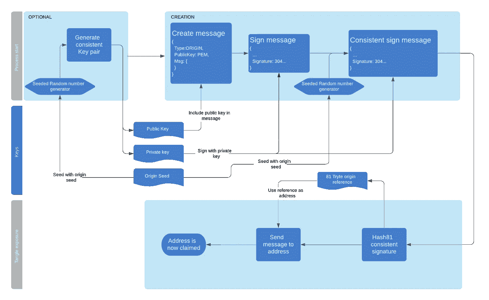
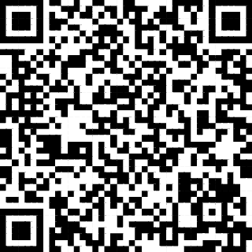

# IOTA 源

> 原文：<https://medium.com/coinmonks/iota-origin-d26b399d3cca?source=collection_archive---------2----------------------->

声明 IOTA 地址所有权的另一种可重用方法。

> 起源:“某事物开始、出现或衍生的点或地方。”

## 到底是什么问题？

IOTA 及其 tangle 采用了一种新的分布式分类帐方法，其结果是无费用和量子安全交易，并且没有理论上的缩放限制。由于这种无感觉性，IOTA 对于以数据为中心的应用程序非常有意义，这些应用程序不直接使用令牌(大约 99.9%的应用程序)，但需要 DLT 作为去中心化和透明的基础。

IOTA 中的所有东西都是一个将某些东西发送到某个地址的事务。这可以是令牌或数据。为了证明这些代币是你的，你必须花掉它们。但是除了屏蔽认证消息(MAM)之外，证明某些数据是你的数据的能力目前是不可能的。这里解释的很好:[https://medium . com/@ abmushi/iota-mam-雄辩-解释-d7505863b413](/@abmushi/iota-mam-eloquently-explained-d7505863b413)

为了创建 IOTA-Pay(捐赠问题的有效解决方案:【https://ecosystem.iota.org/projects/iota-pay】T2)，我广泛研究了 MAM，我的第一个原型也是基于 MAM。然而，MAM 是一个流方法，做得很好，但不完全是我所需要的。

我需要的是类似 MAM 根的东西，一种证明地址是“你的”的替代方法。所以类似于 MAM，但是更灵活，并且可以转移到其他地址，并且也可以在 tangle 之外工作，类似于:

> 这是我的地址，如果我在那里发送零价值交易，你可以肯定是我做的。

如果我指向另一个由我签名的 IOTA 地址，那么您可以肯定，针对该地址的 0 值交易来自同一个地址...**产地**。

我不会在这里详细介绍 IOTA Pay，但在它的创建过程中，我相信我创造了一些对整个生态系统极其有益的东西。一些非常灵活的东西，允许我们在以数据为中心的应用程序可以建立的混乱中创建新的起点或起点。但是让我们先深入了解它是如何工作的，最后我们将探索它的一些潜力！

## 它是如何工作的？

这是一步一步的解释，解释我们如何创建一个 IOTA-Origin 引用。该过程也用下面的流程图来描述。

1.  IOTA-Origin 的一切都是从一个 **Origin-seed** 开始。这个原始种子可以是字面上的任何东西，只要它足够随机、随机二进制数据、24 个随机字或者甚至是传统的 IOTA 种子。有了这个原点种子，我们就可以确定性地生成将作为 IOTA 原点的加密基础的公钥-私钥对。
2.  IOTA-Origin 的下一个过程是创建**起源消息**。源消息包含您认为对创建源引用很重要的信息，可以是任何东西:一些标识符、索引、版本、日期或一些其他声明/信息。最重要的部分是，公钥(或者它的散列，如果你喜欢它是私有的)也在消息中。通过在消息中包含公钥，消息将变得自我验证。
3.  此后，需要用相应的私钥对源消息进行签名。
4.  在创建一个正常签名后，**原点种子**被用于实例化一个种子随机数生成器(SRNG)。然后，该 SRNG 被用作构成原点引用的字段的签名过程的 RNG。通过使用这种方法，我们可以在以后的某个时间点总是重新创建(一致的)签名，从而证明我们拥有该地址，并显示其原始内容，即使在快照的情况下！
5.  一致的签名然后在一个 81-Trytes **原点引用**中被散列。
6.  然后，引用被用作发送源消息的地址。

我们现在已经认领了地址！请参见下面模式中的工作流。

IOTA-Origin reference creation process

## 原点引用验证

现在我们有了一个原点引用，我们需要看看如何验证这个引用。

1.  如果我们从某人那里得到一个引用，我们可以要求任何 IOTA 节点给我们与该引用相关的事务(IOTA 地址)。
2.  我们需要找到最新的原始消息，因为可能存在多个。(定义为“最新”的是特定于应用程序的，但通常是一个时间戳)。
3.  我们将从原始消息中提取公钥。
4.  我们验证正常和一致的签名。如果它们无效，我们可以忽略原始消息。
5.  如果签名有效，我们将散列一致的签名。如果散列与发现原始消息的地址相匹配，我们就验证了引用。

IOTA-Origin verification process

## 太好了！现在怎么办？

这是最精彩的部分！现在有了一个地址，一个带有相关公钥的地址。这意味着发送到该特定 Origin-reference 的所有内容都可以 1)验证它来自地址的所有者，2)只发送给所有者(通过公钥加密的消息)或 3)可以忽略！

# 这是潜力

它的潜力是巨大的！因为它解决了以数据为中心的应用程序主要引用“自有”数据的主要问题。

下面的每种可能性都有自己的媒体文章，我可能会在以后发表，并详细解释它应该如何工作，但现在简短的描述给出了什么是可能的指示。

## 公开数据(IOTA-Pay)

之前已经提到过，但这是实际上让我开发 IOTA-Origin 基础的用例。IOTA-Pay 已经基于 IOTA-Origin 和 works 的原则！但是它用 IOTA-Pay 的应用特定功能扩展了 IOTA-Origin:即传送联系信息、交易节点偏好以及最重要的是传送 IOTA 到哪些地址是可用且安全的事件源机制。所有这些都在一个单一的 IOTA 原点参考下。IOTA-Pay 只是用 IOTAPAY000 作为引用的前缀，因此 API 可以识别如何解释消息。

 [## IOTA 生态系统发现-项目- IOTA 支付

ecosystem.iota.org](https://ecosystem.iota.org/projects/iota-pay) 

## 个人账户数据

需要以某种分散的方式存储一些个人帐户数据并可从任何地方访问的任何软件都可以使用 IOTA-Origin 作为基础来存储加密数据。通过使用单个原始种子来生成密钥，所有数据都可以通过使用原始种子来恢复。

## 沟通

一般通信需要一种密钥交换方式。因为 IOTA-Origin 提供了一种展示公钥的方式，所以它允许 PGP 风格的密钥交换。这为在线和离线的聊天和其他交流机制的创建提供了可能性。它可以解决受限 MAM 流所需的 AES 密钥交换。

## **身份&可证实的说法**

由于我们有一个带有连接公钥的单一 ID (Origin-reference ),因此我们可以要求外部各方提供关于我们的声明，或者让其他人签署我们自己的声明。因为每样东西都与一个原点相关联，我们可以随之建立一个声誉。这一切都是公开的。

## 可转让资产

因为可以在原始消息中包含任何类型的数据，所以可以包含一些标识符。就像代表应用程序生成的一些资产的唯一 ID。由于您的密钥与数字资产的创建紧密相关，您将能够以用您自己的私钥签名的新公钥的形式发布新的所有者！然后由应用程序(就像现在一样)来验证正确的所有者！允许所有类型的应用，包括任何需要不可替换令牌的应用，比如 CryptoKitties！

## **基于订阅的纠结索引**

因为 tangle 上的每个人都可以自由地向你的地址/参考地址发送任何东西，这就为地址垃圾邮件打开了方便之门。这种垃圾邮件可以使任何地址变得无用，因为它花费了公共节点太多的时间/带宽来将该引用上的所有数据传输给你。实质上拒绝了该地址的进一步使用。不幸的是，我们已经看到一些地址发生了这种情况。

但是因为引用的所有者现在可以证明它是所有者，所以我们可以拥有一个 IOTA 扩展接口，它可以根据需要从公开的“索引”中删除无主消息，并提供一个经过过滤的事务列表！这可以由您自己在自己的节点上运行，您可以将它作为应用程序的一部分或基于订阅模式的付费公共服务来提供。'保持地址整洁'

## **无论你能想到什么**

这些当然只是 IOTA-Origin 对我提出的纠结的一些可能性，但是让你的想象力自由驰骋，想出一些你自己的吧！

## 结论

在创造 IOTA-Pay 的过程中，我可能创造了对 IOTA-生态系统更有价值的东西。然而，IOTA-Pay 是 IOTA-Origin 发挥作用的活生生的证据，对我来说，这是它作为一种独立的方法可以为生态系统提供更多价值的证据。

有什么问题吗？请随时联系我！

Iota-Pay donation URL

> [在您的收件箱中直接获得最佳软件交易](https://coincodecap.com/?utm_source=coinmonks)

