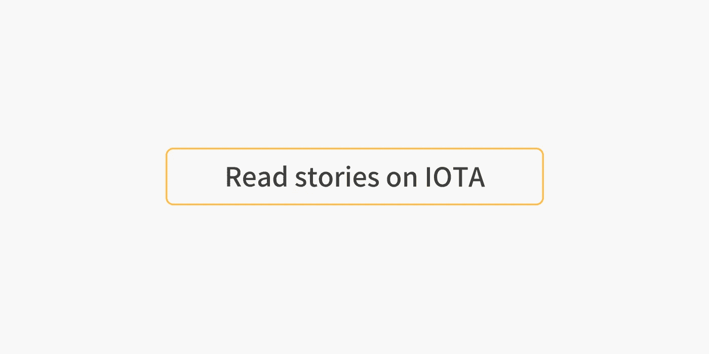

# Iota 视频教程系列

> 原文：<https://medium.com/coinmonks/iota-video-tutorial-series-ef0193ed5533?source=collection_archive---------13----------------------->

## 从头到尾学一点

Image [source](https://www.google.co.in/url?sa=i&rct=j&q=&esrc=s&source=images&cd=&cad=rja&uact=8&ved=2ahUKEwiM96TkrfDbAhUDgI8KHU81Dk8Qjxx6BAgBEAI&url=https%3A%2F%2Fwww.bleepingcomputer.com%2Fnews%2Fsecurity%2Fiota-cryptocurrency-users-lose-4-million-in-clever-phishing-attack%2F&psig=AOvVaw125CY12ld7LRQ0F6dBVJ53&ust=1530069081693757)

**Create Crypto Invoices**

[***Cryptofi —创建加密发票，跟踪您的加密支付***](https://cryptofi.co/)

[**使用 Coinmonks 作业门户**](https://coinmonks.com/) 查找加密作业

[***加入 Coinmonks 投稿人电报组。***](/coinmonks/coinnmonks-crypto-writers-telegram-group-f56b4621af0a)

[***捐造僧***](/coinmonks/monks-need-your-help-7440418d67ec)

IOTA 是一个开源的分布式分类帐。它使用有向无环图(DAG)代替区块链。IOTA 的 DAG 称为 tangle，是区块链协议的推广。

*归属——下面提到的视频系列是* [*李博特*](https://twitter.com/mobilefish) *的作品，最初发表在他的博客*[*mobile fish*](https://www.mobilefish.com/developer/iota/iota_quickguide_tutorial.html)*上。经他许可，这本书已经再版了。*

**IOTA 教程 1:什么是 IOTA 及一些术语讲解**
时长:15:38
下载演示: [what_is_iota_part1.pdf](https://www.mobilefish.com/download/iota/what_is_iota_part1.pdf)

**IOTA 教程 2: Trit 和 Tryte**
时长:7:39
下载演示: [trits_trytes_part2.pdf](https://www.mobilefish.com/download/iota/trits_trytes_part2.pdf)

**IOTA 教程 2.1:将十进制值转换为平衡的三进制值**
时长:14:11
下载演示文稿:[decimal _ to _ balanced _ ternary _ part 2.1 . pdf](https://www.mobilefish.com/download/iota/decimal_to_balanced_ternary_part2.1.pdf)

**IOTA 教程 3: IOTA seed**
时长:8:53
下载演示文稿: [iota_seed_part3.pdf](https://www.mobilefish.com/download/iota/iota_seed_part3.pdf)

**IOTA 教程 4: IOTA seed**
时长:6:20
下载演示: [weight_part4.pdf](https://www.mobilefish.com/download/iota/weight_part4.pdf)

**IOTA 教程 5:快照并附加到 tangle**
时长:16:36
下载演示:[attach _ tangle _ Snapshot _ part 5 . pdf](https://www.mobilefish.com/download/iota/attach_tangle_snapshot_part5.pdf)

**IOTA 教程 5.1:Snapshot be prepared**
时长:5:52
下载演示:[Snapshot _ be _ prepared _ part 5.1 . pdf](https://www.mobilefish.com/download/iota/snapshot_be_prepared_part5.1.pdf)

**IOTA 教程 6:为什么不应该为传出事务重用地址**
持续时间:7:51
下载演示文稿:[hash _ based _ signature _ part 6 . pdf](https://www.mobilefish.com/download/iota/hash_based_signature_part6.pdf)

**IOTA 教程 7:工作证明、Curl 和 Nonce**
时长:15:09
下载演示:[Proof _ of _ Work _ part 7 . pdf](https://www.mobilefish.com/download/iota/proof_of_work_part7.pdf)

**IOTA 教程 8:加密海绵构造**
时长:7:10
下载演示:[sponge _ construction _ part 8 . pdf](https://www.mobilefish.com/download/iota/sponge_construction_part8.pdf)

**IOTA 教程 9:地址和校验和**
时长:13:24
下载演示: [address_part9.pdf](https://www.mobilefish.com/download/iota/address_part9.pdf)

**IOTA 教程 9.1: Key，Digests &地址**
时长:9:34
下载演示:[Key _ Digests _ Address _ part 9.1 . pdf](https://www.mobilefish.com/download/iota/key_digests_address_part9.1.pdf)

**IOTA 教程 10:交易与捆绑**
时长:21:01
下载演示: [transaction_part10.pdf](https://www.mobilefish.com/download/iota/transaction_part10.pdf)

**IOTA 教程 11:Attach _ address _ to _ tangle _ part 11 . pdf 时长:10:16
下载演示文稿:[Attach _ address _ to _ tangle _ part 11 . pdf](https://www.mobilefish.com/download/iota/attach_address_to_tangle_part11.pdf)**

**IOTA 教程 12:协调人** 时长:8:08
下载演示:[协调人 _part12.pdf](https://www.mobilefish.com/download/iota/coordinator_part12.pdf)

**IOTA 教程 13:转播、重附属和提升**
时长:9:47
下载演示:[重附属 _ 转播 _ 提升 _ 部分 13.pdf](https://www.mobilefish.com/download/iota/reattach_rebroadcast_promote_part13.pdf)

**IOTA 教程 14:消息和标签**
时长:19:30
下载演示:[Message _ and _ Tag _ part 14 . pdf](https://www.mobilefish.com/download/iota/message_and_tag_part14.pdf)

**IOTA 教程 15: BundleHash**
时长:7:00
下载演示: [bundlehash_part15.pdf](https://www.mobilefish.com/download/iota/bundlehash_part15.pdf)

**IOTA 教程 16:normalized bundle hash** 时长:8:40
下载演示:[normalized bundle hash _ part 16 . pdf](https://www.mobilefish.com/download/iota/normalizedbundlehash_part16.pdf)

**IOTA 教程 17:创建并验证签名**
持续时间:13:03
下载演示文稿:[Create _ and _ validate _ signature _ part 17 . pdf](https://www.mobilefish.com/download/iota/create_and_validate_signature_part17.pdf)

**IOTA 教程 18: Merkle Tree**
时长:6:33
下载演示: [merkle_tree_part18.pdf](https://www.mobilefish.com/download/iota/merkle_tree_part18.pdf)

**IOTA 教程 19:屏蔽认证消息**
时长:31:55
下载演示: [mam_part19.pdf](https://www.mobilefish.com/download/iota/mam_part19.pdf)

**IOTA 教程 20:屏蔽的认证消息有效负载**
持续时间:13:56
下载演示:[Masked _ Payload _ part 20 . pdf](https://www.mobilefish.com/download/iota/masked_payload_part20.pdf)

**IOTA 教程 21: CryptoJS**
时长:3:40
下载演示: [cryptojs_part21.pdf](https://www.mobilefish.com/download/iota/cryptojs_part21.pdf)

**IOTA 教程 22:蒙面认证消息演示可验证声明**
时长:14:58
下载演示:[可验证 _ 声明 _part22.pdf](https://www.mobilefish.com/download/iota/verifiable_claims_part22.pdf)

**IOTA 教程 23:屏蔽认证消息传递演示存储文件**
持续时间:9:58
下载演示: [store_file_part23.pdf](https://www.mobilefish.com/download/iota/store_file_part23.pdf)

**IOTA 教程 24:多签名** 时长:20:57
下载演示: [multisig_part24.pdf](https://www.mobilefish.com/download/iota/multisig_part24.pdf)

**IOTA 教程 25: WebRTC 与 MAM 信令**
时长:12:05
下载演示: [webrtc_part25.pdf](https://www.mobilefish.com/download/iota/webrtc_part25.pdf)

**IOTA 教程 26: Trinity 钱包种子和双因素认证**
时长:7:40
下载演示: [trinity_part26.pdf](https://www.mobilefish.com/download/iota/trinity_part26.pdf)

**IOTA 教程 26.1: Trinity 钱包种子和双因素认证第二部分**
时长:5:02
下载演示: [trinity_part26.1.pdf](https://www.mobilefish.com/download/iota/trinity_part26.1.pdf)

**IOTA 教程 27:为什么要规格化 BundleHash？为什么不为传出的事务重用一个地址呢？** 时长:21:54
下载演示文稿:[normalized bundle hash _ part 27 . pdf](https://www.mobilefish.com/download/iota/normalizedbundlehash_part27.pdf)

> 如果你喜欢这些教程，请给出一个👏感谢罗伯特的出色工作和*，不要忘记关注我们的 Coinmonks 出版物。请告诉我们您想了解区块链领域的哪些内容。😃*

**Click to learn more about IOTA**