# IOTA 的 Qubic |令人难以置信的互操作性的兴起

> 原文：<https://medium.com/coinmonks/iotas-ixi-module-q-the-rise-of-incredible-interoperability-maybe-339ffdf3bd12?source=collection_archive---------0----------------------->

为 IOTA 改变区块链和现代金融的许多事情做好准备。这是一个关于我进行的研究的推测性帖子，我不是 IOTA 基金会的成员。

Module Q: Cross-chain Oracles and Smart Contract Interoperability

# 证据

这些是 IOTA 的创始人对 q 的评论截图。

## 谢尔盖·伊万切洛(来自远方)

Sergey Ivanchelo(又名 CfB)创立了 NXT，是第一批股权证明区块链之一。从 CfB 的上述陈述中，我们可以得出一些结论:

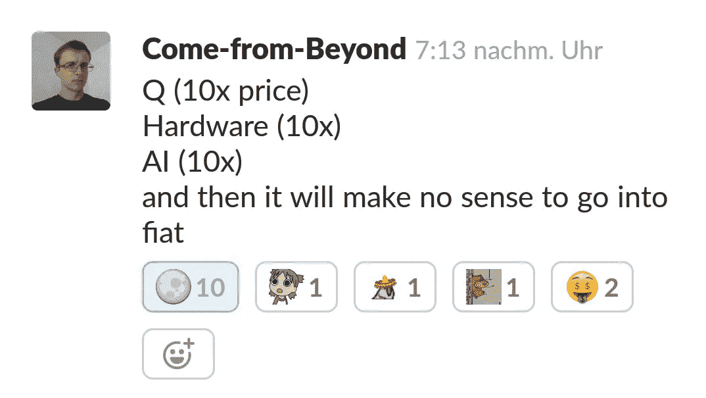

> **1。q 不是说硬件(三进制处理器，JINN)或者 AI。**

> 2. **Q 必须将 IOTA 引入到现有的金融基础设施中。在 IOTA 的所有基础设施(JINN 三元处理器和 IOTA 相关的人工智能)设置到位后，“进入菲亚特将毫无意义”。**

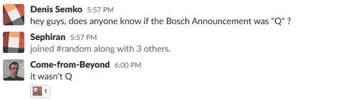

> 3. **Q 与博世公告无关。**

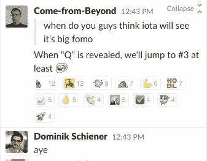

> 4.Q 将使 IOTA 月亮比 BCash 远。这意味着 IOTA 的市值将上涨 5 倍。(月亮什么时候？)

## 大卫·索恩斯特博

领导德国非营利组织 IOTA 基金会，致力于推动人类进步和有计划的人。有几个计划:

> IOTA 不应被视为比特币等现有加密货币的替代货币(altcoin)，而是不断增长的区块链生态系统的延伸。它意味着与这些其他平台协同工作，形成凝聚力和共生关系。IOTA 旨在提供一个其他密码无法提供的解决方案:高效、安全、轻量级、实时、免费的微交易。
> 
> 考虑到 IOTA 主要是作为没有“更重功能”的交易令牌，如图灵完全智能合约，它被设计成可以与这些其他区块链通信。这意味着它可以通过充当以太坊或根茎等平台的先知来触发智能合同，如智能财产。最重要的是，它可以通过检查这些网络中的交易来为这些平台提供额外的安全性。
> 
> 发布于 2015 年 11 月 17 日

这是我找到的最早的关于 IOTA 的帖子之一。它向世界介绍了 IOTA 和 David 对该项目的设想。IOTA 可以被看作是对分布式分类帐空间的扩展，以增强它。IOTA 没有任何最大化主义者，他们希望使用 Rootstock 和以太坊的智能合约功能与比特币共存。上面的 gif 也来自同一篇文章。

**进入 IOTA 扩展界面(IXI)**

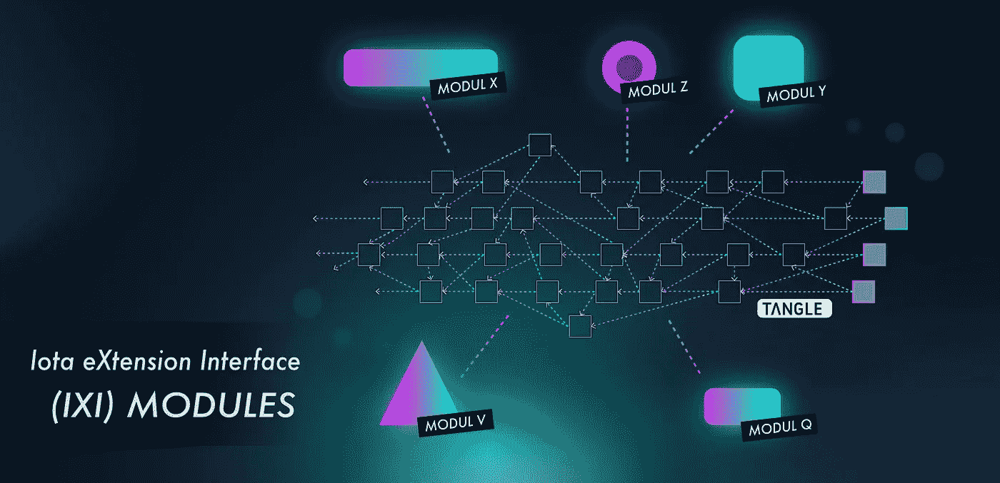

IOTA’s Modular Layers Extending Functionality. Published March 31, 2017

从上图我们可以看到“模块 Q”。这意味着扩展 Tangle 的功能。在 David 写的同一篇博文[中，你可以看到每个模块的开发阶段。但是我们通过这个帖子了解了更多关于 Q 的信息。](https://blog.iota.org/iota-development-roadmap-74741f37ed01)

> 5.Q 是一个 IOTA 扩展接口模块。

真正有趣的是 IOTA 神谕的发展阶段。

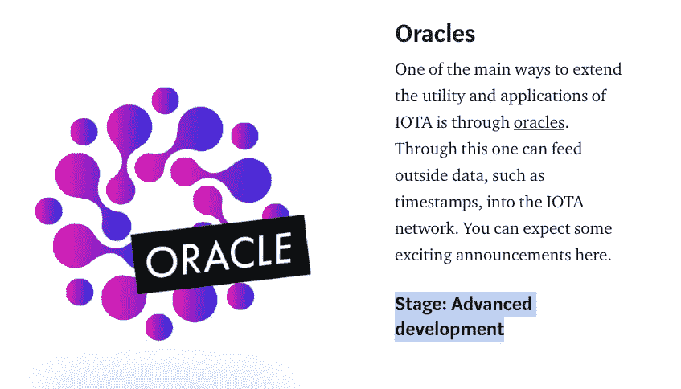

IOTA’s Oracles Development Stage. Published March 31, 2017

IOTA 已经在 Oracle 上工作了大约一年，但是还没有发布关于 Oracle 的版本。很多关于 Q 处理 Qubic 的猜测，听起来很像 IOTA 本身，或者 JINN 三元处理器，但与 oracle 无关。如果神谕已经开发了一年，而一年前它们还处于“高级开发”阶段，那么这些神谕一定非常重要。

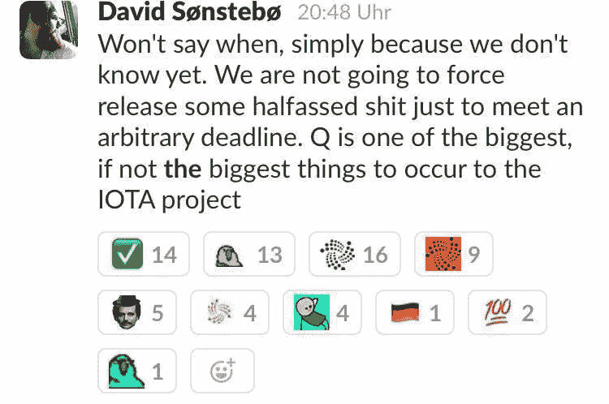

> 6.**问是 IOTA 项目中最重要的事情之一。**

## 张秀坤·希内尔

Dom 自 2012 年以来一直在创办公司，在区块链领域已经有一段时间了。他实际上试图在瑞士开发一个法定加密货币交易所，但没有成功。我确信多姆从他的失败中学到了各种各样的教训，并利用这些教训建立了 IOTA 和 IOTA 基金会。多姆写了一篇[博文](https://blog.iota.org/a-primer-on-iota-with-presentation-e0a6eb2cc621)，其中呈现了以下元素:

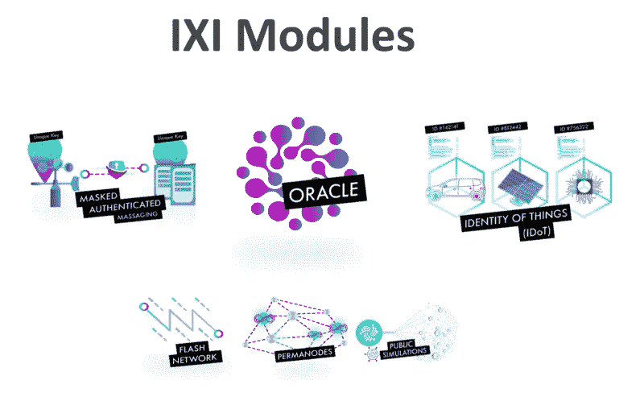

IXI Modules to be Launched. Published May 21, 2017

在发布的 IXI 模块中，我们已经看到了 Flash 通道和屏蔽认证消息的发布。IOTA 基金会正在开发 Permanodes，这是一个保留所有 Tangle 事务的节点，而不需要对分类帐进行快照整理，但 Oracle 在开发方面比 David 之前的文章更先进。

> 我们对神谕的方法将使得在 IOTA 之上直接形成神谕成为可能。这不同于这个领域目前使用的任何东西。借助 Oracle 平台，我们不仅致力于通过 IOTA 连接物理世界；但我们也希望与所有其他区块链平台实现真正的互操作性。
> 
> 2017 年 5 月 21 日发布

互操作性是关键。

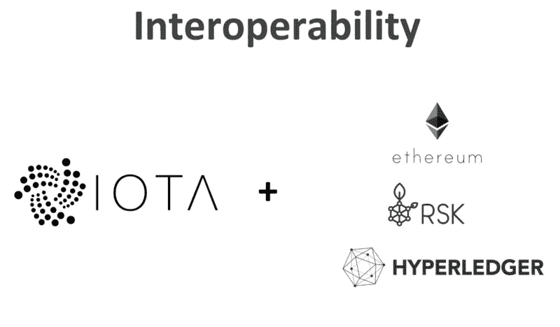

Working With Other Blockchains. Published May 21, 2017

> 我们不是最大主义者，我们相信特定用途技术的未来。正因为如此，我们正积极致力于与现有区块链技术和社区的互操作性。现在主要的焦点是位于 EVM 的区块链(以太坊，RSK，Qtum)和 Hyperledger。随着我们新的 Oracle 平台的发布，我们期待与该领域更多项目实现真正的互操作性。
> 
> 2017 年 5 月 21 日发布

IOTA 与其他区块链合作，可能整合跨链智能合同？先知到底在做什么？这些集成的进展如何？

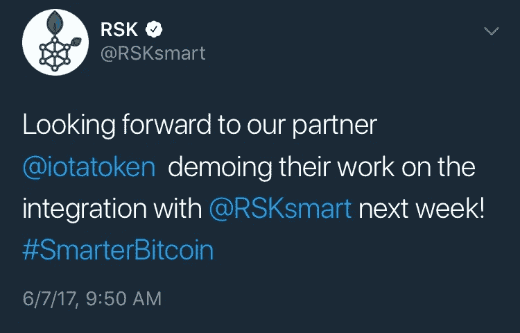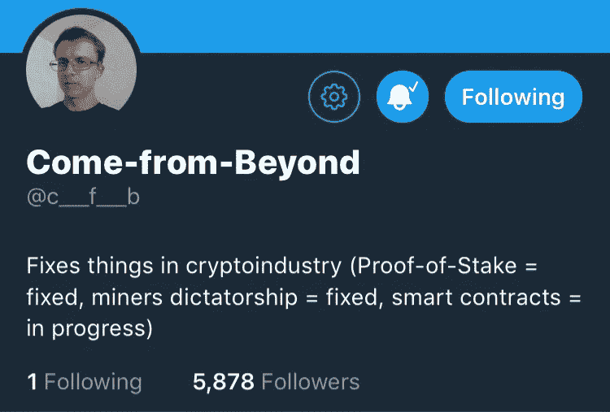

IOTA Smart Contract Focus

嗯，我们可以看到，Rootstock，一个智能合约平台，将图灵完整虚拟机与比特币相结合，集成已经完成，因为他们根本不会宣布演示。IOTA 从未演示根茎智能合同。我还找到了马克·诺顿的这篇文章，内容是关于 IOTA 的一个名叫尼克·沃德的人如何陈述了以下内容:

> 我们甚至与 Rootstock 合作演示了一些分类帐之间的互操作性。然而，对于支付，您无法超越无费用和无比例限制，这就是 IOTA 作为交易结算层为 ledger*带来的好处。
> 
> [2017 年 8 月 19 日](https://bitcoinwarrior.net/2017/08/an-interview-with-the-iota-team/)

关于尼克·沃德和他与 IOTA 基金会的关系，我没有找到太多信息。对最后一句话要有所保留，但它是按照时间表来的。

如果他们有，我从来没有发现，或者是一个社区开发者创造了这样的集成，我无法找到。

CfB 的个人简历展示了他在密码行业的发展。

*   利害关系证明= NXT
*   矿工专政
*   智能合约= Q？还是(Q + AI + JINN)？

**我坚信 Q 处理其他区块链和金融基础设施的互操作性。**

# 模块 Oraqle

现在，如果 Q 是这样一个可以与区块链和他们的智能合约建立互操作性的甲骨文，那么这个甲骨文还能做什么呢？

## 银行互操作性

要实现银行互操作性，IOTA 需要了解银行基础设施并具有高可信度的人员的专业知识。

## 奥利弗·巴斯曼

这两个人是 Q 发展的关键，他们都是 IOTA 基金会的成员。 **Oliver Bussmann** 有很大的金融背景:

*   高级技术执行官，在不同行业(高科技和金融服务)拥有 25 年以上的领导经验，曾供职于 UBS、SAP、Allianz、Deutsche Bank 和 IBM。
*   金融科技、区块链、企业移动和云计算领域的思想领袖。从 CXO 的角色中发现趋势并采用商业建设社交媒体策略的先驱。

所有这些在金融服务业的经历都会产生巨大的影响。他在一次采访中也说了以下的话

> 区块链确实实现了你以前做不到的新服务。我们正在迈向物联网和机器对机器通信的未来。如果你将来去加油站，你的汽车将会有一个电子钱包，并自动付款。在互联世界中，其他行业的金融服务整合将成为可能。当你看到“移动即服务”时，不仅是传统的参与者，非特定行业的参与者也会尝试定义金融服务。我们确实正处于一场重大市场基础设施变革的开端。我不是在谈论增量新功能。

> 我们将看到商业模式发生巨大变化。这给银行带来了重大挑战。他们发现很难打破自己所在行业的传统思维，与同行和非银行机构合作，并找出双赢的方式。另一个问题是，现在在传感器的互联世界中，银行必须开始在实时环境中工作。
> 
> [发布于 2017 年 10 月 9 日](/@jennifer_45057/interview-of-the-week-oliver-bussmann-cebb3499a3f8)

为了让 IOTA 与银行合作，银行必须改变他们的整个商业模式。他们为什么要这么做？容易，因为[PSD 2T5。](https://en.wikipedia.org/wiki/Payment_Services_Directive#Revised_Directive_on_Payment_Services_(PSD2))

## IOTA 的 AMA 于[Reddit 1 月 7 日](https://www.reddit.com/r/Iota/comments/7orp03/iota_foundation_ask_us_anything_january_7th/)

IOTA 在 r/Iota 上举办了“问我任何问题(AMA)”来回答社区的问题。这里最重要的注意事项:

**智能合同**有人问及存储，IOTA 生态系统基金经理 John Licciardello 回答道:“我认为我无权回答这个问题？lol 大卫？”这可能有两个原因:

*   约翰认为他没有足够的资格回答让大卫回答的问题。
*   John 知道智能合约将存储在哪里(Oraqle ),但不知道他是否应该公开该信息，他问 David 是否可以回答这个问题。

**银行业混乱和中央银行关系。**张秀坤回答说，IOTA 不会颠覆银行业，而是帮助创造一种新的银行业形式。Oliver Bussmann 同意 Dom 的观点，并指出银行和中央银行在现有和即将出现的金融生态系统中的重要性。奥利弗认为，菲亚特支付处理需要结束，因为它不如数字货币实时连接处理有效。

> 我们**与一些中央银行和国有部门的实体保持联系**，他们有兴趣探索如何将分布式分类账整合到现有的基础设施中，并**推动数字化转型**。我们还不能随意透露这些对话处于哪个阶段。

> IOTA 基金会不是一个咨询机构，所以我们的对话围绕着利用实时 IOTA 网络。当然，出于各种原因一个中央银行发行的 DLT 需要一些独特的属性，所以仍然有很多悬而未决的问题。
> 
> 大卫·索恩斯特博

在我看来，这部分可能是最疯狂的。幕后发生的事情确保媒体不会发现 IOTA 的交易和关系是疯狂的。我确信 IOTA 基金会的核心圈子知道正在发生什么，并且**一定在法拉第笼**开会，带着很多灵感工作。这让我相信 IOTA 基金会正在阻止尽可能多的 FOMO 真正执行技术，而不仅仅是泵送他们的令牌。

Oraqle 可以提供所有的互操作性，不仅可以与区块链合作，还可以与银行合作。

> 银行在 **IOTA 生态系统**中扮演着至关重要的角色，尤其是在**中短期**中。首先，银行在那里提供流动性，而**充当当前遗留系统(即法定货币)和 IOTA 之间的入口和出口点。**
> 
> 2018 年，我们将与银行进行更密切的合作，而不仅仅是工业企业。主要是关于新的用例(**想想 PSD2，以及 IOTA 如何在那里实现新的商业模式**)，但也特别是关于我们可以与他们一起开发的产品。中央银行显然是我们 IOTA 基金会可以想到的最具战略意义的合作伙伴:)
> 
> 师

# IOTA 生态系统

> 将从业者、开发者、业余爱好者和爱好者聚集在一起，将 IOTA 应用程序构建到经济的各个方面，包括**营利性**、非营利性、学术和**政府部门**，IOTA 生态系统将是无许可、分布式和分散技术的归零地，努力构建一个**更具包容性**、弹性和繁荣的世界。
> 
> 约翰·里恰德洛谈 IOTA 生态系统。

最近， [**IOTA 生态系统**](https://ecosystem.iota.org/) 宣布成立，其网站将于三月推出。IOTA 生态系统将把银行、企业和开发者聚集在一起。通过大家的共同努力，我们可以有更多的企业使用 IOTA 作为货币。这个生态系统将激励 IOTA 社区的更多发展，你将最终使用你的 IOTA 而不是使用它。银行可以为 fiat ←→ IOTA exchange 提供流动性，这将在中期降低 IOTA 的波动性。IOTA 目前与比特币绑定，因此如果比特币价值下跌，IOTA 价值也会下跌。2018 年是脱钩之年。当然，所有这些互操作性都将来自 Oraqle 及其与 IOTA 生态系统的集成。

## IOTA 波动性

> 一个支付系统怎么可能建立在如此不稳定的货币基础上？
> 
> Alon Elmaliah:“波动性肯定是采用这种货币的障碍，这是当今所有数字货币面临的挑战。因此，该基金会正在与银行商谈开发一种工具，以促进法定货币(如欧元或美元)向 IOTA 的快速转换。”
> 
> [2018 年 2 月 6 日](https://www.globes.co.il/en/article-the-israeli-angle-on-tangle-1001222559)
> 
> 多姆:“我能说的一件事是，我不能说我们在做什么。传统上，自由主义者和比特币人士喜欢说去他妈的银行。但问题是，**银行在采用这种【数字资产】的过程中扮演着至关重要的角色。它们是通向未来的大门。传统货币到加密货币。我们将实现这一点。它们是至关重要的桥梁。IOTA 的发展日趋稳定。银行扮演着至关重要的角色。**每次你做一笔交易，你都要转入 IOTA。当机器收到 IOTA 时，他们可以立即出售它**。**
> 
> [2018 年 1 月 23 日](https://www.crowdfundinsider.com/2018/01/127414-going-iota-discussion-dominik-schiener-iota-co-founder/)

Alon Elmaliah 是 IOTA 的核心开发人员之一，并且了解内情。Alon 和 Dom 的报价显示了银行和 IOTA 将如何合作，以实现无缝的数字支付。

## 瑞典电子皇冠

瑞典中央银行开始接受创建本国数字货币的提议。各种组织提交了他们的提案，IOTA 基金会提交了 [**该提案**](https://www.nyteknik.se/tekniknyheter/article6893800.ece/BINARY/IOTA%20Foundation) 。从提案中，您可以看到本币的差异，但提案的一些要点是:

> IOTA 基金会围绕 Tangle 技术进行的研究和实施充当了一个平台，即**生态系统**，由此**进一步扩展连接性**并集成到其他数字和物理技术发展中，为瑞典银行提供了巨大的灵活性，以便在未来添加更多功能。

> IOTA 基金会处于技术发展的最前沿，与大型**营利性**和非营利性组织合作。目前，他们正在与其他中央银行就发展中央银行发行的数字货币进行谈判。

伟大的基础设施正在幕后建造，它将彻底改变分布式账本技术领域。模块 Q 将成为生态系统的一部分，以促进多个组织和有才华的个人之间的联系和协作。

## 马克·苏拉夫卡

> Mark Sulavka 也是 [**国家证券交易所**](https://en.wikipedia.org/wiki/National_Stock_Exchange_(Jersey_City,_New_Jersey)) 的前董事长兼首席执行官，这是一家在美国证券交易委员会注册的证券交易所和自律组织(“SRO”)&是 **MatchPoint Trading** 的联合创始人兼首席技术官，这是一个股票投资组合基础买入市场匹配系统，具有独特的租赁成本匹配算法，被 [**纽约证券交易所**](https://www.nyse.com/index) **(纽约证券交易所)收购。**
> 
> [发布于 2018 年 2 月 6 日](https://blog.iota.org/welcome-mark-sulavka-to-the-iota-foundation-f4d7172e5aa9)

国家证券交易所(NSX)实际上被纽约证券交易所(NYSE)收购，并更名为 NYSE National，与纽约证券交易所的支柱平台[进行交易。](https://www.nyse.com/pillar)

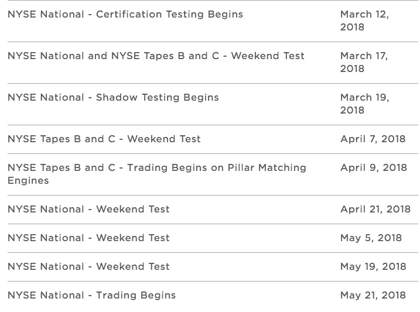

NYSE National Roadmap.

苏拉夫卡先生也是纽约证券交易所的首席执行官。这意味着将会有 IOTA 基金会成员与已建立的交易基础设施合作。这是 IOTA 不仅可以包含在加密货币交易所中，而且可以包含在实际的**已建立的交易所中的一种方式。**

当我们欢迎马克·苏拉夫卡加入 IOTA 基金会时，大卫也写下了这句话:

> Mark 目前正在领导 pivotal Iota 扩展接口(IXI)中心模块的开发。这个 **IXI 枢纽模块**将使交易所的接口无摩擦，并实现交易所的“即插即用”，这将**向加密货币爱好者的整个全球市场开放 IOTA 生态系统**。Mark 将在 IOTA 与已建立的金融机构和监管生态系统之间的桥梁中扮演关键角色和关键推动者。
> 
> [发布于 2018 年 2 月 6 日](https://blog.iota.org/welcome-mark-sulavka-to-the-iota-foundation-f4d7172e5aa9)

# PSD2

PSD2 是增加支付处理商竞争的指令。PSD2 强制银行为商家提供一个开放的 API，以便能够访问用户的账户并进行交易。例如，假设用户从亚马逊购买了一件商品。亚马逊现在可以访问用户的银行账户，验证用户是否有进行交易所需的资金，然后直接与银行进行交易。

支付处理商现在面临另一个障碍，银行通过成为 Visa 或万事达卡网络的一部分来提供流动性，从而产生收入。现在，商家有能力访问用户的银行账户，并自己处理支付。这意味着支付处理商和银行将损失一些收入。为了让银行生存下去，他们必须改变他们的商业模式。

## 新的可能的银行业务模式

*   **按 API 访问付费**，由于银行需要找到一种方法来将他们的数据和交易功能货币化，因此通过 IOTA 微交易向这些企业收取 API 使用费是有意义的。
*   PSD2 是一项将在欧洲强制执行的指令，但银行还需要找到一种在非欧洲国家使用 IOTA 的方法。 **IOTA 生态系统流动性**，溢价把你的 IOTA 换成菲亚特。这肯定需要大量的 KYC 和反洗钱法规。
*   银行需要认识到，他们是 IOTA 和 fiat 转换的看门人，并创建此类交换的高效服务。

# 创始人对博客帖子的回应

大卫和 CfB 已经阅读了关于这个 Q 理论的博客文章，并做出了以下回应。

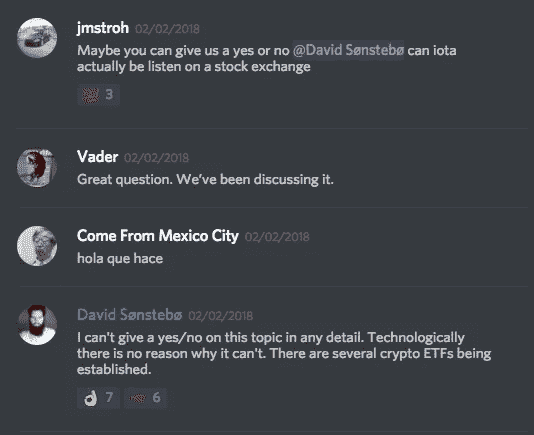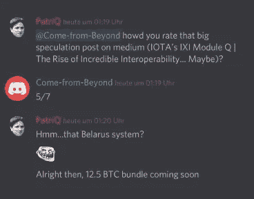

Thanks to jmstroh from Discord.

我们可以看到，大卫对他的话非常小心，因为他应该这样，当谈到投机性的信息。大卫非常谦逊，像 IOTA 基金会的其他人一样拼命工作。我相信他所做的一切就是工作、睡觉、锻炼，并在工作时听音乐取乐。如果任何人有任何问题，他将对社区做出回应，如果他能抽出一些时间，他也能够这样做。

从 CfB 的钓鱼态度，他引用了以下迷因:

Sullivan’s Theorem applied to blog posts.

这意味着他喜欢关于这个理论的博文。然而，还有更多。大卫回答道:

> q 更大

在[奥塔诺格脸书集团](https://www.facebook.com/iotanorge.no/)上。

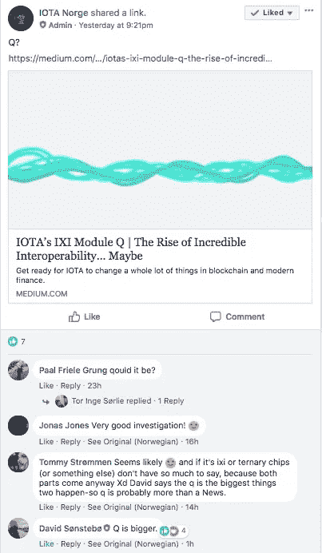

Thanks to the IOTA Norge Facebook Group.

现在我们不耐烦的等着 QQQQQQQQQQQQQQQQQQQ。

这篇博文激发了社区成员的好奇心，让他们基于这一理论进行自己的研究和推测。我将与那些希望为更深入的研究做出贡献的社区成员一起写另一篇文章。然而，Q 预计将很快发布，因为 Q1 2018 即将结束。

## 一系列幸运事件的先决条件

为了发布幕后开发，必须有一系列事件才能在 2018 年进入生产模式。

*   三一钱包
*   IOTA 生态系统
*   Q
*   分权协调员

# 魁北克公告后

于是 Q 被揭露为 [**Qubic**](https://qubic.iota.org) ，原来不仅仅是神谕。Qubic 提供外包计算、神谕和智能合同。这一切意味着什么？

> [在您的收件箱中直接获得最佳软件交易](https://coincodecap.com/?utm_source=coinmonks)

## 神谕

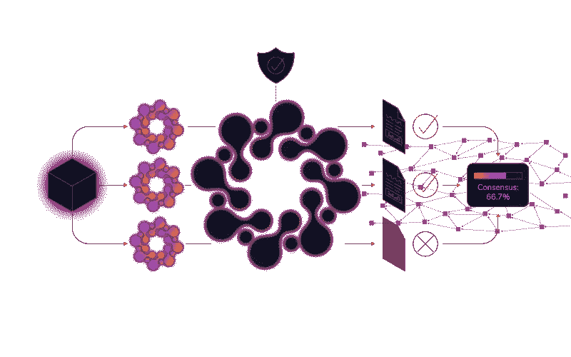

神谕的问题正是区块链试图消除的东西，信任。你怎么能相信这些数据是真的呢？我们可以看到一些例子，人们为了自己的利益改变数据。例如，当硬币市场上限将所有韩国价格从其平均值中移除时，加密货币市场似乎正在崩溃。即使是那些有很大机会升值但甚至没有列在图表上的有趣的代币。我用硬币市值是因为我相信你们都有同感。

数据为王。如果你控制了真相，你就控制了很多影响力。有了 Qubic，我们将为真相收集信息节点，分散真相。我不会详细讨论 Qubic 中的神谕是如何工作的，但我建议阅读 [**这篇文章**](https://vxcompany.com/2018/06/04/iotas-qubic-explained-2/) **。**

甲骨文的问题是几家拥有智能合约的区块链公司面临的问题。IOTA 寻求创建一个去中心化的 oracle 机器，使智能合同变得智能。

*免责声明:我自己拥有 IOTA 代币，在经历了这一耗时无数小时的深入研究后，我希望购买更多代币。*

捐 IOTA:mfqmukflhahdzchkpynwldlggtwshckhxonjlzwzsuihbscmuywgiwxkpt qswpcdc 9 b 9 yhpx wmtueakdcvpfqpmzy

