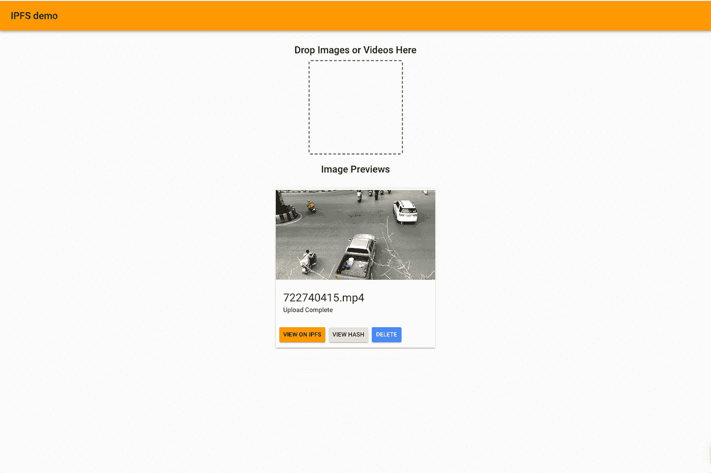

# 使用 React、NextJS、MobX 和 Material UI 的 IPFS 演示

> 原文：<https://medium.com/coinmonks/ipfs-demo-with-react-nextjs-mobx-material-ui-460660c84f85?source=collection_archive---------1----------------------->


IPFS Demo

第 6 周–区块链 1 年

**克隆或跟随**:

[](https://github.com/wrannaman/IPFS-Demo) [## 兰那曼/IPFS-演示

### IPFS-演示- IPFS 演示使用 IPFS，反应，MobX，材料-用户界面

github.com](https://github.com/wrannaman/IPFS-Demo) 

IPFS 是一个分布式对象存储。如果你对 IPFS 完全陌生，从这里开始[。](https://ipfs.io)

数据存储行业本身规模庞大([到 2019 年](https://www.statista.com/topics/3150/data-storage/)将达到 500 亿美元)，但它高度集中在提供文件存储硬件和提供文件存储服务的公司中。不用说，与硬件本身相比，这些服务提供了更高的利润(想想一个硬盘驱动器的成本与 AWS 在驱动器生命周期内对其服务收取的费用)。IPFS 是这个行业的颠覆者吗？它可以投入生产使用了吗？实现起来有多容易？让我们找出答案。

**入门**

从安装[IPF](https://ipfs.io/docs/install/)开始。

```
# Initialize the node:$ ipfs init# Start the daemon $ ipfs daemon
```

您应该能够在 [http://localhost:5001/](http://localhost:5001/) 看到 web UI


IPFS web UI

此时，您可以克隆回购，并通过以下方式启动它:

`$ git clone [https://github.com/wrannaman/IPFS-Demo.git](https://github.com/wrannaman/IPFS-Demo.git) && cd IPFS-Demo && npm i && npm run dev`


An empty demo

现在你应该能够上传图像或视频，并立即看到它们。



A video uploaded to a local IPFS node.

如果你的 IPFS 网络用户界面出现 403，或者应用程序无法连接到你的本地 IPFS 节点，[试试这个](https://github.com/ipfs-shipyard/ipfs-webui/issues/596#issuecomment-314395014)。

**注意事项**:

实现 IPFS 很简单。在很多方面，实现 IPFS 比实现 S3 兼容的对象存储更容易。不需要服务器，甚至上传更大的视频也很快(因为你上传的节点是本地的)。应该指出的是，正如我们在 S3 所知道的那样，对 IPF 的访问控制将是非常重要的。

删除文件并不简单。简而言之，你不能用 IPFS 删除文件。你可以在这里阅读更多关于[的讨论。](https://discuss.ipfs.io/t/can-i-delete-my-content-from-the-network/301/31)

多次上载同一个文件将导致上载具有相同哈希的同一个文件。这是有意义的，文件的内容没有改变，所以它的散列也没有改变。在演示中，当删除一个文件时，我实际上是取消了该文件的锁定，并删除了对它的本地存储引用，需要注意的是，如果另一个节点获取了该文件并托管了它，它将可以通过它的哈希无限寻址。

> [在您的收件箱中直接获得最佳软件交易](https://coincodecap.com/?utm_source=coinmonks)

[](https://coincodecap.com/?utm_source=coinmonks)