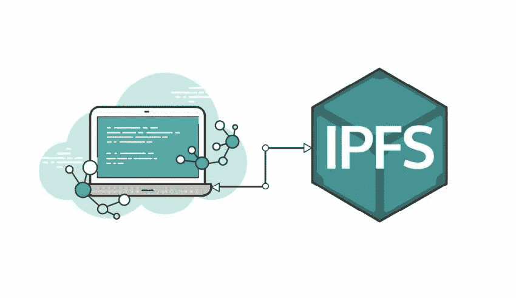

# IPFS 生产配置

> 原文：<https://medium.com/coinmonks/ipfs-production-configuration-57121f0daab2?source=collection_archive---------1----------------------->

在不久的将来，我们的团队将使用 IPFS 进行生产服务，所以我调查了很多关于它的配置。我要分享我学到的知识。



## 1.准备

首先，导出“IPFS _ 路径”。

```
export IPFS_PATH=/data/ipfsrep
```

IPFS 存储库创建到此路径。默认路径是您的$HOME。为了以后方便起见，我强烈建议将这个路径设置到适当的位置。

## 2.知识库初始化

使用“—配置文件服务器”选项初始化存储库。

```
ipfs init —- profile server
```

此选项通过禁用本地网络中的主机和内容发现来优化数据中心的 IPFS 配置。见[公文](https://docs.ipfs.io/introduction/usage/)

> 如果在数据中心的服务器上运行，应该用服务器配置文件初始化 IPFS。这将防止 IPFS 创建大量数据中心内部流量来尝试发现本地节点

## 3.编辑配置文件

IPFS 为我们提供了命令行“配置”选项，尽管我认为手动编辑配置文件很容易。配置文件位于“IPFS 路径”的正下方

```
vi $IPFS_PATH/config
```

从头开始，编辑“地址”。API "和"地址。网关”。虽然网关是只读的，但 API 是可写的。当您将网关设置为“0.0.0.0”时，网关对互联网开放。

```
"Addresses": {
  "API": "/ip4/127.0.0.1/tcp/5001",
  "Gateway": "/ip4/0.0.0.0/tcp/8080",
```

接下来，编辑“数据存储。StorageMax”。这是 IPFS 存储库的数据存储大小的上限。默认值为“10GB”，但您可能需要更多。

```
"StorageMax": "100GB"
```

接下来，遵循[官方指令](https://cluster.ipfs.io/documentation/deployment/setup/)。基本上，这个网站是为集群，但也有助于单一的。

> 增加虫群。ConnMgr.HighWater(最大连接数)并将宽限期减少到 20 秒。

“HighWater”是连接数，当超过该值时，将触发连接 GC 操作。“宽限期”是新连接免于被连接管理器关闭的持续时间。

> 增加数据存储。BloomFilterSize 根据您的回购大小(以字节为单位):1048576 (1MB)是一个很好的值

“BloomFilterSize”是表示块存储的 bloom 过滤器的字节大小的数字。

> 他`IPFS_FD_MAX`环境变量控制`go-ipfs`为自己设置的 FD `ulimit`值。根据您的`Highwater`值，您可能希望将其增加到`8192`或更高。

FD 表示文件描述符。“IPFS_FD_MAX”指定打开文件描述符限制。
根据此代码，[默认最大 FD](https://github.com/ipfs/go-ipfs/blob/master/cmd/ipfs/util/ulimit.go) 为“8192”，最好设置为“8192”。

最后，如果您使用 as Gateway，请编辑“Gateway。HTTPHeaders”。默认情况下，CORS 处于启用状态。我们可以在这里指定“Access-Control-Allow-Headers”或“Access-Control-Allow-Origin”。如果你从来没有以可写的方式运行 Gateway，最好从“Access-Control-Allow-Methods”中删除“POST”和“PUT”方法。

```
"Gateway": {
  "APICommands": [],
  "HTTPHeaders": {
    "Access-Control-Allow-Headers": [
      "X-Requested-With",
      "Range",
      "User-Agent"
    ],
    "Access-Control-Allow-Methods": [
      "GET"
    ],
    "Access-Control-Allow-Origin": [
      "*"
    ]
  },
```

## 4.运行背景

出于开发目的，您可以通过一个简单的命令启动 IPFS 后台进程。

```
ipfs daemon > $IPFS_PATH/ipfs-`date +%Y%m%d%H%M%S`.log &
```

然后，像这个命令一样停止。

```
ps ax | grep ipfs | head -n 1 | awk ‘{print $1}’ | xargs kill
```

出于生产目的，最好使用 systemd。创建系统用户并更改“$ IPFS _ 路径”的所有者。然后，创建一个名为“ipfs.service”的配置文件。

```
adduser — system — group ipfs
chown -R ipfs:ipfs $IPFS_PATH
vi /lib/systemd/system/ipfs.service
```

至于配置，[这个 GitHub 问题](https://github.com/ipfs/go-ipfs/issues/1430)很有帮助。

如下图所示的示例配置。请根据您的环境更改“IPFS 路径”。

```
[Unit]
Description=IPFS daemon
After=network.target
Requires=network.target[Service]
Type=simple
User=ipfs
RestartSec=1
Restart=always
Environment=IPFS_PATH=/data/ipfsrep
Environment=IPFS_FD_MAX=8192
ExecStart=/usr/local/bin/ipfs daemon[Install]
WantedBy=multiuser.target
```

## 5.支持 HTTPS

IPFS 不支持 HTTPS，所以我们需要准备一个代理服务器或负载均衡器，用于 SSL 卸载。

代理设置见[这篇博文](https://hackernoon.com/public-ipfs-node-behind-nginx-reverse-proxy-5682747f174b)。

关于 azure 负载平衡器的设置，请参见[我之前的博文](/@t.tak/build-https-support-load-balancer-on-azure-81e111e58d98)。

供您参考，默认 API 端口是“5001”，默认网关端口是“8080”。

## 6.停止拥挤

IPFS 正在尝试根据引导对等列表连接其他节点。您可以通过下面的命令看到它。

```
ipfs bootstrap list
```

如果你使用 IPFS 作为只读，我认为最好停止蜂拥而至，以节省网络费用。默认端口是“4001”。请记住，你需要关闭入境，此外出境以及。IPFS 节点试图从自身连接，因此我们需要关闭出站。

## 7.备份和恢复

您只需备份“$ IPFS _ 路径”下的所有文件。您可以恢复“$IPFS 路径”文件下的所有数据。

## 8.集群设置

不幸的是，我们的团队不使用集群，所以请查看[官方网站](https://cluster.ipfs.io/)或[有用的博客文章](/@rossbulat/using-ipfs-cluster-service-for-global-ipfs-data-persistence-69a260a0711c)。

## 9.将哈希存储到以太坊的技巧

对于打算将 IPFS 哈希存储到以太坊的人，告诉你节省汽油费用的技巧。不要将 IPFS 哈希存储为字符串类型。将其存储为 bytes32 类型。IPFS 哈希字符串比字节 32 消耗更多的内存，所以它的成本很高。

[IPFS 哈希是 base58 编码值](https://ethereum.stackexchange.com/questions/44506/ipfs-hash-algorithm)。所以我们只需对其进行解码以获得字节 32。

参见[原始协议代码](https://github.com/OriginProtocol/origin/blob/master/packages/ipfs/src/index.js)作为代码示例。参见[我之前的博客](/layerx/how-to-reduce-gas-cost-in-solidity-f2e5321e0395)了解更多节省汽油费用的技巧。

## 摘要

IPFS 生产配置信息较少，因此可能不足以完成上述步骤。请继续关注更新

如果你运行一个小的服务，这些步骤可能太多了。在这种情况下，只需使用“—配置文件服务器”选项初始化存储库。IPFS 优化配置。

希望能有所帮助。

> [在您的收件箱中直接获得最佳软件交易](https://coincodecap.com/?utm_source=coinmonks)

[](https://coincodecap.com/?utm_source=coinmonks)