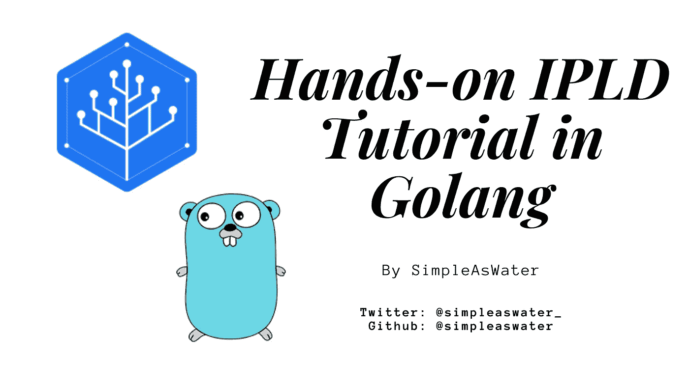

# 戈兰语 IPLD 实践教程

> 原文：<https://medium.com/coinmonks/ipld-hands-on-tutorial-in-golang-15fff6bfe39d?source=collection_archive---------3----------------------->

## 在动手系列的第一篇文章中，我们将理解 IPLD 的基本概念，然后用 Golang 编码来持久化键值条目。

每天通过 WhatsApp、Telegram、Discord 或电子邮件接收像这样的精选 Web 3.0 内容和摘要。